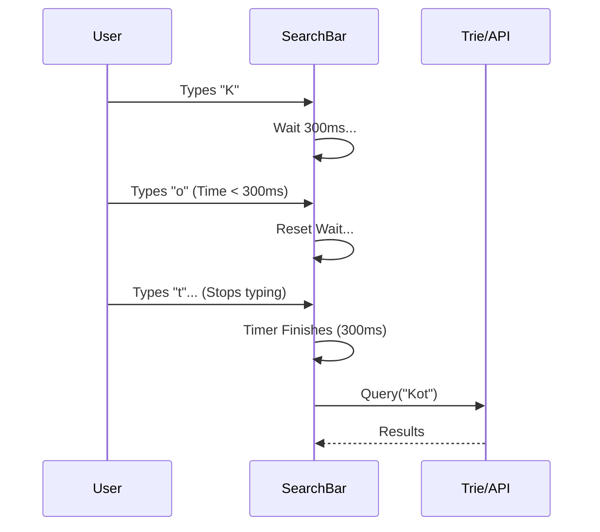

# 🌲 Trie (Prefix Tree)
> **Use Case:** Autocomplete, Search Bars, Spell Checker.
> **Core Data Structure:** Tree of Characters.


---

## 📖 Table of Contents
- [1. The Problem](#1-the-problem)
- [2. Visualizing a Trie](#2-visualizing-a-trie)
- [3. Implementation](#3-implementation)
- [4. Mobile Optimization (Debouncing)](#4-mobile-optimization-debouncing)

---

## 1. The Problem

User types "Ap...". We want to suggest:
- "Apple"
- "App"
- "Apply"

**Bad Approach:** Iterate through a list of 100,000 words. `O(N * Length)`.
**Good Approach:** Use a Trie. `O(Length)` to simple "walk" the tree.

---

## 2. Visualizing a Trie

Adding words: **"CAT"**, **"CAP"**, **"COW"**.

```mermaid
graph TD
    Root((Root)) --> C
    C --> A
    C --> O
    A --> T
    A --> P
    O --> W

    subgraph Words
    T2[T - End of "CAT"]
    P2[P - End of "CAP"]
    W2[W - End of "COW"]
    end
    
    T -.-> T2
    P -.-> P2
    W -.-> W2
    
    style T fill:#90EE90
    style P fill:#90EE90
    style W fill:#90EE90
```

1.  To find "CA", we walk `Root -> C -> A`.
2.  We see children `T` (CAT) and `P` (CAP).
3.  Efficiency: "CAT" and "CAP" share the first 2 nodes. We save memory.

---

## 3. Implementation

```kotlin
class TrieNode {
    val children = HashMap<Char, TrieNode>()
    var isEndOfWord = false
}

class Trie {
    private val root = TrieNode()

    // O(L) where L is length of word
    fun insert(word: String) {
        var current = root
        for (char in word) {
            // If child doesn't exist, create it
            current = current.children.getOrPut(char) { TrieNode() }
        }
        current.isEndOfWord = true
    }

    // O(L)
    fun search(word: String): Boolean {
        var current = root
        for (char in word) {
            current = current.children[char] ?: return false
        }
        return current.isEndOfWord
    }
    
    // O(L) - Check if any word starts with this prefix
    fun startsWith(prefix: String): Boolean {
        var current = root
        for (char in prefix) {
            current = current.children[char] ?: return false
        }
        return true
    }
}
```

---

## 4. Mobile Optimization (Debouncing)

In a real mobile search bar, we don't just rely on the Trie speed. We also need to manage **UI Events**.

**Scenario:** User types "K", "Kot", "Kotl", "Kotlin" very fast.
**Problem:** We don't want to query the Trie (or DB) 4 times.
**Solution:** Debounce.



**Code (Kotlin Flow):**
```kotlin
searchQueryFlow
    .debounce(300) // Wait for user to stop typing
    .distinctUntilChanged() // Don't allow duplicates
    .flatMapLatest { query -> 
        repository.search(query) 
    }
    .collect { results ->
        updateUi(results)
    }
```
