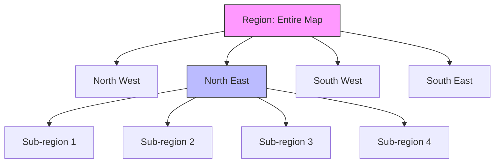

# 🗺 QuadTree (Spatial Partitioning)
> **Use Case:** Google Maps Clustering, Uber Drivers nearby, Game Collision Detection.
> **Core Concept:** Recursively dividing 2D space into 4 quadrants.


---

## 📖 Table of Contents
- [1. The Problem](#1-the-problem)
- [2. Visualizing a QuadTree](#2-visualizing-a-quadtree)
- [3. Logic Breakdown](#3-logic-breakdown)
- [4. Real-World Mobile Example (Clustering)](#4-real-world-mobile-example-clustering)

---

## 1. The Problem

You have 10,000 pins on a map.
**Naive Approach:** To find points inside the user's screen (Viewport), iterate all 10,000 points. `O(N)`.
**Optimized Approach:** Use a QuadTree to ignore points far away. `O(Log N)`.

---

## 2. Visualizing a QuadTree

We start with one big square (Root). If it contains too many points, we split it into 4 smaller squares (NW, NE, SW, SE).



Imagine a map grid:
```text
+-------+-------+
|       |   .   |
|  NW   |  NE   |  <-- "NE" has a point, so we might split it further
|       | . .   |
+-------+-------+
|       |       |
|  SW   |  SE   |
|       |       |
+-------+-------+
```

---

## 3. Logic Breakdown

### Insertion `O(Log N)`
1.  Check if Point is inside the current Boundary.
2.  If yes, and capacity isn't full, add it.
3.  If full, **Subdivide** (create 4 children) and pass the point down to the correct child.

### Query (Range Search) `O(Log N)`
1.  Does the Search Area (Screen) intersect with this Quadrant?
2.  If No -> **Ignore** entire branch (Pruning).
3.  If Yes -> Check points in this node and recurse into children.

---

## 4. Real-World Mobile Example (Clustering)

**Scenario:** Zoom level 5. We have 500 restaurants in New York.
**UI:** We can't show 500 pins. It looks like a mess.
**Solution:** Show one circle saying "500+".

**Algorithm:**
1.  Divide Map into a QuadTree.
2.  Query the QuadTree for the visible region.
3.  If a Quadrant has > 5 points, return a **Cluster Object** (Single pin with count) instead of individual points.
4.  As user zooms in (Search area gets smaller), the QuadTree returns the deeper nodes (individual points).

**Libraries:**
*   Android: `Google Maps Utils` (Uses QuadTree internally for clustering).
*   iOS: `MKMapView` (Clustering identifiers).

```kotlin
// Pseudocode for Clustering
fun getVisibleMarkers(viewport: Rect): List<Marker> {
    val results = mutableListOf<Marker>()
    
    // QuadTree automatically ignores 90% of the world points
    val pointsInView = quadTree.query(viewport) 
    
    if (zoomLevel < 10) {
        // combine points into 1 cluster
        results.add(createCluster(pointsInView))
    } else {
        // show real points
        results.addAll(pointsInView)
    }
    
    return results
}
```
