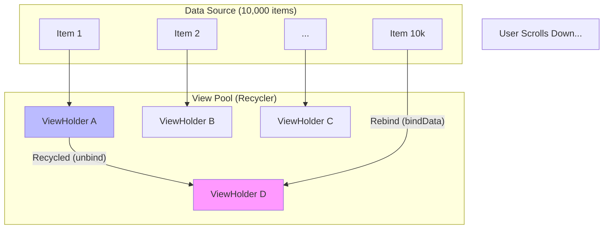
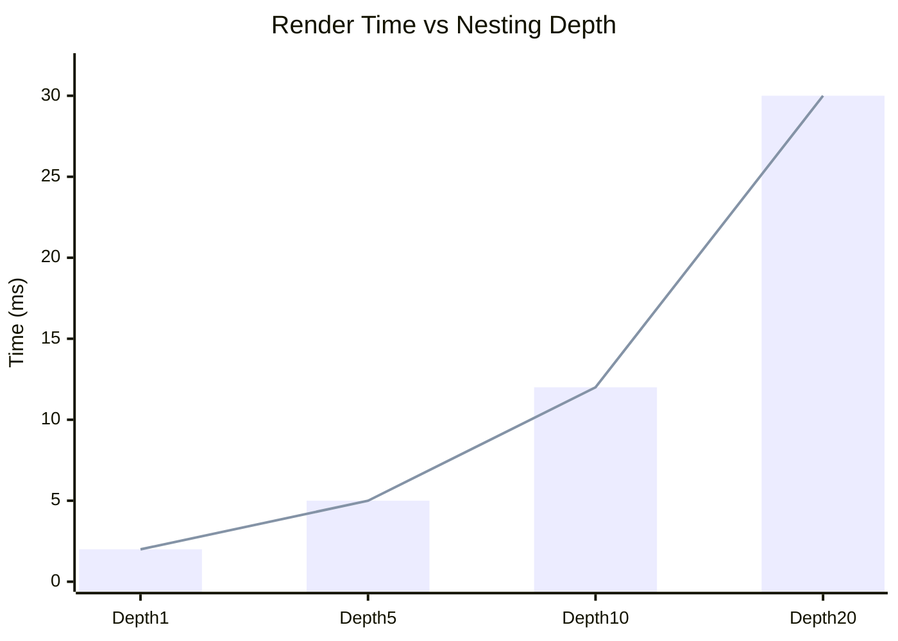

# 📉 Big O Analysis in Mobile
> **Focus:** Layout Hierarchies, Nested Views, and Scroll Performance.


---

## 📖 Table of Contents
- [1. The "Double Taxation" of Layouts](#1-the-double-taxation-of-layouts)
- [2. Linear Layout vs implementation Constraint Layout](#2-linear-layout-vs-constraint-layout)
- [3. Recycler View / LazyColumn Complexity](#3-recycler-view--lazycolumn-complexity)
- [4. Visualizing Hierarchy Cost](#4-visualizing-hierarchy-cost)

---

## 1. The "Double Taxation" of Layouts

In classic Android Views (pre-ConstraintLayout), measuring a layout often required 2 passes.
If you nest them, the complexity grows exponentially.

**Formula:**
`Total Measures = Depth ^ 2` (Rough approximation for bad nesting).

Even if Big O is technically linear `O(N)` for a single traversal, the constant factor `C` is huge because of:
1.  **Measure:** Calculating size.
2.  **Layout:** Calculating position.
3.  **Draw:** Rendering pixels.

---

## 2. Linear Layout vs Constraint Layout

### Nested Linear Layouts (Deep Tree)
```xml
<LinearLayout> 
  <LinearLayout>
    <LinearLayout> ... </LinearLayout>
  </LinearLayout>
</LinearLayout>
```
**Performance:** Poor. Multiple measure passes ripple down the tree.

### ConstraintLayout / Flat Hierarchy
```xml
<ConstraintLayout>
  <View A />
  <View B /> ...
</ConstraintLayout>
```
**Performance:** Better. It uses a **Linear Equation Solver** (Cassowary Algorithm) to resolve positions in a single flat pass (mostly).

---

## 3. Recycler View / LazyColumn Complexity

**Problem:** We have a list of 10,000 items.
**Naive UI:** Create 10,000 Views.
**Complexity:** `O(N)` Memory and CPU.
**Result:** Crash.

**Recycling (View Pool):**
We only create `Visible Items + Buffer`.
**Complexity:** `O(1)` (Constant number of views, regardless of data size).



---

## 4. Visualizing Hierarchy Cost

Comparing a Flat vs Deep hierarchy time to render.


*(As depth increases, time to render spikes, causing dropped frames).*

### Key Takeaway for Interviews:
"I optimize performance by **flattening the view hierarchy** (reducing N) and using **Recycling** to ensure Big O depends on *Screen Size*, not *Data Size*."
