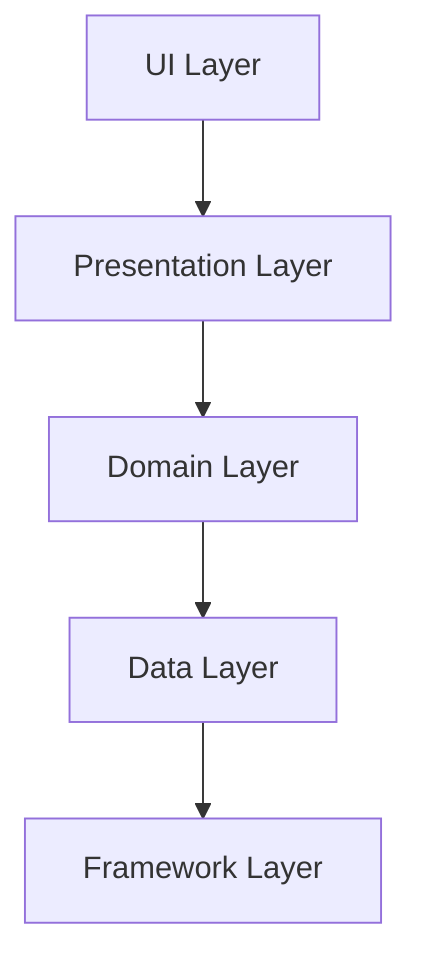

# 🧼 Clean Architecture Interview Guide
> **Targeted for Senior Android Developer / Team Lead Roles**


---

## 📘 Overview

**Clean Architecture** is a software design pattern introduced by **Robert C. Martin (Uncle Bob)**. It promotes separation of concerns and independence of frameworks, UI, databases, and other external agencies. This makes the application more maintainable, testable, and scalable.

---

## 🧱 Layered Structure



---

## 🧩 Layers Explained

| Layer            | Responsibility                                                             |
|------------------|----------------------------------------------------------------------------|
| **UI**           | Displays data and observes `ViewModel` or `Presenter`.                     |
| **Presentation** | Handles user actions, communicates with UseCases. ViewModel lives here.    |
| **Domain**       | Contains business rules. UseCases are defined here. Framework-independent. |
| **Data**         | Implements repository interfaces defined in Domain. Talks to network or local DB. |
| **Framework**    | Includes actual implementations like Room, Retrofit, Firebase, etc.        |

---

## 📦 Package Structure (Example)

```
com.example.app
├── presentation
│   └── viewmodel, ui, state
├── domain
│   └── usecase, model, repository
├── data
│   └── repository, api, db
├── di
│   └── modules for Hilt/Koin
└── utils
```

---

## 🔄 Data Flow

1. **UI** triggers an action (e.g., button click).
2. **ViewModel** calls a **UseCase**.
3. **UseCase** calls a **Repository** interface.
4. **Repository** is implemented in **Data Layer**.
5. **Data Source** (API/DB) is called.
6. Result is passed back to UI via ViewModel state.

---

## 🔐 Key Principles

- **Dependency Rule**: Inner layers should never depend on outer layers.
- **Inversion of Control**: Interfaces defined in inner layers and implemented in outer layers.
- **Testability**: Domain and UseCases are easy to test as they are framework-agnostic.

---

## ✅ Benefits

- Decoupled and modular architecture
- Easier to test each layer
- High maintainability
- Scales well for large applications

---

## ⚠️ Challenges

- May introduce boilerplate
- Learning curve for small teams
- Requires good understanding of abstraction and responsibility segregation

---

## 📘 Example UseCase

```kotlin
class GetUserProfileUseCase(private val repository: UserRepository) {
    suspend operator fun invoke(userId: String): UserProfile {
        return repository.getUserProfile(userId)
    }
}
```

---

## 🧠 Summary

Clean Architecture enforces **separation of concerns** and makes your app **robust and testable** by following a strict layered structure. It is ideal for large-scale applications and teams working on long-term maintainable Android projects.

# Comparison: Clean Architecture vs Other Architectures (MVVM, MVP)

| Aspect               | Clean Architecture                               | MVVM (Model-View-ViewModel)                        | MVP (Model-View-Presenter)                      |
|----------------------|-------------------------------------------------|---------------------------------------------------|------------------------------------------------|
| **Main Idea**         | Separation of concerns into layers (Domain, Data, Presentation) with clear dependency rules. | Separation of UI (View) and business logic (ViewModel) with LiveData or StateFlow. | Separates View and Presenter, where Presenter handles UI logic and communicates with Model. |
| **Layers**           | 1. **Entities (Domain layer)**<br>2. **Use Cases / Interactors**<br>3. **Interface Adapters / Presenters**<br>4. **Framework & Drivers (UI, DB, Network)** | Usually 3 layers:<br>1. Model<br>2. View<br>3. ViewModel | 3 layers:<br>1. Model<br>2. View<br>3. Presenter |
| **Dependency Rule**   | Inner layers should never depend on outer layers; dependencies point inward. | View depends on ViewModel; ViewModel depends on Model or Repository. | View depends on Presenter; Presenter depends on Model/Repository. |
| **Testability**       | High - business logic is isolated in domain/use case layer. | Moderate to high - ViewModel can be tested separately from View. | Moderate - Presenter can be tested, but View is often harder to isolate. |
| **UI Framework Dependency** | UI frameworks are in the outermost layer; domain and use cases are independent of Android. | ViewModel can contain Android-specific code but often kept Android-agnostic for testability. | Presenter usually contains Android UI logic but aims to be platform-independent. |
| **Code Complexity**   | Higher initial complexity due to many layers and interfaces. | Moderate complexity; easier to start with but can grow large. | Moderate complexity but can lead to tight coupling if not careful. |
| **Typical Use Cases** | Large, complex apps where long-term maintenance and testability are important. | Apps with dynamic UI updates and reactive data streams, e.g., using Jetpack libraries. | Apps with simpler UI and logic separation needs, common before MVVM popularity. |
| **Examples in Android** | Using Use Cases + Repositories + Clean separation + Dependency Injection (Hilt/Dagger) | Using Jetpack Compose or XML with ViewModel + LiveData/Flow | Using Activities/Fragments as Views + Presenter classes handling logic |

---

### Summary

- **Clean Architecture** focuses on strict layering and separation of concerns with clear rules on dependencies to keep business logic isolated from UI and frameworks. It’s ideal for maintainable, scalable, and testable large apps.
- **MVVM** is simpler, focuses on reactive UI data binding, and fits well with Jetpack Compose and Android Architecture Components.
- **MVP** separates UI and logic but often leads to more boilerplate and can become tightly coupled without careful design.

---

