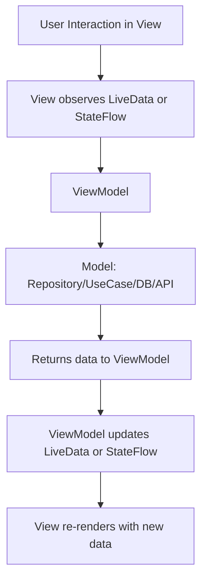

# 🏗️ MVVM Architecture Interview Guide
> **Targeted for Senior Android Developer / Team Lead Roles**


---

## ✅ What is MVVM?

**MVVM (Model-View-ViewModel)** is a software architectural pattern used in modern Android development. It enables a **separation of concerns** between the UI (View), the business logic/data (Model), and the intermediary (ViewModel).

MVVM is ideal for **data binding**, **lifecycle-aware components**, and **unit testing** in Android applications.

---

## 🔄 MVVM Flow (Mermaid Diagram)



---

## 🧩 Components of MVVM

| Component    | Responsibility                                                                 |
|--------------|----------------------------------------------------------------------------------|
| **Model**     | Handles data-related operations: network, DB, preferences, etc.                 |
| **View**      | Displays UI. Observes `LiveData`, `StateFlow`, or `Compose` state.              |
| **ViewModel** | Exposes data to the UI and handles business logic. Survives configuration changes. |

---

## 🧠 Key Concepts

- **Unidirectional Data Flow**: View observes state, but never pushes changes directly to the Model.
- **LiveData / StateFlow / Compose State**: Used for reactive UI updates.
- **Lifecycle Awareness**: ViewModel is lifecycle-aware and survives orientation changes.

---

## 📱 Example Flow (Search UI)

1. **User types** a query → View calls `viewModel.onSearch("query")`
2. **ViewModel** calls repository `searchItems("query")`
3. **Repository** fetches data from API or cache
4. **Result** is returned to ViewModel
5. **ViewModel** updates the `LiveData` or `StateFlow`
6. **View** automatically re-renders UI with new list

---

## ✅ Benefits of MVVM

- Easy to **test ViewModel** separately.
- Clean separation of UI and logic.
- Works well with **Jetpack Compose**, **LiveData**, and **Kotlin Flows**.
- **Lifecycle-aware** via ViewModel and other Jetpack components.

---

## ⚠️ Drawbacks

- May require boilerplate for `sealed classes`, `UIState`, `Events`.
- Overuse of ViewModel for too much logic can cause a "fat ViewModel".
- Requires understanding of reactive streams (LiveData, Flow, etc.)

---

## 🔄 Comparison Summary

| Pattern | Data Flow             | Lifecycle-Aware | Testability | UI Tech         |
|--------|------------------------|------------------|-------------|------------------|
| MVC    | Bidirectional          | ❌                | Medium      | Web/legacy apps  |
| MVP    | View → Presenter → Model | ❌              | Good        | XML Android      |
| MVVM   | View ←→ ViewModel ←→ Model | ✅             | Excellent   | XML & Compose    |
| MVI    | Unidirectional (State) | ✅                | Excellent   | Jetpack Compose  |

---

## 🛠️ Sample Code Snippets

### ViewModel

```kotlin
class SearchViewModel(
    private val repository: SearchRepository
) : ViewModel() {

    private val _uiState = MutableStateFlow<SearchUiState>(SearchUiState.Idle)
    val uiState: StateFlow<SearchUiState> = _uiState.asStateFlow()

    fun onSearch(query: String) {
        viewModelScope.launch {
            _uiState.value = SearchUiState.Loading
            try {
                val results = repository.search(query)
                _uiState.value = SearchUiState.Success(results)
            } catch (e: Exception) {
                _uiState.value = SearchUiState.Error(e.message ?: "Unknown error")
            }
        }
    }
}
```

### UI State

```kotlin
sealed class SearchUiState {
    object Idle : SearchUiState()
    object Loading : SearchUiState()
    data class Success(val items: List<String>) : SearchUiState()
    data class Error(val message: String) : SearchUiState()
}
```

---

## ✅ Summary

MVVM is the recommended architecture for **modern Android apps**, especially when using:

- Jetpack Compose
- Lifecycle-aware components
- Kotlin coroutines and Flow
- Clean Architecture

It leads to **cleaner**, **testable**, and **maintainable** code.
