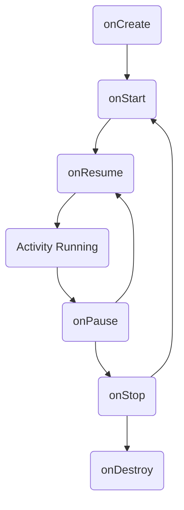

# 🧩 Android Components Interview Guide
> **Targeted for Junior - Senior Android Developer Roles**
> **Note:** These are the building blocks of any Android application. Mastery of their lifecycles is essential.

---

## 📖 Table of Contents
- [1. Activities & Lifecycle](#-1-what-is-an-activity)
- [2. Services](#-2-what-is-a-service)
- [3. Broadcast Receivers](#-3-what-is-a-broadcast-receiver)
- [4. Content Providers](#-4-what-is-a-content-provider)
- [5. Inter-Component Communication](#-8-how-do-you-communicate-between-components)

---

## What are Android components?

Android components are the essential building blocks of an Android application. Each component is a different point through which the system can enter your app. The main Android components are:

- **Activities**
- **Services**
- **Broadcast Receivers**
- **Content Providers**

---

### 1. What is an Activity?

**Answer:**  
An Activity represents a single screen with a user interface. It is like a window or a page in an app. Activities handle user interaction and navigation between screens.

#### Activity Lifecycle Methods with Flow

The typical flow of an Activity's lifecycle is as follows:

- **onCreate()**: Called when the activity is first created. Initialize resources here.
- **onStart()**: Called when the activity becomes visible to the user.
- **onResume()**: Called when the activity starts interacting with the user.
- **onPause()**: Called when the system is about to start resuming another activity.
- **onStop()**: Called when the activity is no longer visible.
- **onDestroy()**: Called before the activity is destroyed.

This flow ensures proper resource management and user experience as the activity transitions between states.

---

### 2. What is a Service?

**Answer:**  
A Service is a component that runs in the background to perform long-running operations. It does not provide a user interface. Examples include playing music or fetching data from the network.

---

### 3. What is a Broadcast Receiver?

**Answer:**  
A Broadcast Receiver responds to system-wide broadcast announcements. Apps can register to receive specific broadcasts, such as when the device is charging or when the network connectivity changes.

---

### 4. What is a Content Provider?

**Answer:**  
A Content Provider manages access to a structured set of data. It allows data sharing between different applications. Examples include the Contacts or MediaStore providers.

---

### 5. What is the role of the AndroidManifest.xml file?

**Answer:**  
The `AndroidManifest.xml` file declares all the components of the application and their capabilities. It is required for the system to know about the components and how to launch them.

---

### 6. Can you explain the lifecycle of an Activity?

**Answer:**  
The Activity lifecycle includes states such as `onCreate()`, `onStart()`, `onResume()`, `onPause()`, `onStop()`, and `onDestroy()`. These methods allow developers to manage resources and handle user interactions appropriately.

---

### 7. How do Services differ from Activities?

**Answer:**  
Services run in the background without a user interface, while Activities interact with the user. Services are used for tasks that need to continue even if the user is not interacting with the app.

---

### 8. How do you communicate between components?

**Answer:**  
Components communicate using **Intents**. Intents can be explicit (targeting a specific component) or implicit (requesting any component that can handle the action).

---

### 9. What are the different types of Services in Android?

**Answer:**  
There are three main types of services:
- **Foreground Service:** Performs operations noticeable to the user, such as playing music. It must display a notification.
- **Background Service:** Performs tasks not directly noticed by the user. Subject to background execution limits in recent Android versions.
- **Bound Service:** Allows components (like activities) to bind to the service and interact with it via a client-server interface.

---

### 10. How do you start and stop a Service?

**Answer:**  
You start a service using `startService(Intent)` or `bindService(Intent, ServiceConnection, int)`.  
To stop a service, call `stopService(Intent)` or `stopSelf()` from within the service. Bound services are stopped when all clients unbind.

---

### 11. What is a Bound Service and how is it implemented?

**Answer:**  
A Bound Service allows components to bind and interact with it. It is implemented by overriding `onBind()` in the Service class and returning an `IBinder` interface for communication. Clients use this binder to call public methods in the service.

---

### 12. How do you run a Service in the foreground?

**Answer:**  
Call `startForeground()` within the service, passing a notification. This keeps the service running even under memory pressure and informs the user that the service is active.

---

### 13. What are the lifecycle methods of a Service?

**Answer:**  
Key lifecycle methods include:
- `onCreate()`: Called when the service is first created.
- `onStartCommand()`: Called each time the service is started.
- `onBind()`: Called when a component binds to the service.
- `onUnbind()`: Called when all clients have unbound.
- `onDestroy()`: Called when the service is destroyed.

---

### 14. How does Android handle service limitations in recent versions?

**Answer:**  
Recent Android versions impose restrictions on background services to improve battery life. Apps must use foreground services for long-running tasks, and background execution is limited unless the app is in the foreground or has special permissions.

---

### 15. What are some best practices for using Services?

**Answer:**  
- Use foreground services for user-noticeable tasks.
- Release resources in `onDestroy()`.
- Avoid long-running operations on the main thread; use worker threads.
- Handle service restarts gracefully using `START_STICKY`, `START_NOT_STICKY`, or `START_REDELIVER_INTENT` in `onStartCommand()`.

---

### 16. What are the launch modes of an Activity?

**Answer:**  
Android supports four launch modes for activities, defined in the manifest or via intent flags:
- **standard:** Default mode; a new instance is created each time.
- **singleTop:** If the activity is already at the top, no new instance is created.
- **singleTask:** Only one instance exists in the task; if it exists, it is brought to the front.
- **singleInstance:** The activity is the only one in its task; other activities launch in a new task.

---

### 17. How do you pass data between Activities?

**Answer:**  
Data is passed using `Intent` extras. Use `putExtra()` to add data and `getIntent().getExtras()` or `getIntent().getStringExtra()` to retrieve it in the target activity.

---

### 18. What is the difference between onSaveInstanceState() and onRestoreInstanceState()?

**Answer:**  
`onSaveInstanceState()` is called before an activity may be destroyed to save UI state. `onRestoreInstanceState()` is called after `onStart()` to restore the saved state. This helps preserve data during configuration changes like rotation.

---

### 19. How do you handle configuration changes in Activities?

**Answer:**  
Override `onConfigurationChanged()` or use `android:configChanges` in the manifest to handle changes manually. Alternatively, rely on the default behavior and save/restore state using `onSaveInstanceState()` and `onRestoreInstanceState()`.

---

### 20. How do you share data between apps using a Content Provider?

**Answer:**  
Content Providers expose data using a URI. Other apps access data via `ContentResolver` methods like `query()`, `insert()`, `update()`, and `delete()`, using the provider's URI.

---

### 21. How do you implement a custom Content Provider?

**Answer:**  
Extend the `ContentProvider` class and override methods: `onCreate()`, `query()`, `insert()`, `update()`, `delete()`, and `getType()`. Register the provider in `AndroidManifest.xml` with a unique authority.

---

### 22. How do you secure a Content Provider?

**Answer:**  
Restrict access using permissions in the manifest. Use `android:exported="false"` to limit access to your app, or define custom permissions for read/write operations.

---

### 23. What is a URI Matcher in Content Providers?

**Answer:**  
A `UriMatcher` helps map incoming URI patterns to integer codes, making it easier to handle different types of queries or operations in the provider's methods.

---

### 24. How do you notify data changes in a Content Provider?

**Answer:**  
Call `getContext().getContentResolver().notifyChange(uri, null)` after modifying data. Registered observers (like cursors or loaders) will be notified to update their data.

---

## Summary Table

| Component          | Purpose                                 | UI?   |
|--------------------|-----------------------------------------|-------|
| Activity           | User interaction, UI screens            | Yes   |
| Service            | Background tasks                        | No    |
| Broadcast Receiver | Respond to system/app broadcasts        | No    |
| Content Provider   | Data sharing between apps               | No    |
