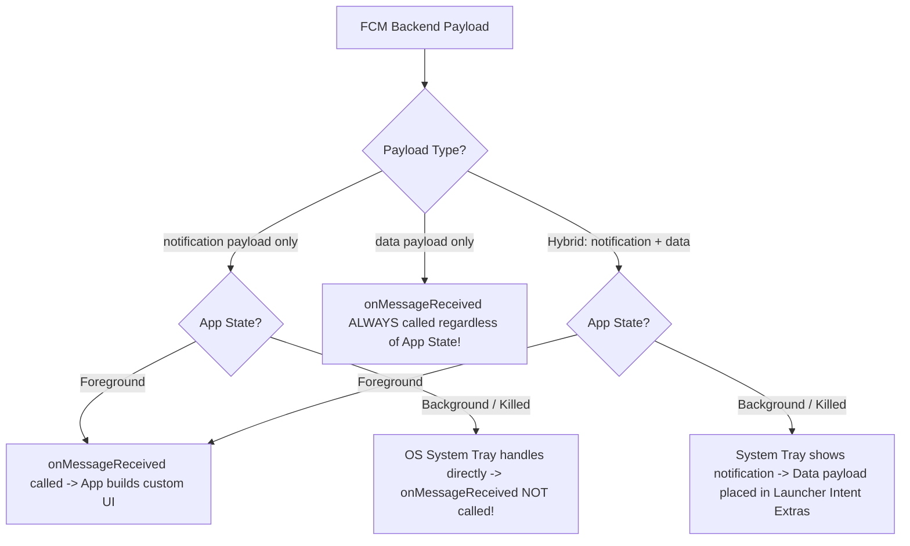
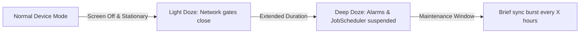

# 🔔 Firebase Cloud Messaging (FCM) & Modern Push Architecture
> **Targeted for Senior, Staff, and Lead Android Engineers**  
> **Core Focus:** Android 13+ `POST_NOTIFICATIONS` Permission, Data vs. Notification Payloads, Foreground/Background/Killed State Behavior, Deep-Link PendingIntents, and WorkManager Offloading.


---

## 📖 Table of Contents
- [1. FCM Architecture & Payload Matrix](#1-fcm-architecture--payload-matrix)
- [2. Android 13+ (API 33) Runtime Permission Flow](#2-android-13-api-33-runtime-permission-flow)
- [3. Implementing `FirebaseMessagingService`](#3-implementing-firebasemessagingservice)
- [4. Deep Linking into Jetpack Compose Destinations](#4-deep-linking-into-jetpack-compose-destinations)
- [5. Doze Mode, FCM Priority, and Quotas](#5-doze-mode-fcm-priority-and-quotas)
- [6. High-Reliability Data Message Processing with WorkManager](#6-high-reliability-data-message-processing-with-workmanager)
- [7. Interview Questions & Production Traps](#7-interview-questions--production-traps)

---

## 1. FCM Architecture & Payload Matrix

One of the most frequently failed interview topics is explaining how Android handles push messages depending on the payload structure and application state.



### The Definitive Behavior Matrix

| Payload Type | App in Foreground | App in Background | App Killed / Force Stopped |
| :--- | :--- | :--- | :--- |
| **Notification Payload** (`{ "notification": { "title": "Hello" } }`) | Delivered to `onMessageReceived()` | Intercepted by OS System Tray. `onMessageReceived()` is **never** invoked. | Delivered to System Tray unless app was manually **Force Stopped** by user. |
| **Data Payload** (`{ "data": { "orderId": "123" } }`) | Delivered to `onMessageReceived()` | Delivered to `onMessageReceived()`. Full custom handling. | System wakes the process in background to execute `onMessageReceived()`. |
| **Hybrid Payload** (`notification` + `data`) | Delivered to `onMessageReceived()` | OS displays system tray notification. Data is passed to target Activity via `intent.extras` **only after user taps the notification**. | Same as Background. |

> [!IMPORTANT]
> For enterprise messaging, ride updates, and silent synchronization, **always use pure Data messages**. This ensures `onMessageReceived()` executes 100% of the time.

---

## 2. Android 13+ (API 33) Runtime Permission Flow

Starting with Android 13 (API 33), notifications require explicit runtime user consent (`Manifest.permission.POST_NOTIFICATIONS`).

```kotlin
package com.devcrack.notification.permission

import android.Manifest
import android.content.pm.PackageManager
import android.os.Build
import androidx.activity.compose.rememberLauncherForActivityResult
import androidx.activity.result.contract.ActivityResultContracts
import androidx.compose.runtime.Composable
import androidx.compose.runtime.LaunchedEffect
import androidx.compose.ui.platform.LocalContext
import androidx.core.content.ContextCompat

@Composable
fun RequestNotificationPermission(
    onPermissionGranted: () -> Unit,
    onPermissionDenied: () -> Unit
) {
    val context = LocalContext.current

    val permissionLauncher = rememberLauncherForActivityResult(
        contract = ActivityResultContracts.RequestPermission()
    ) { isGranted ->
        if (isGranted) onPermissionGranted() else onPermissionDenied()
    }

    LaunchedEffect(Unit) {
        if (Build.VERSION.SDK_INT >= Build.VERSION_CODES.TIRAMISU) {
            val status = ContextCompat.checkSelfPermission(
                context,
                Manifest.permission.POST_NOTIFICATIONS
            )
            if (status != PackageManager.PERMISSION_GRANTED) {
                permissionLauncher.launch(Manifest.permission.POST_NOTIFICATIONS)
            } else {
                onPermissionGranted()
            }
        } else {
            onPermissionGranted()
        }
    }
}
```

---

## 3. Implementing `FirebaseMessagingService`

```kotlin
package com.devcrack.notification.service

import android.app.NotificationChannel
import android.app.NotificationManager
import android.app.PendingIntent
import android.content.Context
import android.content.Intent
import android.media.RingtoneManager
import android.os.Build
import androidx.core.app.NotificationCompat
import com.devcrack.MainActivity
import com.devcrack.R
import com.google.firebase.messaging.FirebaseMessagingService
import com.google.firebase.messaging.RemoteMessage
import dagger.hilt.android.AndroidEntryPoint
import kotlinx.coroutines.CoroutineScope
import kotlinx.coroutines.Dispatchers
import kotlinx.coroutines.launch
import javax.inject.Inject

@AndroidEntryPoint
class AppFirebaseMessagingService : FirebaseMessagingService() {

    @Inject lateinit var tokenSyncUseCase: SyncFcmTokenUseCase

    override fun onNewToken(token: String) {
        super.onNewToken(token)
        // Token rotated (app reinstalled, restored on new device, instance ID cleared)
        CoroutineScope(Dispatchers.IO).launch {
            tokenSyncUseCase.uploadTokenToBackend(token)
        }
    }

    override fun onMessageReceived(remoteMessage: RemoteMessage) {
        super.onMessageReceived(remoteMessage)

        // 1. Check if message contains a Data payload
        if (remoteMessage.data.isNotEmpty()) {
            val orderId = remoteMessage.data["order_id"]
            val title = remoteMessage.data["title"] ?: "Order Update"
            val message = remoteMessage.data["body"] ?: "Your ride status has changed"

            showNotification(title, message, orderId)
        }
    }

    private fun showNotification(title: String, messageBody: String, orderId: String?) {
        val channelId = "orders_channel"

        // Build Intent with Deep Link routing parameters
        val intent = Intent(this, MainActivity::class.java).apply {
            flags = Intent.FLAG_ACTIVITY_CLEAR_TOP or Intent.FLAG_ACTIVITY_SINGLE_TOP
            putExtra("EXTRA_NAV_DESTINATION", "order_details")
            putExtra("EXTRA_ORDER_ID", orderId)
        }

        val pendingIntent = PendingIntent.getActivity(
            this,
            orderId?.hashCode() ?: 0,
            intent,
            PendingIntent.FLAG_UPDATE_CURRENT or PendingIntent.FLAG_IMMUTABLE
        )

        val soundUri = RingtoneManager.getDefaultUri(RingtoneManager.TYPE_NOTIFICATION)
        val notificationBuilder = NotificationCompat.Builder(this, channelId)
            .setSmallIcon(android.R.drawable.ic_dialog_info)
            .setContentTitle(title)
            .setContentText(messageBody)
            .setAutoCancel(true)
            .setSound(soundUri)
            .setPriority(NotificationCompat.PRIORITY_HIGH)
            .setContentIntent(pendingIntent)

        val notificationManager = getSystemService(Context.NOTIFICATION_SERVICE) as NotificationManager

        // Create Channel for Android 8.0 (API 26+)
        if (Build.VERSION.SDK_INT >= Build.VERSION_CODES.O) {
            val channel = NotificationChannel(
                channelId,
                "Ride & Order Notifications",
                NotificationManager.IMPORTANCE_HIGH
            )
            notificationManager.createNotificationChannel(channel)
        }

        notificationManager.notify(orderId?.hashCode() ?: 1, notificationBuilder.build())
    }
}
```

---

## 4. Deep Linking into Jetpack Compose Destinations

When the user taps the notification, the system opens `MainActivity`. We extract the arguments and route the Jetpack Compose `NavController` directly to the target screen.

```kotlin
package com.devcrack.ui

import android.content.Intent
import android.os.Bundle
import androidx.activity.ComponentActivity
import androidx.activity.compose.setContent
import androidx.navigation.compose.rememberNavController

class MainActivity : ComponentActivity() {

    override fun onCreate(savedInstanceState: Bundle?) {
        super.onCreate(savedInstanceState)

        setContent {
            val navController = rememberNavController()

            // Handle cold start deep link from notification
            LaunchedEffect(Unit) {
                intent?.let { handleNotificationIntent(it, navController) }
            }

            AppNavHost(navController = navController)
        }
    }

    override fun onNewIntent(intent: Intent) {
        super.onNewIntent(intent)
        // Handle warm start deep link when MainActivity was already alive
        setIntent(intent)
    }

    private fun handleNotificationIntent(intent: Intent, navController: NavHostController) {
        val destination = intent.getStringExtra("EXTRA_NAV_DESTINATION")
        val orderId = intent.getStringExtra("EXTRA_ORDER_ID")

        if (destination == "order_details" && orderId != null) {
            navController.navigate("orders/$orderId")
        }
    }
}
```

---

## 5. Doze Mode, FCM Priority, and Quotas

To protect battery life, Android places devices into **Doze Mode** when unplugged, stationary, and screen-off:



### High Priority vs. Normal Priority
- **Normal Priority (`"priority": "normal"`):** FCM messages are suppressed during Doze mode and only delivered during the next maintenance window.
- **High Priority (`"priority": "high"`):** Bypasses Doze mode immediately. Android grants a temporary network access window and CPU wake.
- **High-Priority Quota:** Android limits the number of high-priority messages an app can receive. If an app receives continuous high-priority pings that do not show a visible user notification, the OS **demotes** future messages to Normal priority.

---

## 6. High-Reliability Data Message Processing with WorkManager

If an FCM data message requires syncing data (e.g. downloading a batch of encrypted messages or syncing large databases), never perform long network tasks inside `onMessageReceived()`. The OS gives you only **~20 seconds** before terminating the background execution slot.

```kotlin
override fun onMessageReceived(remoteMessage: RemoteMessage) {
    super.onMessageReceived(remoteMessage)

    if (remoteMessage.data["requires_sync"] == "true") {
        val syncRequest = OneTimeWorkRequestBuilder<SyncDatabaseWorker>()
            .setExpedited(OutOfQuotaPolicy.RUN_AS_NON_EXPEDITED_WORK_REQUEST)
            .build()

        WorkManager.getInstance(this).enqueue(syncRequest)
    }
}
```

---

## 7. Interview Questions & Production Traps

### Q1. What causes `onNewToken` to be called, and why must the token be sent to your backend?
**Answer:**  
`onNewToken` is invoked when:
1. The app is installed on a new device or restored from backup.
2. The user clears application data in system settings.
3. Firebase periodically rotates underlying security credentials.  
FCM device tokens are unique addresses identifying a specific app instance on a specific device. If your backend holds a stale token, push delivery attempts will fail with `UNREGISTERED` errors.

### Q2. Why did my FCM notification not display when the app was in the background?
**Answer:**  
Common causes in production:
1. **Hybrid Payload with launcher defaults:** If the payload contains `"notification"`, Android's system tray handles it directly and uses default launcher intent unless a `click_action` matching an intent-filter is specified.
2. **Missing Notification Channel (Android 8.0+):** If the notification is built without assigning a valid `NotificationChannel`, Android drops the notification silently.
3. **Missing `POST_NOTIFICATIONS` Permission (Android 13+):** If the user denied notification permission, the OS suppresses display.
4. **App Force-Stopped:** If the user swiped the app away from recent tasks on heavily customized OEM ROMs (e.g. Xiaomi MIUI / Huawei EMUI), the app is placed in a "stopped" state. Android prohibits broadcast delivery to stopped apps until the user manually taps the app icon again.
