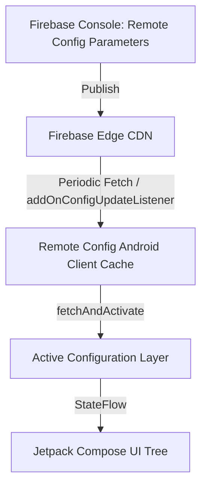

# 🚀 Remote Config, Crashlytics & Performance Monitoring
> **Targeted for Senior, Staff, and Lead Android Engineers**  
> **Core Focus:** Real-Time Remote Config in Jetpack Compose, Dynamic Feature Flags, Coroutine Exception Handling with Crashlytics, and Custom Tracing with Firebase Performance.


---

## 📖 Table of Contents
- [1. Firebase Remote Config Architecture](#1-firebase-remote-config-architecture)
- [2. Real-Time Remote Config with Jetpack Compose](#2-real-time-remote-config-with-jetpack-compose)
- [3. Crashlytics Enterprise Observability](#3-crashlytics-enterprise-observability)
- [4. Coroutines & Non-Fatal Exception Handling](#4-coroutines--non-fatal-exception-handling)
- [5. Firebase Performance Monitoring (Custom Traces & Metrics)](#5-firebase-performance-monitoring-custom-traces--metrics)
- [6. Interview Questions & Production War Stories](#6-interview-questions--production-war-stories)

---

## 1. Firebase Remote Config Architecture

Firebase Remote Config allows dynamically altering application features, UI layouts, and experiment flags without distributing a new APK/AAB to the Play Store.



### Fetch & Activate Strategies
1. **Fetch and Activate on Launch:** Simple, but if the network is sluggish, it introduces noticeable UI jank or delays screen rendering.
2. **Activate from Cache, Fetch in Background:** Instantly renders the cached config from the previous session, fetches fresh values in the background, and activates them on the next cold launch.
3. **Real-Time Config Updates (Firebase 21.3.0+):** Utilizes bidirectional streaming (`addOnConfigUpdateListener`) to push changes to the app within milliseconds of being saved in the Firebase console.

---

## 2. Real-Time Remote Config with Jetpack Compose

```kotlin
package com.devcrack.config

import com.google.firebase.remoteconfig.ConfigUpdate
import com.google.firebase.remoteconfig.ConfigUpdateListener
import com.google.firebase.remoteconfig.FirebaseRemoteConfig
import com.google.firebase.remoteconfig.FirebaseRemoteConfigException
import com.google.firebase.remoteconfig.FirebaseRemoteConfigSettings
import kotlinx.coroutines.flow.MutableStateFlow
import kotlinx.coroutines.flow.StateFlow
import kotlinx.coroutines.flow.asStateFlow
import javax.inject.Inject
import javax.inject.Singleton

data class FeatureFlags(
    val isNewRideUiEnabled: Boolean = false,
    val discountBannerPercent: Long = 0L,
    val checkoutButtonColorHex: String = "#FF6D00"
)

@Singleton
class RemoteConfigManager @Inject constructor(
    private val remoteConfig: FirebaseRemoteConfig
) {
    private val _featureFlags = MutableStateFlow(FeatureFlags())
    val featureFlags: StateFlow<FeatureFlags> = _featureFlags.asStateFlow()

    init {
        setupRemoteConfig()
    }

    private fun setupRemoteConfig() {
        val configSettings = FirebaseRemoteConfigSettings.Builder()
            // In development: 0 seconds for instant testing. In production: 3600s (1 hour)
            .setMinimumFetchIntervalInSeconds(3600)
            .build()

        remoteConfig.setConfigSettingsAsync(configSettings)
        remoteConfig.setDefaultsAsync(
            mapOf(
                "is_new_ride_ui_enabled" to false,
                "discount_banner_percent" to 0L,
                "checkout_button_color" to "#FF6D00"
            )
        )

        // 1. Initial background fetch and activate
        remoteConfig.fetchAndActivate().addOnCompleteListener {
            syncFlagsToState()
        }

        // 2. Real-time config listener (instant updates without app restart)
        remoteConfig.addOnConfigUpdateListener(object : ConfigUpdateListener {
            override fun onUpdate(configUpdate: ConfigUpdate) {
                remoteConfig.activate().addOnCompleteListener {
                    syncFlagsToState()
                }
            }

            override fun onError(error: FirebaseRemoteConfigException) {
                // Log Remote Config error
            }
        })
    }

    private fun syncFlagsToState() {
        _featureFlags.value = FeatureFlags(
            isNewRideUiEnabled = remoteConfig.getBoolean("is_new_ride_ui_enabled"),
            discountBannerPercent = remoteConfig.getLong("discount_banner_percent"),
            checkoutButtonColorHex = remoteConfig.getString("checkout_button_color")
        )
    }
}
```

### Consuming in Jetpack Compose

```kotlin
@Composable
fun HomeScreen(configManager: RemoteConfigManager) {
    val flags by configManager.featureFlags.collectAsState()

    if (flags.isNewRideUiEnabled) {
        ModernRideExperience(discount = flags.discountBannerPercent)
    } else {
        ClassicRideExperience()
    }
}
```

---

## 3. Crashlytics Enterprise Observability

Raw stack traces alone are often insufficient to reproduce sporadic crashes reported by users. Enterprise Crashlytics requires:
- **Custom Keys:** State variables (e.g. `order_id`, `battery_level`, `network_type`).
- **User Identifier Tagging:** Correlating crashes with specific user accounts without exposing PII.
- **Breadcrumbs:** Logging chronological user interactions prior to the crash.

```kotlin
package com.devcrack.monitoring

import com.google.firebase.crashlytics.FirebaseCrashlytics
import javax.inject.Inject
import javax.inject.Singleton

@Singleton
class AppObservability @Inject constructor(
    private val crashlytics: FirebaseCrashlytics
) {

    fun setUserSession(userId: String, userTier: String) {
        crashlytics.setUserId(userId)
        crashlytics.setCustomKey("user_tier", userTier)
    }

    fun logUserAction(actionDescription: String) {
        // Appends breadcrumb message that appears in Crashlytics console timeline
        crashlytics.log("[Navigation] $actionDescription")
    }

    fun setTripContext(tripId: String, vehicleType: String) {
        crashlytics.setCustomKey("active_trip_id", tripId)
        crashlytics.setCustomKey("vehicle_type", vehicleType)
    }

    fun recordNonFatal(throwable: Throwable, contextMap: Map<String, String> = emptyMap()) {
        contextMap.forEach { (key, value) ->
            crashlytics.setCustomKey(key, value)
        }
        crashlytics.recordException(throwable)
    }
}
```

---

## 4. Coroutines & Non-Fatal Exception Handling

Unhandled exceptions inside a root `CoroutineScope` crash the process. Use `CoroutineExceptionHandler` to capture non-fatals and ship them to Crashlytics:

```kotlin
package com.devcrack.monitoring

import com.google.firebase.crashlytics.FirebaseCrashlytics
import kotlinx.coroutines.CoroutineExceptionHandler
import kotlinx.coroutines.CoroutineScope
import kotlinx.coroutines.Dispatchers
import kotlinx.coroutines.SupervisorJob

object SafeCoroutineScopes {

    val globalSupervisorScope: CoroutineScope by lazy {
        val handler = CoroutineExceptionHandler { _, throwable ->
            // Prevent app crash, log non-fatal to Crashlytics
            FirebaseCrashlytics.getInstance().apply {
                log("Uncaught exception in CoroutineScope")
                recordException(throwable)
            }
        }
        CoroutineScope(SupervisorJob() + Dispatchers.Default + handler)
    }
}
```

---

## 5. Firebase Performance Monitoring (Custom Traces & Metrics)

Firebase Performance auto-instruments **App Start Time** (Cold/Warm/Hot) and screen render speeds (**Slow Rendering Frames** $>16\text{ ms}$ and **Frozen Frames** $>700\text{ ms}$).

### Measuring Custom Business Operations

```kotlin
package com.devcrack.monitoring

import com.google.firebase.perf.FirebasePerformance
import com.google.firebase.perf.metrics.Trace

class CheckoutPerformanceTracker {

    private var checkoutTrace: Trace? = null

    fun startCheckoutTrace() {
        checkoutTrace = FirebasePerformance.getInstance().newTrace("trip_checkout_flow")
        checkoutTrace?.start()
    }

    fun recordStepSuccess(itemCount: Long, paymentMethod: String) {
        checkoutTrace?.apply {
            putAttribute("payment_gateway", paymentMethod)
            putMetric("items_checked_out", itemCount)
        }
    }

    fun stopCheckoutTrace(isSuccessful: Boolean) {
        checkoutTrace?.apply {
            putAttribute("status", if (isSuccessful) "SUCCESS" else "FAILED")
            stop()
        }
        checkoutTrace = null
    }
}
```

### Kotlin Inlined Extension for Elegant Tracing

```kotlin
inline fun <T> traceExecution(traceName: String, block: () -> T): T {
    val trace = FirebasePerformance.getInstance().newTrace(traceName)
    trace.start()
    return try {
        block()
    } finally {
        trace.stop()
    }
}

// Usage in repository
suspend fun loadOfflineMapCache() = traceExecution("load_map_cache_trace") {
    // Heavy disk I/O operation
}
```

---

## 6. Interview Questions & Production War Stories

### Q1. Why does setting `minimumFetchIntervalInSeconds(0)` in production cause severe throttling?
**Answer:**  
Firebase Remote Config enforces server-side rate limits. If a production app with hundreds of thousands of users sets the fetch interval to 0, devices spam Google's backend on every launch. Google Play Services responds with **HTTP 429 Too Many Requests**, causing the client to throw `FirebaseRemoteConfigFetchThrottledException` and freezing config fetches for up to several hours. For production, keep the interval at $\ge 3600$ seconds (1 hour) or rely on the real-time config update stream (`addOnConfigUpdateListener`).

### Q2. What is the difference between Slow Frames and Frozen Frames in Android Vitals & Firebase Performance?
**Answer:**  
- **Slow Frames:** Any frame that takes longer than **16.6 ms** to render (exceeding the 60 Hz display refresh window, or 8.3 ms on 120 Hz screens). Causes visible animation jitter (stuttering).
- **Frozen Frames:** Any frame that takes longer than **700 ms** to render. The user perceives the app as completely unresponsive or hanging, often leading directly to an ANR (Application Not Responding) dialog.
