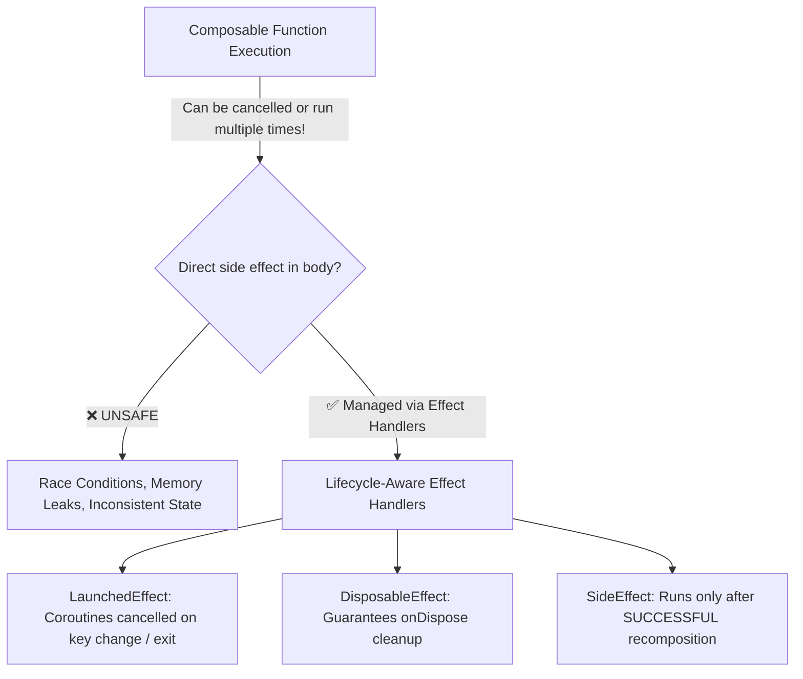
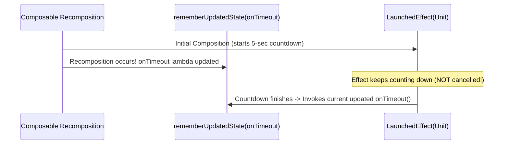

# ⚡ Jetpack Compose Side Effects & Lifecycle Effect Handlers
> **Targeted for Senior, Staff, and Lead Android Engineers**  
> **Core Focus:** Effect Handlers (`LaunchedEffect`, `DisposableEffect`, `SideEffect`), `rememberUpdatedState`, `snapshotFlow`, `produceState`, Coroutine Lifecycle Integration, and Anti-Pattern Mitigation.


---

## 📖 Table of Contents
- [1. What are Side Effects in Jetpack Compose?](#1-what-are-side-effects-in-jetpack-compose)
- [2. The Side Effect Decision Matrix](#2-the-side-effect-decision-matrix)
- [3. `LaunchedEffect`: Suspending Effects Tied to Composition](#3-launchedeffect-suspending-effects-tied-to-composition)
- [4. `rememberCoroutineScope`: Event-Driven Coroutines](#4-remembercoroutinescope-event-driven-coroutines)
- [5. `rememberUpdatedState`: The Stale Closure Defender](#5-rememberupdatedstate-the-stale-closure-defender)
- [6. `DisposableEffect`: Cleanup & Resource Teardown](#6-disposableeffect-cleanup--resource-teardown)
- [7. `SideEffect`: Publishing Compose State to Non-Compose Observers](#7-sideeffect-publishing-compose-state-to-non-compose-observers)
- [8. `produceState`: Bridging External Async Sources into Compose State](#8-producestate-bridging-external-async-sources-into-compose-state)
- [9. `snapshotFlow`: Converting Compose State to Kotlin Flow](#9-snapshotflow-converting-compose-state-to-kotlin-flow)
- [10. Critical Anti-Patterns & Interview Traps](#10-critical-anti-patterns--interview-traps)
- [11. Frequently Asked Staff-Level Interview Questions](#11-frequently-asked-staff-level-interview-questions)

---

## 1. What are Side Effects in Jetpack Compose?

In Jetpack Compose, a composable function should ideally be **pure**:
1. It produces UI based purely on the inputs (arguments) provided to it.
2. It has no side effects on external state.
3. It can be executed on any thread, out of order, or skipped entirely during recomposition.

A **Side Effect** is any mutation or operation that escapes the scope of a composable function:
- Launching background network/database coroutines.
- Updating global/singleton state or analytics trackers.
- Registering broadcast receivers, sensor listeners, or location callbacks.
- Controlling external UI elements (system status bars, window insets).



> [!WARNING]
> Never execute network calls, analytics pings, or coroutines directly in the body of a `@Composable`. Recomposition can happen 60+ times per second or discard intermediate frames; effect handlers ensure predictable execution.

---

## 2. The Side Effect Decision Matrix

| API | Triggers When? | Coroutine Scope? | Cleanup Support? | Primary Use Case |
| :--- | :--- | :--- | :--- | :--- |
| **`LaunchedEffect`** | Enters composition or when key(s) change | ✅ Yes (Cancels previous job) | Automatic job cancellation | Async loading, timers, animations, one-shot events |
| **`rememberCoroutineScope`** | Called explicitly inside an event callback | ✅ Yes (Tied to call-site composition) | Cancelled when caller leaves composition | Button clicks, gesture swipes, manual user actions |
| **`rememberUpdatedState`** | Recomposition updates value without restarting effect | ❌ No | N/A | Preventing stale lambdas/callbacks in long-running effects |
| **`DisposableEffect`** | Enters composition or when key(s) change | ❌ No | ✅ Yes (`onDispose` mandatory) | Listeners, broadcast receivers, observers, sensors |
| **`SideEffect`** | Every successful recomposition | ❌ No | ❌ No | Syncing Compose state with external non-Compose objects |
| **`produceState`** | Enters composition or when key(s) change | ✅ Yes | Automatic cancellation / `awaitDispose` | Converting Flow, RxJava, or callbacks into `State<T>` |
| **`snapshotFlow`** | Emits when observed Compose state value changes | Bridges to cold `Flow<T>` | Standard Flow operators (`debounce`, etc.) | Filtering state emissions, driving pagination on list scroll |

---

## 3. `LaunchedEffect`: Suspending Effects Tied to Composition

`LaunchedEffect` launches a coroutine scoped to the composition. If any key passed to it changes, the running coroutine is cancelled and a new one is launched. When the composable leaves the composition tree, the coroutine is automatically cancelled.

```kotlin
@Composable
fun UserProfileScreen(
    userId: String,
    viewModel: UserProfileViewModel = hiltViewModel()
) {
    val uiState by viewModel.uiState.collectAsStateWithLifecycle()

    // 1. Re-executes whenever `userId` changes
    LaunchedEffect(userId) {
        viewModel.loadUserProfile(userId)
    }

    // 2. Runs once when entering composition (Key = Unit or true)
    LaunchedEffect(Unit) {
        viewModel.trackScreenView("UserProfile")
    }

    when (val state = uiState) {
        is UiState.Loading -> CircularProgressIndicator()
        is UiState.Success -> ProfileContent(state.user)
        is UiState.Error -> ErrorView(state.message)
    }
}
```

### Key Rules for `LaunchedEffect`:
- **`LaunchedEffect(Unit)` vs `LaunchedEffect(key)`:** `Unit` or `true` means "run once when this composable first enters the composition tree". If you need it to react to parameter changes, pass the dynamic parameter as the key.
- **Cancellation:** It uses structured concurrency. When the key changes, the previous job receives a `CancellationException`.

---

## 4. `rememberCoroutineScope`: Event-Driven Coroutines

When a coroutine must be launched from a **non-composable event callback** (e.g. `onClick`, `onRefresh`, `onSwipe`), use `rememberCoroutineScope()`.

```kotlin
@Composable
fun CartScreen(
    snackbarHostState: SnackbarHostState,
    viewModel: CartViewModel = hiltViewModel()
) {
    // 1. Obtain a CoroutineScope bound to this point in the composition
    val coroutineScope = rememberCoroutineScope()

    Button(
        onClick = {
            // Cannot call LaunchedEffect here because onClick is a standard lambda!
            coroutineScope.launch {
                val result = snackbarHostState.showSnackbar(
                    message = "Item removed",
                    actionLabel = "Undo",
                    duration = SnackbarDuration.Short
                )
                if (result == SnackbarResult.ActionPerformed) {
                    viewModel.undoRemove()
                }
            }
        }
    ) {
        Text("Remove Item")
    }
}
```

> [!IMPORTANT]
> **Difference:** `LaunchedEffect` is called by the framework during the composition phase. `rememberCoroutineScope` provides a scope to launch coroutines in response to user actions *after* composition has finished.

---

## 5. `rememberUpdatedState`: The Stale Closure Defender

When a long-lived effect references a parameter or lambda that might update during recomposition, but you **do not** want the effect to restart and reset its timer or progress, use `rememberUpdatedState`.



### Problem Demonstration & Solution:

```kotlin
@Composable
fun SplashScreen(
    onTimeout: () -> Unit // Lambda might change if parent recomposes!
) {
    // ❌ FLAWED: If onTimeout is in key, every recomposition restarts the 3s delay!
    // If not in key, it captures the initial instance (stale closure).
    // LaunchedEffect(onTimeout) { delay(3000); onTimeout() }

    // ✅ PRODUCTION-GRADE: Captures the freshest reference without restarting delay
    val currentOnTimeout by rememberUpdatedState(onTimeout)

    LaunchedEffect(Unit) {
        delay(3000L) // 3-second splash delay
        currentOnTimeout() // Calls the latest lambda safely
    }

    SplashContent()
}
```

---

## 6. `DisposableEffect`: Cleanup & Resource Teardown

`DisposableEffect` is designed for side effects that require explicit cleanup when keys change or when the composable leaves composition (e.g. listeners, BroadcastReceivers, sensors).

```kotlin
@Composable
fun SystemBroadcastObserver(
    systemAction: String,
    onBroadcastReceived: (Intent?) -> Unit
) {
    val context = LocalContext.current
    val currentOnReceived by rememberUpdatedState(onBroadcastReceived)

    DisposableEffect(context, systemAction) {
        val receiver = object : BroadcastReceiver() {
            override fun onReceive(ctx: Context?, intent: Intent?) {
                currentOnReceived(intent)
            }
        }

        val intentFilter = IntentFilter(systemAction)
        context.registerReceiver(receiver, intentFilter)

        // onDispose is MANDATORY and guaranteed to be executed on exit/key change
        onDispose {
            context.unregisterReceiver(receiver)
        }
    }
}
```

---

## 7. `SideEffect`: Publishing Compose State to Non-Compose Observers

`SideEffect` runs **after every successful recomposition**. It is used to share Compose state with objects not managed by Compose (e.g. updating an external logging SDK, communicating with a custom View, or updating system UI controller).

```kotlin
@Composable
fun AnalyticsTracker(
    screenName: String,
    analyticsSdk: AnalyticsSdk
) {
    // Runs only after recomposition successfully completes and commits to the screen
    SideEffect {
        analyticsSdk.setUserCurrentScreen(screenName)
    }
}
```

> [!NOTE]
> Unlike `LaunchedEffect`, `SideEffect` does not accept keys and cannot suspend. It is strictly synchronous and runs on the main thread after every successful recomposition.

---

## 8. `produceState`: Bridging External Async Sources into Compose State

`produceState` launches a coroutine scoped to composition that can push values into a returned Compose `State<T>`.

```kotlin
@Composable
fun loadNetworkImage(
    url: String,
    imageLoader: ImageLoader
): State<ImageResult> {
    return produceState<ImageResult>(initialValue = ImageResult.Loading, key1 = url) {
        // Runs in CoroutineScope whenever 'url' changes
        value = try {
            val bitmap = imageLoader.fetch(url)
            ImageResult.Success(bitmap)
        } catch (e: Exception) {
            ImageResult.Error(e)
        }
    }
}
```

---

## 9. `snapshotFlow`: Converting Compose State to Kotlin Flow

`snapshotFlow` observes Compose state objects (`mutableStateOf`) and emits their values into a cold Kotlin `Flow`. This unlocks rich Coroutine operators like `debounce`, `distinctUntilChanged`, and `filter`.

### Real-World Use Case: Infinite Scrolling & LazyList Pagination

```kotlin
@Composable
fun PaginatedOrderList(
    lazyListState: LazyListState = rememberLazyListState(),
    onLoadMore: () -> Unit
) {
    LaunchedEffect(lazyListState) {
        snapshotFlow {
            // Read Compose state inside snapshotFlow block
            val totalItems = lazyListState.layoutInfo.totalItemsCount
            val lastVisibleItemIndex = lazyListState.layoutInfo.visibleItemsInfo.lastOrNull()?.index ?: 0
            lastVisibleItemIndex >= totalItems - 5 && totalItems > 0
        }
        .distinctUntilChanged() // Only emit when boolean state actually toggles
        .filter { shouldLoad -> shouldLoad } // Only act when reaching the threshold
        .collect {
            onLoadMore()
        }
    }

    LazyColumn(state = lazyListState) {
        // Items rendering...
    }
}
```

---

## 10. Critical Anti-Patterns & Interview Traps

### ❌ Trap 1: Mutating State Directly in Composable Body
```kotlin
// WRONG: Causes infinite recomposition loops!
@Composable
fun BadCounter() {
    var count by remember { mutableStateOf(0) }
    count++ // Modifying state during composition triggers another recomposition!
    Text("Count: $count")
}
```

### ❌ Trap 2: Using Volatile Keys in `LaunchedEffect`
```kotlin
// WRONG: Restarts coroutine every frame because timestamp is always new!
LaunchedEffect(System.currentTimeMillis()) {
    fetchData()
}
```

### ❌ Trap 3: Passing Composables into Async Coroutine Blocks
```kotlin
// WRONG: Composables cannot be invoked inside coroutine bodies!
LaunchedEffect(Unit) {
    MyComposableUI() // Compile-time error: @Composable invocations only valid in @Composable context
}
```

---

## 11. Frequently Asked Staff-Level Interview Questions

### Q1. What happens if a Composable recomposes while a `LaunchedEffect` is running?
**Answer:**  
If none of the `LaunchedEffect` keys changed, the running coroutine **continues uninterrupted**. Recomposition alone does not restart `LaunchedEffect`. If any key changed, the existing coroutine is cancelled via `CancellationException` and a new coroutine is launched with the new key.

### Q2. Why is `SideEffect` preferred over placing code directly in the Composable body?
**Answer:**  
The Compose compiler can execute, abandon, or repeat a Composable function's body multiple times before a frame is successfully committed to the screen. If you place side effects directly in the body, they might execute even if composition was discarded due to an invalidation. `SideEffect` guarantees that its lambda runs **only after composition successfully completes and is applied to the UI tree**.

### Q3. How does `snapshotFlow` track Compose state changes under the hood?
**Answer:**  
`snapshotFlow` leverages the **Compose Snapshot System**. When reading `State<T>` inside the `snapshotFlow` block, the snapshot system registers those state reads. Whenever any read state object mutates, the snapshot observer notifies the flow, which compares the new result with the previously emitted value and emits downstream if different.
