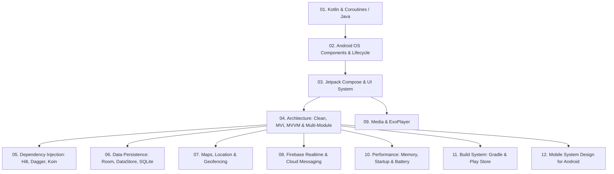

# 🤖 Android Mastery: The Senior & Staff Android Engineer Handbook
> **A Comprehensive, Production-Grade Engineering and Interview Guide for Modern Android, Jetpack Compose, Coroutines, System Architecture, and OS Internals.**

---

## 📖 Curriculum Roadmap

---

## 📚 Table of Contents

### 🟢 1. Core Languages
- **[Kotlin Mastery](./Kotlin)**
  - [Comprehensive Kotlin Guide](./Kotlin/Kotlin_Guide/README.md): OOP, Null safety, lambdas, Generics, Delegation.
  - [Kotlin Coroutines & Flows](./Kotlin/Kotlin_Guide/08_Coroutines.md): Structured concurrency, cancellation, exception handling, Channels.
  - [Kotlin Quick Cheatsheet](./Kotlin/cheatsheet.md): Idiomatic syntax, scope functions, collections.
- **[Java Core & Advanced](./Java)**
  - [Core Java Cheatsheet](./Java/Core/cheetsheet.md): Memory model, OOP principles, collections, multithreading.
  - [Advanced Java Internals](./Java/Advanced/advanced.md): JVM garbage collection, bytecode, reflection, classloaders.

---

### 🧩 2. Android Core Components & OS Internals
- **[Android Components](./Components/components.md)**
  - Activity & Fragment lifecycle scenarios, backstack management.
  - Services: Foreground, Background, Bound, and Android 14+ `foregroundServiceType`.
  - Broadcast Receivers: Dynamic vs Static, LocalBroadcastManager vs SharedFlow.
  - Content Providers & Inter-Process Communication (IPC / Binder).

---

### 🎨 3. UI Frameworks & Jetpack Compose
- **[Jetpack Compose Mastery](./Jetpack%20Compose/README.md)**
  - [Compose State Management](./Jetpack%20Compose/04_State_Management.md): `remember`, `rememberSaveable`, UDF patterns.
  - [Side Effects & Lifecycle Handlers](./Jetpack%20Compose/05_Side_Effects.md): `LaunchedEffect`, `rememberUpdatedState`, `DisposableEffect`, `snapshotFlow`.
  - [Layout & Performance Optimization](./Jetpack%20Compose/11_Performance__Optimization.md): Skipping recomposition, stability (`@Stable`), `derivedStateOf`.
- **[Android View System (XML)](./Ui/ui.md)**: Custom Views, Measure/Layout/Draw passes, ViewBinding, ConstraintLayout.
- **[User Experience & Motion](./UX/ux.md)**: Material Design 3, accessibility, predictive back gestures.

---

### 🏛️ 4. Architecture & Dependency Injection
- **[Architecture Patterns](./Architecture)**
  - [Clean Architecture Android](./Architecture/Clean/clean_architecture_android.md): Domain Use Cases, Repositories, Inversion of Control.
  - [MVI (Model-View-Intent)](./Architecture/MVI/mvi.md): Unidirectional data flow, immutable state, single-event channels.
  - [MVVM](./Architecture/MVVM/mvvm.md): ViewModel lifecycle, StateFlow vs LiveData.
  - [MVP & MVC](./Architecture/MVP/mvp.md): Legacy patterns and migration strategies.
- **[Dependency Injection](./Dependency%20Injection)**
  - [Hilt](./Dependency%20Injection/Hilt/hilt.md): Standard Android DI, scoping rules (`@Singleton`, `@ViewModelScoped`).
  - [Dagger 2](./Dependency%20Injection/Dagger/dagger.md): Component dependencies, subcomponents, graph generation.
  - [Koin](./Dependency%20Injection/Koin/koin.md): Service locator DSL for Kotlin Multiplatform.

---

### 🗄️ 5. Data Persistence & Caching
- **[Data Layer](./Data)**
  - [Room Database](./Data/Room/room.md): Entities, DAOs, migrations, reactive Flow queries, TypeConverters.
  - [SQLite Internals](./Data/SQLite/sqlite.md): Raw queries, indexing strategies, transactions, database corruption recovery.
  - [Realm Mobile Database](./Data/Realm/realm.md): Zero-copy architecture, live objects.

---

### 📍 6. Maps, Location & Cloud Services
- **[Maps & Location Services](./Maps%20and%20Location)**
  - [01. Location Provider & Foreground Service](./Maps%20and%20Location/01_Location_Provider_and_Foreground_Service.md): `FusedLocationProviderClient`, Android 10-15 permissions, battery optimization.
  - [02. Google Maps Compose & Smooth Animation](./Maps%20and%20Location/02_Google_Maps_Compose_and_Animation.md): Vehicle marker interpolation with `SphericalUtil`, polylines, clustering.
  - [03. Geofencing API & Google Places SDK](./Maps%20and%20Location/03_Geofencing_and_Places_SDK.md): Dwell delays, WorkManager dispatching, Session Token cost optimization.
- **[Firebase Real-Time Architecture](./Firebase%20Realtime)**
  - [01. Firestore Real-Time & Offline Engine](./Firebase%20Realtime/01_Firestore_Realtime_Architecture.md): Flow snapshot listeners, optimistic UI, transactions, security rules.
  - [02. Realtime Database: Live Tracking](./Firebase%20Realtime/02_Realtime_Database_and_Live_Location_Tracking.md): Live presence (`.info/connected`), driver-rider live coordinates pipeline.
  - [03. FCM Push Notifications](./Firebase%20Realtime/03_FCM_Push_Notifications_Modern_Android.md): Android 13+ permissions, data vs notification payloads, deep linking into Compose.
  - [04. Remote Config & Crashlytics](./Firebase%20Realtime/04_Remote_Config_Crashlytics_and_Performance.md): Real-time feature flags, non-fatal Coroutine exception tracking, custom traces.

---

### ⚡ 7. Performance Optimization & Media
- **[Performance Mastery](./Performance%20Optimization/performance_mastery.md)**
  - Memory Profiler, LeakCanary, analyzing HPROF heap dumps.
  - App Startup Optimization: Cold/Warm/Hot launches, AndroidX App Startup, Baseline Profiles.
  - Battery optimization: Doze Mode, App Standby Buckets, wake lock audits.
- **[Media & Video Streaming](./Media/ExoPlayer_Mastery.md)**: Media3 / ExoPlayer, adaptive bitrate streaming (HLS/DASH), background playback.

---

### 🛠️ 8. Tooling, Gradle & Play Store
- **[Gradle Mastery](./Gradle/gradle_mastery.md)**: Kotlin DSL (`build.gradle.kts`), version catalogs (`libs.versions.toml`), build cache optimization, custom Gradle plugins.
- **[Google Play Store](./Playstore/playstore.md)**: Android App Bundles (.aab), dynamic feature modules, In-App Updates, In-App Reviews.
- **[Asynchronous Reactive Extensions (RxJava)](./RX%20Java/rx.md)**: Observables, Schedulers, operators, migrating RxJava to Coroutines Flow.
