# ☁️ Cloud Native Foundations for Mobile Engineers
>
> **Target Audience:** Staff Mobile Engineers & Architects.
> **Focus:** Serverless, Edge Computing, BFF Pattern, and Advanced Identity.

---

## 📖 Table of Contents
- [☁️ Cloud Native Foundations for Mobile Engineers](#️-cloud-native-foundations-for-mobile-engineers)
  - [📖 Table of Contents](#-table-of-contents)
  - [1. Serverless Architecture](#1-serverless-architecture)
    - [Mobile Use Cases](#mobile-use-cases)
  - [2. Edge Computing \& Low Latency](#2-edge-computing--low-latency)
  - [3. Backend For Frontend (BFF)](#3-backend-for-frontend-bff)
  - [4. Advanced Identity (OAuth2 \& OIDC)](#4-advanced-identity-oauth2--oidc)
    - [The Flows Mobile Devs Must Know:](#the-flows-mobile-devs-must-know)
    - [JWT Structure (JSON Web Token)](#jwt-structure-json-web-token)

---

## 1. Serverless Architecture

**Concept:** Run code without provisioning or managing servers. You pay only for the compute time value.

### Mobile Use Cases
1.  **Image Processing:** User uploads an avatar -> Trigger Lambda to resize/compress -> Save to S3.
2.  **Notifications:** Database write (new comment) -> Trigger Cloud Function -> Send FCM push.
3.  **Webhooks:** Handle Stripe payment success events securely.

**Pros:**
*   **No Ops:** No patching OS, no scaling groups.
*   **Cost:** Zero cost when idle.
*   **Scale:** Handles 0 to 10k requests/sec automatically.

**Cons:**
*   **Cold Starts:** Initial request latency (Java/Kotlin ~500ms, Node/Go ~100ms).
*   **Stateless:** Cannot keep WebSocket connections easily (requires separate gateway).

---

## 2. Edge Computing & Low Latency

**Concept:** Run logic physically closer to the user (CDN Nodes) rather than a central region (us-east-1).

**Technology:**
*   **Cloudflare Workers** (V8 Isolate)
*   **AWS Lambda @ Edge**
*   **Vercel Edge Functions**

**Scenario:**
A user in **Mumbai** opens your app.
*   **Traditional:** Request travels to Virginia, USA -> DB -> Back to Mumbai (Latency: ~300ms).
*   **Edge:** Request hits Mumbai CDN node -> Returns cached data or computes simple logic -> Response (Latency: ~20ms).

**Best For:**
*   A/B Testing logic (Feature flags).
*   Personalization (injecting user name into cached HTML/JSON).
*   Auth verification (JWT validation).

---

## 3. Backend For Frontend (BFF)

**Problem:**
You have 3 microservices: `User Service`, `Order Service`, `Product Service`.
Your Mobile App needs data from all 3 to show the "Home Screen".
**Bad Approach:** App makes 3 parallel API calls over 4G network. (Battery drain, latency, complex error handling).

**Solution (BFF):**
Create a specific API Layer tailored **exactly** for the Mobile App.

```mermaid
graph LR
    Mobile[📱 Mobile App] --> BFF[🎨 Mobile BFF API]
    BFF --> User[User Microservice]
    BFF --> Order[Order Microservice]
    BFF --> Product[Product Microservice]
    
    BFF -- "Aggregates Data" --> Mobile
```

**Benefits:**
1.  **Over-fetching**: BFF removes unused fields (e.g., `user.hashed_password`) before sending to mobile.
2.  **Under-fetching**: BFF combines 3 calls into 1.
3.  **Protocol Translation**: Client talks GraphQL/REST -> BFF talks gRPC to internal services.

---

## 4. Advanced Identity (OAuth2 & OIDC)

**OAuth2**: Authorization (Access). "Can this app access my photos?"
**OIDC (OpenID Connect)**: Authentication (Identity). "Who is this user?"

### The Flows Mobile Devs Must Know:
1.  **Authorization Code Flow with PKCE (Proof Key for Code Exchange)**.
    *   **Mandatory** for mobile apps (public clients).
    *   Prevents code interception attacks.
    *   **Don't** use "Implicit Flow" anymore (it's deprecated).

2.  **Token Rotation (Refresh Tokens)**.
    *   **Access Token**: Short-lived (15 mins). Use this to call APIs.
    *   **Refresh Token**: Long-lived (30 days). Securely stored (Encrypted SharedPreferences/Keychain).
    *   **Flow**: When API returns `401 Unauthorized`, app silently sends Refresh Token to get new Access Token. User never gets logged out.

### JWT Structure (JSON Web Token)
*   **Header**: Algorithm (`HS256`, `RS256`).
*   **Payload**: Claims (`sub`=userId, `exp`=expiry, `scope`=read:profile).
*   **Signature**: Verifies token wasn't tampered with.
