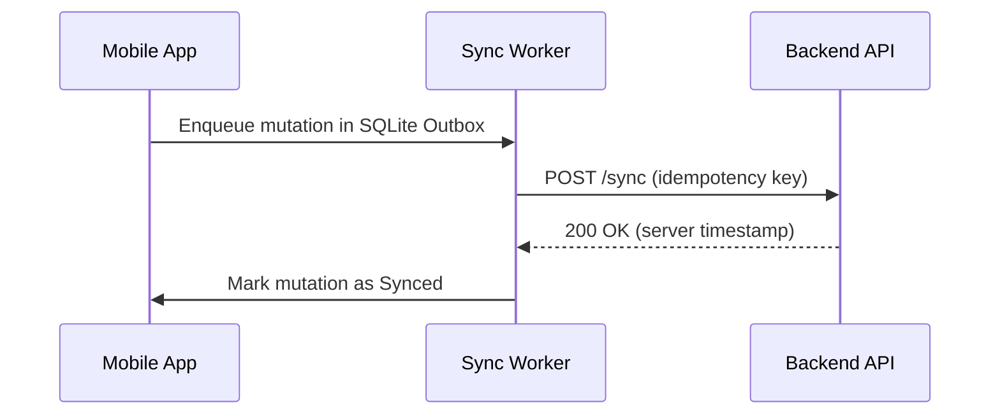

# 🤝 Contributing to Awesome Mobile Interviews & Engineering Handbook

First off, thank you for considering contributing! 🎉 

This project is built and maintained by mobile engineers, for mobile engineers. Every contribution—whether it's fixing a minor typo in a code snippet, adding a real-world interview question from your recent interview, or authoring a complete mobile system design blueprint—helps tens of thousands of developers worldwide level up their careers.

---

## 🧭 Ways You Can Contribute

We welcome contributions across all areas of mobile engineering:

| Contribution Track | Description | Ideal For |
| :--- | :--- | :--- |
| **💡 New Questions & Answers** | Add high-yield interview questions to our platform modules (Kotlin, Swift, Compose, SwiftUI, Flutter, React Native). | Any developer who recently learned or encountered an insightful question. |
| **🏢 Company Question Banks** | Share actual interview rounds, problem statements, and machine coding prompts from top companies. | Candidates who recently interviewed at product or service firms. |
| **📐 Mobile System Design** | Add or improve architectural designs, component diagrams, offline sync strategies, or data schemas. | Senior, Staff, and Lead Architects. |
| **🐛 Fix Errors & Typos** | Correct technical inaccuracies, update deprecated APIs (e.g., Swift 6 migrations, Compose BOM updates), or fix broken links. | Quick, high-impact contributions. |
| **🎨 Diagrams & Visuals** | Enhance existing explanations with Mermaid.js diagrams or architecture flowcharts. | Visual thinkers and system modelers. |

---

## 🚀 Getting Started: Step-by-Step PR Workflow

### 1. Fork the Repository
Click the **Fork** button at the top right of this repository to create your own copy under your GitHub account.

### 2. Clone Your Fork Locally
```bash
git clone https://github.com/<your-username>/awesome-mobile-interviews.git
cd awesome-mobile-interviews
```

### 3. Create a Topic Branch
Branch off from `main` with a descriptive name:
```bash
git checkout -b feat/uber-driver-location-system-design
# or
git checkout -b fix/swift-actor-isolation-typo
```

### 4. Make Your Changes
Edit files using your favorite editor. Please adhere to the [Content & Style Guidelines](#-content--style-guidelines) below.

### 5. Verify Markdown & Links
Make sure all internal markdown links are relative and valid. Test that code snippets compile or represent valid modern syntax.

### 6. Commit Using Conventional Commits
We follow the [Conventional Commits](https://www.conventionalcommits.org/) specification:
- `feat:` Introduces a new question, company interview bank, or system design chapter.
- `fix:` Fixes a typo, factual error, or broken link.
- `docs:` Updates documentation, README, or learning paths.
- `refactor:` Restructures existing explanations without changing the technical meaning.

**Example commit messages:**
```bash
git commit -m "feat(interviews): add recent Duolingo iOS machine coding round"
git commit -m "fix(android): correct Flow flatMapLatest explanation in 01_kotlin"
git commit -m "docs: clarify L1-to-Senior navigation paths in README"
```

### 7. Push to Your Fork and Open a PR
```bash
git push origin <your-branch-name>
```
Go to the original repository on GitHub, and you will see a prompt to open a Pull Request. Fill out the PR template with a clear summary of your changes.

---

## 📝 Content & Style Guidelines

### 1. The Question & Answer Format
When adding or updating questions, please follow this standard template:

````markdown
### Q: [Clear, Concise Question Title]?

**Difficulty:** 🟢 Entry-Level | 🟡 Mid-Level | 🔴 Senior/Staff  
**Category:** [e.g., Kotlin Coroutines, Swift ARC, Compose Recomposition, React Native Fabric]

#### 💡 The Short Answer (10-Second Elevator Pitch)
[2-3 sentences explaining the core concept directly without rambling.]

#### 🔍 Detailed Deep Dive
[Clear explanation of the underlying mechanics, platform internals, and tradeoffs.]

#### 💻 Production Code Example
```kotlin
// or swift / dart / typescript
// Clean, modern, production-grade snippet demonstrating the concept
```

#### ⚠️ Common Pitfalls & Interview Follow-Ups
* **Pitfall 1:** [e.g., Forgetting to cancel the job leads to memory leaks]
* **Follow-up Question:** [e.g., "How does this behave when the screen rotates?"]
````

### 2. Code Snippet Standards
* **Kotlin:** Modern Kotlin idioms (coroutines, Flow, extension functions, sealed interfaces). Avoid legacy Java-esque patterns unless explicitly contrasting.
* **Swift:** Swift 6 concurrency, strict concurrency checking, modern SwiftUI (`@Observable` macro), value types.
* **Dart/Flutter:** Flutter 3.x+, Riverpod or BLoC, async/await, isolates.
* **React Native:** Modern React Native with hooks, TypeScript types, and JSI/TurboModules context.

### 3. Visuals & Diagrams
We strongly encourage diagrams! Please use standard **Mermaid.js** fenced blocks so that diagrams render natively in GitHub markdown without requiring external image hosting:

````markdown

````

### 4. Zero Paywalls & Genuine Knowledge
* All content in this handbook is **100% free and open-source**.
* Please do not submit copyrighted course material or paid academy content.
* Share real knowledge gained from engineering experience and public community discussions.

---

## 🏷️ GitHub Issues

If you don't have time to write a full PR, opening an issue is just as valuable! We have dedicated templates for:
- 🐛 **[Bug / Typo Report](https://github.com/vennamprasad/awesome-mobile-interviews/issues/new?template=bug_report.md)**: Report technical errors, outdated APIs, or broken links.
- 💡 **[New Question Suggestion](https://github.com/vennamprasad/awesome-mobile-interviews/issues/new?template=new_question.md)**: Propose a high-impact interview question.
- 💼 **[Interview Experience Submission](https://github.com/vennamprasad/awesome-mobile-interviews/issues/new?template=interview_experience.md)**: Share your recent interview rounds and questions.
- 📐 **[System Design Request](https://github.com/vennamprasad/awesome-mobile-interviews/issues/new?template=system_design_request.md)**: Request an architectural breakdown for a specific mobile app.

---

## 📜 Code of Conduct

We are dedicated to providing a welcoming, inclusive, and harassment-free experience for everyone. Please read our [Code of Conduct](./CODE_OF_CONDUCT.md) before participating.

---

## 🌟 Recognition

Every approved contribution is merged with your name credited in the commit history. Top contributors are featured in our releases and community announcements.

Thank you for helping empower the next generation of mobile software engineers! 🚀
