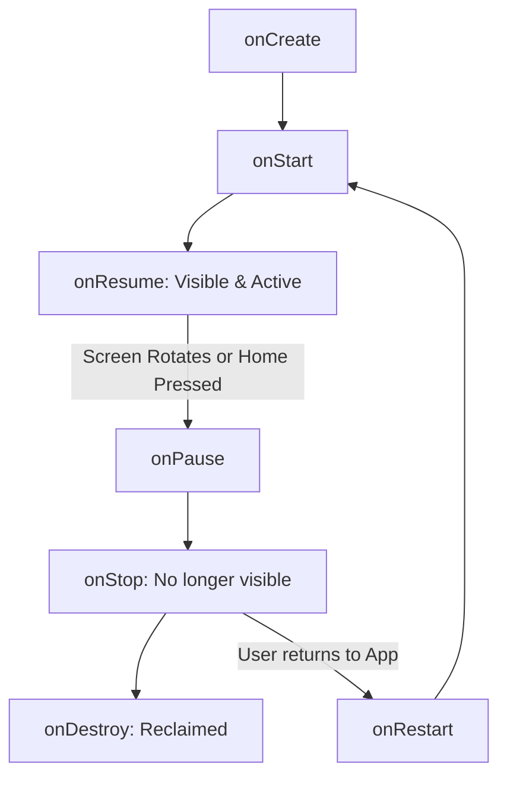
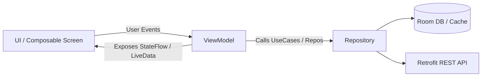

# 🎯 L1 Android Developer Interview Guide (Junior / Entry-Level / Screening)
> **Target Audience:** Junior Android Developers (0–2 years), Associate Engineers, or First-Round Screening Interviews  
> **Core Focus:** Kotlin Fundamentals, Android OS & Lifecycle, Jetpack Compose Basics, MVVM, Coroutines, and Common Coding Challenges.


---

## 📖 Table of Contents
- [1. L1 Interviewer Quick Calibration & Timing (45–60 Mins)](#1-l1-interviewer-quick-calibration--timing-4560-mins)
- [2. Module 1: Kotlin Core Essentials](#2-module-1-kotlin-core-essentials)
- [3. Module 2: Android Core Components & Lifecycle](#3-module-2-android-core-components--lifecycle)
- [4. Module 3: Jetpack Compose Fundamentals](#4-module-3-jetpack-compose-fundamentals)
- [5. Module 4: Threading, Coroutines & ANR](#5-module-4-threading-coroutines--anr)
- [6. Module 5: Architecture (MVVM) & Data Persistence](#6-module-5-architecture-mvvm--data-persistence)
- [7. Module 6: Networking & Android Gradle Basics](#7-module-6-networking--android-gradle-basics)
- [8. Module 7: Hands-On Live Coding Questions](#8-module-7-hands-on-live-coding-questions)
- [9. Interviewer Scorecard & Evaluation Rubric](#9-interviewer-scorecard--evaluation-rubric)

---

## 1. L1 Interviewer Quick Calibration & Timing (45–60 Mins)

| Time | Phase | Focus Area |
| :--- | :--- | :--- |
| **00–05 min** | Warmup & Background | Self-introduction, past Android projects, tech stack used. |
| **05–15 min** | Kotlin Essentials | Null safety, variables, scope functions, data/sealed classes. |
| **15–25 min** | Android Lifecycle & Core | Activity lifecycle scenarios, Intents, ViewModels, ANR. |
| **25–35 min** | Compose / UI & Coroutines | State in Compose (`remember`), LazyColumn, Dispatchers. |
| **35–45 min** | Live Coding / Problem Solving | 1 quick Kotlin coding exercise (Strings/Collections/Flow). |
| **45–50 min** | Candidate Questions & Wrap-up | Reverse questions from candidate. |

---

## 2. Module 1: Kotlin Core Essentials

### Q1. What is the difference between `val`, `var`, and `const val`?
**Answer:**
- `var` (Variable): Mutable reference. The value can be reassigned.
- `val` (Value): Read-only reference. Can only be assigned once, but its internal properties can be mutable (e.g. `val list = mutableListOf(1, 2); list.add(3)` is valid).
- `const val`: Compile-time constant. Must be declared at top-level or inside an `object` / `companion object`. Can only hold primitive types or `String`. Value is inlined at compile time.

---

### Q2. How does Kotlin achieve Null Safety? Explain `?`, `?.`, `?:`, and `!!`.
**Answer:**
In Kotlin, types are non-nullable by default (`var name: String = "John"` cannot be null).
- `?` (Nullable Type): Declares that a variable can hold `null` (`var name: String? = null`).
- `?.` (Safe Call Operator): Executes the call only if the target is not null, otherwise returns null:
  ```kotlin
  val length = name?.length // If name is null, returns null instead of NullPointerException
  ```
- `?:` (Elvis Operator): Provides a fallback default value if the expression is null:
  ```kotlin
  val length = name?.length ?: 0
  ```
- `!!` (Not-Null Assertion Operator): Forces the compiler to treat the value as non-null. Throws a `NullPointerException` at runtime if the value is null. Avoid in production!

---

### Q3. What is the difference between `lateinit` and `lazy`?

| Feature | `lateinit var` | `by lazy` |
| :--- | :--- | :--- |
| **Mutability** | Works only with `var` | Works only with `val` |
| **Types Allowed** | Non-primitive types only (No `Int`, `Boolean`) | Any type |
| **Initialization** | Initialized manually before usage (`isInitialized`) | Initialized automatically on first access (thread-safe by default) |
| **Common Use** | Dependency injection, Android Views (`lateinit var binding`) | Heavy objects, ViewModels, expensive calculations |

```kotlin
// Example
lateinit var apiService: ApiService

val database: AppDatabase by lazy {
    Room.databaseBuilder(context, AppDatabase::class.java, "db").build()
}
```

---

### Q4. What are Scope Functions in Kotlin? (`let`, `apply`, `run`, `also`, `with`)
**Answer:**
Scope functions execute a block of code within the context of an object.

| Function | Context Object | Return Value | Common Use Case |
| :--- | :--- | :--- | :--- |
| **`let`** | `it` | Lambda result | Null checks (`item?.let { ... }`) and transformations |
| **`apply`** | `this` | Context object | Object configuration (`Intent().apply { putExtra(...) }`) |
| **`also`** | `it` | Context object | Additional side effects like logging (`list.filter().also { log(it) }`) |
| **`run`** | `this` | Lambda result | Object configuration + computing a result |
| **`with`** | `this` | Lambda result | Calling multiple methods on a non-null object without repeating its name |

---

### Q5. What is the difference between a `Data Class` and a regular `Class`?
**Answer:**
A `data class` automatically generates:
1. `equals()` and `hashCode()` based on properties defined in the primary constructor.
2. `toString()` returning formatted string representation (e.g., `User(name=Alice, id=1)`).
3. `copy()` method for creating modified copies (immutability).
4. `componentN()` functions enabling destructuring declarations (`val (name, id) = user`).

---

## 3. Module 2: Android Core Components & Lifecycle

### Q6. What are the 4 fundamental Android Application Components?
1. **Activity:** Represents a single screen with a user interface.
2. **Service:** Executes long-running operations in the background without UI (e.g. music playback).
3. **Broadcast Receiver:** Listens for system-wide or app-level broadcast messages (e.g. battery low, airplane mode toggled).
4. **Content Provider:** Manages shared access to a structured repository of data across apps (e.g. Contacts, MediaStore).

---

### Q7. Walk me through the Activity Lifecycle methods and what happens during screen rotation.



**Scenario: User rotates the phone (Orientation Change):**
1. The current Activity is completely destroyed: `onPause() -> onStop() -> onDestroy()`.
2. A new instance is created: `onCreate() -> onStart() -> onResume()`.
3. **How to preserve data across rotation?**
   - **`ViewModel`** (best practice): Retained in memory across configuration changes.
   - **`onSaveInstanceState(Bundle)`**: Used for small, transient UI state (e.g. scroll position, text typed).
   - **`rememberSaveable`** in Jetpack Compose.

---

### Q8. What happens when a user presses the Home button vs the Back button?
- **Home Button:** The Activity is placed into the background: `onPause() -> onStop()`. The Activity instance remains in memory. If memory becomes low, the OS can kill the process.
- **Back Button (Default behavior):** The Activity is popped off the backstack and destroyed: `onPause() -> onStop() -> onDestroy()`. (In modern Predictive Back, it behaves similarly unless custom back handlers exist).

---

### Q9. What is an Intent? Difference between Explicit and Implicit Intent?
- **Explicit Intent:** Specifies the exact target component class name:
  ```kotlin
  val intent = Intent(this, DetailActivity::class.java)
  startActivity(intent)
  ```
- **Implicit Intent:** Does not specify the target component; specifies an **action** and optional data URI, allowing the OS to find matching apps (e.g. dial a phone number, open a web page, take a picture):
  ```kotlin
  val intent = Intent(Intent.ACTION_VIEW, Uri.parse("https://google.com"))
  startActivity(intent)
  ```

---

## 4. Module 3: Jetpack Compose Fundamentals

### Q10. What is Jetpack Compose, and how does it differ from the XML View System?
**Answer:**
- **XML View System (Imperative):** You define static XML layouts, find views via `findViewById` / ViewBinding, and manually mutate their properties (`textView.text = "Hello"`).
- **Jetpack Compose (Declarative):** You describe the UI as a function of the current state (`@Composable`). When state changes, Compose automatically re-executes the function (**Recomposition**) to render the updated UI.

---

### Q11. What is State in Compose? Difference between `remember` and `rememberSaveable`?
- **State:** Any value that can change over time. When state changes, Compose triggers recomposition.
- **`remember`:** Preserves state across recompositions, but **loses state during configuration changes** (like device rotation).
- **`rememberSaveable`:** Preserves state across recompositions **and** across configuration changes and process death by saving it in a `Bundle`.

```kotlin
@Composable
fun Counter() {
    // Survives rotation!
    var count by rememberSaveable { mutableStateOf(0) }

    Button(onClick = { count++ }) {
        Text("Count: $count")
    }
}
```

---

### Q12. What is `LazyColumn` and why is it preferred over a regular `Column`?
**Answer:**
- `Column`: Renders **all** child items immediately, even if there are 1,000 items and only 5 are visible on screen. This causes high memory consumption and UI freezing.
- `LazyColumn` (equivalent to `RecyclerView` in XML): Only renders items that are currently visible on screen. As the user scrolls, off-screen items are recycled/composed on demand, ensuring smooth 60 FPS scrolling.

```kotlin
@Composable
fun UserList(users: List<String>) {
    LazyColumn {
        items(users) { user ->
            Text(text = user, modifier = Modifier.padding(16.dp))
        }
    }
}
```

---

## 5. Module 4: Threading, Coroutines & ANR

### Q13. What is an ANR (Application Not Responding)? What causes it?
**Answer:**
An ANR occurs when the application's **Main Thread (UI Thread)** is blocked for too long and cannot process user input or draw frames:
- **5 seconds:** For user input events (key press, touch).
- **10–20 seconds:** For BroadcastReceivers and Services.

**Common Causes:**
1. Performing network requests on the Main Thread (throws `NetworkOnMainThreadException`).
2. Heavy database queries (Room) or File I/O on Main Thread.
3. Heavy JSON parsing or nested calculations.

**Solution:** Offload all heavy operations to background threads using **Kotlin Coroutines** with `Dispatchers.IO` or `Dispatchers.Default`.

---

### Q14. What are Kotlin Coroutines? Difference between `launch` and `async`?
**Answer:**
Coroutines are light-weight, non-blocking threads managed at the language level.
- **`launch`:** "Fire and forget". Launches a coroutine that does not return a result. Returns a `Job`.
- **`async`:** Launches a coroutine that returns a result. Returns a `Deferred<T>`, and you call `.await()` to retrieve the value.

```kotlin
// launch example
viewModelScope.launch {
    userRepository.updateUser(user)
}

// async example (running 2 parallel requests)
viewModelScope.launch {
    val profileDeferred = async { api.getProfile() }
    val ordersDeferred = async { api.getOrders() }

    val profile = profileDeferred.await()
    val orders = ordersDeferred.await()
}
```

---

### Q15. What are the common Coroutine Dispatchers?
1. **`Dispatchers.Main`:** Runs on Android Main (UI) thread. Used for UI updates and light tasks.
2. **`Dispatchers.IO`:** Optimized for disk, file, Room database, and network I/O operations (elastic thread pool).
3. **`Dispatchers.Default`:** Optimized for CPU-intensive work (sorting large lists, parsing huge JSON, image transformations).

---

## 6. Module 5: Architecture (MVVM) & Data Persistence

### Q16. Why do we use MVVM (Model-View-ViewModel) architecture?
**Answer:**
1. **Separation of Concerns:** Decouples business logic from UI rendering.
2. **Lifecycle Awareness:** `ViewModel` survives configuration changes (rotation), preventing data loss and redundant network calls.
3. **Testability:** Business logic in ViewModel can be easily unit-tested without requiring Android platform UI dependencies.



---

### Q17. Difference between `SharedPreferences` and modern `Jetpack DataStore`?
- **SharedPreferences:** Synchronous API (reads can block Main thread, causing ANR), parses runtime exceptions without type safety, no Flow/reactive support.
- **DataStore:** Built with Kotlin Coroutines and Flow, completely asynchronous, non-blocking, handles data corruption gracefully, supports typed objects via Protocol Buffers (**Proto DataStore**) or key-value pairs (**Preferences DataStore**).

---

## 7. Module 6: Networking & Android Gradle Basics

### Q18. How does Retrofit work in Android?
**Answer:**
Retrofit is a type-safe HTTP client that turns HTTP APIs into Kotlin interfaces:
1. Define endpoints using HTTP annotations (`@GET`, `@POST`, `@Path`, `@Query`).
2. Use Converters (`GsonConverterFactory` / `MoshiConverterFactory`) to serialize/deserialize JSON into Kotlin data classes.
3. Retrofit handles background execution when functions are marked as `suspend`:

```kotlin
interface ApiService {
    @GET("users/{id}")
    suspend fun getUser(@Path("id") userId: String): UserDto
}
```

---

### Q19. What is the difference between `compileSdk`, `targetSdk`, and `minSdk`?
- **`minSdk`:** The minimum Android OS version required to install and run the app. Devices running older versions cannot install the app.
- **`targetSdk`:** The OS version against which the app was tested. Android uses this to enable or disable new OS behavior changes (e.g. runtime permissions in API 23, notification permissions in API 33).
- **`compileSdk`:** The Android SDK version used to compile the application source code. Determines which Android APIs you can reference during coding.

---

## 8. Module 7: Hands-On Live Coding Questions

Give the candidate 1 or 2 quick 5-minute coding problems to verify practical Kotlin competence:

### Coding Question 1: Filter and Transform a List
**Task:** Given a list of users, filter only active users, sort them by age ascending, and return their names in uppercase.

```kotlin
data class User(val name: String, val age: Int, val isActive: Boolean)

// Candidate should write:
fun getActiveUserNames(users: List<User>): List<String> {
    return users
        .filter { it.isActive }
        .sortedBy { it.age }
        .map { it.name.uppercase() }
}
```

---

### Coding Question 2: Two-Pointer String Palindrome
**Task:** Write a function to check if a string is a palindrome, ignoring non-alphanumeric characters and case.

```kotlin
fun isPalindrome(s: String): Boolean {
    var left = 0
    var right = s.length - 1

    while (left < right) {
        while (left < right && !s[left].isLetterOrDigit()) left++
        while (left < right && !s[right].isLetterOrDigit()) right--

        if (s[left].lowercaseChar() != s[right].lowercaseChar()) {
            return false
        }
        left++
        right--
    }
    return true
}
```

---

## 9. Interviewer Scorecard & Evaluation Rubric

| Category | Must-Have for L1 Hire | Red Flags (No Hire) |
| :--- | :--- | :--- |
| **Kotlin Basics** | Understands `val` vs `var`, null safety (`?`, `?.`, `?:`), data classes. | Relies on `!!` everywhere, doesn't know what null safety is. |
| **Android Lifecycle** | Explains Activity lifecycle, why rotation destroys Activity, and how ViewModel helps. | Cannot name lifecycle methods, puts network calls in `onCreate()` on Main Thread. |
| **UI (Compose / XML)** | Knows what a Composable is, understands `remember` and `mutableStateOf`. | Doesn't know what recomposition is, never heard of declarative UI. |
| **Threading & Coroutines** | Explains Main vs Background thread, what causes ANR, basic `launch` vs `async`. | Thinks network requests run automatically on background threads. |
| **Coding Problem** | Writes idiomatic Kotlin using `.filter()`, `.map()`, or clean while loop. | Struggles with basic syntax, loops, or simple conditional statements. |

### Decision Summary:
- **Hire (L1 Junior):** Strong Kotlin foundation, clear understanding of Activity lifecycle, knows how to use Coroutines for network calls, writes working code with minimal assistance.
- **No Hire:** Confused by null safety, unaware of main thread blocking / ANRs, unable to solve simple string/collection problem.
