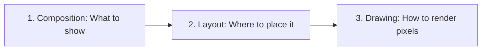
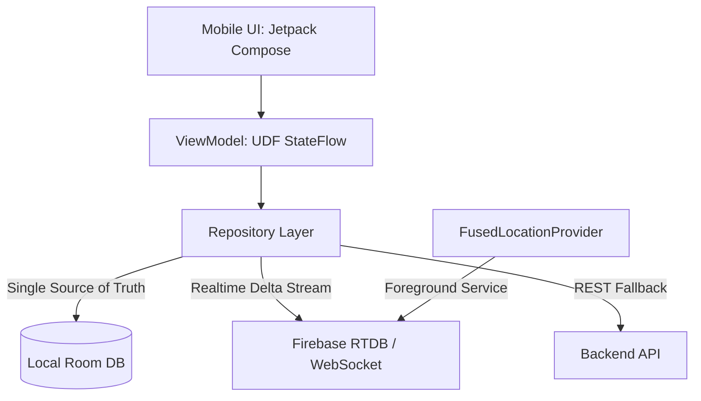

# 🎯 Ascendion Senior Android Engineer Interviewer Handbook
> **Role:** Senior Android Engineer (L4 / Lead Level)  
> **Company Context:** Ascendion (Enterprise Digital Engineering & Fortune 500 Client Delivery)  
> **Duration:** 60 Minutes  
> **Focus Areas:** Kotlin Concurrency, Jetpack Compose Internals, Android OS & Memory, Clean Architecture, Mobile System Design, and Enterprise Consulting Acumen.


---

## 📖 Table of Contents
- [1. Interviewer Blueprint & 60-Minute Stepwise Timeline](#1-interviewer-blueprint--60-minute-stepwise-timeline)
- [2. Candidate Evaluation Rubric & Hiring Bar](#2-candidate-evaluation-rubric--hiring-bar)
- [3. Step 1: Introduction & Technical Depth Warmup (5 Mins)](#3-step-1-introduction--technical-depth-warmup-5-mins)
- [4. Step 2: Kotlin Concurrency & Coroutines Internals (15 Mins)](#4-step-2-kotlin-concurrency--coroutines-internals-15-mins)
- [5. Step 3: Jetpack Compose Internals & Performance (15 Mins)](#5-step-3-jetpack-compose-internals--performance-15-mins)
- [6. Step 4: Android OS Internals, Memory & Battery (10 Mins)](#6-step-4-android-os-internals-memory--battery-10-mins)
- [7. Step 5: Live Code Review Challenge (10 Mins)](#7-step-5-live-code-review-challenge-10-mins)
- [8. Step 6: Mobile System Design Scenario (Optional Deep Dive)](#8-step-6-mobile-system-design-scenario-optional-deep-dive)
- [9. Step 7: Client Engagement, Leadership & Behavioral (5 Mins)](#9-step-7-client-engagement-leadership--behavioral-5-mins)
- [10. Step 8: Candidate Q&A & Wrap-Up (5 Mins)](#10-step-8-candidate-qa--wrap-up-5-mins)

---

## 1. Interviewer Blueprint & 60-Minute Stepwise Timeline

In digital engineering consultancies like Ascendion, senior engineers are placed in high-visibility client environments. They must be capable of:
1. Writing performant, bug-free modern code (Kotlin Coroutines, Flow, Jetpack Compose).
2. Diagnosing complex platform bugs (memory leaks, frame drops, battery drain).
3. Leading architectural refactoring (migrating legacy XML/RxJava to Compose/Coroutines).
4. Communicating trade-offs clearly to client stakeholders.

```mermaid
gantt
    title 60-Minute Senior Android Interview Timeline
    dateFormat mm
    axisFormat %M min
    
    Intro & Candidate Rapport     :00, 05m
    Kotlin & Coroutines Deep-Dive  :05, 15m
    Jetpack Compose & UI Internals :20, 15m
    Android OS, Memory & Battery   :35, 10m
    Live Code Review / Design      :45, 10m
    Consulting Behavioral & Wrap-up:55, 05m
```



---

## 2. Candidate Evaluation Rubric & Hiring Bar

| Score | Rating | Definition for Senior Android (L4) |
| :---: | :--- | :--- |
| **1** | **Strong No Hire** | Superficial syntax knowledge only. Relies on trial-and-error. Cannot explain Coroutine scopes, recomposition, or memory leaks. |
| **2** | **No Hire** | Knows basic Compose and Coroutine syntax, but struggles with concurrency cancellation, Compose stability, or system design trade-offs. |
| **3** | **Hire (Senior)** | Deep conceptual understanding. Explains *how* and *why* things work under the hood. Identifies subtle bugs in code review. Demonstrates sound architectural patterns. |
| **4** | **Strong Hire (Lead)** | Authoritative mastery. Proactively discusses memory, battery, compiler stability, multi-module boundaries, and trade-offs. Exhibits strong consulting leadership. |

---

## 3. Step 1: Introduction & Technical Depth Warmup (5 Mins)

### Goal:
Break the ice, calibrate communication skills, and verify hands-on recency.

### Questions to Ask:
> *"Walk me through the most technically challenging problem you solved in Android over the last 12–18 months. What made it non-trivial, what trade-offs did you consider, and how did you measure success?"*

### What to Look For:
- ✅ **Green Flag:** Mentions concrete architectural decisions (e.g., modularization boundary, memory leak investigation using Memory Profiler, baseline profile optimization, custom Compose layout).
- 🚩 **Red Flag:** High-level narrative only with no technical depth, or talking about generic CRUD screens and API integrations as "complex".

---

## 4. Step 2: Kotlin Concurrency & Coroutines Internals (15 Mins)

### Q1. Exception Propagation: `SupervisorJob` vs. `Job`
**Question to Candidate:**  
> *"If you launch three parallel child coroutines inside a `CoroutineScope`, and child #2 throws an unhandled `IllegalStateException`, what happens to children #1 and #3? How do you prevent sibling cancellation, and where does `supervisorScope` fit in?"*

#### Expected Senior Answer:
- With a standard `Job`, an unhandled exception in one child cancels the parent `Job`, which immediately cancels all other siblings (structured concurrency).
- To isolate failures, use `SupervisorJob`. A failure in a child will not cancel the parent or siblings.
- **Trap / Follow-up:** *"Can I just write `val scope = CoroutineScope(Dispatchers.IO + SupervisorJob())`? What happens if you pass `SupervisorJob()` directly to `launch()`?"*
  - **Correct Answer:** Passing `SupervisorJob()` as a parameter to a child `launch` does **not** protect against cancellation because child coroutines always create a new standard `Job` subordinate to the parent. You must use `supervisorScope { ... }` or declare it at the root scope.

### Q2. Reactive State: `StateFlow` vs. `SharedFlow` vs. `Channel`
**Question to Candidate:**  
> *"How do you handle One-Time UI Events (e.g., showing a Snackbar or Navigation) vs Persistent UI State in Compose? Why is `StateFlow` problematic for one-time events?"*

#### Expected Senior Answer:
- `StateFlow` is conflated: it holds a single current value and deduplicates consecutive equal values (`distinctUntilChanged`). If an event triggers twice (or during configuration change), `StateFlow` either re-emits the stale event or swallows duplicate events.
- One-time events are better handled via:
  1. **Channels** (`Channel<UiEvent>(Channel.BUFFERED)`) exposed as a Flow (`receiveAsFlow()`), ensuring every event is consumed exactly once.
  2. Or modeling events as state with a consumed flag/ID: `data class Message(val id: Long, val text: String)`.

```kotlin
// Channel-based one-time event pattern
private val _eventChannel = Channel<UiEvent>(Channel.BUFFERED)
val events = _eventChannel.receiveAsFlow()
```

### Q3. Coroutine Dispatchers Internals
**Question to Candidate:**  
> *"What is the difference between `Dispatchers.Default` and `Dispatchers.IO` under the hood? What happens if you execute 100 blocking database calls on `Dispatchers.IO`?"*

#### Expected Senior Answer:
- Both dispatchers share the same underlying thread pool.
- `Dispatchers.Default` is bounded by the number of CPU cores (minimum 2), designed for compute-intensive tasks (JSON parsing, diffing algorithms).
- `Dispatchers.IO` is bounded by `64` threads (or number of cores if larger). It allows threads to block without starving `Default` because threads are dynamically spawned/reallocated when threads enter blocking I/O state.

---

## 5. Step 3: Jetpack Compose Internals & Performance (15 Mins)

### Q1. The Three Phases of Compose & Skipping Recomposition
**Question to Candidate:**  
> *"What are the three distinct phases Compose executes to render a frame? Why is skipping recomposition important, and what causes an apparently unchanged composable to recompose?"*



#### Expected Senior Answer:
1. **Phases:** Composition (evaluates Composable tree) $\rightarrow$ Layout (Measure and Place) $\rightarrow$ Drawing (Canvas draw calls).
2. **Recomposition Skipping:** A Composable can skip recomposition only if all its parameters are **Stable**.
3. **The Stability Trap:** Standard Kotlin `List<T>` is an interface; the Compose compiler cannot guarantee immutability (it could be a mutable `ArrayList` upcast to `List`). Hence, `List<T>` is treated as **Unstable**, causing the Composable to re-execute every time its parent recomposes.
4. **Fix:** Use `@Immutable` / `@Stable` wrapper classes, Kotlinx Immutable Collections (`ImmutableList<T>`), or pass primitive keys.

### Q2. Side Effect Handlers: `rememberUpdatedState`
**Question to Candidate:**  
> *"Look at this splash/countdown timer code. What bug exists here and how does `rememberUpdatedState` fix it?"*

```kotlin
@Composable
fun Timer(onFinish: () -> Unit) {
    LaunchedEffect(Unit) {
        delay(5000L)
        onFinish()
    }
}
```

#### Expected Senior Answer:
- If `Timer` recomposes because its parent changes, a new instance of `onFinish` lambda might be passed in.
- Because `LaunchedEffect` has `Unit` as key, it does **not** restart. The coroutine captures the *initial* instance of `onFinish` in its closure (the **Stale Closure** bug).
- Fix: `val currentOnFinish by rememberUpdatedState(onFinish)` ensures the coroutine always invokes the newest lambda without resetting the 5-second delay.

### Q3. `derivedStateOf` vs `remember(key)`
**Question to Candidate:**  
> *"When should you use `derivedStateOf` over `remember(key)`? Give a concrete UI example."*

#### Expected Senior Answer:
- `remember(key)` recalculates whenever `key` changes. If `key` changes rapidly (e.g. scroll offset `1, 2, 3, 4, ...`), `remember(key)` triggers recomposition on every pixel change.
- `derivedStateOf` is used when a state changes frequently, but you only care when a derived boolean or threshold flips (e.g. `val showButton by remember { derivedStateOf { listState.firstVisibleItemIndex > 0 } }`). Recomposition only occurs when the boolean toggles from `false` to `true`.

---

## 6. Step 4: Android OS Internals, Memory & Battery (10 Mins)

### Q1. Investigating Memory Leaks & Heap Dumps
**Question to Candidate:**  
> *"Your team notices OutOfMemory (OOM) crashes spiking in production. How do you systematically reproduce, profile, and fix memory leaks in Android?"*

#### Expected Senior Answer:
- **Tools:** Android Studio Memory Profiler, LeakCanary in debug builds, Perfetto.
- **Root Cause Analysis:** Capture an HPROF heap dump $\rightarrow$ Filter by retained size $\rightarrow$ Find GC Roots holding references to destroyed `Activity` or `View` instances.
- **Common Culprits:** Static singletons holding `Context` (instead of `applicationContext`), Coroutine scopes not cancelled with lifecycle, listeners/callbacks not unregistered in `onDispose` / `onDestroy`, static handlers.

### Q2. Modern Background Execution (Android 14 & 15+)
**Question to Candidate:**  
> *"A client wants an app to sync location and inventory data every 5 minutes in the background 24/7. How do you advise them regarding Android battery restrictions, Doze Mode, and Foreground Service types?"*

#### Expected Senior Answer:
- **Client Advisory:** Continuous 5-minute background execution without user visibility is prohibited by Android's Doze Mode and App Standby Buckets.
- If it requires user awareness (e.g. active delivery navigation): Use a **Foreground Service** with explicit `android:foregroundServiceType="location"`, appropriate notification channel, and runtime permissions.
- If it is periodic data synchronization: Use **WorkManager** (`PeriodicWorkRequestBuilder` with minimum 15-minute interval) with battery and network constraints (`setRequiredNetworkType(NetworkType.CONNECTED)`).

---

## 7. Step 5: Live Code Review Challenge (10 Mins)

Share the candidate challenge file: **[Coding_Challenge_and_Review.md](./Coding_Challenge_and_Review.md)**.

### The Problem:
Ask the candidate to review a realistic 40-line snippet containing 4 critical production defects:
1. **Blocking Call on Main Thread:** Running network or heavy processing directly inside a Composable or UI dispatcher.
2. **Missing `rememberUpdatedState`:** Stale lambda closure inside a long-running coroutine.
3. **Mutable State Mutation in Composable Body:** Mutating `var counter` inside `@Composable` causing an infinite recomposition loop.
4. **Leaked Coroutine Scope:** Using `GlobalScope` or unbounded scope instead of `viewModelScope` / `rememberCoroutineScope`.

---

## 8. Step 6: Mobile System Design Scenario (Optional Deep Dive)

### Prompt:
> *"Design an Offline-First Real-Time Food Delivery Tracking Screen. The user must see the driver's location moving on the map, active order status, and have the screen load instantly even on a spotty 2G subway connection."*



### Key Senior Discussion Points:
1. **Single Source of Truth (SSOT):** UI reads only from local Room DB / Datastore; network updates write directly to DB.
2. **Real-time Coordinate Throttling:** Batching driver coordinates to avoid UI jank and excessive cellular radio battery consumption.
3. **Optimistic Updates:** UI immediately reflects order cancellation or rating while queuing write requests locally.

---

## 9. Step 7: Client Engagement, Leadership & Behavioral (5 Mins)

In an Ascendion consulting engagement, engineers interact with enterprise clients.

### Scenario 1: Managing Technical Debt vs. Feature Velocity
> *"The client's product manager insists on shipping a major feature in 2 weeks by copy-pasting existing legacy XML views and skipping unit tests. How do you handle this pushback?"*
- **What to look for:** Does not respond emotionally. Balances business delivery with engineering health. Proposes a phased MVP approach with modularization or post-launch hardening sprint.

### Scenario 2: Refactoring Legacy Codebases
> *"You join an enterprise project with a 7-year-old monolithic Java + RxJava codebase with zero unit tests. How do you plan and execute a migration to Kotlin, Coroutines, and Jetpack Compose without halting feature development?"*
- **What to look for:** Avoids the "rewrite from scratch" fallacy. Proposes an incremental strangler-fig pattern: new features in Kotlin/Compose via `ComposeView` interop, wrapping RxJava Observables into Coroutine Flow, establishing modular boundaries.

---

## 10. Step 8: Candidate Q&A & Wrap-Up (5 Mins)

Leave 5 minutes for the candidate to ask questions. A strong senior candidate will inquire about:
- Architecture standardization across client squads.
- CI/CD automation and test coverage mandates.
- Tech stack autonomy vs. client constraints.

---

## 📋 Quick Interviewer Scorecard

```markdown
Candidate Name: _______________________    Date: ______________
Interviewer:    _______________________    Recommendation: [ ] Strong Hire  [ ] Hire  [ ] No Hire  [ ] Strong No Hire

Scores (1-4):
1. Kotlin & Coroutines Depth:        [ ] / 4
2. Jetpack Compose & UI Performance: [ ] / 4
3. Android OS, Memory & Battery:     [ ] / 4
4. Code Quality & Code Review:       [ ] / 4
5. Architecture & System Design:     [ ] / 4
6. Client Consulting & Soft Skills:  [ ] / 4

Key Strengths:
-
-

Key Concerns / Gaps:
-
-

Final Decision Notes:
-
```
