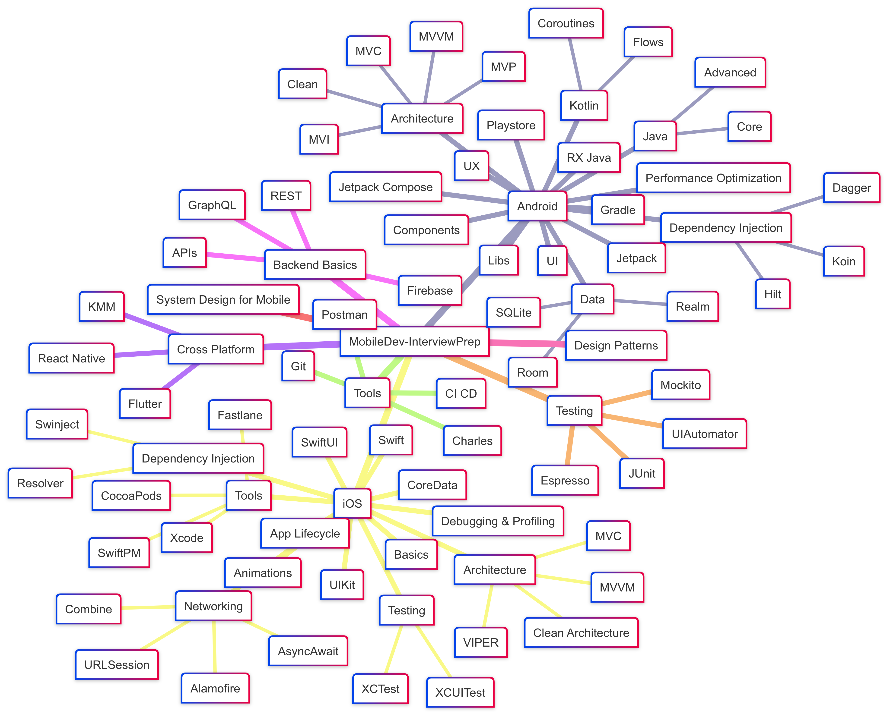

# 📱 DevCrack: Mobile Interview Preparation & Engineering Handbook
> **The Definitive Guide for Senior, Staff, and Lead Mobile Engineers**
> Mastering Native Android, Native iOS, System Design, Security, Engineering Leadership, and the Global Mobile Ecosystem.



[](https://opensource.org/licenses/MIT)


---

## 📖 Table of Contents
- [🎯 Why DevCrack?](#-why-devcrack)
- [🏛️ Four Core Pillars](#️-four-core-pillars)
  - [📱 1. Platform Engineering (Android, iOS, Cross-Platform)](#-1-platform-engineering)
  - [🛠️ 2. Core Engineering Disciplines](#️-2-core-engineering-disciplines)
  - [💼 3. Career & Engineering Leadership](#-3-career--engineering-leadership)
  - [🎤 4. The Interview Vault (190+ Companies)](#-4-the-interview-vault)
- [📈 Roadmap & Upcoming](#-roadmap--upcoming)
- [✍️ Contributing](#️-contributing)
- [📝 License](#-license)

---

## 🎯 Why DevCrack?
Modern mobile engineering is no longer just about writing UI screens. To succeed at **Senior, Staff, and Principal** levels, you must bridge the gap between client feature development, distributed system architecture, security hardening, and team leadership.

This repository is an **Enterprise-Grade Handbook** engineered to provide:
- **Depth**: Deep dives into OS internals (Android ART/Binder/Compose compiler, iOS Mach messages/ARC/Swift 6 actors).
- **Breadth**: Distributed System Design, Cloud-to-Mobile APIs, Security/Reverse engineering defense, and CI/CD automation.
- **Cross-Platform Bridge**: Direct Rosetta Stone mental models for engineers crossing between Android and iOS.
- **Real-World Practice**: 190+ curated interview templates from top-tier product and consulting companies.

---

## 🏛️ Four Core Pillars

```
DevCrack/
├── platforms/          # Native Android, Native iOS, & Cross-Platform (Flutter, KMP, React Native)
├── engineering/        # System Design, Security, Testing, Patterns, Algorithms, DevOps, Backend
├── career/             # Resumes, Negotiation, Leadership, Management & STAR Behavioral
└── interviews/         # Interview Frameworks, L1–Staff Suites, 190+ Company Question Banks
```

---

### 📱 1. [Platform Engineering](./platforms/README.md)

#### 🤖 [Android Mastery](./platforms/android/README.md)
19-chapter sequentially structured curriculum:
- **Languages**: [Kotlin Internals & Coroutines](./platforms/android/01_kotlin), [Core & Advanced Java](./platforms/android/02_java).
- **Core OS & UI**: [Components & Lifecycle](./platforms/android/03_components_and_lifecycle), [Views & Layouts](./platforms/android/04_views_and_layouts), [Jetpack Compose](./platforms/android/05_jetpack_compose), [UX & Material Design 3](./platforms/android/07_ux_and_material_design).
- **Architecture & Data**: [Clean, MVI, MVVM](./platforms/android/08_architecture), [Room, SQLite, DataStore](./platforms/android/09_data_and_persistence), [Dagger, Hilt, Koin](./platforms/android/10_dependency_injection).
- **Real-Time & Media**: [Maps & Location Services](./platforms/android/12_maps_and_location), [Firebase Realtime & FCM](./platforms/android/13_firebase_realtime), [ExoPlayer Media3](./platforms/android/14_media_and_streaming).
- **Build & Performance**: [Performance Optimization](./platforms/android/15_performance_optimization), [Gradle Build System](./platforms/android/16_gradle_build_system), [Play Store & Vitals](./platforms/android/17_playstore_distribution), [RxJava to Flow Migration](./platforms/android/18_rxjava), [Android System Design](./platforms/android/19_system_design).

#### 🍎 [iOS Mastery](./platforms/ios/README.md)
12-chapter structured journey to modern Swift excellence:
- **Android to iOS Bridge**: **[The Rosetta Stone Guide](./platforms/ios/iOS_for_Android_Developers_Rosetta_Stone.md)** (Compose vs SwiftUI, Coroutines vs Actors, Room vs SwiftData, JVM GC vs ARC).
- **Foundations**: [iOS Architecture & Scene Lifecycle](./platforms/ios/01_basics), [Swift Language & Memory ARC](./platforms/ios/02_swift).
- **UI Frameworks**: [UIKit Core Concepts](./platforms/ios/03_ui_frameworks), [SwiftUI State & Navigation](./platforms/ios/04_swiftui).
- **Architecture & Networking**: [MVVM-C & Coordinators](./platforms/ios/05_mvvm_and_architecture), [URLSession, Async/Await & SSL Pinning](./platforms/ios/06_networking).
- **Persistence & Concurrency**: [UserDefaults, Keychain, CoreData & SwiftData](./platforms/ios/07_data_persistence), [GCD, Actors & Swift 6 Data Isolation](./platforms/ios/08_concurrency).
- **Quality & Release**: [XCTest & XCUITest](./platforms/ios/09_testing), [Instruments & Memory Leak Profiling](./platforms/ios/10_debugging_and_performance), [Fastlane & App Store Distribution](./platforms/ios/11_app_distribution), [Scalable iOS System Design](./platforms/ios/12_system_design).

#### ⚔️ [Cross-Platform Engineering](./platforms/cross-platform/README.md)
- **[Flutter](./platforms/cross-platform/flutter)**: Impeller/Skia direct canvas rendering, Dart Isolates, BLoC/Riverpod, MethodChannels.
- **[Kotlin Multiplatform (KMP)](./platforms/cross-platform/kmp)**: Shared business logic, Ktor, Room KMP, Compose Multiplatform for iOS.
- **[React Native](./platforms/cross-platform/react-native)**: New Architecture (JSI, Fabric renderer, TurboModules), Hermes engine.

---

### 🛠️ 2. [Core Engineering Disciplines](./engineering/README.md)

- **[System Design for Mobile](./engineering/system-design/README.md)**: 15-part end-to-end distributed system design covering scalability, caching, load balancing, API design, CDNs, and real-world architectures (Ride-Sharing, Chat, Video Streaming, Food Delivery).
- **[Security & Reverse Engineering](./engineering/security/README.md)**: OWASP Mobile Top 10, Frida/Xposed dynamic hook defense, root detection, Keystore/Keychain, screen recording defense (`FLAG_SECURE`), and Banking-Grade hardening.
- **[Design Patterns](./engineering/design-patterns/README.md)**: GoF Creational, Structural, Behavioral patterns + Mobile-specific Repository, UDF, and Coordinator patterns.
- **[Algorithms & Data Structures](./engineering/algorithms/README.md)**: Mobile-focused algorithmic implementations: LRU Cache, Trie for autocomplete, QuadTree for geospatial maps, and Big-O memory profiling.
- **[Testing Strategy](./engineering/testing/README.md)**: Comprehensive pyramid testing with JUnit, Mockito/MockK, Espresso, and UIAutomator.
- **[Tools & DevOps](./engineering/tools-and-devops/README.md)**: Advanced Git internals (bisect, reflog, rebase), CI/CD pipelines, Fastlane automation, Charles Proxy, and Postman API mocking.
- **[Backend & Cloud Foundations](./engineering/backend-and-cloud/README.md)**: Cloud-native microservices, Docker/K8s, REST API design, GraphQL & Apollo caching, and Firebase serverless.
- **[Emerging Tech](./engineering/emerging-tech/README.md)**: On-Device ML (CoreML, TFLite), VisionOS spatial computing, WCAG Accessibility (a11y), AI Engineering (RAG, on-device SLMs), and AdTech/Media playback.

---

### 💼 3. [Career & Engineering Leadership](./career/README.md)

- **[Career Strategy](./career/career-growth/README.md)**:
  - **[Resume Guide](./career/career-growth/01_Resume_Guide.md)**: Metric-driven bullet points that pass automated ATS screens.
  - **[Take-Home Challenges](./career/career-growth/02_Take_Home_Challenges.md)**: Architecture, test coverage, and documentation rubrics.
  - **[Salary Negotiation](./career/career-growth/03_Salary_Negotiation.md)**: Scripts and strategy for equity, bonuses, and counter-offers.
- **[Engineering Leadership](./career/leadership/README.md)**:
  - **[Engineering Management](./career/leadership/01_Engineering_Management.md)**: 1:1 frameworks, performance management, coaching.
  - **[Technical Leadership](./career/leadership/02_Technical_Leadership.md)**: Driving RFCs, ADRs, and cross-team tech roadmap execution.
  - **[Project Management](./career/leadership/03_Project_Management.md)**: Agile sprint planning, risk mitigation, and delivery.
  - **[Behavioral Interviewing (STAR)](./career/leadership/04_Behavioral_Questions.md)**: High-scoring leadership answers.
  - **[Hiring & Culture](./career/leadership/05_Hiring_and_Culture.md)**: Candidate calibration, hiring rubrics, and onboarding.

---

### 🎤 4. [The Interview Vault](./interviews/README.md)

A battle-tested vault of real-world mobile technical interviews, scoring rubrics, and company question banks:

- **[Master Interview Framework](./interviews/01_Interview_Master_Framework.md)**: Multi-platform technical roadmap and interview stages.
- **[Job Search Cheat Sheet & "Cheat Codes"](./interviews/02_Job_Search_Strategy.md)**: Google X-Ray searches, bypassing HR gatekeepers, and unlocking unlisted roles.
- **[L1 Android Developer Interview Guide](./interviews/03_L1_Android_Developer_Guide.md)**: 50+ Q&A, lifecycles, Compose state, and coding problems for junior/mid screening.
- **[Ascendion Senior Android Engineer Suite](./interviews/service-based/Ascendion/Senior_Android_Interview_Suite.md)**: 60-min interviewer handbook with rubric and candidate scorecard.
- **[45-Minute Live Code Review Challenge](./interviews/service-based/Ascendion/Coding_Challenge_and_Review.md)**: Hands-on debugging challenge with 6 intentional production bugs.
- **[Product-Based Directory (145+ Companies)](./interviews/product-based/README.md)**: Google, Apple, Meta, Amazon, Netflix, Uber, Spotify, Stripe, Airbnb, Flipkart, Swiggy, Zomato, etc.
- **[Service-Based Directory (45+ Companies)](./interviews/service-based/README.md)**: Ascendion, EPAM, Thoughtworks, Accenture, Cognizant, Infosys, TCS, Wipro, GlobalLogic, etc.

---

## 📈 Roadmap & Upcoming
We are constantly expanding DevCrack to cover the highest levels of mobile engineering:
- **[ ] Observability & Mobile Vitals**: Production monitoring, ANR/OOM tracking, and custom telemetry.
- **[ ] Developer Experience (DevEx)**: Build systems (Bazel/Buck), remote caching, and custom Linting.
- **[ ] Advanced App Growth**: Server-Driven UI (SDUI), App Size reduction, and AdTech header bidding.
- **[ ] Data Sync & Offline-First**: Conflict-free Replicated Data Types (CRDTs) and BackgroundTasks internals.
- **[ ] Platform Internals**: Deep dives into Android ART runtime/Binder IPC and iOS Mach messages/Objective-C runtime.
- **[ ] Local AI/ML**: Running SLMs (Small Language Models: Gemma 2B, LLaMA 3.2) on-device.

Check out our [Detailed Roadmap](./ROADMAP.md) to see how you can contribute!

---

## ✍️ Contributing
We value community contributions! Please review our [Contribution Guidelines](./CONTRIBUTING.md) and [Code of Conduct](./CODE_OF_CONDUCT.md).

## 📝 License
Distributed under the [MIT License](./LICENSE).

---
*Created with ❤️ for the Global Mobile Engineering Community.*
