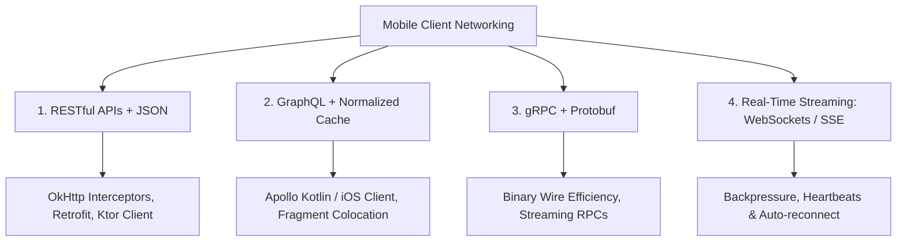

# 🔌 Mobile API Implementation & Networking Architecture

> **A comprehensive guide to modern mobile networking protocols, REST vs GraphQL vs gRPC, OkHttp/Retrofit patterns, error handling, offline caching, and security.**

---

## 🌐 Mobile Networking Landscape

Mobile networking is unique due to flaky cellular handovers, variable latency, battery drain, and offline states. Building resilient client-server communication requires deep understanding of transport protocols, serialization formats, and caching strategies.

---

## 📑 Core Chapters in this Guide

| Chapter | Topic | Key Focus |
|:---|:---|:---|
| **[02. API Fundamentals](./02_API_Fundamentals.md)** | Transport Protocols | HTTP/1.1 vs HTTP/2 vs HTTP/3 (QUIC), TCP handshakes, and mobile latency. |
| **[03. REST APIs](./03_REST_APIs.md)** | REST Architecture | Resource modeling, URI design, and idempotent HTTP methods. |
| **[04. Methods & Status Codes](./04_HTTP_Methods__Status_Codes.md)** | HTTP Semantics | 2xx success, 4xx client errors (401 vs 403), 5xx server errors, 429 rate limiting. |
| **[05. API Design Best Practices](./05_API_Design__Best_Practices.md)** | Mobile Contracts | Payload minimization, sparse fieldsets, envelope patterns, and backward compatibility. |
| **[06. Auth & Tokens](./06_Authentication__Authorization.md)** | Token Management | OAuth2 PKCE flow, OkHttp `Authenticator` token refresh, and mutual TLS. |
| **[07. GraphQL](./07_GraphQL.md)** | Over-fetching Solution | Queries, mutations, subscriptions, Apollo client normalized caching. |
| **[08. Android Implementation](./08_Android_Implementation.md)** | Production Stack | Retrofit2, OkHttp client configuration, Moshi / Kotlinx Serialization. |
| **[09. Error Handling](./09_Error_Handling.md)** | Resilience | Exponential backoff, jitter, retry policies, and network circuit breakers. |
| **[10. Performance & Optimization](./10_Performance__Optimization.md)** | Network Efficiency | HTTP response caching (ETag / Cache-Control), GZIP/Brotli compression. |
| **[11. Security Best Practices](./11_Security_Best_Practices.md)** | Wire Defense | Certificate pinning, cleartext blocking, and API payload signing. |
