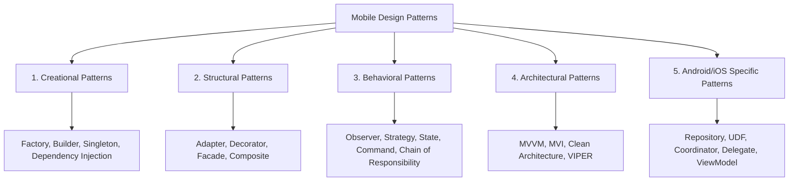

# 🎨 Design Patterns for Mobile Engineering

> **A master guide to Gang of Four (GoF) design patterns and modern mobile architectural patterns implemented idiomatic Kotlin and Swift.**

---

## 🏛️ Overview & Classification

Design patterns provide battle-tested solutions to common software design problems. In mobile development, applying the right design pattern ensures decoupling, testability, and maintainability across large multi-module codebases.

---

## 📑 Core Chapters in this Guide

| Chapter | Topic | Highlights |
|:---|:---|:---|
| **[02. Creational Patterns](./02_Creational_Patterns.md)** | Object Creation | Abstract Factory, Builder pattern with Kotlin DSLs, Singleton vs Scoped DI. |
| **[03. Structural Patterns](./03_Structural_Patterns.md)** | Class & Object Composition | Adapter for RecyclerView/UI lists, Facade for multi-SDK wrappers, Decorator. |
| **[04. Behavioral Patterns](./04_Behavioral_Patterns.md)** | Communication & Flow | Observer with Kotlin Flow / StateFlow, Strategy for payment routing, Command. |
| **[05. Architectural Patterns](./05_Architectural_Patterns.md)** | App-Level Structure | MVVM vs MVI (Unidirectional Data Flow), Clean Architecture layer separation. |
| **[06. Mobile-Specific Patterns](./06_Android-Specific_Patterns.md)** | Platform Idiosyncrasies | Repository pattern with offline caching, Coordinator navigation, Worker pattern. |
| **[07. Best Practices](./07_Best_Practices.md)** | Production Guidelines | Avoiding anti-patterns (God Objects, Over-engineering, Premature Abstraction). |
