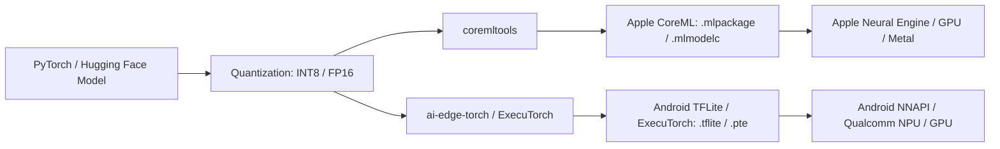

# 🤖 PyTorch to Mobile: CoreML, TFLite & ExecuTorch Export

> **A complete engineering guide to converting, quantizing, and optimizing PyTorch and Hugging Face deep learning models for on-device inference on Android and iOS.**

---

## 🎯 On-Device AI Architecture Pipeline

Running AI locally on mobile devices eliminates server inference costs, protects user privacy, and enables zero-latency offline experiences.



---

## 🍎 1. Exporting PyTorch to Apple CoreML (`coremltools`)

### Prerequisites
```bash
pip install torch torchvision coremltools
```

### Conversion Script with FP16 Quantization
```python
import torch
import torchvision.models as models
import coremltools as ct

# 1. Load trained PyTorch model
model = models.mobilenet_v3_small(weights=models.MobileNet_V3_Small_Weights.DEFAULT)
model.eval()

# 2. Trace model with example input tensor
example_input = torch.rand(1, 3, 224, 224)
traced_model = torch.jit.trace(model, example_input)

# 3. Convert to CoreML with Float16 precision for Apple Neural Engine (ANE)
mlmodel = ct.convert(
    traced_model,
    inputs=[ct.ImageType(name="input_image", shape=example_input.shape, scale=1/255.0)],
    compute_precision=ct.precision.FLOAT16,  # Cuts model size in half!
    minimum_deployment_target=ct.target.iOS17,
)

# 4. Save package for Xcode drag-and-drop
mlmodel.save("MobileNetV3.mlpackage")
print("✅ Successfully exported to MobileNetV3.mlpackage")
```

---

## 🤖 2. Exporting PyTorch to Android TFLite (`ai-edge-torch`)

### Prerequisites
```bash
pip install torch ai-edge-torch
```

### Conversion Script with Dynamic Range Quantization
```python
import torch
import torchvision.models as models
import ai-edge-torch

# 1. Load model
model = models.mobilenet_v3_small(weights=models.MobileNet_V3_Small_Weights.DEFAULT)
model.eval()

# 2. Prepare sample input
sample_input = (torch.randn(1, 3, 224, 224),)

# 3. Convert directly to TensorFlow Lite via ai-edge-torch
edge_model = ai_edge_torch.convert(model, sample_input)

# 4. Export .tflite file for Android assets directory
edge_model.export("mobilenet_v3.tflite")
print("✅ Successfully exported to mobilenet_v3.tflite")
```

---

## ⚡ 3. Quantization Comparison Matrix

Quantization converts 32-bit floating point weights (`FP32`) into lower bit-depth representations (`FP16` or `INT8`):

| Quantization Method | Model Size Reduction | Inference Speedup | Accuracy Impact | Best Target Hardware |
|:---|:---|:---|:---|:---|
| **FP32 (Baseline)** | 0% (Standard) | 1.0x (Baseline) | None | Server GPU |
| **FP16 (Half Precision)** | ~50% reduction | 1.5x – 2.5x | Negligible (<0.1%) | Apple Neural Engine (ANE), Mobile GPU |
| **INT8 Post-Training** | ~75% reduction | 2.0x – 4.0x | Very Minor (<1.0%) | Android NPU, Qualcomm Hexagon, CPU |
| **INT4 (LLM Quant)** | ~87.5% reduction | 3.0x – 5.0x | Noticeable | On-Device Mobile LLMs (ExecuTorch) |

---

## 🚀 4. ExecuTorch: The Next-Gen On-Device Runtime from PyTorch

**ExecuTorch** is PyTorch's native C++ runtime designed specifically for mobile edge hardware (bypassing ONNX and TFLite entirely).

### Exporting an LLM or Transformer with ExecuTorch:
```python
import torch
from executorch.extension.pybindings.aten_lib import *
from executorch.exir import to_edge

# 1. Export graph
exported_program = torch.export.export(model, sample_input)

# 2. Lower to Edge dialect
edge_program = to_edge(exported_program)

# 3. Lower to ExecuTorch runtime binary
executorch_program = edge_program.to_executorch()

# 4. Save .pte file
with open("model.pte", "wb") as f:
    f.write(executorch_program.buffer)
print("✅ ExecuTorch binary exported: model.pte")
```
