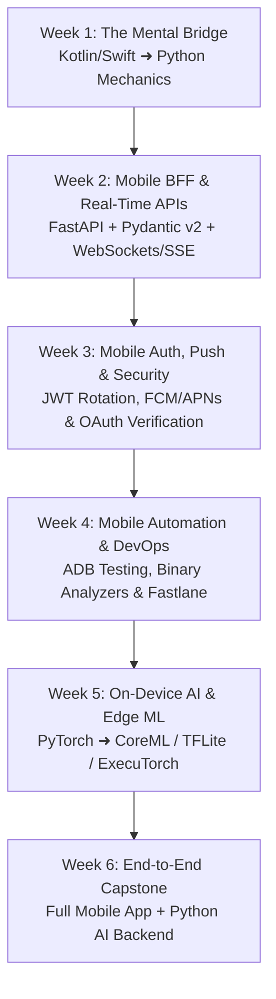

# 📱 Python for Mobile Developers — 6-Week Master Learning Path

> **A dedicated, high-impact learning path tailored specifically for Android (Kotlin), iOS (Swift), Flutter, and React Native engineers mastering Python for Mobile Backends (FastAPI), On-Device AI/Edge ML (CoreML/TFLite), Automation Tooling, and System Design.**

---

## 🎯 Why This Path Exists

Traditional Python courses waste hours teaching basic syntax (variables, loops, arithmetic) that you already know. 

This curriculum is **built strictly for Mobile Engineers**:
* Translates your existing mental models (Coroutines, Actors, ARC, JVM GC, Compose/SwiftUI state) directly to Python idioms.
* Focuses on the real-world applications where Python dominates: **BFF Microservices**, **Model Quantization & Edge AI Export**, **Device Farm Automation**, and **Production CI/CD**.

---

## 🗺️ 6-Week Milestone Roadmap

---

## 🧠 Mental Model Rosetta Stone: Kotlin/Swift vs Python

| Mobile Concept (Kotlin / Swift) | Python Equivalent | Why It Matters for Mobile Engineers |
|:---|:---|:---|
| `data class` / `struct` | `pydantic.BaseModel` | Runtime schema validation & serialization for mobile JSON payloads |
| `CoroutineScope.launch` / `Task { }` | `asyncio.create_task()` | Launch non-blocking background tasks on the event loop |
| `Flow.collect` / `AsyncSequence` | `async for item in generator():` | Consume Server-Sent Events (SSE) and WebSocket streams |
| Hilt / Swinject Dependency Injection | FastAPI `Depends()` | Providing DB sessions, token authenticators, and services cleanly |
| Retrofit / URLSession | `httpx` (async) / `requests` | High-performance asynchronous HTTP networking |
| Room / CoreData | `SQLAlchemy 2.0 (async)` / `SQLModel` | Async database ORM with connection pooling |
| EncryptedSharedPreferences / Keychain | `cryptography` (Fernet) / Redis | Secure token storage & session caching |
| JVM Tracing GC / Swift ARC | Reference Counting + Cyclic GC | Understanding CPython memory lifecycle and memory leak prevention |

---

## 📅 Detailed Week-by-Week Curriculum

### 🗓️ Week 1: The Mental Bridge (Kotlin/Swift ➜ Python Mechanics)
* **Goal:** Master CPython execution model, type hints, and async event loops without dynamically-typed traps.
* **Core Topics:**
  * Strict Type Hints: `typing.Optional`, `Union`, `Literal`, `TypeVar`, `Protocol` (Python's interfaces).
  * **Pydantic v2**: `BaseModel`, custom field validators, and JSON schema generation.
  * **Memory Management**: Reference counting internals, the tri-generational cyclic garbage collector (`gc` module), and avoiding cyclic reference leaks.
  * **The GIL & Concurrency**: Why CPython uses the Global Interpreter Lock, when to use `asyncio` vs `threading` vs `multiprocessing`, and Python 3.13 free-threaded no-GIL mode.
* 🛠️ **Milestone Project:** Build a CLI configuration parser that reads multi-platform mobile build configs (`build.gradle.kts` / `Podfile`) and validates schemas with Pydantic.

---

### 🗓️ Week 2: Mobile BFF (Backend-for-Frontend) & Real-Time APIs
* **Goal:** Build ultra-fast asynchronous REST, SSE, and WebSocket endpoints tailored for mobile consumption.
* **Core Topics:**
  * **FastAPI Core Architecture**: Async route handlers, path/query parameters, dependency injection with `Depends()`.
  * **Mobile Pagination**: Cursor-based pagination vs Offset pagination for infinite scrolling feeds.
  * **Real-Time Streaming**:
    * **Server-Sent Events (SSE):** Streaming live AI tokens or score updates to Android/iOS clients.
    * **WebSockets (`/ws`):** Bidirectional channels for chat, live taxi tracking, and collaborative state.
* 🛠️ **Milestone Project:** Build a complete FastAPI BFF service with paginated feed endpoints and a real-time WebSocket room for mobile clients.

---

### 🗓️ Week 3: Mobile Security, Auth & Push Notifications
* **Goal:** Secure mobile endpoints and handle cloud-to-device triggers.
* **Core Topics:**
  * **JWT Token Rotation**: Short-lived Access Tokens (15 min) + Long-lived Refresh Tokens (30 days) with database/Redis revocation.
  * **OAuth Verification**: Verifying Google Sign-In (`id_token`) and Sign in with Apple (`identityToken` with Apple public keys) server-side.
  * **Push Notifications**: Triggering Firebase Cloud Messaging (FCM) and Apple Push Notification service (APNs HTTP/2) using `firebase-admin` and `httpx`.
  * **Rate Limiting & DDoS Defense**: Protecting mobile endpoints from aggressive polling using `slowapi` and Redis sliding windows.
* 🛠️ **Milestone Project:** Create an authentication microservice that verifies mobile social logins, issues rotating JWTs, and dispatches rich push notifications.

---

### 🗓️ Week 4: Mobile Automation, CI/CD & Build Tooling
* **Goal:** Automate device testing, release verification, and binary inspection.
* **Core Topics:**
  * **Android ADB Automation**: Writing Python wrappers around `adb` for screen capture, memory profiling (`dumpsys meminfo`), and monkey stress tests.
  * **iOS Simulator Scripting**: Automating iOS simulators using Python and `xcrun simctl`.
  * **Binary Analyzers**:
    * Parsing APK/AAB files to check DEX method counts, uncompressed assets, and size diffs between releases.
    * Auditing `AndroidManifest.xml` and `Info.plist` for exported security risks and missing security flags.
* 🛠️ **Milestone Project:** Build an automated GitHub Action bot in Python that checks every pull request for APK size bloat and generates a visual markdown breakdown.

---

### 🗓️ Week 5: On-Device AI & Edge ML for Mobile
* **Goal:** Convert, quantize, and execute deep learning models on mobile hardware.
* **Core Topics:**
  * **Apple CoreML Conversion**: Using `coremltools` to trace and export PyTorch / Hugging Face models to `.mlpackage` targeting the Apple Neural Engine (ANE).
  * **Android TFLite & ExecuTorch**: Using `ai-edge-torch` to convert PyTorch models to `.tflite` and next-gen `.pte` binaries for Qualcomm/MediaTek NPUs.
  * **Quantization**: Applying **FP16** and **INT8** post-training quantization to reduce model footprint by 50–75% with zero perceivable latency.
  * **GenAI API Integration**: Function calling, tool use, and structured output generation with LLMs.
* 🛠️ **Milestone Project:** Export a PyTorch background-removal or object detection model to both CoreML (`.mlpackage`) and TFLite (`.tflite`) with FP16/INT8 quantization and benchmark inference speeds.

---

### 🗓️ Week 6: End-to-End Capstone Project
* **Goal:** Integrate everything into a production-grade full-stack AI mobile system.
* **Architecture:**
  1. **Mobile App (Compose / SwiftUI):** Native mobile client with local offline caching, camera integration, and SSE stream listeners.
  2. **Python Backend (FastAPI):** Authenticated gateway, Redis rate limiter, background Celery/Async worker queue.
  3. **AI Pipeline:** On-device CoreML/TFLite model for instant edge inference + Python cloud LLM fallback for complex processing.

---

## 🔗 Quick Links to Track Modules

* **[Phase 1: Language Mechanics & The GIL](./01-language-mechanics/memory-gc-and-gil.md)**
* **[Phase 2: FastAPI Mobile Backend](./02-backend-and-apis/fastapi-mobile-backend.md)**
* **[Phase 3: ADB & Device Automation](./03-mobile-automation-and-tooling/adb-and-device-scripting.md)**
* **[Phase 4: PyTorch to Mobile (CoreML, TFLite, ExecuTorch)](./04-ai-and-edge-ml/pytorch-to-mobile-conversion.md)**
* **[Phase 5: Python DSA Interview Cheatsheet](./05-interview-and-dsa/python-idiomatic-dsa-cheatsheet.md)**
