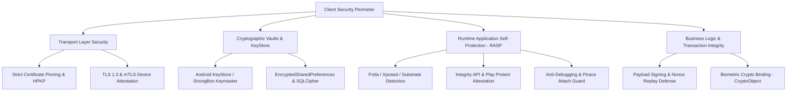

# 🛡️ Banking-Grade Security Implementation Guide

> **The definitive production-grade security handbook for financial, fintech, health, and enterprise Android applications. Protecting against reverse engineering, runtime hook injection, data exfiltration, and MITM attacks.**

---

## 🏛️ Executive Summary

Mobile banking and financial applications operate in a **Zero-Trust hostile environment**. The client device must be assumed compromised by default — rooted/jailbroken, running under emulators, attached to debuggers, or proxied through intercepting middleboxes.

This 22-chapter handbook provides **production-tested defensive architectures, cryptographic blueprints, and penetration testing checklists** required to achieve compliance with **PCI-DSS v4.0**, **OWASP MASVS (L2 + Resilience)**, and **RBI/MAS mobile banking security guidelines**.

---

## 🎯 Security Architecture Pillars

---

## 📑 Core Navigation Guide

| Chapter | Topic | Key Focus |
|:---|:---|:---|
| **[01. Enterprise Threat Model](./01_Enterprise-Level_Security_for_Android_Applications.md)** | Attack Surface Analysis | Zero-Trust architecture, STRIDE threat modeling, and MASVS L2 standards. |
| **[03. Architecture Overview](./03_Security_Architecture_Overview.md)** | Defense-in-Depth | Multi-layered defense rings from UI to hardware security modules (TEE/StrongBox). |
| **[04. Network Security](./04_Network_Security.md)** | Transport Protection | TLS 1.3, dynamic certificate pinning, mTLS, and proxy bypass defense. |
| **[05. Data Security & Encryption](./05_Data_Security__Encryption.md)** | At-Rest Protection | AES-256-GCM, MasterKey Android KeyStore, SQLCipher, and memory zeroization. |
| **[06. Auth & Biometrics](./06_Authentication__Authorization.md)** | Biometric Binding | `BiometricPrompt.CryptoObject`, asymmetric key signatures, and OAuth2 DPoP. |
| **[07. Code Protection](./07_Code_Protection__Anti-Tampering.md)** | R8 & Obfuscation | Control flow flattening, string encryption, and symbol mangling. |
| **[08. Runtime Security (RASP)](./08_Runtime_Security.md)** | Anti-Hooking & Root | Frida hooking detection, Magisk/KernelSU detection, and debugger traps. |
| **[09. Transaction Security](./09_Transaction_Security.md)** | Integrity & Anti-Replay | HMAC transaction signing, dynamic nonces, and zero-knowledge proofs. |
| **[12–18. Pentesting & Audits](./12_Static_Analysis.md)** | Security Verification | Static, dynamic, runtime, network, and business logic audit runbooks. |
