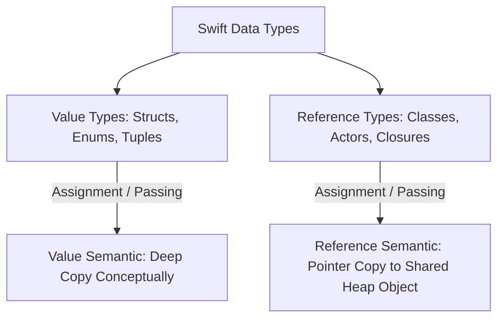
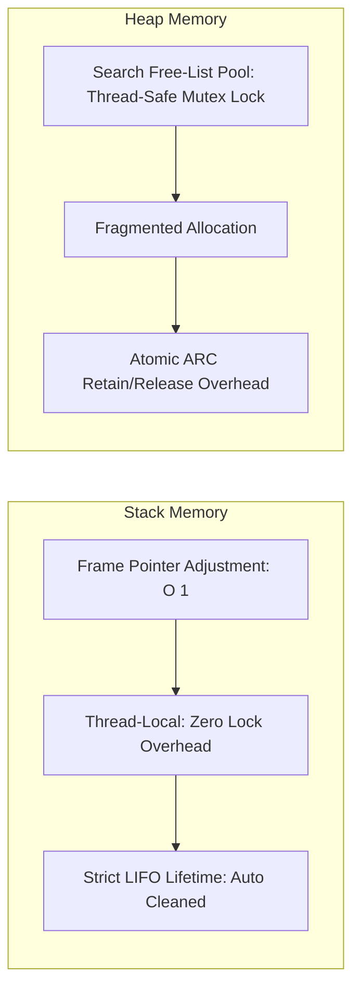

# 📦 Value vs. Reference Types, Memory Layout & Copy-on-Write (CoW)
> **Targeted for Senior, Staff, and Lead iOS Engineers**  
> **Core Focus:** Memory Layout (Stack vs. Heap), When Structs Escape to Heap, Custom Copy-on-Write Implementation, Method Dispatch (Static vs V-Table), and Immutability Semantics.


---

## 📖 Table of Contents
- [1. Fundamental Differences & Memory Layout](#1-fundamental-differences--memory-layout)
- [2. Stack vs. Heap Allocation Internals](#2-stack-vs-heap-allocation-internals)
- [3. When Does a Struct Get Allocated on the Heap?](#3-when-does-a-struct-get-allocated-on-the-heap)
- [4. Copy-on-Write (CoW) Internals](#4-copy-on-write-cow-internals)
- [5. Implementing Custom Copy-on-Write with `isKnownUniquelyReferenced`](#5-implementing-custom-copy-on-write-with-isknownuniquelyreferenced)
- [6. Method Dispatch: Direct vs. V-Table vs. Message Send](#6-method-dispatch-direct-vs-v-table-vs-message-send)
- [7. Staff-Level Interview Questions & Traps](#7-staff-level-interview-questions--traps)

---

## 1. Fundamental Differences & Memory Layout

In Swift, types are broadly categorized into **Value Types** and **Reference Types**:



### Complete Comparative Matrix

| Feature | Struct / Enum (Value Type) | Class / Actor (Reference Type) |
| :--- | :--- | :--- |
| **Identity** | No identity; compared by values (`==`) | Distinct memory address identity (`===`) |
| **Default Storage** | Stack | Heap |
| **Reference Counting (ARC)** | None (unless containing reference properties) | Yes (Managed via metadata pointer) |
| **Inheritance** | Protocols only (No subclassing) | Full single-inheritance hierarchy |
| **Deinitializer (`deinit`)** | ❌ None | ✅ Yes |
| **Method Dispatch** | Static / Direct (Inlinable) | Table (V-Table) or Dynamic (`objc_msgSend`) |
| **Thread Safety** | Thread-safe by isolation (unique copy) | Inherently unsafe unless synchronized |

---

## 2. Stack vs. Heap Allocation Internals



### Stack Allocation:
- Managed strictly via the CPU's Stack Pointer (LIFO order).
- Allocating memory requires simply decrementing/incrementing a register ($O(1)$ CPU cycle).
- Memory is strictly **thread-local**; zero synchronization or locking overhead.

### Heap Allocation:
- Dynamic, non-contiguous pool of memory.
- Allocating requires traversing memory free-lists to find a suitable block, requiring **thread synchronization locks**.
- Requires tracking metadata, type descriptors, and **atomic reference counts** (`retain` / `release`) on every assignment, causing CPU cache misses.

---

## 3. When Does a Struct Get Allocated on the Heap?

A common myth is: *"Structs are always on the Stack, Classes are always on the Heap."*  
In reality, a `struct` will be allocated on the **Heap** in 3 major scenarios:

1. **Captured by an Escaping Closure:**
   ```swift
   func delayedAction() -> () -> Void {
       var counter = 0 // Struct Int
       return { // Escaping closure escapes stack frame -> 'counter' is boxed onto Heap!
           counter += 1
           print(counter)
       }
   }
   ```
2. **Contained Inside a Class:**
   If a `struct Point { var x, y: Double }` is a property of `class Shape`, the struct is embedded directly inside the class's heap memory allocation buffer.
3. **Boxed Inside an Existential Container (`any Protocol`):**
   If a struct exceeds 3 words (24 bytes on 64-bit architectures) and is assigned to an existential protocol type (`let item: any CustomStringConvertible`), Swift allocates heap memory for the value buffer.

---

## 4. Copy-on-Write (CoW) Internals

If a 10-megabyte `Array` was copied in memory every time it was passed into a function, performance would collapse.

Swift collections (`Array`, `Dictionary`, `Set`, `String`) implement **Copy-on-Write**:
- The `struct Array<T>` is simply a lightweight wrapper around an internal reference pointer (`Buffer` class on the Heap).
- When you assign `arrayB = arrayA`, **no data is copied**. Both structs point to the **same heap buffer**.
- A physical copy of the buffer is made **only when one of the instances mutates** and its buffer is shared.

---

## 5. Implementing Custom Copy-on-Write with `isKnownUniquelyReferenced`

Custom structs do **not** automatically get Copy-on-Write behavior unless you manually implement it using `isKnownUniquelyReferenced`:

```swift
import Foundation

// 1. Private heap storage class
private final class DataStorage<T> {
    var data: T

    init(_ data: T) {
        self.data = data
    }

    func copy() -> DataStorage<T> {
        DataStorage(data)
    }
}

// 2. Public value struct with Copy-on-Write
struct BigDataHolder<T> {
    private var storage: DataStorage<T>

    init(_ data: T) {
        self.storage = DataStorage(data)
    }

    var data: T {
        get { storage.data }
        set {
            // Check if more than one strong reference points to this buffer
            if !isKnownUniquelyReferenced(&storage) {
                // Buffer is shared: Make a private clone before mutating!
                storage = storage.copy()
            }
            storage.data = newValue
        }
    }
}
```

---

## 6. Method Dispatch: Direct vs. V-Table vs. Message Send

Understanding method dispatch is vital for app performance:

```mermaid
graph TD
    A[Method Invocation] --> B{Type?}
    B -->|Struct / Final Class Method| C[Direct / Static Dispatch: Fixed address, inlinable]
    B -->|Standard Class Method| D[Virtual Table V-Table Dispatch: Indexed offset lookup]
    B -->|@objc dynamic / KVO| E[Message Send: objc_msgSend runtime selector lookup]
```

1. **Direct (Static) Dispatch:** Fastest. The compiler knows the exact memory address of the function at compile time. Enables compiler optimizations like **function inlining**.
2. **Table (Virtual Table / Witness Table) Dispatch:** Standard for class methods and protocol requirements. Looks up the function pointer in an array of function addresses (`vtable`) at runtime. Adds 1–2 pointer indirection hops.
3. **Message Send Dispatch:** Most flexible, slowest. Used by Objective-C runtime (`objc_msgSend`). Resolves methods at runtime via cache and selector tables, enabling swizzling.

---

## 7. Staff-Level Interview Questions & Traps

### Q1. What happens under the hood when a `mutating` function is invoked on a struct?
**Answer:**  
In Swift, `self` is passed to a struct's methods as an implicit parameter. In non-mutating methods, it is passed as `let self`. In a `mutating` method, `self` is passed as an **`inout self`** parameter. When the function returns, the mutated instance is written back to the original memory variable address, adhering to Swift's exclusivity memory access model (`Law of Exclusivity`).

### Q2. Why can a struct containing a class reference degrade performance?
**Answer:**  
If a struct contains multiple reference-type properties (e.g. 5 class references inside a struct):
```swift
struct MixedStruct {
    let a: MyClass, b: MyClass, c: MyClass, d: MyClass, e: MyClass
}
```
Every time this struct is copied, passed by value, or stored, Swift must perform **5 separate atomic reference count increments (`retain`)**. If passed in a tight loop, the ARC overhead can make the struct significantly slower than passing a single class instance by reference.
