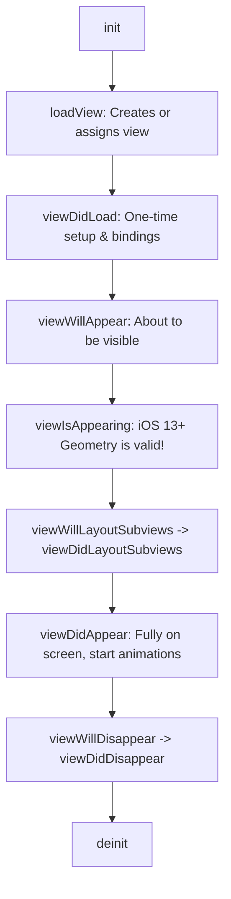
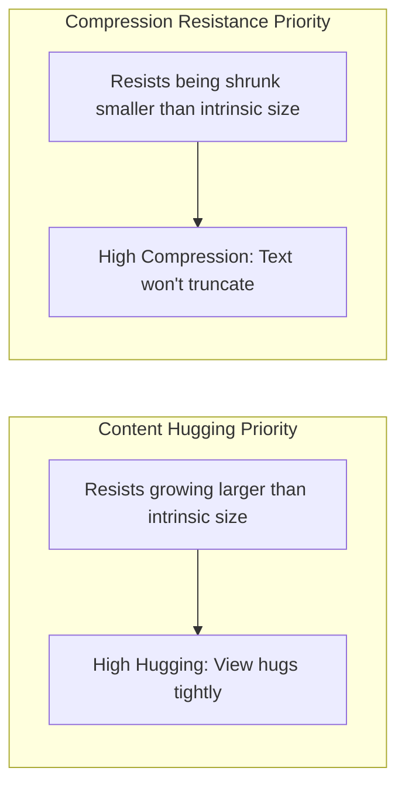
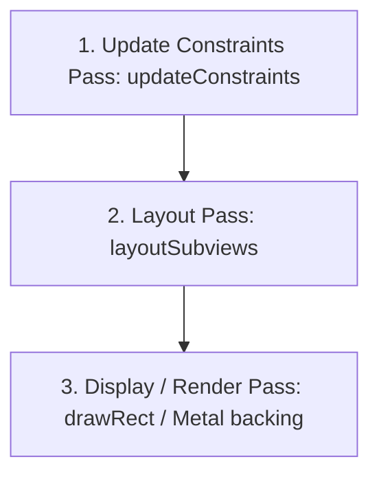
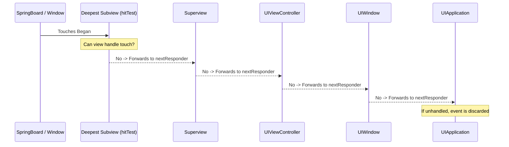

# 🖼️ UIKit Architecture, Auto Layout & Render Pipeline Mastery
> **Targeted for Senior, Staff, and Lead iOS Engineers**  
> **Core Focus:** UIViewController Lifecycle (`viewIsAppearing`), Auto Layout Cassowary Engine, Content Hugging vs. Compression Resistance, Responder Chain & Hit Testing, and 120 FPS Table/Collection Recycling.


---

## 📖 Table of Contents
- [1. UIViewController Lifecycle & Modern `viewIsAppearing`](#1-uiviewcontroller-lifecycle--modern-viewisappearing)
- [2. The Auto Layout Engine (Cassowary Algorithm)](#2-the-auto-layout-engine-cassowary-algorithm)
- [3. Intrinsic Content Size, Hugging & Compression Resistance](#3-intrinsic-content-size-hugging--compression-resistance)
- [4. The Three Layout Engine Passes](#4-the-three-layout-engine-passes)
- [5. Hit-Testing & The UIResponder Chain](#5-hit-testing--the-uiresponder-chain)
- [6. High-Performance List Recycling (Diffable Data Source)](#6-high-performance-list-recycling-diffable-data-source)
- [7. Staff-Level Interview Questions & Gotchas](#7-staff-level-interview-questions--gotchas)

---

## 1. UIViewController Lifecycle & Modern `viewIsAppearing`



### Key Nuances:
1. **`loadView()`:** Only override if constructing the root view purely in code without Storyboards/XIBs. **Never call `super.loadView()`** if assigning `self.view = CustomView()`.
2. **`viewDidLoad()`:** Called once per controller instance. Geometry/frame measurements are **not final** here.
3. **`viewIsAppearing()` (iOS 13+ backported, officially prioritized in iOS 17):** Executes after `viewWillAppear`, but **before the view is rendered**. Crucially, the view controller's traits and view geometry (bounds, safe area) are valid and calibrated, eliminating visual layout jumps.
4. **`viewWillLayoutSubviews()` / `viewDidLayoutSubviews()`:** Called whenever the view's bounds change (orientation, split screen). Safe area and final frames are ready.

---

## 2. The Auto Layout Engine (Cassowary Algorithm)

Auto Layout is a linear equation solver based on the **Cassowary algorithm**. Every layout relationship is expressed as:

$$\text{Item1.Attribute} = \text{Multiplier} \times \text{Item2.Attribute} + \text{Constant}$$

### Constraint Priorities (1 to 1000)
- **`required` (1000):** Constraint must be satisfied; failure causes constraint conflict warnings and runtime breaks.
- **`defaultHigh` (750):** Priority for content hugging.
- **`defaultLow` (250):** Priority for fallback sizing.

---

## 3. Intrinsic Content Size, Hugging & Compression Resistance

Certain views know their natural size based on internal content (e.g. `UILabel` knows its font bounding box; `UIImageView` knows its `UIImage` pixel dimensions).



### The Two Critical Priorities:
1. **Content Hugging Priority (CHP):** *"Don't stretch me!"* A view with a higher hugging priority refuses to expand larger than its intrinsic content size.
2. **Content Compression Resistance Priority (CCRP):** *"Don't squish me!"* A view with a higher compression resistance refuses to shrink smaller than its intrinsic content size (preventing text truncation).

```swift
// Real-world example: Price label should NEVER truncate, Title can truncate
titleLabel.setContentCompressionResistancePriority(.defaultLow, for: .horizontal)
priceLabel.setContentCompressionResistancePriority(.required, for: .horizontal)
```

---

## 4. The Three Layout Engine Passes

When layout changes, the run loop executes three sequential passes:



### Controlling the Passes:
- **`setNeedsLayout()`:** Flags the view as "dirty". Defers recalculation to the next screen refresh cycle (cheap).
- **`layoutIfNeeded()`:** Forces an immediate layout pass if the view is dirty. **Mandatory inside animation blocks**:
  ```swift
  heightConstraint.constant = 200
  UIView.animate(withDuration: 0.3) {
      view.layoutIfNeeded() // Animate the constraint transition smoothly!
  }
  ```
- **`layoutSubviews()`:** Never call directly. Override to manually adjust subview frames after Auto Layout completes.

---

## 5. Hit-Testing & The UIResponder Chain

When a touch lands on screen, UIKit uses reverse pre-order depth-first traversal via `hitTest(_:with:)` to identify the deepest subview under the finger.



### Extending Touch Targets:
```swift
class ExpandableButton: UIButton {
    override func point(inside point: CGPoint, with event: UIEvent?) -> Bool {
        // Expand touch target to at least 44x44 points (Apple HIG)
        let hitBounds = bounds.insetBy(dx: -15, dy: -15)
        return hitBounds.contains(point)
    }
}
```

---

## 6. High-Performance List Recycling (Diffable Data Source)

In modern UIKit (iOS 13+), replace brittle `reloadData()` and manual `numberOfRowsInSection` with **`UICollectionViewDiffableDataSource`**:

```swift
enum Section {
    case main
}

final class ProductListViewController: UIViewController {
    private var collectionView: UICollectionView!
    private var dataSource: UICollectionViewDiffableDataSource<Section, Product>!

    override func viewDidLoad() {
        super.viewDidLoad()
        configureHierarchy()
        configureDataSource()
    }

    private func configureDataSource() {
        let cellRegistration = UICollectionView.CellRegistration<UICollectionViewListCell, Product> { cell, indexPath, product in
            var content = cell.defaultContentConfiguration()
            content.text = product.name
            content.secondaryText = "$\(product.price)"
            cell.contentConfiguration = content
        }

        dataSource = UICollectionViewDiffableDataSource<Section, Product>(collectionView: collectionView) { collectionView, indexPath, product in
            collectionView.dequeueConfiguredReusableCell(using: cellRegistration, for: indexPath, item: product)
        }
    }

    func updateUI(products: [Product]) {
        // Computes linear diff in background thread automatically
        var snapshot = NSDiffableDataSourceSnapshot<Section, Product>()
        snapshot.appendSections([.main])
        snapshot.appendItems(products)
        dataSource.apply(snapshot, animatingDifferences: true)
    }
}
```

---

## 7. Staff-Level Interview Questions & Gotchas

### Q1. Why does calling `setNeedsDisplay()` differ from `setNeedsLayout()`?
**Answer:**  
- `setNeedsLayout()` triggers Auto Layout and `layoutSubviews()`, affecting view frames, sizes, and positioning.
- `setNeedsDisplay()` invalidates the view's pixel content and tells the system to re-invoke `draw(_:)` to redraw custom Quartz 2D / Core Graphics paths. It does not alter view frames or constraints.

### Q2. What causes cell flickering or mismatched images in UITableView / UICollectionView?
**Answer:**  
Asynchronous image downloads bound to recycled cells. When a cell scrolls off screen, it is reused for a new index path. If the prior image download completes after reuse, it populates the wrong image.  
**Fix:**
1. Call `prepareForReuse()` on the cell subclass to cancel pending asynchronous tasks and clear placeholder images.
2. In the data source, verify that the completed download matches the current `indexPath` or cell identifier before applying.
