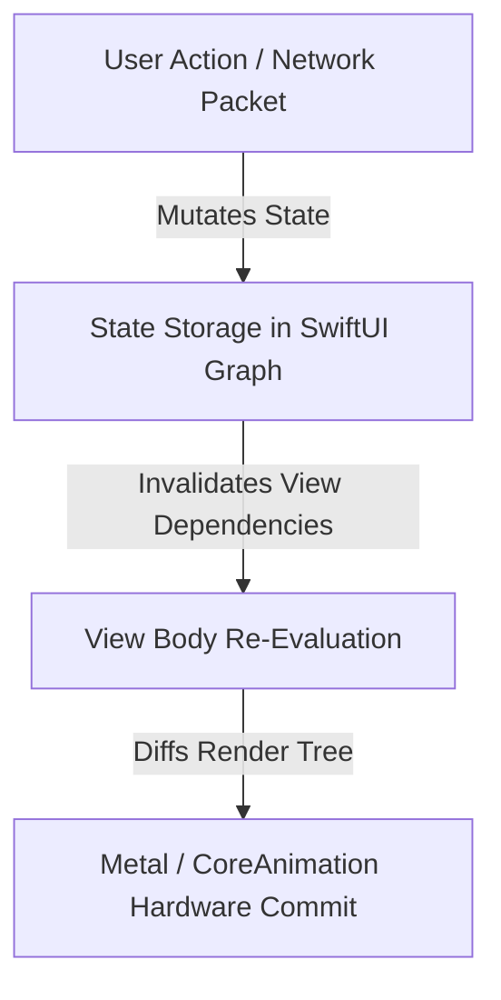
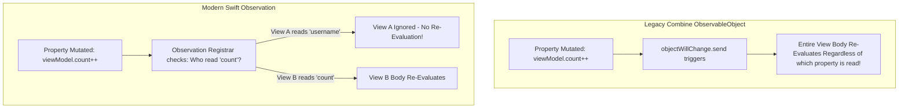

# 🧠 Modern SwiftUI State Management & Observation Framework
> **Targeted for Senior, Staff, and Lead iOS Engineers**  
> **Core Focus:** Property Wrapper Hierarchy, iOS 17+ Swift Observation (`@Observable`), Fine-Grained Invalidation, `@Bindable`, and Architectural Memory Traps.


---

## 📖 Table of Contents
- [1. The State Management Evolution in SwiftUI](#1-the-state-management-evolution-in-swiftui)
- [2. The Complete Property Wrapper Decision Matrix](#2-the-complete-property-wrapper-decision-matrix)
- [3. Deep Dive: Swift Observation Framework (iOS 17+)](#3-deep-dive-swift-observation-framework-ios-17)
- [4. Fine-Grained Re-Evaluation vs. Coarse `@Published` Invalidation](#4-fine-grained-re-evaluation-vs-coarse-published-invalidation)
- [5. Creating Two-Way Bindings with `@Bindable`](#5-creating-two-way-bindings-with-bindable)
- [6. Dependency Injection with `@Environment`](#6-dependency-injection-with-environment)
- [7. Memory Leaks, Retain Cycles & Anti-Patterns](#7-memory-leaks-retain-cycles--anti-patterns)
- [8. Staff-Level Interview Questions & Traps](#8-staff-level-interview-questions--traps)

---

## 1. The State Management Evolution in SwiftUI

In SwiftUI, views are **functions of state**. Because `View` instances are lightweight, ephemeral structs recreated on almost every user interaction, state storage cannot live inside the struct properties themselves.



---

## 2. The Complete Property Wrapper Decision Matrix

| Property Wrapper | Source of Truth? | Lifetime Scope | Value or Reference Type? | When to Use |
| :--- | :---: | :--- | :--- | :--- |
| **`@State`** | ✅ Yes | View Lifecycle | Value types (primitives, structs) | Internal, transient UI state (toggle, text field, counter) |
| **`@Binding`** | ❌ No | Bound to parent | Two-way reference | Passing read/write access from a parent to a reusable child |
| **`@StateObject`** (Pre-iOS 17) | ✅ Yes | View Lifecycle | Reference type (`ObservableObject`) | View creates and owns a ViewModel |
| **`@ObservedObject`** (Pre-iOS 17) | ❌ No | External | Reference type (`ObservableObject`) | Passing an existing ViewModel down the hierarchy |
| **`@EnvironmentObject`** (Pre-iOS 17) | ❌ No | App / Scene | Reference type (`ObservableObject`) | Implicit injection across entire navigation subtrees |
| **`@Observable`** (iOS 17+) | ✅ Yes | Standard Swift class | Reference type (`@Observable` class) | Modern state holder / ViewModel |
| **`@Bindable`** (iOS 17+) | ❌ No | Scoped to View | Reference type (`@Observable` class) | Deriving two-way bindings from an `@Observable` model |
| **`@AppStorage`** | ❌ No | Global / Disk | UserDefaults backed | Persisting small preferences (dark mode toggle, user ID) |
| **`@SceneStorage`** | ❌ No | Window / Scene | State Restoration | Restoring active tab or draft text across multitasking |

---

## 3. Deep Dive: Swift Observation Framework (iOS 17+)

Introduced in iOS 17, the **`@Observable` macro** replaces the Combine-based `ObservableObject`, `@Published`, and `@StateObject` paradigm with compiler-synthesized runtime observation.

### Legacy Combine Approach (iOS 13–16):
```swift
// ❌ Legacy Approach: Coarse-grained, requires Combine, boiler-plate heavy
class LegacyViewModel: ObservableObject {
    @Published var title: String = ""
    @Published var count: Int = 0
}

struct LegacyView: View {
    @StateObject private var viewModel = LegacyViewModel()
    
    var body: some View {
        Text(viewModel.title) // Re-evaluates even if ONLY count changes!
    }
}
```

### Modern Observation Approach (iOS 17+):
```swift
// ✅ Modern Approach: Clean Swift class, zero Combine dependencies
import Observation
import SwiftUI

@Observable
final class ProfileViewModel {
    var username: String = "Alice"
    var avatarURL: URL? = nil
    var loginCount: Int = 0
}

struct ProfileView: View {
    // Stored as regular @State in iOS 17+
    @State private var viewModel = ProfileViewModel()

    var body: some View {
        VStack {
            Text(viewModel.username) // Tracks strictly 'username'
            Button("Increment Logins") {
                viewModel.loginCount += 1 // Text above will NOT re-evaluate!
            }
        }
    }
}
```

---

## 4. Fine-Grained Re-Evaluation vs. Coarse `@Published` Invalidation

This is one of the most critical performance differences evaluated in senior interviews:



- **`ObservableObject`:** Emits on `objectWillChange`. Any mutation to *any* `@Published` property notifies the entire view, triggering a re-render even if the view doesn't display that property.
- **`@Observable` Macro:** Tracks exact property reads using an internal `ObservationRegistrar`. A view **only** invalidates if a property accessed inside its `body` changes.

---

## 5. Creating Two-Way Bindings with `@Bindable`

When passing an `@Observable` model to a view that requires two-way bindings (e.g. `TextField($model.text)`), use the **`@Bindable`** property wrapper:

```swift
@Observable
class UserFormModel {
    var email: String = ""
    var receiveNewsletter: Bool = true
}

struct UserFormView: View {
    // @Bindable enables the $ prefix projection for two-way bindings
    @Bindable var model: UserFormModel

    var body: some View {
        Form {
            TextField("Email", text: $model.email)
            Toggle("Newsletter", isOn: $model.receiveNewsletter)
        }
    }
}
```

---

## 6. Dependency Injection with `@Environment`

In iOS 17+, you no longer need `@EnvironmentObject`. You inject `@Observable` instances directly into the standard `@Environment`:

```swift
// 1. Injected at the root
@main
struct MyApp: App {
    @State private var authSession = AuthSession()

    var body: some Scene {
        WindowGroup {
            ContentView()
                .environment(authSession) // Type-safe environment injection
        }
    }
}

// 2. Consumed in any descendant subview
struct SettingsView: View {
    @Environment(AuthSession.self) private var authSession

    var body: some View {
        Button("Log Out") {
            authSession.signOut()
        }
    }
}
```

---

## 7. Memory Leaks, Retain Cycles & Anti-Patterns

### ❌ Anti-Pattern 1: Initializing `@ObservedObject` in `View.init()`
```swift
// WRONG: ViewModel is re-instantiated on every parent recomposition!
struct UserDetailView: View {
    @ObservedObject var viewModel: UserDetailViewModel

    init(userId: String) {
        self.viewModel = UserDetailViewModel(userId: userId) // State destroyed repeatedly!
    }
}
```
**Fix:** Use `@StateObject` (pre-iOS 17) or `@State` with `@Observable` (iOS 17+).

### ❌ Anti-Pattern 2: Retain Cycles in Combine Subscriptions
```swift
// WRONG: ViewModel captures self strongly in sink closure!
class BadViewModel: ObservableObject {
    @Published var searchQuery = ""
    private var cancellables = Set<AnyCancellable>()

    init() {
        $searchQuery
            .debounce(for: .milliseconds(300), scheduler: RunLoop.main)
            .sink { [weak self] query in // MUST use [weak self]
                self?.performSearch(query)
            }
            .store(in: &cancellables)
    }
}
```

---

## 8. Staff-Level Interview Questions & Traps

### Q1. Why does `@State private var object = MyClass()` cause memory issues if MyClass is not marked with `@Observable`?
**Answer:**  
`@State` is specifically designed to store value types (structs, enums). When passed a reference type (class), `@State` only observes the **pointer address**. If internal properties of the class mutate, the pointer reference remains identical, so SwiftUI **never re-evaluates the view**. Furthermore, class deallocations may not align with SwiftUI view graph cleanup.

### Q2. How does `@StateObject` guarantee that an object is created only once?
**Answer:**  
`@StateObject` wraps its target in an internal autoclosure. When the `View` struct is initialized, the closure is **not executed immediately**. SwiftUI allocates storage for the object in its internal dependency graph and instantiates the class instance only when the view renders for the first time. On subsequent view redraws, SwiftUI retrieves the existing instance from the graph, bypassing re-allocation.
