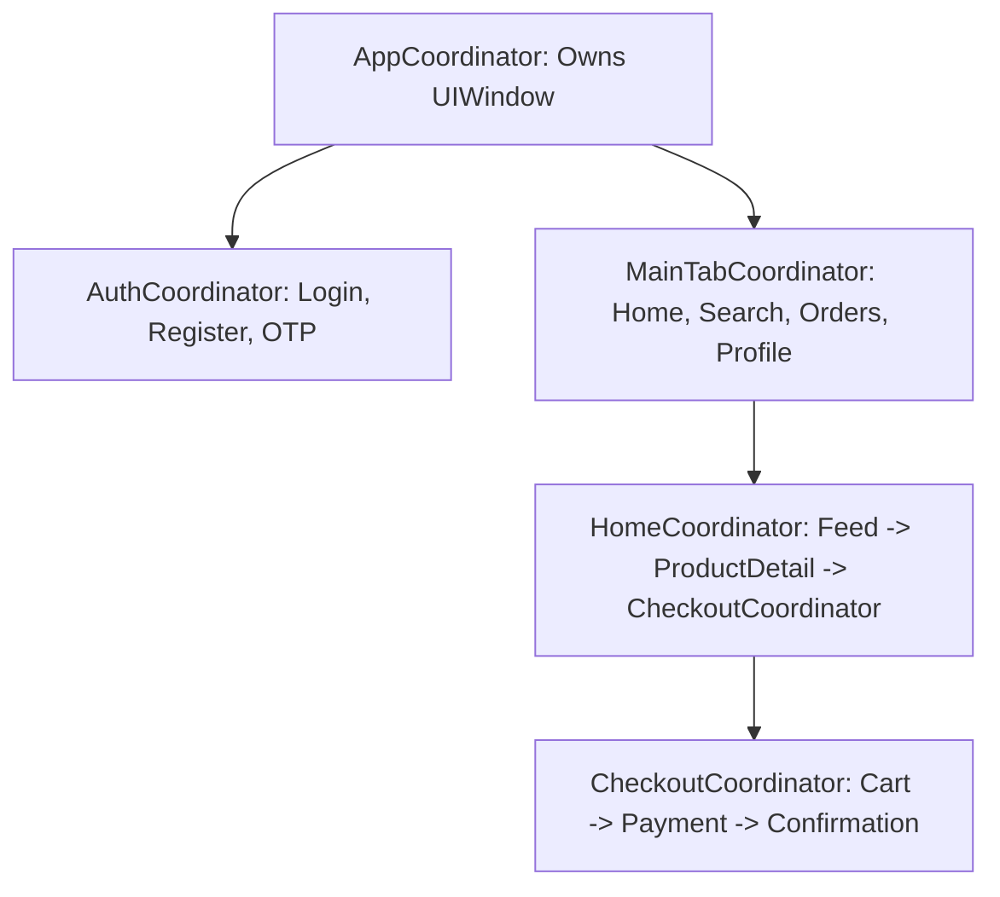

# 🗺️ Coordinator Pattern (MVVM-C) & Navigation Routers
> **Targeted for Senior, Staff, and Lead iOS Engineers**  
> **Core Focus:** Decoupled Navigation Architecture, Child Coordinator Memory Management, Back-Swipe Retention Pitfalls, Deep Linking Engines, and Modern SwiftUI Routers.


---

## 📖 Table of Contents
- [1. The Massive View Controller & Navigation Problem](#1-the-massive-view-controller--navigation-problem)
- [2. The Coordinator Protocol Hierarchy](#2-the-coordinator-protocol-hierarchy)
- [3. Child Coordinator Lifecycle & Memory Management](#3-child-coordinator-lifecycle--memory-management)
- [4. Solving the Interactive Back-Swipe Memory Leak](#4-solving-the-interactive-back-swipe-memory-leak)
- [5. Deep Link Resolution Architecture](#5-deep-link-resolution-architecture)
- [6. Modern SwiftUI Coordinator / Navigation Router](#6-modern-swiftui-coordinator--navigation-router)
- [7. Staff-Level Interview Questions & Traps](#7-staff-level-interview-questions--traps)

---

## 1. The Massive View Controller & Navigation Problem

In standard MVC or naive MVVM, View Controllers manage their own presentation logic:
```swift
// ❌ Anti-Pattern: Tight Coupling & Untestable Navigation
class FeedViewController: UIViewController {
    func didSelectPost(postId: String) {
        let detailVC = PostDetailViewController(postId: postId) // Hard dependency!
        self.navigationController?.pushViewController(detailVC, animated: true)
    }
}
```
**Why this fails at scale:**
1. **Tight Coupling:** `FeedViewController` must know the exact concrete class of `PostDetailViewController` and how to instantiate its dependencies.
2. **Zero Reusability:** You cannot display `PostDetailViewController` from Search or User Profile without replicating instantiation code.
3. **Untestable:** Navigation cannot be verified in unit tests without rendering UI hierarchies.

---

## 2. The Coordinator Protocol Hierarchy

The **Coordinator Pattern (MVVM-C)** extracts 100% of navigation and presentation logic out of View Controllers into dedicated flow coordinators.



### Core Coordinator Protocol

```swift
import UIKit

protocol Coordinator: AnyObject {
    var childCoordinators: [Coordinator] { get set }
    var navigationController: UINavigationController { get set }
    
    func start()
}

extension Coordinator {
    func addChild(_ coordinator: Coordinator) {
        childCoordinators.append(coordinator)
    }

    func removeChild(_ coordinator: Coordinator?) {
        guard let coordinator = coordinator else { return }
        childCoordinators.removeAll { $0 === coordinator }
    }
}
```

---

## 3. Child Coordinator Lifecycle & Memory Management

```swift
final class AppCoordinator: Coordinator {
    var childCoordinators: [Coordinator] = []
    var navigationController: UINavigationController
    private let window: UIWindow
    private let authService: AuthService

    init(window: UIWindow, navigationController: UINavigationController = UINavigationController(), authService: AuthService) {
        self.window = window
        self.navigationController = navigationController
        self.authService = authService
    }

    func start() {
        window.rootViewController = navigationController
        window.makeKeyAndVisible()

        if authService.isAuthenticated {
            showMainFlow()
        } else {
            showAuthFlow()
        }
    }

    private func showAuthFlow() {
        let authCoordinator = AuthCoordinator(navigationController: navigationController)
        authCoordinator.delegate = self
        addChild(authCoordinator)
        authCoordinator.start()
    }

    private func showMainFlow() {
        let mainCoordinator = MainTabCoordinator(navigationController: navigationController)
        addChild(mainCoordinator)
        mainCoordinator.start()
    }
}

// Delegate protocol for child coordinator to notify parent of completion
extension AppCoordinator: AuthCoordinatorDelegate {
    func authCoordinatorDidFinish(_ coordinator: AuthCoordinator) {
        removeChild(coordinator) // Deallocates child coordinator!
        showMainFlow()
    }
}
```

---

## 4. Solving the Interactive Back-Swipe Memory Leak

A notorious trap in UIKit coordinators occurs when a user uses the **interactive edge-swipe gesture** or the back button to pop a view controller.

The View Controller is deallocated, but its **`ChildCoordinator` remains strongly retained** inside `childCoordinators` on the parent!

### The Fix: `UINavigationControllerDelegate`

```swift
final class FlowCoordinator: NSObject, Coordinator, UINavigationControllerDelegate {
    var childCoordinators: [Coordinator] = []
    var navigationController: UINavigationController

    init(navigationController: UINavigationController) {
        self.navigationController = navigationController
        super.init()
        self.navigationController.delegate = self
    }

    func start() { ... }

    // Intercept popped ViewControllers
    func navigationController(
        _ navigationController: UINavigationController,
        didShow viewController: UIViewController,
        animated: Bool
    ) {
        // Read the "from" view controller that was popped
        guard let fromViewController = navigationController.transitionCoordinator?.viewController(forKey: .from) else {
            return
        }

        // If the navigation stack no longer contains the fromViewController, it was popped!
        if !navigationController.viewControllers.contains(fromViewController) {
            if let orderVC = fromViewController as? OrderDetailViewController {
                removeChild(orderVC.coordinator)
            }
        }
    }
}
```

---

## 5. Deep Link Resolution Architecture

Coordinators excel at handling Universal Links (`https://example.com/orders/123`):

```swift
extension AppCoordinator {
    func handleDeepLink(url: URL) -> Bool {
        guard let components = URLComponents(url: url, resolvingAgainstBaseURL: true),
              let host = components.host else {
            return false
        }

        switch host {
        case "orders":
            guard let orderId = components.queryItems?.first(where: { $0.name == "id" })?.value else { return false }
            // 1. Pop back to main navigation root
            navigationController.popToRootViewController(animated: false)
            // 2. Route coordinator to specific child screen
            let mainCoordinator = childCoordinators.first { $0 is MainTabCoordinator } as? MainTabCoordinator
            mainCoordinator?.showOrder(id: orderId)
            return true
        default:
            return false
        }
    }
}
```

---

## 6. Modern SwiftUI Coordinator / Navigation Router

In SwiftUI (iOS 16+), the coordinator pattern translates into an **Observable Navigation Router** managing a typed `NavigationPath`:

```swift
import SwiftUI

enum AppDestination: Hashable {
    case productDetail(productId: String)
    case checkout(cartId: String)
    case userProfile(userId: String)
}

@Observable
final class NavigationRouter {
    var path = NavigationPath()

    func navigate(to destination: AppDestination) {
        path.append(destination)
    }

    func pop() {
        guard !path.isEmpty else { return }
        path.removeLast()
    }

    func popToRoot() {
        path.removeLast(path.count)
    }
}

// Consuming in SwiftUI Root
struct RootAppView: View {
    @State private var router = NavigationRouter()

    var body: some View {
        NavigationStack(path: $router.path) {
            ProductListView()
                .navigationDestination(for: AppDestination.self) { destination in
                    switch destination {
                    case .productDetail(let id):
                        ProductDetailView(id: id)
                    case .checkout(let cartId):
                        CheckoutView(cartId: cartId)
                    case .userProfile(let userId):
                        UserProfileView(userId: userId)
                    }
                }
        }
        .environment(router)
    }
}
```

---

## 7. Staff-Level Interview Questions & Traps

### Q1. Why does a Child Coordinator need a weak reference to its Parent, or how do you communicate completion?
**Answer:**  
If a parent coordinator strongly holds `childCoordinators`, and the child coordinator holds a strong reference back to the parent (`var parent: AppCoordinator`), a **retain cycle** is formed, and neither coordinator will ever be deallocated. Communication should always flow upwards via **weak delegates** (`weak var delegate: ChildCoordinatorDelegate?`) or escaping completion closures with `[weak self]`.

### Q2. How do Coordinators improve modularization in multi-module SPM projects?
**Answer:**  
In a multi-module architecture, feature modules (e.g. `:FeatureOrders` and `:FeatureCart`) should not depend on each other. Coordinators live in an aggregation layer or leverage navigation contracts. `:FeatureOrders` simply triggers `orderDelegate.didRequestCheckout()`. The coordinator in the app or flow layer handles the transition, allowing feature modules to remain completely decoupled and compile in parallel.
