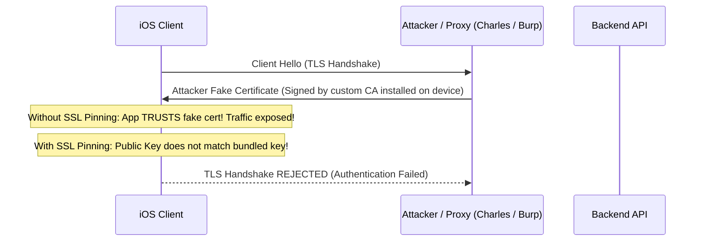
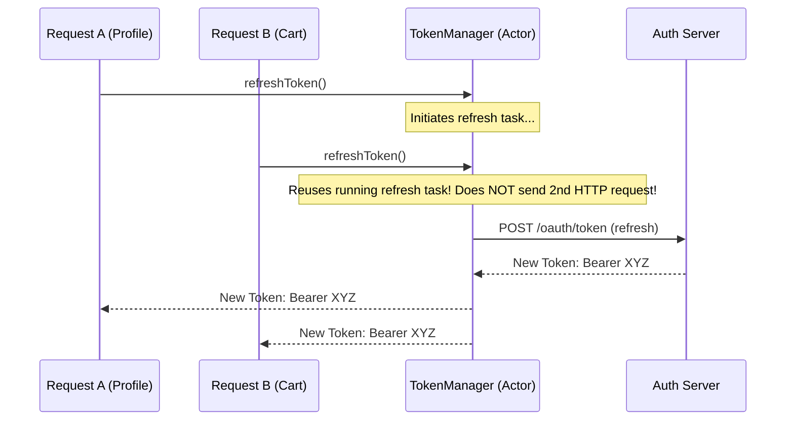

# 🔒 iOS Network Security, SSL Pinning & Token Refresh Architecture
> **Targeted for Senior, Staff, and Lead iOS Engineers**  
> **Core Focus:** Certificate vs Public Key Pinning via `URLSessionDelegate`, App Transport Security (ATS), OAuth2 Refresh Race Conditions with Swift Actors, and Secure Token Storage.


---

## 📖 Table of Contents
- [1. Threat Model & Man-In-The-Middle (MITM) Attacks](#1-threat-model--man-in-the-middle-mitm-attacks)
- [2. Certificate Pinning vs. Public Key (HPKP) Pinning](#2-certificate-pinning-vs-public-key-hpkp-pinning)
- [3. Complete Native SSL Pinning Implementation in `URLSessionDelegate`](#3-complete-native-ssl-pinning-implementation-in-urlsessiondelegate)
- [4. App Transport Security (ATS) Deep Dive](#4-app-transport-security-ats-deep-dive)
- [5. Concurrency Race Condition: OAuth2 Token Refresh with Swift Actors](#5-concurrency-race-condition-oauth2-token-refresh-with-swift-actors)
- [6. Storing Sensitive Secrets (Keychain & Secure Enclave)](#6-storing-sensitive-secrets-keychain--secure-enclave)
- [7. Staff-Level Interview Questions & Traps](#7-staff-level-interview-questions--traps)

---

## 1. Threat Model & Man-In-The-Middle (MITM) Attacks

By default, an iOS device trusts any SSL/TLS certificate signed by a Root Certificate Authority (CA) installed in the iOS trust store.

If an attacker:
1. Convinces a user to install a malicious root certificate (e.g. via corporate MDM profiles or proxy apps like Charles Proxy / Proxyman), or
2. A commercial CA is compromised,

The attacker can intercept, read, and tamper with all HTTPS traffic between the iOS app and the backend.



---

## 2. Certificate Pinning vs. Public Key (HPKP) Pinning

| Strategy | What is Pinned? | Expiration / Rotation Risk | Security Level |
| :--- | :--- | :--- | :--- |
| **Certificate Pinning** | The exact binary `.cer` certificate file | **High:** Certificates expire every 1–2 years. If the server renews the cert and the app is not updated, the app **completely breaks**. | Very High |
| **Public Key Pinning** | The SHA-256 hash of the Subject Public Key Info (SPKI) | **Low:** When certificates are renewed, backend engineers can generate a Certificate Signing Request (CSR) with the **same private/public key pair**, requiring no mobile app update. | Maximum (Recommended) |

---

## 3. Complete Native SSL Pinning Implementation in `URLSessionDelegate`

```swift
import Foundation
import CryptoKit
import Security

final class PinnedSessionDelegate: NSObject, URLSessionDelegate {

    // Pre-calculated SHA-256 hash of the server's Subject Public Key Info (SPKI)
    private let pinnedPublicKeyHash = "d6w...example_base64_sha256_hash..."

    func urlSession(
        _ session: URLSession,
        didReceive challenge: URLAuthenticationChallenge,
        completionHandler: @escaping (URLSession.AuthChallengeDisposition, URLCredential?) -> Void
    ) {
        // 1. Verify challenge is for Server Trust
        guard challenge.protectionSpace.authenticationMethod == NSURLAuthenticationMethodServerTrust,
              let serverTrust = challenge.protectionSpace.serverTrust else {
            completionHandler(.cancelAuthenticationChallenge, nil)
            return
        }

        // 2. Evaluate standard system trust policy first
        var error: CFError?
        let isTrusted = SecTrustEvaluateWithError(serverTrust, &error)
        guard isTrusted else {
            completionHandler(.cancelAuthenticationChallenge, nil)
            return
        }

        // 3. Extract Certificate Chain
        guard let certificateChain = SecTrustCopyCertificateChain(serverTrust) as? [SecCertificate],
              let leafCertificate = certificateChain.first,
              let serverPublicKey = SecCertificateCopyKey(leafCertificate) else {
            completionHandler(.cancelAuthenticationChallenge, nil)
            return
        }

        // 4. Extract Public Key Data and Compute SHA-256
        guard let publicKeyData = SecKeyCopyExternalRepresentation(serverPublicKey, nil) as Data? else {
            completionHandler(.cancelAuthenticationChallenge, nil)
            return
        }

        let computedHash = SHA256.hash(data: publicKeyData).compactMap { String(format: "%02x", $0) }.joined()

        // 5. Compare with Pinned Hash
        if computedHash == pinnedPublicKeyHash {
            completionHandler(.useCredential, URLCredential(trust: serverTrust))
        } else {
            // Pinning mismatch - possible MITM attack!
            completionHandler(.cancelAuthenticationChallenge, nil)
        }
    }
}
```

---

## 4. App Transport Security (ATS) Deep Dive

ATS enforces strict connection standards:
- TLS 1.2 or TLS 1.3 only.
- Strong ciphers with **Forward Secrecy** (e.g. ECDHE_RSA_WITH_AES_128_GCM_SHA256).
- SHA-256 or better fingerprinting.

### Proper `Info.plist` Configuration (Instead of disabling globally):
```xml
<!-- ❌ NEVER do this in production: -->
<!-- <key>NSAllowsArbitraryLoads</key><true/> -->

<!-- ✅ DO THIS: Target only specific legacy staging domains: -->
<key>NSAppTransportSecurity</key>
<dict>
    <key>NSExceptionDomains</key>
    <dict>
        <key>legacy-staging.example.com</key>
        <dict>
            <key>NSIncludesSubdomains</key>
            <true/>
            <key>NSTemporaryExceptionAllowsInsecureHTTPLoads</key>
            <true/>
            <key>NSTemporaryExceptionMinimumTLSVersion</key>
            <string>TLSv1.2</string>
        </dict>
    </dict>
</dict>
```

---

## 5. Concurrency Race Condition: OAuth2 Token Refresh with Swift Actors

When an access token expires, multiple parallel network requests (e.g. fetching Profile, Notifications, Cart) will return `401 Unauthorized` simultaneously. 

Without synchronization, the app triggers **3 simultaneous refresh token calls**, invalidating single-use refresh tokens and logging the user out.



### Complete Swift Actor Token Refresh Engine:

```swift
actor TokenManager {
    private var accessToken: String?
    private var refreshToken: String?
    private var refreshTask: Task<String, Error>?

    func validToken() async throws -> String {
        // If a refresh is already in-flight, await the SAME task
        if let existingTask = refreshTask {
            return try await existingTask.value
        }

        if let token = accessToken, !isExpired(token) {
            return token
        }

        // Launch refresh task cooperatively
        let task = Task<String, Error> {
            defer { refreshTask = nil } // Clear task when completed
            return try await performNetworkTokenRefresh()
        }
        
        refreshTask = task
        return try await task.value
    }

    private func performNetworkTokenRefresh() async throws -> String {
        // HTTP Call to /oauth/token
        let newToken = "new_bearer_token_abc123"
        self.accessToken = newToken
        return newToken
    }

    private func isExpired(_ token: String) -> Bool {
        // Token expiration verification
        false
    }
}
```

---

## 6. Storing Sensitive Secrets (Keychain & Secure Enclave)

- **Hardcoded API Keys in Binary:** Easily extracted in 30 seconds using `strings MyApp.app/MyApp` or Mach-O disassemblers (Hopper / Ghidra).
- **UserDefaults:** Stored in plaintext `.plist` on disk. Accessible via iTunes backup or rooted/jailbroken devices.
- **Keychain Services:** Hardware-encrypted using AES-256 with keys stored in the **Secure Enclave**.
  - Accessible only when device is unlocked (`kSecAttrAccessibleWhenUnlockedThisDeviceOnly`).
  - Supports biometric requirement (`kSecAccessControlBiometryAny`).

---

## 7. Staff-Level Interview Questions & Traps

### Q1. What happens if a pinned certificate expires in production before users update the app?
**Answer:**  
Every network request to that domain will fail with an authentication challenge error, rendering the app unusable.  
**Mitigation Strategy:**
1. **Always Pin Backup Keys:** Bundle at least **two** public key hashes in the app: the active primary key and a cold standby backup key stored securely in an offline vault. If the primary key is compromised or rotated, the server switches to the backup key without requiring a mobile app emergency release.
2. **Remote Config Kill-Switch:** Maintain a secure fallback channel that can temporarily disable pinning or update pinned hashes in an emergency.

### Q2. How do you bypass SSL Pinning during penetration testing?
**Answer:**  
Security researchers use runtime instrumentation tools like **Frida** or **Objection** to hook into `SecTrustEvaluateWithError` or `urlSession(_:didReceive:completionHandler:)` and force the function to return `true`. To counter this in banking and security-critical apps, developers implement runtime integrity checks, symbol obfuscation, and jailbreak detection heuristics.
