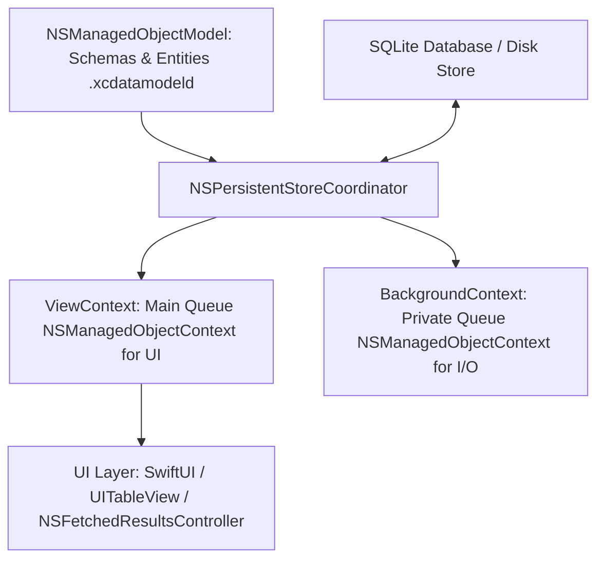
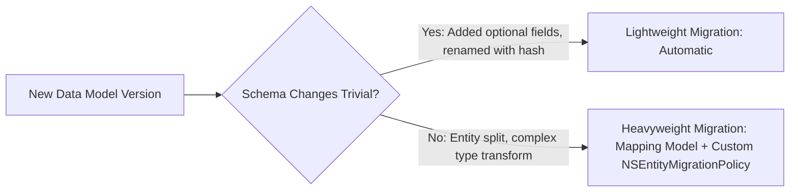

# 🗄️ Core Data Architecture & Concurrency Mastery
> **Targeted for Senior, Staff, and Lead iOS Engineers**  
> **Core Focus:** Core Data Stack Internals, Concurrency Architecture (`performBackgroundTask`), Faulting & Batching Optimization, Context Merging, and Enterprise Migration Strategies.


---

## 📖 Table of Contents
- [1. Core Data Stack Internals](#1-core-data-stack-internals)
- [2. Multi-Threading & Concurrency Architecture](#2-multi-threading--concurrency-architecture)
- [3. Background Contexts & Merging Strategies](#3-background-contexts--merging-strategies)
- [4. Performance Tuning: Faulting, Prefetching & Batch Operations](#4-performance-tuning-faulting-prefetching--batch-operations)
- [5. Batch Inserts, Updates & Deletes (Bypassing MOC Overhead)](#5-batch-inserts-updates--deletes-bypassing-moc-overhead)
- [6. Migration Strategies: Lightweight vs. Heavyweight](#6-migration-strategies-lightweight-vs-heavyweight)
- [7. Staff-Level Interview Questions & Gotchas](#7-staff-level-interview-questions--gotchas)

---

## 1. Core Data Stack Internals

Core Data is **not a relational database**; it is an **Object Graph Management and Persistence Framework** that can use SQLite, Binary, or In-Memory stores as a backing engine.



### Key Components:
1. **`NSManagedObjectModel` (MOM):** Represents the app's entity schema, attributes, and relationships.
2. **`NSPersistentStoreCoordinator` (PSC):** Bridges the data schema with the underlying storage file on disk (SQLite). Manages locks and serialization.
3. **`NSManagedObjectContext` (MOC):** The "in-memory scratchpad". Tracks changes, creates faults, and records insertions/deletions before committing to disk via `save()`.
4. **`NSPersistentContainer`:** Encapsulates MOM, PSC, and MOCs into a unified, thread-safe initializer.

---

## 2. Multi-Threading & Concurrency Architecture

### ⚠️ The Golden Rule of Core Data
> **`NSManagedObject` and `NSManagedObjectContext` are NOT thread-safe.**  
> Accessing a context or its managed objects outside the thread/queue where they were created triggers undefined behavior, silent memory corruption, and crashes.

To enforce thread safety, enable Core Data concurrency assertions in Xcode Scheme Run Arguments:
`-com.apple.CoreData.ConcurrencyDebug 1`

### Using `perform` and `performAndWait`

Every `NSManagedObjectContext` owns an internal private queue. You must access it exclusively via:
- **`perform { ... }`:** Asynchronous execution on the context's internal queue.
- **`performAndWait { ... }`:** Synchronous blocking execution on the context's internal queue.

```swift
final class CoreDataManager {
    static let shared = CoreDataManager()
    
    let container: NSPersistentContainer

    init() {
        container = NSPersistentContainer(name: "AppModel")
        container.loadPersistentStores { description, error in
            if let error = error as NSError? {
                fatalError("Core Data store failed to load: \(error), \(error.userInfo)")
            }
        }
        
        // Automatically sync background saves to the view context
        container.viewContext.automaticallyMergesChangesFromParent = true
        container.viewContext.mergePolicy = NSMergeByPropertyObjectTrumpMergePolicy
    }

    var viewContext: NSManagedObjectContext {
        container.viewContext
    }
}
```

---

## 3. Background Contexts & Merging Strategies

When importing 10,000 JSON records from a REST API, executing on `viewContext` freezes the Main Thread (causing frame drops and Watchdog `0x8badf00d` crashes).

### Background Execution Pattern:

```swift
func syncProducts(dtos: [ProductDTO]) {
    // Spawns a dedicated private background queue context
    CoreDataManager.shared.container.performBackgroundTask { context in
        context.mergePolicy = NSMergeByPropertyObjectTrumpMergePolicy

        for dto in dtos {
            let entity = ProductEntity(context: context)
            entity.id = dto.id
            entity.name = dto.name
            entity.price = dto.price
        }

        do {
            if context.hasChanges {
                try context.save()
            }
        } catch {
            print("Background save failed: \(error)")
        }
    }
}
```

### Passing Objects Between Contexts: `NSManagedObjectID`
Never pass an `NSManagedObject` reference from a background context to the UI. Instead, pass its thread-safe **`NSManagedObjectID`**:

```swift
// On Background Context
let objectID = backgroundProduct.objectID

// On Main Context
DispatchQueue.main.async {
    let mainProduct = CoreDataManager.shared.viewContext.object(with: objectID) as? ProductEntity
    // Safely update UI
}
```

---

## 4. Performance Tuning: Faulting, Prefetching & Batch Operations

### 1. Faulting (`returnsObjectsAsFaults`)
When Core Data fetches records, it does not populate all attributes immediately. It creates a **Fault**—a lightweight placeholder object containing only the `objectID`. 
When code reads a property (`product.name`), Core Data triggers a "fault fire", querying SQLite on demand.

### 2. Fetch Batch Sizing (`fetchBatchSize`)
When displaying thousands of items in a table, setting `fetchBatchSize` prevents loading all objects into RAM:

```swift
let fetchRequest: NSFetchRequest<ProductEntity> = ProductEntity.fetchRequest()
fetchRequest.fetchBatchSize = 20 // Loads records in chunks of 20 as user scrolls
```

### 3. Relationship Prefetching (`relationshipKeyPathsForPrefetching`)
Avoid the **$N+1$ query problem**:
```swift
// Pre-fetches the 'order' relationship in a single SQL JOIN instead of 100 separate queries
fetchRequest.relationshipKeyPathsForPrefetching = ["order", "order.customer"]
```

---

## 5. Batch Inserts, Updates & Deletes (Bypassing MOC Overhead)

Traditional Core Data saves load every object into memory, instantiate `NSManagedObject` classes, validate rules, and generate individual SQL `UPDATE`/`DELETE` statements.

In iOS 13+, **Batch Requests** execute directly against the SQLite file on disk, bypassing memory instantiation:

```swift
// Fast Batch Insert: 10,000 items in milliseconds without RAM spike
func performFastBatchInsert(dictionaries: [[String: Any]]) {
    let batchInsert = NSBatchInsertRequest(
        entityName: "ProductEntity",
        objects: dictionaries
    )
    batchInsert.resultType = .statusOnly

    CoreDataManager.shared.container.performBackgroundTask { context in
        do {
            try context.execute(batchInsert)
        } catch {
            print("Batch insert failed: \(error)")
        }
    }
}
```

---

## 6. Migration Strategies: Lightweight vs. Heavyweight



### Lightweight Migration
Enabled by default on `NSPersistentContainer`. Can handle:
- Adding/removing optional attributes.
- Adding non-optional attributes with a default value.
- Renaming entities/attributes using the **Renaming Identifier** in the data model inspector.

### Heavyweight Migration
Required when:
- Converting an attribute from a single String into an array of related Entities.
- Merging two entities into one.
- Requires an `.xcmappingmodel` file and a custom subclass of `NSEntityMigrationPolicy` implementing `createDestinationInstances(forSource:in:manager:)`.

---

## 7. Staff-Level Interview Questions & Gotchas

### Q1. What happens if you pass an NSManagedObject across threads?
**Answer:**  
It may work temporarily in simple cases, but will inevitably cause random data corruption, heap pointer errors, and crashes when concurrent access occurs. Core Data contexts maintain internal locks and dirty change flags that are strictly bound to their assigned queue. Always pass `NSManagedObjectID` across threads and call `context.object(with: id)`.

### Q2. How does `NSFetchedResultsController` optimize memory and table rendering?
**Answer:**  
`NSFetchedResultsController` (FRC) observes `NSManagedObjectContextObjectsDidChange` notifications. It computes index-path diffs automatically and notifies table/collection views of row insertions, deletions, and updates. Coupled with `fetchBatchSize`, it keeps memory usage bounded regardless of whether the dataset contains 100 or 100,000 records.

### Q3. Why is `mergePolicy` critical in background synchronization?
**Answer:**  
When both the main context and a background context edit the same entity simultaneously, calling `save()` triggers an `NSMergeConflict`. By default, Core Data throws an error and rejects the save (`NSErrorMergePolicy`). In production, you typically configure `NSMergeByPropertyObjectTrumpMergePolicy` (in-memory changes override disk) or `NSMergeByPropertyStoreTrumpMergePolicy` (disk changes override memory) to handle conflicts deterministically.
