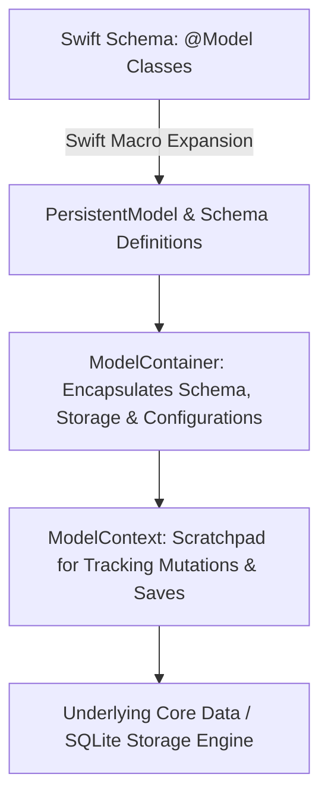

# 🍏 SwiftData Architecture & iOS 17+ Persistence
> **Targeted for Senior, Staff, and Lead iOS Engineers**  
> **Core Focus:** SwiftData Architecture, `@Model` Macro, `ModelContainer` & `ModelContext`, SwiftUI `@Query` Integration, Background Operations, and Core Data Migration.


---

## 📖 Table of Contents
- [1. SwiftData vs. Core Data Architecture](#1-swiftdata-vs-core-data-architecture)
- [2. Defining Schemas with the `@Model` Macro](#2-defining-schemas-with-the-model-macro)
- [3. The SwiftData Stack: ModelContainer & ModelContext](#3-the-swiftdata-stack-modelcontainer--modelcontext)
- [4. Declarative Fetching with SwiftUI `@Query`](#4-declarative-fetching-with-swiftui-query)
- [5. Concurrency & Background Processing with `ModelActor`](#5-concurrency--background-processing-with-modelactor)
- [6. Migration from Core Data to SwiftData](#6-migration-from-core-data-to-swiftdata)
- [7. Staff-Level Interview Questions & Gotchas](#7-staff-level-interview-questions--gotchas)

---

## 1. SwiftData vs. Core Data Architecture

SwiftData is Apple's modern, Swift-native persistence framework introduced in iOS 17. It replaces the complex XML/Xcode data model editor (`.xcdatamodeld`) with pure Swift macros and code-first schemas, while leveraging the battle-tested **Core Data / SQLite** engine under the hood.



### Feature Comparison

| Feature | Core Data | SwiftData |
| :--- | :--- | :--- |
| **Model Definition** | Visual `.xcdatamodeld` file | Pure Swift code with `@Model` macro |
| **Type Safety** | Stringly-typed keypaths / `NSManagedObject` | 100% Type-safe Swift properties |
| **SwiftUI Integration** | `@FetchRequest` (Requires `NSManagedObjectContext` in environment) | Declarative `@Query` macro |
| **Background Threading** | `performBackgroundTask` with child MOCs | Swift Concurrency `ModelActor` |
| **CloudKit Sync** | `NSPersistentCloudKitContainer` | Built-in automatic synchronization |
| **Minimum OS** | iOS 3.0+ | **iOS 17.0+** |

---

## 2. Defining Schemas with the `@Model` Macro

The `@Model` macro decorates a regular Swift class, synthesizing conformance to `PersistentModel` and automatically tracking property mutations via the Swift Observation framework.

```swift
import Foundation
import SwiftData

@Model
final class Order {
    // Unique identifier constraint
    #Unique<Order>([\.orderId])
    
    var orderId: String
    var customerName: String
    var totalAmount: Decimal
    var createdAt: Date
    var status: String
    
    // Relationship: One-to-Many with Cascade Delete
    @Relationship(deleteRule: .cascade, inverse: \OrderItem.order)
    var items: [OrderItem] = []
    
    // Transient property not persisted to disk
    @Transient
    var isSelected: Boolean = false

    init(orderId: String, customerName: String, totalAmount: Decimal, status: String = "PENDING") {
        self.orderId = orderId
        self.customerName = customerName
        self.totalAmount = totalAmount
        self.createdAt = Date()
        self.status = status
    }
}

@Model
final class OrderItem {
    var itemId: String
    var productName: String
    var quantity: Int
    var unitPrice: Decimal
    
    var order: Order?

    init(itemId: String, productName: String, quantity: Int, unitPrice: Decimal) {
        self.itemId = itemId
        self.productName = productName
        self.quantity = quantity
        self.unitPrice = unitPrice
    }
}
```

---

## 3. The SwiftData Stack: ModelContainer & ModelContext

1. **`ModelContainer`:** Manages the schema, storage configuration (in-memory vs. SQLite), migration plan, and CloudKit sync.
2. **`ModelContext`:** The working scratchpad. Tracks object mutations, insertions, deletions, and flushes changes to disk on `context.save()`.

### Initializing in SwiftUI App Lifecycle

```swift
import SwiftUI
import SwiftData

@main
struct EnterpriseApp: App {
    
    // Configure Container with Schema & In-Memory flag for Previews/Tests
    var container: ModelContainer = {
        let schema = Schema([Order.self, OrderItem.self])
        let configuration = ModelConfiguration(
            schema: schema,
            isStoredInMemoryOnly: false,
            allowsSave: true
        )
        do {
            return try ModelContainer(for: schema, configurations: [configuration])
        } catch {
            fatalError("Failed to initialize SwiftData ModelContainer: \(error)")
        }
    }()

    var body: some Scene {
        WindowGroup {
            OrderListView()
        }
        .modelContainer(container) // Injects main ModelContext into environment
    }
}
```

---

## 4. Declarative Fetching with SwiftUI `@Query`

The `@Query` macro performs reactive data fetching directly inside SwiftUI views. When objects matching the predicate mutate, the view re-renders automatically.

```swift
import SwiftUI
import SwiftData

struct OrderListView: View {
    @Environment(\.modelContext) private var modelContext

    // 1. Reactive query with sorting and predicate filter
    @Query(
        filter: #Predicate<Order> { order in
            order.status == "PENDING"
        },
        sort: \Order.createdAt,
        order: .reverse
    )
    private var pendingOrders: [Order]

    var body: some View {
        NavigationStack {
            List {
                ForEach(pendingOrders) { order in
                    VStack(alignment: .leading) {
                        Text(order.customerName)
                            .font(.headline)
                        Text("$\(order.totalAmount)")
                            .font(.subheadline)
                            .foregroundColor(.secondary)
                    }
                }
                .onDelete(perform: deleteOrders)
            }
            .navigationTitle("Pending Orders")
            .toolbar {
                Button(action: addSampleOrder) {
                    Label("Add", systemImage: "plus")
                }
            }
        }
    }

    private func deleteOrders(at offsets: IndexSet) {
        for index in offsets {
            modelContext.delete(pendingOrders[index])
        }
        // SwiftData autosaves, but explicit save guarantees immediate persistence
        try? modelContext.save()
    }

    private func addSampleOrder() {
        let newOrder = Order(
            orderId: UUID().uuidString,
            customerName: "Acme Corp",
            totalAmount: 199.99
        )
        modelContext.insert(newOrder)
    }
}
```

---

## 5. Concurrency & Background Processing with `ModelActor`

In SwiftData, **`ModelContext` is NOT thread-safe**. Sharing a `ModelContext` across concurrent threads causes undefined behavior and data corruption.

In iOS 17+, Apple introduced the **`ModelActor`** protocol, which integrates SwiftData with Swift Concurrency Actors:

```swift
import Foundation
import SwiftData

@ModelActor
actor BackgroundOrderImporter {
    
    // ModelActor automatically synthesizes:
    // - nonisolated let modelExecutor: any ModelExecutor
    // - nonisolated let modelContainer: ModelContainer
    // - var modelContext: ModelContext (isolated to this actor!)

    func importOrdersFromAPI(dtoList: [OrderDTO]) throws {
        for dto in dtoList {
            let order = Order(
                orderId: dto.id,
                customerName: dto.customer,
                totalAmount: dto.amount
            )
            modelContext.insert(order)
        }
        // Save on background thread safely
        try modelContext.save()
    }
}

// Usage in Service / Repository
func syncOrders(container: ModelContainer, dtos: [OrderDTO]) async throws {
    let importer = BackgroundOrderImporter(modelContainer: container)
    try await importer.importOrdersFromAPI(dtoList: dtos)
}
```

---

## 6. Migration from Core Data to SwiftData

Because SwiftData uses Core Data's SQLite layout under the hood, existing Core Data databases can be upgraded seamlessly:

1. **Keep Existing Managed Object Model File:** Ensure entity and attribute names match exactly with `@Model` classes.
2. **Schema Versioning with `VersionedSchema`:**
   ```swift
   enum AppSchemaV1: VersionedSchema {
       static var versionIdentifier = Schema.Version(1, 0, 0)
       static var models: [any PersistentModel.Type] { [Order.self] }
   }

   enum AppSchemaV2: VersionedSchema {
       static var versionIdentifier = Schema.Version(2, 0, 0)
       static var models: [any PersistentModel.Type] { [Order.self, OrderItem.self] }
   }

   enum OrderMigrationPlan: SchemaMigrationPlan {
       static var schemas: [any VersionedSchema.Type] { [AppSchemaV1.self, AppSchemaV2.self] }
       static var stages: [MigrationStage] { [migrateV1toV2] }

       static let migrateV1toV2 = MigrationStage.lightweight(
           fromVersion: AppSchemaV1.self,
           toVersion: AppSchemaV2.self
       )
   }
   ```

---

## 7. Staff-Level Interview Questions & Gotchas

### Q1. Why cannot you pass a `@Model` instance between actors or threads?
**Answer:**  
Like Core Data's `NSManagedObject`, SwiftData `@Model` class instances are **not `Sendable`**. Their properties are tied directly to the `ModelContext` that loaded them. If Actor A mutates a model while Actor B is reading it, a data race occurs. To pass data across concurrency boundaries:
1. Pass the `PersistentIdentifier` (which is `Sendable`).
2. Inside the target actor, fetch the model fresh using `modelContext.model(for: identifier)`.

### Q2. How does SwiftData auto-save differ from Core Data?
**Answer:**  
Core Data requires explicit calls to `managedObjectContext.save()`, or changes remain in memory. SwiftData performs **automatic saving** when triggered by main run-loop events (e.g. user taps, screen dismissals) or background actor completions. However, when performing batch operations or immediate handoffs to external APIs, calling `try modelContext.save()` explicitly is recommended to prevent data loss.
