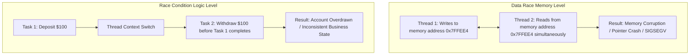

# 🛡️ Thread Safety, Modern Locks & Swift 6 Concurrency
> **Targeted for Senior, Staff, and Lead iOS Engineers**  
> **Core Focus:** Data Races vs Race Conditions, Synchronization Primitives (`os_unfair_lock`, GCD Barriers, Mutexes), Actors, `Sendable`, Actor Reentrancy, and Swift 6 Complete Concurrency.


---

## 📖 Table of Contents
- [1. Data Race vs. Race Condition: The Fundamental Difference](#1-data-race-vs-race-condition-the-fundamental-difference)
- [2. Synchronization Primitives Comparison Matrix](#2-synchronization-primitives-comparison-matrix)
- [3. Low-Level Locking: `os_unfair_lock`](#3-low-level-locking-os_unfair_lock)
- [4. Reader-Writer Lock with GCD Barriers](#4-reader-writer-lock-with-gcd-barriers)
- [5. Swift Actors & Isolation Domains](#5-swift-actors--isolation-domains)
- [6. The Actor Reentrancy Hazard (The Senior Interview Trap)](#6-the-actor-reentrancy-hazard-the-senior-interview-trap)
- [7. The `Sendable` Protocol & Closures](#7-the-sendable-protocol--closures)
- [8. Swift 6 Complete Concurrency Mode](#8-swift-6-complete-concurrency-mode)
- [9. Staff-Level Interview Questions & Traps](#9-staff-level-interview-questions--traps)

---

## 1. Data Race vs. Race Condition: The Fundamental Difference

This distinction is universally probed in senior and staff-level iOS interviews:



- **Data Race (Memory Level):** Occurs when two concurrent threads access the same memory location simultaneously without synchronization, and **at least one access is a write**. Leads to torn reads, corrupted pointers, and undefined behavior. Detectable via Xcode's **Thread Sanitizer (TSan)** and eliminated at compile-time in **Swift 6**.
- **Race Condition (Logic Level):** Occurs when the correctness of a program depends on the relative timing or order of execution of concurrent threads. A program can be 100% data-race-free (e.g. using actors) while still containing race conditions.

---

## 2. Synchronization Primitives Comparison Matrix

| Primitive | Mechanism | Performance Overhead | Reentrant? | Best Used For |
| :--- | :--- | :---: | :---: | :--- |
| **`os_unfair_lock`** | Low-level kernel futex lock | Lowest (~10–15 ns) | ❌ No | High-frequency, sub-millisecond variable synchronization |
| **`NSLock`** | Objective-C POSIX wrapper | Low (~25–35 ns) | ❌ No | General critical section protection |
| **`NSRecursiveLock`** | Recursive mutex | Medium (~50–70 ns) | ✅ Yes | Methods that call themselves or call internal locked helpers |
| **GCD Barrier** | Concurrent queue reader-writer | High (~200–500 ns) | ❌ No | Read-heavy, write-infrequent shared dictionaries |
| **Swift `actor`** | Cooperative thread pool actor | Compiler-managed | N/A (Async) | Modern asynchronous domain state isolation |

---

## 3. Low-Level Locking: `os_unfair_lock`

`os_unfair_lock` is Apple's recommended low-level synchronization lock. It replaced `OSSpinLock` (which suffered from priority inversion where high-priority threads starved lower-priority lock holders).

```swift
import os.lock

final class ThreadSafeCounter {
    private var lock = os_unfair_lock_s()
    private var count = 0

    func increment() {
        os_unfair_lock_lock(&lock)
        count += 1
        os_unfair_lock_unlock(&lock)
    }

    var value: Int {
        os_unfair_lock_lock(&lock)
        defer { os_unfair_lock_unlock(&lock) }
        return count
    }
}
```

> [!CAUTION]
> `os_unfair_lock` is **unfair** (it does not enforce FIFO acquisition order to maximize throughput). Calling `lock()` on a thread that already holds the lock causes an **immediate deadlock**.

---

## 4. Reader-Writer Lock with GCD Barriers

For shared resources where reads occur 95% of the time and writes occur 5% of the time, a **concurrent queue with barrier writes** allows multiple simultaneous reads while ensuring exclusive writes.

```swift
final class ConcurrentCache<Key: Hashable, Value> {
    private var storage: [Key: Value] = [:]
    private let queue = DispatchQueue(label: "com.cache.queue", attributes: .concurrent)

    // Concurrent read: Multiple threads read simultaneously without blocking each other
    func value(forKey key: Key) -> Value? {
        queue.sync {
            storage[key]
        }
    }

    // Exclusive write: Blocks all other reads and writes until write completes
    func set(_ value: Value, forKey key: Key) {
        queue.async(flags: .barrier) { [weak self] in
            self?.storage[key] = value
        }
    }
}
```

---

## 5. Swift Actors & Isolation Domains

An `actor` is a reference type that protects its mutable state by enforcing **serial access**. The compiler guarantees that no two concurrent tasks can access actor state at the same time.

```swift
actor BankAccount {
    private var balance: Decimal = 1000

    func deposit(amount: Decimal) {
        balance += amount
    }

    func withdraw(amount: Decimal) -> Decimal {
        guard balance >= amount else { return 0 }
        balance -= amount
        return amount
    }

    // Read-only computed property
    var currentBalance: Decimal {
        balance
    }
}

// Consuming from outside the actor requires 'await'
Task {
    let account = BankAccount()
    await account.deposit(amount: 500)
    let balance = await account.currentBalance
}
```

---

## 6. The Actor Reentrancy Hazard (The Senior Interview Trap)

While actors guarantee **Data Race Safety**, they are subject to **Actor Reentrancy**. Between two suspension points (`await`), the actor may execute other queued tasks, potentially invalidating prior assumptions.

```mermaid
sequenceDiagram
    participant TaskA as Task 1 (Download Avatar)
    participant Actor as ImageCacheActor
    participant TaskB as Task 2 (Clear Cache)

    TaskA->>Actor: Read cache[userId] (returns nil)
    TaskA->>Actor: Begin network fetch: await downloadImage()
    Note over Actor: Actor is suspended! Actor is FREE to process other messages!
    TaskB->>Actor: Call clearAllCache() -> Cache emptied
    Note over TaskA: Network fetch returns!
    TaskA->>Actor: Resume execution: cache[userId] = downloadedImage
    Note over Actor: Image was cached DESPITE cache being cleared!
```

### The Buggy Code:
```swift
actor UserCache {
    private var cache: [String: Image] = [:]

    func fetchImage(for id: String) async throws -> Image {
        if let existing = cache[id] {
            return existing
        }
        
        // ⚠️ SUSPENSION POINT: The actor is unlocked while awaiting the network!
        let image = try await networkDownload(id)
        
        // When resuming here, another task might have cleared or updated cache[id]!
        cache[id] = image
        return image
    }

    func clearCache() {
        cache.removeAll()
    }
}
```

### The Fix: Re-validate State After Suspension
```swift
func fetchImage(for id: String) async throws -> Image {
    if let existing = cache[id] { return existing }

    let image = try await networkDownload(id)

    // Re-verify state after resuming from suspension
    if let existing = cache[id] {
        return existing
    }
    cache[id] = image
    return image
}
```

---

## 7. The `Sendable` Protocol & Closures

`Sendable` is a marker protocol indicating that a value can be safely passed across concurrency domains (threads, tasks, actors).

### What is Sendable?
- **All Value Types:** Structs and enums whose stored properties are Sendable (e.g. `String`, `Int`, `Array<Sendable>`).
- **Immutable Classes:** `final class` where all stored properties are `let` and `Sendable`.
- **Actors:** Inherently Sendable because access is isolated.
- **Closures (`@Sendable`):** Cannot capture mutable local variables (`var`).

```swift
// Valid Sendable Class
final class UserConfig: Sendable {
    let apiKey: String
    let timeout: TimeInterval

    init(apiKey: String, timeout: TimeInterval) {
        self.apiKey = apiKey
        self.timeout = timeout
    }
}
```

---

## 8. Swift 6 Complete Concurrency Mode

In Swift 6, data race safety is **enforced at compile time**. Code that compiles in Swift 5.9 with concurrency warnings will trigger hard compiler errors in Swift 6.

### Common Swift 6 Migration Fixes:
1. **Global Variables:**
   ```swift
   // ❌ Swift 6 Error: Global variable 'globalSettings' is not concurrency-safe
   // var globalSettings = Settings()

   // ✅ Fix: Isolate to @MainActor or wrap in an Actor/Sendable structure
   @MainActor
   var globalSettings = Settings()
   ```

2. **Delegate Callbacks Across Threads:**
   Ensure delegate protocols inherit from `AnyObject & Sendable` or annotate with `@MainActor` when interacting with UI components.

---

## 9. Staff-Level Interview Questions & Traps

### Q1. Why does `NSRecursiveLock` hurt performance compared to `os_unfair_lock`?
**Answer:**  
`NSRecursiveLock` must record which thread currently owns the lock and maintain an internal recursion depth counter. On every lock and unlock call, it verifies thread ownership and increments/decrements the counter. In contrast, `os_unfair_lock` is a simple 32-bit integer futex managed directly by the kernel, yielding $\sim 4\times$ faster performance.

### Q2. Can deadlocks occur with Swift Actors?
**Answer:**  
Actors eliminate traditional mutex deadlocks (where Thread A waits for Lock B, and Thread B waits for Lock A) because tasks suspend cooperatively rather than blocking OS threads. However, **logical deadlocks** can still occur if two actors synchronously await each other in a circular dependency cycle without an exit condition.
