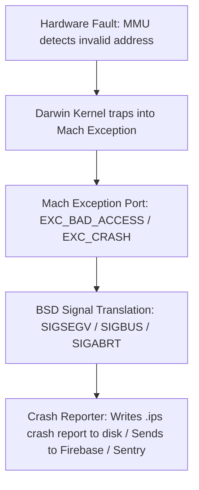
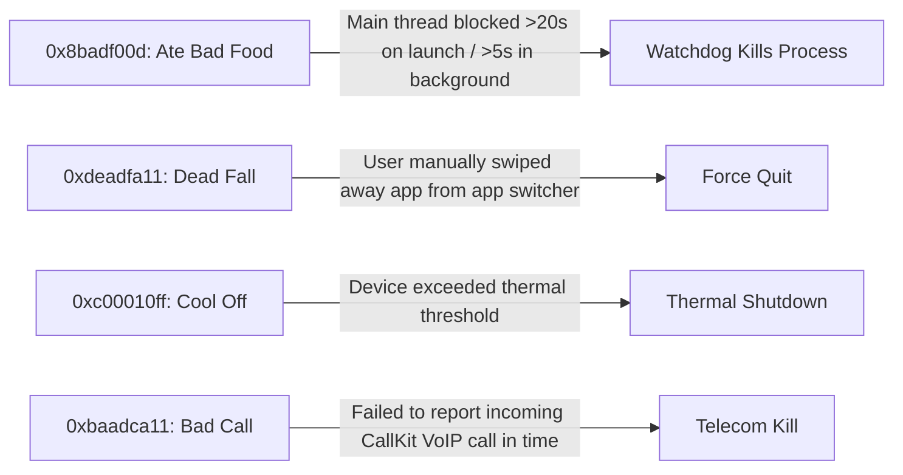

# 💥 Crash Logs, Symbolication & Mach Exception Internals
> **Targeted for Senior, Staff, and Lead iOS Engineers**  
> **Core Focus:** Mach Exceptions vs. BSD Signals (`SIGSEGV`, `SIGABRT`, `SIGBUS`), Hexadecimal Termination Codes (`0x8badf00d`, Jetsam), dSYM DWARF Extraction, and CLI Symbolication via `atos`.


---

## 📖 Table of Contents
- [1. The iOS Crash Reporting Pipeline: Mach Exceptions to BSD Signals](#1-the-ios-crash-reporting-pipeline-mach-exceptions-to-bsd-signals)
- [2. Common BSD Signals & Root Causes](#2-common-bsd-signals--root-causes)
- [3. The Famous Hexadecimal Exception Codes](#3-the-famous-hexadecimal-exception-codes)
- [4. The Jetsam Memory Termination Engine (OOM Without Crashes)](#4-the-jetsam-memory-termination-engine-oom-without-crashes)
- [5. dSYM Internals & Matching UUIDs](#5-dsym-internals--matching-uuids)
- [6. Manual CLI Symbolication with `atos`](#6-manual-cli-symbolication-with-atos)
- [7. Staff-Level Interview Questions & Gotchas](#7-staff-level-interview-questions--gotchas)

---

## 1. The iOS Crash Reporting Pipeline: Mach Exceptions to BSD Signals

The Darwin kernel at the heart of iOS does not run POSIX signals natively. When a hardware fault occurs (e.g., CPU tries to dereference an illegal memory address):



---

## 2. Common BSD Signals & Root Causes

| Signal | Mach Exception | Common Root Cause | Code Example |
| :--- | :--- | :--- | :--- |
| **`SIGSEGV`** | `EXC_BAD_ACCESS (KERN_INVALID_ADDRESS)` | Segmentation fault. Dereferencing a dangling pointer, unmapped memory, or accessing deallocated instance ("Use-after-free"). | Unsafe pointer casting, dangling C pointer. |
| **`SIGABRT`** | `EXC_CRASH` | Abort signal called explicitly by runtime when an unhandled exception or failed assertion occurs. | Force-unwrapping `nil` (`!`), array index out of bounds, missing `@IBOutlet`. |
| **`SIGBUS`** | `EXC_BAD_ACCESS` | Bus error. Misaligned memory access or hardware page fault failure. | Accessing mmap'd disk memory when file was deleted. |
| **`SIGTRAP`** | `EXC_BREAKPOINT` | Compiler-generated trap. Swift inserts traps for arithmetic overflow, force downcast (`as!`) failures, and `fatalError()`. | `let x = Int.max + 1`, `fatalError("TODO")`. |
| **`SIGKILL`** | `EXC_RESOURCE` / OS Signal | The OS kernel killed the process unconditionally. **Cannot be intercepted or caught by app code.** | Watchdog timeout, high Jetsam memory pressure. |

---

## 3. The Famous Hexadecimal Exception Codes

Apple uses distinct hex words inside iOS `.ips` crash logs:



### 1. `0x8badf00d` ("Ate Bad Food")
- **Cause:** The iOS **Watchdog** daemon terminated the app because the **Main Thread was blocked** for too long:
  - More than **20 seconds** during cold app launch (`application:didFinishLaunchingWithOptions:`).
  - More than **5 seconds** during background task execution or app suspension.
- **Fix:** Move network requests, Core Data migrations, and heavy disk reads off the main thread.

### 2. `0xdeadfa11` ("Dead Fall")
- The user manually force-quit the application from the multitasking App Switcher.

### 3. `0xc00010ff` ("Cool Off")
- The device was under extreme thermal pressure (high temperature) and the OS terminated resource-heavy apps to protect the hardware battery.

---

## 4. The Jetsam Memory Termination Engine (OOM Without Crashes)

A critical senior interview question is: *"Why do many Out-Of-Memory (OOM) events fail to appear in Firebase Crashlytics?"*

**The Answer:**
1. iOS does **not have a virtual memory swap partition** like macOS or Windows.
2. When memory pressure is high, the kernel's **Jetsam** daemon sends a low-memory notification (`UIApplicationDidReceiveMemoryWarningNotification`).
3. If memory consumption continues to rise beyond the app's footprint ceiling, Jetsam issues a **`SIGKILL` (Code 9)**.
4. Because `SIGKILL` bypasses the process completely and cannot be intercepted by any signal handlers, crash reporting SDKs (Crashlytics, Sentry) never receive a callback to write a stack trace!
5. These appear only in iOS System Analytics logs under **`JetsamEvent-*.ips`**.

---

## 5. dSYM Internals & Matching UUIDs

A **dSYM (Debug Symbol)** file contains DWARF (Debugging With Arbitrary Record Formats) symbol tables that map raw compiled machine instructions (e.g. `0x0000000104a3f2b4`) to the source file name and line number (`OrderViewModel.swift:142`).

### Verifying UUID Match
Every compiled binary and its dSYM share a unique 128-bit UUID. If the UUIDs do not match, symbolication **will fail**:

```bash
# 1. Extract UUID from the dSYM bundle
dwarfdump --uuid MyApp.app.dSYM

# Output:
# UUID: 4B6A974D-29A8-3E74-884E-5D34C9E7E02A (arm64) MyApp.app.dSYM/Contents/Resources/DWARF/MyApp

# 2. Compare against Binary Images header in the crash report:
# 0x104a34000 - 0x104b2bfff MyApp arm64 <4b6a974d-29a8-3e74-884e-5d34c9e7e02a> /var/containers/...
```

---

## 6. Manual CLI Symbolication with `atos`

When you have a raw unsymbolicated stack trace line:
```
3   MyApp               0x0000000104a3f2b4 0x104a34000 + 45748
```
- **Load Address:** `0x104a34000` (Base address where binary was loaded in memory due to ASLR).
- **Target Address:** `0x0000000104a3f2b4` (Address of the crash instruction).

### Running `atos`:
```bash
atos -arch arm64 \
     -o MyApp.app.dSYM/Contents/Resources/DWARF/MyApp \
     -l 0x104a34000 \
     0x0000000104a3f2b4

# Output:
# specialized OrderViewModel.checkout() (OrderViewModel.swift:142)
```

---

## 7. Staff-Level Interview Questions & Gotchas

### Q1. What is Address Space Layout Randomization (ASLR), and why is the Load Address required for symbolication?
**Answer:**  
ASLR is a security defense mechanism that randomizes the target memory addresses of the app binary each time it launches, preventing buffer-overflow exploits from guessing exact function pointer locations. Because the code is shifted in memory by a random offset, symbolication tools need the **Load Address** (base start of the binary) to calculate the original slide offset:
$$\text{DWARF Symbol Offset} = \text{Crash Address} - \text{ASLR Load Address}$$

### Q2. What causes `EXC_BAD_ACCESS (KERN_PROTECTION_FAILURE)`?
**Answer:**  
Unlike `KERN_INVALID_ADDRESS` (which attempts to read memory that does not exist or has been freed), `KERN_PROTECTION_FAILURE` occurs when memory exists, but the process attempts an operation forbidden by that memory page's access permissions—such as attempting to write data into a read-only memory page (e.g. compiled executable code segment) or executing instructions from a non-executable page (W^X memory violation).
