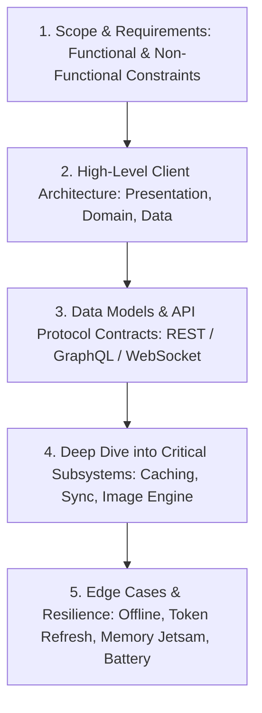
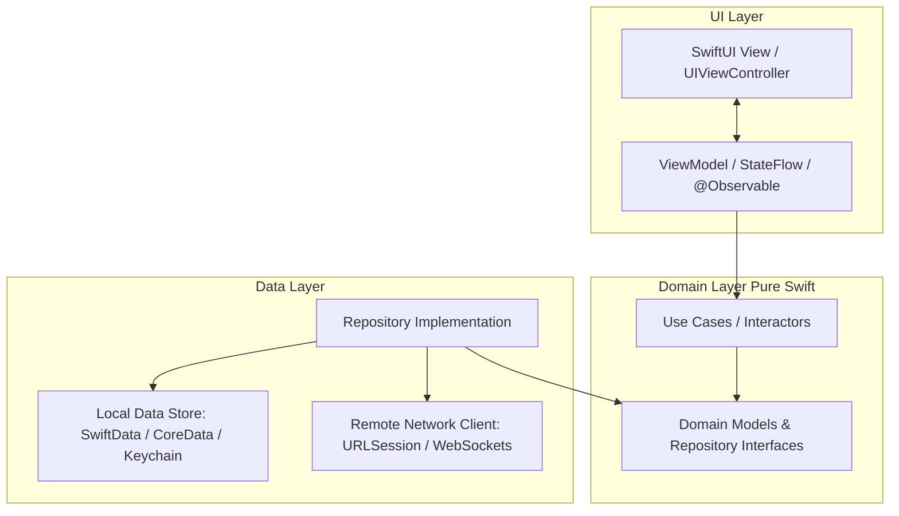
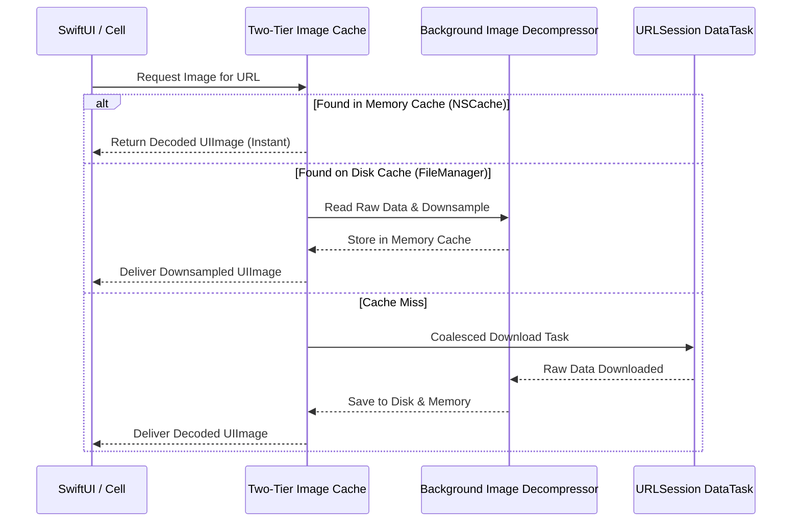
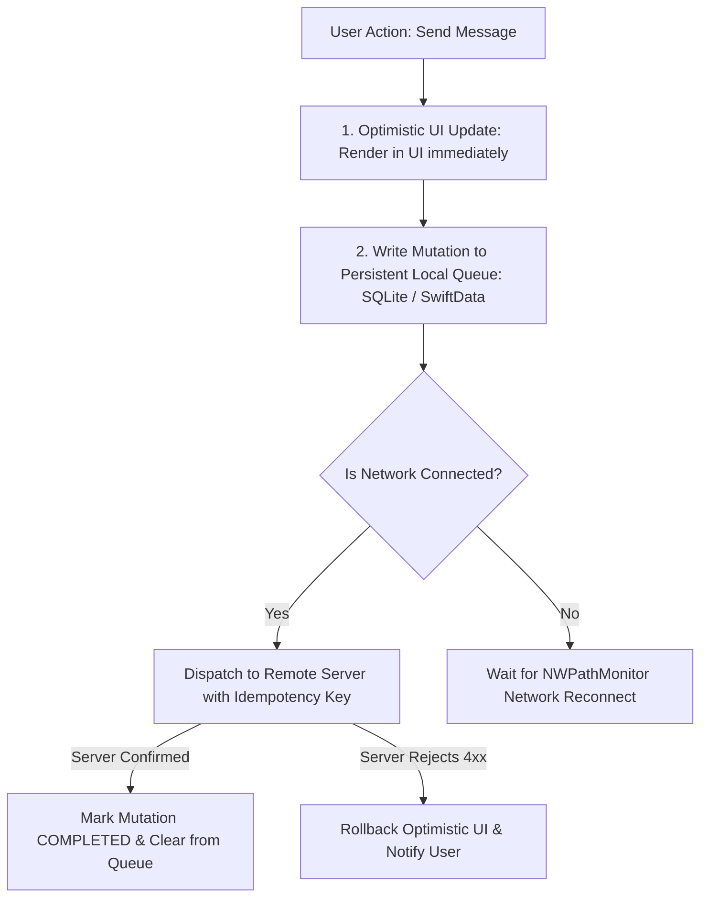

# 🏗️ Mobile System Design Architecture Framework for iOS
> **Targeted for Senior, Staff, and Lead iOS Engineers**  
> **Core Focus:** 5-Step Mobile Architecture Framework, High-Level Client Component Design, Offline-First Synchronization, Image Pipeline Engineering, and Real-World Case Studies.


---

## 📖 Table of Contents
- [1. The 5-Step Mobile System Design Framework](#1-the-5-step-mobile-system-design-framework)
- [2. Universal Mobile Client Architecture](#2-universal-mobile-client-architecture)
- [3. Deep-Dive Subsystem: Production Image Loading Pipeline](#3-deep-dive-subsystem-production-image-loading-pipeline)
- [4. Deep-Dive Subsystem: Offline-First Sync & Mutation Queue](#4-deep-dive-subsystem-offline-first-sync--mutation-queue)
- [5. API Protocol Selection Matrix (REST vs. GraphQL vs. gRPC vs. WebSocket)](#5-api-protocol-selection-matrix-rest-vs-graphql-vs-grpc-vs-websocket)
- [6. Case Study: Designing an Offline-First Infinite Feed (Instagram / X)](#6-case-study-designing-an-offline-first-infinite-feed-instagram--x)
- [7. Staff-Level Interview Rubric & Failure Traps](#7-staff-level-interview-rubric--failure-traps)

---

## 1. The 5-Step Mobile System Design Framework

Mobile system design interviews differ drastically from backend system design: you are not designing distributed databases across 1,000 servers. You are designing an **autonomous edge client** running on battery-constrained, CPU-throttled, intermittent-connectivity hardware.



### Time Allocation in a 45-Minute Interview:
- **00–05 min:** Clarify Scope & Non-Functional Constraints.
- **05–15 min:** High-Level Architecture & Layered Diagram.
- **15–30 min:** Deep Dive into 1–2 Core Complex Subsystems (e.g. Sync Engine or Image Cache).
- **30–40 min:** Edge Cases (Doze/Backgrounding, Network Loss, Security, Jetsam OOM).
- **40–45 min:** Summary & Trade-offs.

---

## 2. Universal Mobile Client Architecture

A scalable enterprise iOS app is organized into strict unidirectional layers:



---

## 3. Deep-Dive Subsystem: Production Image Loading Pipeline

Displaying an infinite image feed without stuttering requires solving **3 major bottlenecks**:
1. **Redundant Downloads:** Deduplicating in-flight requests.
2. **Main Thread Frame Drops:** Decoding compressed JPEGs/PNGs on background threads before passing to `UIImageView`.
3. **Memory Pressure (Jetsam OOM):** Downsampling $4000\times3000$ camera photos to match screen resolution ($300\times300$ pt).



### Complete Native Downsampling Implementation

```swift
import UIKit
import ImageIO

func downsampleImage(at imageURL: URL, to pointSize: CGSize, scale: CGFloat = UIScreen.main.scale) -> UIImage? {
    let imageSourceOptions = [kCGImageSourceShouldCache: false] as CFDictionary
    guard let imageSource = CGImageSourceCreateWithURL(imageURL as CFURL, imageSourceOptions) else {
        return nil
    }

    let maxDimensionInPixels = max(pointSize.width, pointSize.height) * scale
    let downsampleOptions = [
        kCGImageSourceCreateThumbnailFromImageAlways: true,
        kCGImageSourceShouldCacheImmediately: true, // Forces decompression on background thread!
        kCGImageSourceCreateThumbnailWithTransform: true,
        kCGImageSourceThumbnailMaxPixelSize: maxDimensionInPixels
    ] as CFDictionary

    guard let downsampledImage = CGImageSourceCreateThumbnailAtIndex(imageSource, 0, downsampleOptions) else {
        return nil
    }

    return UIImage(cgImage: downsampledImage)
}
```

---

## 4. Deep-Dive Subsystem: Offline-First Sync & Mutation Queue

When the device has no internet, user actions (e.g. Liking a post, sending a message) must not be lost:



### Idempotency Keys (Preventing Duplicate Charges/Messages):
Every queued request generates a UUID `idempotency_key` client-side. If the request times out or is re-sent upon reconnecting, the server recognizes the duplicate key and returns the cached response rather than processing the transaction twice.

---

## 5. API Protocol Selection Matrix

| Protocol | Best Used For | Pros | Cons / Mobile Trade-Offs |
| :--- | :--- | :--- | :--- |
| **REST (HTTP/2 or 3)** | Standard CRUD, Feed loading, Auth | Highly cacheable (HTTP headers), universally supported | Over-fetching / under-fetching data |
| **GraphQL** | Deeply nested complex dashboards | Client requests exact fields needed (saves mobile bandwidth) | Hard to cache on HTTP level, complex client libraries |
| **gRPC / Protobuf** | High-performance binary transport | Compact binary payloads, type-safe schema contracts | Lacks native browser/inspector visibility, streaming connection maintenance |
| **WebSockets** | Live chat, Ride tracking, Real-time collaboration | Full-duplex persistent stream, lowest latency | High battery drain if kept open continuously; requires ping/pong keep-alive |

---

## 6. Case Study: Designing an Offline-First Infinite Feed (Instagram / X)

### Key Architecture Components:
1. **Cursor-Based Pagination:** Use `since_id` / `max_id` or timestamp cursors. (Never use offset pagination `page=2`, as new posts cause duplicate or skipped items).
2. **Pre-fetching:** Monitor scroll velocity. When the user reaches item $N-5$, trigger a background fetch for page $N+1$.
3. **Background Sync:** Use `BGAppRefreshTask` to download the top 20 feed posts while the user is asleep, so opening the app in the morning displays fresh content instantly.

---

## 7. Staff-Level Interview Rubric & Failure Traps

### ❌ Fatal Traps in Mobile System Design:
1. **Treating Mobile Like a Web App:** Assuming permanent gigabit Wi-Fi and unlimited RAM.
2. **Ignoring App Backgrounding:** Not explaining what happens when iOS suspends the app after 30 seconds.
3. **Ignoring Memory Footprints:** Loading 100 raw 4K images into an array, triggering an immediate OS **Jetsam memory crash**.
4. **No Error Handling or Offline Strategy:** Assuming network requests always succeed on the first try.
