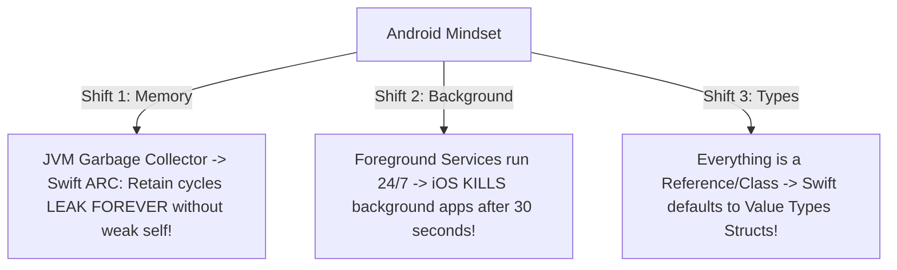
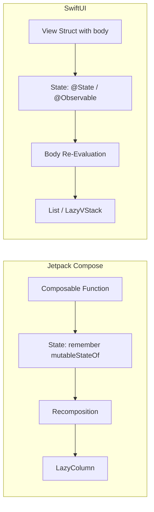
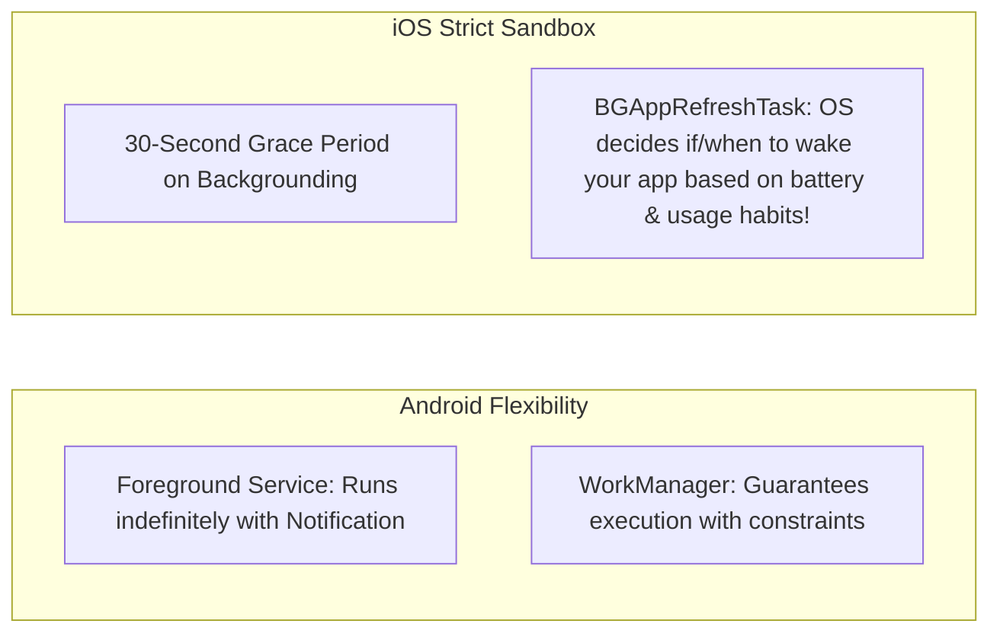

# 🔄 iOS Architecture & Mental Models for Android Engineers (The Rosetta Stone)
> **Designed specifically for Android Engineers mastering iOS**  
> **Core Focus:** Mapping Android Mental Models (Kotlin, Coroutines, Compose, Jetpack, JVM GC) to iOS Equivalents (Swift, GCD/Actors, SwiftUI, UIKit, ARC), Highlighting Surprises, Traps, and Architectural Parallels.


---

## 📖 Table of Contents
- [1. The 3 Biggest Mindset Shifts for Android Devs](#1-the-3-biggest-mindset-shifts-for-android-devs)
- [2. Memory Management: JVM Garbage Collection vs. Apple ARC](#2-memory-management-jvm-garbage-collection-vs-apple-arc)
- [3. Language Rosetta Stone: Kotlin vs. Swift](#3-language-rosetta-stone-kotlin-vs-swift)
- [4. UI Frameworks: Jetpack Compose vs. SwiftUI](#4-ui-frameworks-jetpack-compose-vs-swiftui)
- [5. Concurrency: Kotlin Coroutines vs. Swift Concurrency (GCD & Actors)](#5-concurrency-kotlin-coroutines-vs-swift-concurrency-gcd--actors)
- [6. Architecture & Dependency Injection: Hilt/MVVM vs. iOS Patterns](#6-architecture--dependency-injection-hiltmvvm-vs-ios-patterns)
- [7. Local Persistence: Room vs. SwiftData & Core Data](#7-local-persistence-room-vs-swiftdata--core-data)
- [8. Background Work: WorkManager & Services vs. iOS BGTasks](#8-background-work-workmanager--services-vs-ios-bgtasks)
- [9. Quick-Reference Equivalents Cheat Sheet](#9-quick-reference-equivalents-cheat-sheet)

---

## 1. The 3 Biggest Mindset Shifts for Android Devs

Coming from Android, you are used to the JVM's safety nets and open system architecture. When moving to iOS, keep these 3 core realities in mind:



1. **Memory is NOT Garbage Collected:** The JVM runs a tracing Mark-and-Sweep GC. Even if Object A and Object B hold strong references to each other, the JVM frees both if neither is reachable from a GC Root. **In iOS, circular references retain each other in memory FOREVER.** You must actively manage reference ownership with `weak`.
2. **Background Execution is Heavily Restricted:** In Android, you can launch a Foreground Service with an ongoing notification and run high-frequency tasks (GPS, Bluetooth, downloads) indefinitely. **iOS has no generic persistent background services.** The OS suspends your app 30 seconds after it leaves the screen unless using strictly permitted background modes (Audio, VoIP, Navigation).
3. **Value Types are King:** In Kotlin, every `class` and `data class` is an object allocated on the JVM heap. In Swift, models, UI views, and collections (`Array`, `Dictionary`) are **`struct` value types** copied on assignment, keeping memory on the CPU stack and eliminating shared mutable state.

---

## 2. Memory Management: JVM Garbage Collection vs. Apple ARC

| Dimension | Android (JVM / ART) | iOS (Automatic Reference Counting - ARC) |
| :--- | :--- | :--- |
| **Mechanism** | Tracing Generational Garbage Collector | Compile-time injected `retain` / `release` counters |
| **When deallocated?** | Non-deterministic (when GC runs during idle or low memory) | **Instantaneous** (the exact microsecond reference count drops to 0) |
| **Circular Reference ($A \leftrightarrow B$)** | ✅ Cleaned automatically if unreachable from GC root | ❌ **Permanent Memory Leak** (Retain Cycle) |
| **Closure / Lambda Captures** | Lambda captures outer class reference silently | **MUST** use capture list: `[weak self]` |
| **Null pointer handling** | Crashes with `NullPointerException` | Optionals (`nil`) handled safely via compiler guards |

### Retain Cycles: The #1 iOS Trap for Android Developers

```kotlin
// In Android / Kotlin: Perfectly safe!
class OrderViewModel : ViewModel() {
    private val repo = OrderRepository()
    
    fun load() {
        repo.fetchData { result ->
            // Even though this lambda captures 'this', GC reclaims both when VM is destroyed
            show(result)
        }
    }
}
```

```swift
// In iOS / Swift: DANGEROUS! Memory Leak!
class OrderViewModel {
    private let repo = OrderRepository()

    func load() {
        // ❌ LEAK: 'repo' holds the closure, closure holds 'self' strongly, 'self' holds 'repo'.
        // repo.fetchData { result in self.show(result) }

        // ✅ THE IOS FIX: Capture self weakly
        repo.fetchData { [weak self] result in
            guard let self = self else { return } // Optional unwrapping
            self.show(result)
        }
    }
}
```

---

## 3. Language Rosetta Stone: Kotlin vs. Swift

Both languages were born in the modern era and share remarkable syntactic similarities. Here is your direct translation dictionary:

```kotlin
// ==================== KOTLIN ====================
val name: String = "John"      // Read-only
var age: Int = 30              // Mutable
val city: String? = null       // Nullable

// Null safety
val length = city?.length ?: 0 // Elvis operator

// Data class
data class User(val id: String, val name: String)

// Extension function
fun String.isValidEmail(): Boolean = this.contains("@")

// When expression (Pattern matching)
when (status) {
    Status.SUCCESS -> println("Done")
    is Status.Error -> println(status.msg)
}

// Scope functions
user?.let { print(it.name) }
val intent = Intent().apply { putExtra("id", 1) }
```

```swift
// ==================== SWIFT ====================
let name: String = "John"      // Constant (read-only)
var age: Int = 30              // Variable (mutable)
var city: String? = nil        // Optional (can be nil)

// Null safety
let length = city?.count ?? 0  // Nil-coalescing operator

// Struct with synthesized memberwise init & Equatable
struct User: Equatable {
    let id: String
    let name: String
}

// Extension function
extension String {
    func isValidEmail() -> Bool { self.contains("@") }
}

// Switch statement (Exhaustive pattern matching)
switch status {
case .success: print("Done")
case .error(let msg): print(msg)
}

// Unwrapping idioms
if let user = user { print(user.name) }
guard let user = user else { return }
```

---

## 4. UI Frameworks: Jetpack Compose vs. SwiftUI

If you know Jetpack Compose, **you already know 80% of SwiftUI**. Both are declarative, reactive, and rebuild the UI tree based on state changes.



### Direct Concept Mapping

| Jetpack Compose | SwiftUI Equivalent | Notes & Key Differences |
| :--- | :--- | :--- |
| `@Composable fun MyScreen()` | `struct MyScreen: View { var body: some View }` | Compose uses functions; SwiftUI uses structs implementing the `View` protocol. |
| `remember { mutableStateOf(0) }` | `@State private var count = 0` | SwiftUI stores state outside the struct in its dependency graph. |
| `rememberSaveable` | `@SceneStorage` or `@AppStorage` | Saves across configuration changes / restarts. |
| `Modifier.padding(16.dp).fillMaxWidth()` | `.padding(16).frame(maxWidth: .infinity)` | **Crucial:** Compose modifiers execute in sequential order; SwiftUI modifiers wrap views inside new views! |
| `Column { ... }` / `Row { ... }` | `VStack { ... }` / `HStack { ... }` | Vertical and Horizontal stacks. |
| `Box { ... }` | `ZStack { ... }` or `.overlay { ... }` | Stacking layers on the Z-axis. |
| `LazyColumn { items(list) { ... } }` | `List(list) { ... }` or `LazyVStack { ... }` | `List` recycles like `RecyclerView`; `LazyVStack` creates lazy views inside a `ScrollView`. |
| `LaunchedEffect(key) { ... }` | `.task(id: key) { ... }` | Launches a cooperative coroutine/task; cancelled when key changes or view leaves. |
| `DisposableEffect { onDispose { } }` | `.onDisappear { ... }` | Cleanup hook. |
| `rememberCoroutineScope()` | `@Environment(\.openURL)` or `Task { ... }` | Launching asynchronous tasks from click callbacks. |
| `StateFlow.collectAsStateWithLifecycle()` | Modern `@Observable` class accessed directly | In iOS 17+, you read properties directly; SwiftUI tracks reads automatically! |

### Side-by-Side Code Comparison

```kotlin
// ==================== COMPOSE ====================
@Composable
fun CounterScreen(viewModel: CounterViewModel = hiltViewModel()) {
    val count by viewModel.count.collectAsStateWithLifecycle()

    Column(
        modifier = Modifier.fillMaxSize().padding(16.dp),
        horizontalAlignment = Alignment.CenterHorizontally
    ) {
        Text(text = "Taps: $count", style = MaterialTheme.typography.headlineMedium)
        Button(onClick = { viewModel.increment() }) {
            Text("Tap Me")
        }
    }
}
```

```swift
// ==================== SWIFTIUI ====================
struct CounterScreen: View {
    // In iOS 17+, ViewModel is an @Observable class
    @State private var viewModel = CounterViewModel()

    var body: some View {
        VStack(spacing: 16) {
            Text("Taps: \(viewModel.count)")
                .font(.title)
            Button("Tap Me") {
                viewModel.increment()
            }
            .buttonStyle(.borderedProminent)
        }
        .padding(16)
        .frame(maxWidth: .infinity, maxHeight: .infinity)
    }
}
```

---

## 5. Concurrency: Kotlin Coroutines vs. Swift Concurrency (GCD & Actors)

Both ecosystems have moved away from callbacks and threads to **Structured Concurrency**.

```mermaid
graph TD
    A[CoroutineScope in Android] <--> B[Task / TaskGroup in Swift]
    C[Dispatchers.Main] <--> D[@MainActor / DispatchQueue.main]
    E[Dispatchers.IO] <--> F[Cooperative Global Thread Pool]
    G[StateFlow / Flow] <--> H[AsyncStream / Combine Publisher]
    I[Mutex / Atomic] <--> J[Swift actor]
```

### Concurrency Rosetta Stone

| Android Coroutines Concept | Swift Concurrency Equivalent |
| :--- | :--- |
| `suspend fun fetchData(): String` | `func fetchData() async throws -> String` |
| `viewModelScope.launch { ... }` | `Task { ... }` |
| `async { ... }.await()` | `async let result = ...` followed by `await result` |
| `withContext(Dispatchers.IO)` | Execution on standard non-isolated `async` functions (handled by cooperative thread pool) |
| `Dispatchers.Main` | `@MainActor` (Global actor pinned to Main Thread) |
| `Mutex` / Thread-safe class | `actor MyStateHolder { ... }` (Serial message queue) |
| `flow { emit(...) }` | `AsyncStream { continuation in continuation.yield(...) }` |
| `StateFlow<T>` | Combine `@Published var value: T` or iOS 17 `@Observable` property |

---

## 6. Architecture & Dependency Injection: Hilt/MVVM vs. iOS Patterns

### 1. ViewModels
- **Android:** Inherits from `androidx.lifecycle.ViewModel`. Managed by `ViewModelProvider` so it survives Activity destruction across screen orientation changes.
- **iOS:** Plain Swift class marked with `@Observable` (iOS 17+) or conforming to `ObservableObject` (iOS 13-16). Stored in the SwiftUI view tree using `@State` or `@StateObject`.

### 2. Dependency Injection
- **Android:** Heavily relies on compile-time annotation processing with **Dagger / Hilt** (`@Inject`, `@HiltViewModel`, `@Provides`).
- **iOS:** Reflection and code generation (like Dagger) are rare because of Swift's static type system and lack of JVM annotation processors. iOS uses:
  - **Manual Constructor Injection** (Preferred in Clean Architecture).
  - **Factory Pattern** or **Composition Root**.
  - Lightweight libraries: **Needle** (Uber), **Factory**, or **Swinject**.
  - SwiftUI's built-in **`@Environment`** container.

---

## 7. Local Persistence: Room vs. SwiftData & Core Data

| Android: Room | iOS: SwiftData (iOS 17+) | iOS: Core Data (Classic) |
| :--- | :--- | :--- |
| `@Entity data class User(...)` | `@Model class User { ... }` | Visual `.xcdatamodeld` graphical schema |
| `@Dao interface UserDao` | SwiftData `ModelContext` methods | `NSFetchRequest` + `managedObjectContext` |
| `RoomDatabase.Builder` | `ModelContainer(for: User.self)` | `NSPersistentContainer(name: "Model")` |
| `@Query("SELECT * FROM user") Flow<List<User>>` | `@Query var users: [User]` | `@FetchRequest var users: FetchedResults<User>` |
| Pure SQLite table mapping | SQLite backing Object Graph | SQLite backing Object Graph |

---

## 8. Background Work: WorkManager & Services vs. iOS BGTasks

This is where Android and iOS diverge the most:



- **In Android:** If you must sync data every 15 minutes, you register a `PeriodicWorkRequest` in WorkManager. If you need turn-by-turn navigation, you start a `ForegroundService`.
- **In iOS:** You **cannot guarantee an exact time** for background tasks.
  - When the app enters the background, you get $\sim 30$ seconds to finish current requests using `beginBackgroundTask(expirationHandler:)`.
  - For deferred sync, you submit a `BGAppRefreshTaskRequest` to `BGTaskScheduler`. The iOS machine learning battery engine decides *if and when* to run your task based on whether the device is on Wi-Fi, charging, and the user's historical app usage patterns.

---

## 9. Quick-Reference Equivalents Cheat Sheet

| Category | Android Term | iOS Term |
| :--- | :--- | :--- |
| **Operating System** | Android OS / Linux Kernel | iOS / Darwin / XNU Kernel |
| **Package / Bundle** | `.apk` / `.aab` | `.ipa` / `MyApp.app` |
| **Build System** | Gradle (Groovy / Kotlin DSL) | Swift Package Manager (SPM) / Xcode |
| **Manifest** | `AndroidManifest.xml` | `Info.plist` |
| **Screen Container** | `Activity` / `Fragment` | `UIHostingController` / `UIViewController` |
| **Navigation** | Jetpack Navigation `NavHost` | `NavigationStack` / Coordinator Pattern |
| **List Recycling** | `RecyclerView` / `LazyColumn` | `UICollectionViewDiffableDataSource` / `List` |
| **Log Tool** | `Log.d("TAG", msg)` | `os.Logger` / `print()` |
| **Profiling Tool** | Android Studio Profiler / Perfetto | Xcode Instruments (Time Profiler, Allocations) |
| **Crash Report** | Logcat / Tombstone | `.ips` Crash Log / dSYM Symbolication |
