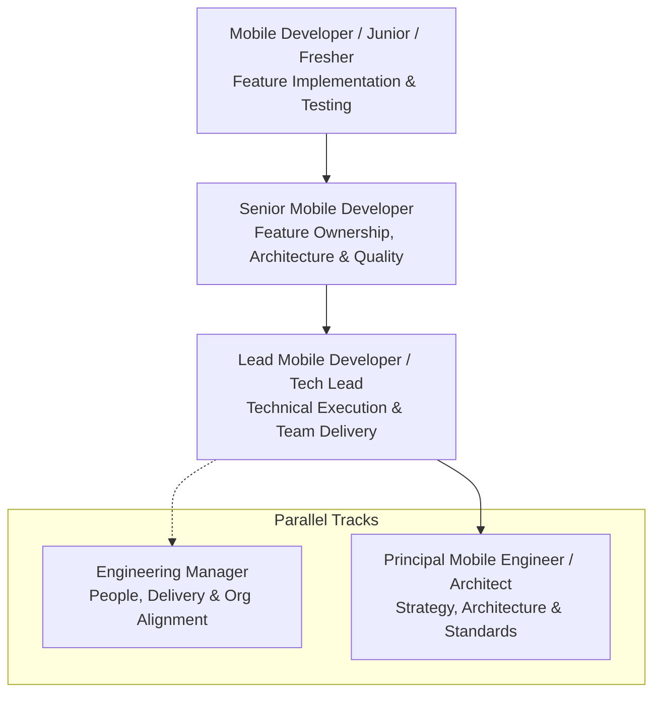
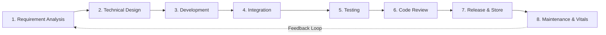

# 🎤 The Mobile Interview Vault & Engineering Career Framework
> **The Complete Handbook of Real-World Mobile Technical Ladders, Engineering Lifecycles, and Interview Systems across Android, iOS, Flutter, and React Native**


---

## 📖 Table of Contents
- [1. Industry Engineering Ladder & Mobile Developer Roles](#1-industry-engineering-ladder--mobile-developer-roles)
  - [Level 1: Mobile Developer (Junior / Fresher: 0–3 Years)](#1-mobile-developer-junior--fresher--mid-level-03-years)
  - [Level 2: Senior Mobile Developer (3–6+ Years)](#2-senior-mobile-developer-36-years)
  - [Level 3: Lead Mobile Developer / Tech Lead (6–9+ Years)](#3-lead-mobile-developer--tech-lead-69-years)
  - [Level 4: Principal Mobile Engineer / Mobile Architect (10+ Years)](#4-principal-mobile-engineer--mobile-architect-10-years)
- [2. Multi-Platform Technical Competency Matrix](#2-multi-platform-technical-competency-matrix)
- [3. The Unified Mobile Engineering Lifecycle](#3-the-unified-mobile-engineering-lifecycle)
- [4. Corporate Team Structure & Reporting Hierarchy](#4-corporate-team-structure--reporting-hierarchy)
- [5. Available Interview Guides & Platform Roadmaps](#5-available-interview-guides--platform-roadmaps)

---

## 1. Industry Engineering Ladder & Mobile Developer Roles

In modern tech companies, mobile engineering roles and responsibilities vary significantly based on experience level, project complexity, and organizational structure. 

While entry-level developers focus primarily on feature implementation and clean coding, senior and principal engineers drive architectural direction, cross-platform alignment, mobile vitals, and technical mentoring.



---

### 1. Mobile Developer (Junior / Fresher / Mid-Level: 0–3 Years)
**Primary Focus:** Feature development, implementation, and code hygiene across native and cross-platform stacks.

- **Feature Implementation:** Develop robust mobile features using modern languages (Kotlin, Swift, Dart, or TypeScript).
- **Modern UI:** Implement responsive, reactive UIs using modern declarative toolkits:
  - *Android:* Jetpack Compose or XML ViewBinding
  - *iOS:* SwiftUI or UIKit AutoLayout
  - *Cross-Platform:* Flutter Widgets or React Native JSX
- **Network Integration:** Connect RESTful / GraphQL endpoints (Retrofit, URLSession, Dio, Axios).
- **Architecture:** Follow MVVM, BLoC, or Unidirectional Data Flow (UDF) patterns.
- **Lifecycle & State:** Safely manage screen lifecycles, configuration changes (orientation), background state, and process death.
- **Testing & Debugging:** Write unit tests (JUnit, XCTest, Mockito/MockK, Jest) and debug issues using platform profilers and Logcat/Xcode console.
- **Collaboration & Review:** Resolve bugs, participate in peer code reviews, and partner with designers, backend engineers, and QA.

👉 **Interview Guides:**
- [Ultimate L1 Android Developer Guide (0–3 Years)](./03_L1_Android_Developer_Guide.md)
- [Ultimate L1 iOS Developer Guide (0–3 Years)](./04_L1_iOS_Developer_Guide.md)
- [Ultimate L1 Cross-Platform (Flutter & React Native) Guide (0–3 Years)](./05_L1_Cross_Platform_Guide.md)

---

### 2. Senior Mobile Developer (3–6+ Years)
**Primary Focus:** Feature ownership, technical quality, and architectural integrity.

- **Complex Feature Design:** Architect complex, fault-tolerant mobile subsystems (offline-first sync, video streaming, biometrics).
- **Modular Clean Architecture:** Define multi-module architectures (`:core`, `:feature`, `:data`, or Swift packages) applying SOLID principles and Clean Architecture.
- **Performance & Vitals:** Optimize application cold start latency, memory allocations, rendering frame rates (60/120 FPS), and battery impact.
- **Asynchronous Concurrency:** Architect asynchronous pipelines using Kotlin Coroutines/Flow, Swift `async/await`/Combine, or Dart Streams.
- **Dependency Injection:** Design scalable DI graphs using Hilt/Dagger, Swift Dependencies, or Riverpod/GetIt.
- **Code Quality & Mentorship:** Review code for architectural adherence, enforce lint rules and best practices, and mentor junior developers.
- **End-to-End Ownership:** Own features from technical design through staging, A/B testing, and production deployment.

---

### 3. Lead Mobile Developer / Tech Lead (6–9+ Years)
**Primary Focus:** Technical leadership, delivery governance, and team enablement.

- **Technical Direction:** Define the technical roadmap, framework upgrades, and coding standards for the mobile engineering team.
- **Work Breakdown:** Translate product specifications and user stories into structured, estimated technical tasks.
- **Execution & Coordination:** Assign work, coordinate day-to-day sprint development activities, and remove technical blockers.
- **Cross-Team Governance:** Coordinate contracts with Backend (REST/GraphQL/gRPC), QA, DevOps, and Product teams.
- **Risk Management:** Identify technical debt, third-party dependency vulnerabilities, and system delivery bottlenecks early.
- **Release Readiness:** Supervise staged rollouts, Play Store and App Store compliance, and crash-free session stability targets (99.9%+).
- **People Growth:** Coach developers, conduct internal technical workshops, and support team members' technical career trajectories.

---

### 4. Principal Mobile Engineer / Mobile Architect (10+ Years)
**Primary Focus:** Engineering strategy, global architecture, and cross-organizational excellence.

| Responsibility Area | Typical Engineering Activities |
| :--- | :--- |
| **Architecture** | Define scalable, modular, multi-repo or monorepo mobile architectures with decoupled feature contracts across Android, iOS, or Cross-Platform. |
| **Technical Strategy** | Establish long-term multi-year engineering roadmaps and cross-platform strategies (Kotlin Multiplatform, Compose Multiplatform, Flutter, React Native). |
| **Design Decisions** | Evaluate and benchmark libraries, design system frameworks, compile-time tools, and architectural trade-offs. |
| **Code Quality Standards** | Establish unified engineering guidelines, custom Detekt/SwiftLint/ESLint rules, and automated CI quality gates. |
| **Performance & Vitals** | Lead initiatives to slash cold start latency, optimize binary size, baseline profiles, and eliminate jank/ANRs/watchdog kills. |
| **Platform Expertise** | Guide organization-wide adoption of Compose, SwiftUI, Swift 6 concurrency, Kotlin releases, and modern OS changes. |
| **Technical Leadership** | Drive complex cross-team technical initiatives across mobile, backend, platform infrastructure, and security. |
| **Mentorship** | Coach senior engineers and tech leads; cultivate an elite engineering culture of technical rigor. |
| **Risk Management** | Audit architectural vulnerabilities, SDK licensing liabilities, and Apple/Google store policy deprecation roadmaps. |
| **Innovation & R&D** | Prototype emerging technologies (On-Device AI/SLMs, WebAssembly, CRDT offline-first synchronization). |
| **Production Ownership** | Own global mobile vitals, crash-free user rates, production observability, and incident post-mortems. |

---

## 2. Multi-Platform Technical Competency Matrix

| Competency Area | Android Stack | iOS Stack | Flutter Stack | React Native Stack |
| :--- | :--- | :--- | :--- | :--- |
| **Primary Language** | Kotlin (or Java) | Swift (or Objective-C) | Dart | TypeScript / JavaScript |
| **Declarative UI** | Jetpack Compose | SwiftUI | Flutter Widget Tree | React Native (JSX / TSX) |
| **Imperative UI** | XML Views / ViewBinding | UIKit (Storyboards / AutoLayout) | N/A | React Native class views |
| **Concurrency** | Coroutines & Flow | `async/await` & Combine | Dart Isolates & Streams | JS Event Loop & Promises |
| **Architecture** | MVVM / MVI | MVVM / TCA / Clean Swift | BLoC / Riverpod / Clean | MVVM / Redux / Zustand |
| **Networking** | Retrofit + OkHttp | URLSession + Alamofire | Dio + Http | Axios + Fetch API |
| **Local Database** | Room (SQLite) | SwiftData / CoreData | Hive / Isar / Drift | WatermelonDB / SQLite |
| **Dependency Injection** | Hilt / Dagger / Koin | Swift Dependencies / Factory | GetIt / Riverpod | InversifyJS / React Context |
| **Testing** | JUnit4/5, MockK, Compose Test | XCTest, Swift Testing, ViewInspector | Flutter Test, Mockito | Jest, React Native Testing Library |
| **Build Tools** | Gradle (Kotlin DSL) | XcodeBuild, SPM, CocoaPods | Flutter CLI, Gradle, Xcode | Metro Bundler, Gradle, Xcode |

---

## 3. The Unified Mobile Engineering Lifecycle

Regardless of platform or designation, professional mobile engineers operate across this end-to-end engineering lifecycle:



1. **Requirement Analysis:** Understand business objectives, user stories, edge cases, acceptance criteria, and mobile constraints (offline, battery, bandwidth).
2. **Technical Design:** Draft Architecture Decision Records (ADRs), UI component hierarchies, API contracts (OpenAPI/Protobuf), caching mechanisms, and data flows.
3. **Development:** Implement features with idiomatic platform code, modern declarative UI (Compose / SwiftUI / Flutter / React Native), and Clean Architecture.
4. **Integration:** Integrate backend REST/gRPC endpoints, OAuth/Biometric authentication, analytics event pipelines, and remote config.
5. **Testing:** Write Unit Tests (JUnit, XCTest, Jest), UI Tests, Integration Tests, and automated regression checks.
6. **Code Review:** Scrutinize pull requests for maintainability, memory leaks, security flaws, UI thread bottlenecks, and test coverage.
7. **Release & Store:** Manage build variants, code signing (Keystore / Apple Provisioning Profiles), ProGuard/R8/Hermès compilation, CI/CD pipelines, and Google Play Console / App Store Connect staged rollouts.
8. **Maintenance & Vitals:** Monitor Firebase Crashlytics, Apple MetricKit, Android Vitals (ANRs, slow frames), and address technical debt.

---

## 4. Corporate Team Structure & Reporting Hierarchy

In high-performing software organizations, engineering leadership operates along two parallel, equally valued tracks:

```text
                  ┌───────────────────────────────┐
                  │      Engineering Director     │
                  └───────────────┬───────────────┘
                                  │
         ┌────────────────────────┴────────────────────────┐
         ▼                                                 ▼
┌───────────────────────────────┐         ┌───────────────────────────────┐
│     Engineering Manager       │         │  Principal Mobile Architect   │
│  (People, Delivery, Org)      │◄───────►│  (Architecture, Tech Strategy)│
└───────────────┬───────────────┘         └───────────────┬───────────────┘
                │                                         │
                └─────────────────┬───────────────────────┘
                                  ▼
                   ┌─────────────────────────────┐
                   │    Mobile Tech Lead         │
                   └──────────────┬──────────────┘
                                  ▼
                   ┌─────────────────────────────┐
                   │   Senior Mobile Developer   │
                   └──────────────┬──────────────┘
                                  ▼
                   ┌─────────────────────────────┐
                   │  Mobile Developer (L1/Mid)  │
                   └─────────────────────────────┘
```

> [!NOTE]
> **Parallel Track Dynamic:** Principal Engineers and Engineering Managers operate as collaborative partners. The EM focuses on people development, sprint delivery, hiring, and organizational priorities, while the Principal Engineer oversees system architecture, technical risk, and long-term technology roadmaps.

---

## 5. Available Interview Guides & Platform Roadmaps

| Guide | Target Platform | Focus Areas | Link |
| :--- | :--- | :--- | :--- |
| **L1 Android Developer Guide** | Android (Kotlin) | Kotlin, Activity Lifecycle, Compose, Coroutines, MVVM, Room, Live Coding | **[View Android L1 Guide](./03_L1_Android_Developer_Guide.md)** |
| **L1 iOS Developer Guide** | iOS (Swift) | Swift, SwiftUI vs UIKit, Concurrency, ARC, MVVM, SwiftData, XCTest, Live Coding | **[View iOS L1 Guide](./04_L1_iOS_Developer_Guide.md)** |
| **L1 Cross-Platform Guide** | Flutter & React Native | Dart & TS, BLoC & Riverpod, Redux & Zustand, Bridges, Hermès, Impeller, Live Coding | **[View Cross-Platform Guide](./05_L1_Cross_Platform_Guide.md)** |
| **Multi-Platform Job Search** | All Platforms | Boolean Queries, LinkedIn Hacks, Google X-Ray strings, Cold Outreach, ATS | **[View Job Search Strategy](./02_Job_Search_Strategy.md)** |
| **Product-Based Question Bank** | All Platforms | 155+ Product companies (OpenAI, Google, Meta, Apple, Discord, Uber, etc.) | **[Browse Product Bank](./product-based/README.md)** |
| **Service-Based Question Bank** | All Platforms | 48+ Consulting firms (Tata Elxsi, Nagarro, EPAM, Thoughtworks, TCS, etc.) | **[Browse Service Bank](./service-based/README.md)** |
