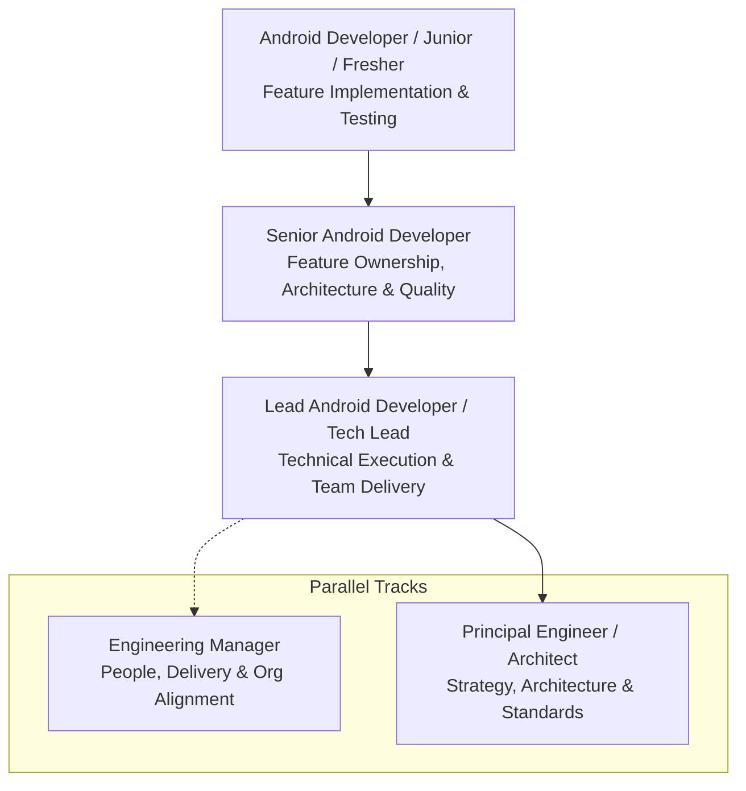
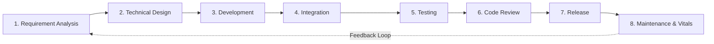

# 🎤 The Mobile Interview Vault & Engineering Career Framework
> **The Complete Handbook of Real-World Mobile Technical Ladders, Engineering Lifecycles, and Interview Systems**


---

## 🏛️ Industry Engineering Ladder & Android Developer Roles

In modern tech companies, Android developer roles and responsibilities vary significantly based on experience level, project complexity, and organizational structure. 

While entry-level engineers focus primarily on feature implementation and clean coding, senior and principal engineers drive architectural direction, cross-platform alignment, system performance, and technical mentoring.



---

### 1. Android Developer (Junior / Fresher / Mid-Level: 0–3 Years)
**Primary Focus:** Feature development, implementation, and code hygiene.

- **Feature Implementation:** Develop robust Android application features using Kotlin or Java.
- **Modern UI:** Implement reactive, responsive UI using XML ViewBinding or Jetpack Compose.
- **Network Integration:** Integrate RESTful APIs and handle responses using Retrofit, OkHttp, and Coroutines.
- **Architecture:** Follow MVVM (Model-View-ViewModel) and unidirectional data flow patterns.
- **Lifecycle Management:** Safely handle Activity and Fragment lifecycles, configuration changes (screen rotation), and process death.
- **Testing & Debugging:** Write unit tests using JUnit and MockK; debug runtime defects using Logcat, Android Studio Profiler, and breakpoints.
- **Collaboration & Review:** Resolve bugs, participate in pull request code reviews, and collaborate with designers, backend engineers, and QA teams.

👉 **Interview Guide:** [Ultimate L1 Beginner & Fresher Android Guide (0–3 Years)](./03_L1_Android_Developer_Guide.md)

---

### 2. Senior Android Developer (3–6+ Years)
**Primary Focus:** Feature ownership, technical quality, and architectural integrity.

- **Complex Feature Design:** Design and implement complex, fault-tolerant Android subsystems.
- **Modular Clean Architecture:** Define multi-module architecture (`:core`, `:feature`, `:data`) applying SOLID principles and Clean Architecture.
- **Performance & Vitals:** Optimize application startup time (App Startup library), memory allocations, rendering frame rates (60/120 FPS), and battery impact.
- **Asynchronous Concurrency:** Architect asynchronous workflows using Kotlin Coroutines, Channels, and reactive StateFlow/SharedFlow.
- **Dependency Injection:** Design scalable DI graphs using Hilt or Dagger.
- **Code Quality & Mentorship:** Review code for architectural adherence, enforce lint rules and best practices, and mentor junior developers.
- **End-to-End Ownership:** Own features from technical design through staging, A/B testing, and production deployment.

👉 **Senior Suite:** [Senior Android Engineer Interview Suite (Ascendion)](./service-based/Ascendion/Senior_Android_Interview_Suite.md)  
👉 **Live PR Review:** [45-Minute Live Code Review & Debugging Challenge](./service-based/Ascendion/Coding_Challenge_and_Review.md)

---

### 3. Lead Android Developer / Tech Lead (6–9+ Years)
**Primary Focus:** Technical leadership, delivery governance, and team enablement.

- **Technical Direction:** Define the technical roadmap, framework upgrades, and coding standards for the Android team.
- **Work Breakdown:** Translate product specifications and user stories into structured, estimated technical tasks.
- **Execution & Coordination:** Assign work, coordinate day-to-day sprint development activities, and remove technical blockers.
- **Cross-Team Governance:** Coordinate contracts with Backend (REST/GraphQL/gRPC), QA, DevOps, and Product teams.
- **Risk Management:** Identify technical debt, third-party dependency vulnerabilities, and system delivery bottlenecks early.
- **Release Readiness:** Supervise staged rollouts, Play Store compliance, and crash-free session stability targets (99.9%+).
- **People Growth:** Coach developers, conduct internal technical workshops, and support team members' technical career trajectories.

---

### 4. Principal Android Engineer / Mobile Architect (10+ Years)
**Primary Focus:** Engineering strategy, global architecture, and cross-organizational excellence.

| Responsibility Area | Typical Engineering Activities |
| :--- | :--- |
| **Architecture** | Define scalable, modular, multi-repo or monorepo Android architectures with decoupled feature contracts. |
| **Technical Strategy** | Establish long-term multi-year engineering roadmaps and cross-platform strategies (Compose Multiplatform, KMP). |
| **Design Decisions** | Evaluate and benchmark libraries, design system frameworks, compile-time tools, and architectural trade-offs. |
| **Code Quality Standards** | Establish unified engineering guidelines, custom Detekt/Ktlint rules, and automated CI quality gates. |
| **Performance & Vitals** | Lead initiatives to slash cold start latency, optimize DEX byte-code, baseline profiles, and eliminate jank/ANRs. |
| **Platform Expertise** | Guide organization-wide adoption of Jetpack Compose, Kotlin language releases, and modern Android OS changes. |
| **Technical Leadership** | Drive complex cross-team technical initiatives across mobile, backend, platform infrastructure, and security. |
| **Mentorship** | Coach senior engineers and tech leads; cultivate an elite engineering culture of technical rigor. |
| **Risk Management** | Audit architectural vulnerabilities, SDK licensing liabilities, and platform deprecation roadmaps. |
| **Innovation & R&D** | Prototype emerging technologies (On-Device AI/SLMs, WebAssembly, CRDT offline-first synchronization). |
| **Production Ownership** | Own global mobile vitals, crash-free user rates, production observability, and incident post-mortems. |

---

## 🔄 The Complete Android Engineering Lifecycle

Regardless of designation, professional Android engineers operate across this end-to-end engineering lifecycle:



1. **Requirement Analysis:** Understand business objectives, user stories, edge cases, acceptance criteria, and third-party dependencies.
2. **Technical Design:** Draft Architecture Decision Records (ADRs), UI component hierarchies, API schemas, caching mechanisms, and data flows.
3. **Development:** Implement features with idiomatic Kotlin, Jetpack Compose / ViewBinding, Android SDK, and modular Clean Architecture.
4. **Integration:** Integrate backend REST/gRPC endpoints, OAuth/Biometric authentication, analytics event pipelines, and remote config.
5. **Testing:** Write Unit Tests (JUnit, MockK), UI Tests (Compose UI Test, Espresso), Integration Tests, and automated regression checks.
6. **Code Review:** Scrutinize pull requests for maintainability, memory leaks, security flaws, UI thread bottlenecks, and test coverage.
7. **Release:** Manage Gradle build variants, Keystore signing, ProGuard/R8 obfuscation, CI/CD pipelines, and Google Play Console staged rollouts.
8. **Maintenance & Vitals:** Monitor Firebase Crashlytics, Android Vitals (ANRs, slow rendering frames, frozen frames), and address technical debt.

---

## 🏢 Corporate Team Structure & Reporting Hierarchy

In high-performing software organizations, engineering leadership operates along two parallel, equally valued tracks:

```text
                  ┌───────────────────────────────┐
                  │      Engineering Director     │
                  └───────────────┬───────────────┘
                                  │
         ┌────────────────────────┴────────────────────────┐
         ▼                                                 ▼
┌───────────────────────────────┐         ┌───────────────────────────────┐
│     Engineering Manager       │         │  Principal Engineer / Arch    │
│  (People, Delivery, Org)      │◄───────►│  (Architecture, Tech Strategy)│
└───────────────┬───────────────┘         └───────────────┬───────────────┘
                │                                         │
                └─────────────────┬───────────────────────┘
                                  ▼
                   ┌─────────────────────────────┐
                   │    Android Tech Lead        │
                   └──────────────┬──────────────┘
                                  ▼
                   ┌─────────────────────────────┐
                   │   Senior Android Developer  │
                   └──────────────┬──────────────┘
                                  ▼
                   ┌─────────────────────────────┐
                   │  Android Developer (L1/Mid) │
                   └─────────────────────────────┘
```

> [!NOTE]
> **Parallel Track Dynamic:** Principal Engineers and Engineering Managers operate as collaborative partners. The EM focuses on people development, sprint delivery, hiring, and organizational priorities, while the Principal Engineer oversees system architecture, technical risk, and long-term technology roadmaps.

---

## 📚 Interview Vault Quick Directory

| Guide | Target Level | Focus Areas | Link |
| :--- | :--- | :--- | :--- |
| **L1 Beginner / Fresher Guide** | 0–3 Years | Kotlin essentials, Lifecycle, Compose basics, Coroutines, MVVM, Live Coding | **[View L1 Guide](./03_L1_Android_Developer_Guide.md)** |
| **Job Search & Application Strategy** | All Levels | LinkedIn hacks, Google X-Ray strings, Cold Outreach, ATS optimization | **[View Strategy Guide](./02_Job_Search_Strategy.md)** |
| **Senior Engineer Interview Suite** | 3–8 Years | Architecture, Memory Profiling, Concurrency, Compose internals, Scorecard | **[View Senior Suite](./service-based/Ascendion/Senior_Android_Interview_Suite.md)** |
| **Live PR Review & Code Challenge** | Senior / Lead | Debugging 6 anti-patterns, Debounced search, Coroutine leaks | **[View PR Challenge](./service-based/Ascendion/Coding_Challenge_and_Review.md)** |
| **Product-Based Question Bank** | All Levels | 145+ Product companies (Google, Meta, Uber, Amazon, Netflix, etc.) | **[Browse Product Bank](./product-based/README.md)** |
| **Service-Based Question Bank** | All Levels | 45+ Consulting firms (Ascendion, EPAM, Thoughtworks, TCS, etc.) | **[Browse Service Bank](./service-based/README.md)** |
