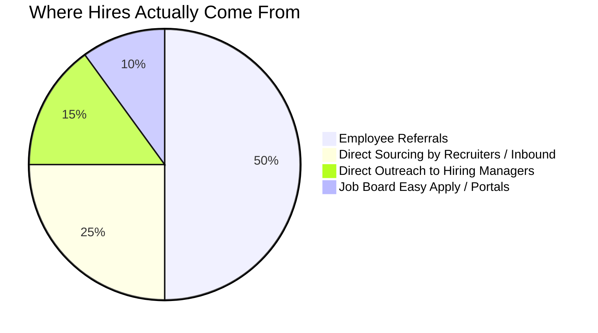
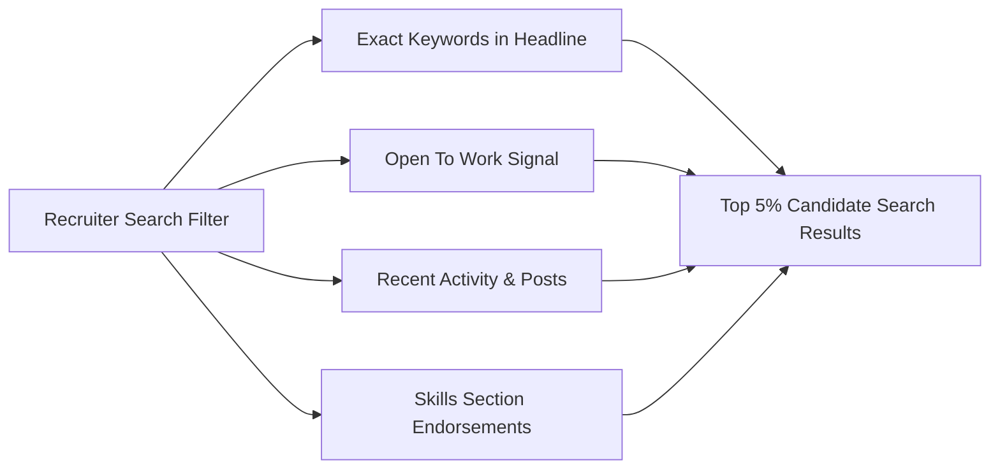
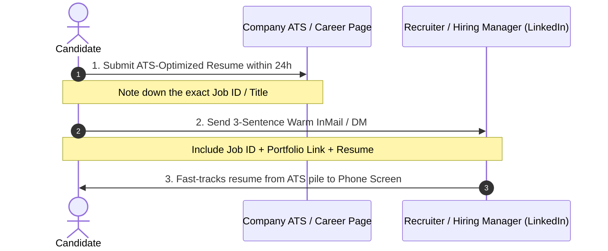

# 🕵️‍♂️ The Ultimate Mobile Developer Job Search & Application Playbook
> **A Battle-Tested Guide to LinkedIn Hacking, Google X-Ray Search, ATS Optimization, Platform Strategies, and High-Conversion Cold Outreach**


---

## 📖 Table of Contents
- [1. The 3-Tier Job Hunt Architecture](#1-the-3-tier-job-hunt-architecture)
- [2. LinkedIn Masterclass: Profile Optimization & Algorithm Hacking](#2-linkedin-masterclass-profile-optimization--algorithm-hacking)
- [3. LinkedIn Job Search & Advanced Boolean Queries](#3-linkedin-job-search--advanced-boolean-queries)
- [4. Cold Outreach & Direct Messaging Scripts](#4-cold-outreach--direct-messaging-scripts)
- [5. Platform-by-Platform Tactical Playbooks](#5-platform-by-platform-tactical-playbooks)
  - [Naukri.com (India & Middle East)](#naukri-profile-freshness-algorithm)
  - [Wellfound (AngelList) & YC Work at a Startup](#wellfound-angellist--yc-startups)
  - [Instahyre, Cutshort & Otta](#instahyre-cutshort--otta)
- [6. Google "X-Ray" Search (Bypassing Gatekeepers)](#6-google-x-ray-search-bypassing-gatekeepers)
- [7. How to Apply: The "Dual-Pincer" Application Method](#7-how-to-apply-the-dual-pincer-application-method)
- [8. ATS Resume Engineering for Mobile Developers](#8-ats-resume-engineering-for-mobile-developers)
- [9. The Job Search Operating System (Rule of 100 Tracker)](#9-the-job-search-operating-system-rule-of-100-tracker)

---

## 1. The 3-Tier Job Hunt Architecture

Most job seekers spend 90% of their energy clicking "Easy Apply" on LinkedIn and wonder why they receive generic rejections. Understand how hiring actually works:



| Tier | Channel | Conversion Rate | Candidate Effort |
| :--- | :--- | :--- | :--- |
| **Tier 1: High Intent** | Direct Employee Referrals & Hiring Manager outreach | **25% – 40%** interview rate | High (Targeted messages, custom portfolios) |
| **Tier 2: Medium Intent** | Company career page within 24 hours of posting + Recruiter DM | **10% – 15%** interview rate | Medium (Resume alignment + tailored pitch) |
| **Tier 3: Low Intent** | LinkedIn "Easy Apply" with 500+ applicants | **< 2%** interview rate | Low (1-click spray & pray) |

> [!IMPORTANT]
> **The Golden Rule:** Shift 80% of your daily job search time to **Tier 1 & Tier 2**. Spend no more than 20% on public job board submissions.

---

## 2. LinkedIn Masterclass: Profile Optimization & Algorithm Hacking

Recruiters use **LinkedIn Recruiter**, an enterprise tool with strict algorithmic filters. If your profile lacks exact keywords or recent activity signals, you simply do not appear in search results.



### 1. Headline Formula (Your Billboard)
❌ **Generic / Weak:**  
- "Aspiring Android Developer | Computer Science Graduate"  
- "Looking for Android Developer opportunities"  
- "Student at XYZ College"  

✅ **High-Impact / Keyword-Dense:**  
- **Entry-Level / Fresher (0–1 yr):**  
  `Android Developer | Kotlin • Jetpack Compose • Coroutines • MVVM • Room | Built & Shipped 2 Apps on Google Play`
- **Junior to Mid-Level (1–3 yrs):**  
  `Android Engineer @ [Company] | Kotlin • Jetpack Compose • Clean Architecture • Flow • Retrofit | 99.8% Crash-Free Apps`
- **Experienced (3–5+ yrs):**  
  `Senior Android Engineer | Kotlin • Jetpack Compose • Modularization • Hilt • CI/CD | High-Scale Apps (1M+ MAU)`

---

### 2. About Section (The 4-Part Story Framework)
Structure your summary into 4 concise paragraphs:
1. **The Hook:** Who you are and what you build (`"Android engineer passionate about crafting responsive, fluid mobile experiences using Kotlin and Jetpack Compose."`).
2. **Core Technical Stack:** A cleanly bulleted matrix:
   - **Languages:** Kotlin, Java
   - **Modern Android:** Jetpack Compose, Coroutines, Flow, StateFlow, ViewModel, Room, Navigation, WorkManager
   - **Architecture & DI:** MVVM, Clean Architecture, Repository Pattern, Hilt / Koin
   - **Networking & Tools:** Retrofit, OkHttp, Moshi/Gson, Git, Android Studio Profiler, JUnit, MockK
3. **Tangible Achievements & Apps:** Mention links to your live Google Play Store apps or active GitHub repositories with star counts.
4. **Call to Action (CTA):** State your availability and email: `"Currently open to Android Developer roles (Full-time / Remote / Hybrid). Reach me directly at your.email@example.com"`.

---

### 3. Featured Section (Visual Proof of Work)
Do not leave your Featured section empty. Pin:
- **Direct Google Play Store Links:** Live apps that anyone can install and test.
- **Top 2 GitHub Repositories:** Ensure your GitHub READMEs feature animated GIFs/screenshots of the running app, architectural diagrams, and clean code.
- **Technical Articles / Breakdown:** Even a short LinkedIn post analyzing a Compose performance trap or Coroutine optimization demonstrates depth.

---

### 4. Experience Section: The Google "XYZ" Formula
Recruiters do not read job duties; they evaluate **business impact and technical ownership**.

Format every bullet using:  
**"Accomplished [X], as measured by [Y], by doing [Z]"**

- ❌ "Worked on login screen and integrated APIs."
- ✅ "Architected modern authentication flow using Jetpack Compose and Retrofit, decreasing onboarding drop-off by 14% across 50K+ monthly active users."
- ❌ "Fixed bugs in the app."
- ✅ "Resolved memory leaks and background ANRs using Android Studio Profiler and LeakCanary, boosting crash-free user rate from 98.2% to 99.7%."
- ❌ "Used Room database for offline data."
- ✅ "Implemented offline-first repository with Room and Coroutine Flow, enabling full offline access and reducing redundant network payload calls by 40%."

---

### 5. Open To Work Settings
- **Recruiters Only (Recommended if currently employed):** Only people using LinkedIn Recruiter can see your badge. Current colleagues at your existing company are hidden by LinkedIn.
- **All LinkedIn Members (Green Banner - Recommended for freshers/laid-off):** Increases profile views by up to **40%**. Choose the target titles: `Android Developer`, `Mobile Application Developer`, `Software Engineer - Android`.

---

## 3. LinkedIn Job Search & Advanced Boolean Queries

Stop scrolling the default infinite feed. Use precise boolean queries to filter out recruiter spam and locate direct hiring posts.

### 1. Find Direct Posts from Hiring Managers
Paste these into LinkedIn's top search bar (select **"Posts"** tab):

```text
"hiring" AND ("Android Developer" OR "Android Engineer") AND ("remote" OR "hybrid") AND ("team" OR "DM me")
```

```text
"we are looking for" AND "Android" AND ("Junior" OR "Associate" OR "Fresher") AND ("resume" OR "apply")
```

```text
"my team is hiring" AND ("mobile developer" OR "Android") AND "Kotlin"
```

### 2. Time-Based Filtering (The First-Hour Advantage)
1. In the LinkedIn Jobs search tab, search: `Android Developer`.
2. Set **Date Posted** filter to: **Past 24 hours** (or **Past week** on Mondays).
3. Set **Number of Applicants** filter to: **Under 10 applicants**.
4. Identify the **"Job Poster"** listed at the top-right of the listing. Instead of only applying, send a targeted message directly to that person.

---

## 4. Cold Outreach & Direct Messaging Scripts

Sending a generic connection request with no note has an acceptance rate below 15%. A tailored 250-character note jumps to **60%+**.

### Script 1: Entry-Level / Fresher Reaching out to an Engineering Manager
*Subject: Passionate Android Dev / Quick question regarding [Team Name]*

> "Hi [Name], loved your recent post on [Topic/Feature at Company].  
> I am an entry-level Android developer specializing in Kotlin & Jetpack Compose. I recently built [App Name - link], an offline-first app utilizing Room and Coroutines.  
> I noticed an opening on your mobile team. Would love to send my resume and a 2-minute video walkthrough if you are open to reviewing it. Thank you!"

---

### Script 2: Junior/Mid-Level Reaching out to a Talent Acquisition Recruiter
*Subject: Application for Android Engineer role [Job ID / Link]*

> "Hi [Name], I noticed you are leading talent acquisition for the Android Developer opening at [Company].  
> With [X] years of experience shipping production Kotlin apps and driving 99.8% crash-free sessions with Compose & MVVM, my background directly matches your requirements.  
> I have officially submitted my application via the portal (Ref: [ID]). Attached is my 1-page resume for quick review. Open to a 5-minute screening call this week."

---

### Script 3: Asking a Peer Engineer for a Referral (The "Low-Friction" Referral)
Never ask: *"Can you refer me?"* (creates work for them).  
Instead, **do all the work for them:**

> "Hi [Name], huge fan of the mobile engineering work your team is doing at [Company].  
> I am applying for the Android Engineer position (Job ID: #12345). I know referrals save the team recruiting time.  
> To make it effortless for you, here is a 2-sentence summary of my fit, a link to the job, and my resume:  
> - **Stack:** 2 years Kotlin, Jetpack Compose, Coroutines, MVVM, Room  
> - **Impact:** Reduced network latency by 35% in previous e-commerce app  
> - **Job Link:** [URL]  
> If you are comfortable referring me via your internal portal, I would be immensely grateful!"

---

### Script 4: The "Value-Add" Trojan Horse (Highest Response Rate)
Download their app from the Play Store. Find a noticeable bug, UI misalignment, or missing feature.

> "Hi [Name], I installed [Company App] and noticed that rotating the checkout screen triggers an activity recreation that wipes the input form state (likely missing `rememberSaveable` or `ViewModel` state hoisting).  
> I drafted a quick 10-line code snippet showing how to resolve this state preservation issue cleanly.  
> I love the product and would love to bring this level of attention to detail to your Android team. Are you currently hiring for mobile?"

---

### The Follow-Up Protocol
- **Day 1:** Send initial connection note / message.
- **Day 4 (72 Hours Later - Polite Nudge):**  
  *"Hi [Name], following up briefly on this in case it got buried in your inbox. Hope you have a productive week ahead!"*
- **Day 8 (Final Check-in):**  
  *"Hi [Name], understand you are busy with sprint deliveries. I will assume the role is currently filled. Appreciate your time and looking forward to staying connected on mobile updates!"*

---

## 5. Platform-by-Platform Tactical Playbooks

### Naukri (Profile Freshness Algorithm)
Naukri is the primary recruiter engine in India and Southeast Asia. Recruiters use candidate search filters that rank results strictly by **"Last Active Date"**.

1. **The Daily 9:00 AM Freshness Hack:**  
   Log in to Naukri every morning at 9:00 AM. Edit your Profile Summary (add a space or comma) and click **Save**. Your profile instantly gets marked as **"Updated Today"**, placing you on Page 1 of recruiter searches.
2. **Resume Headline Optimization:**  
   Include all primary keywords:  
   `Android Developer | Kotlin | Jetpack Compose | MVVM | Coroutines | Flow | Room | Retrofit | Dagger Hilt | Unit Testing | 0-3 Yrs Exp`
3. **Key Skills Matrix:**  
   Ensure you add all related skill tags: `Android SDK`, `Kotlin`, `Jetpack Compose`, `REST API`, `Git`, `Java`, `SQLite`, `RxJava/Coroutines`.

---

### Wellfound (AngelList) & YC Startups
Startups move fast and value raw builders over corporate credentials.

1. **Write a Custom Pitch for Every Application:**  
   Never submit default text. Address:
   - Why you love their specific product.
   - What you built previously that proves you can build their feature.
   - A link to your APK or GitHub demo.
2. **Ping the Founder Directly:**  
   Find the CEO, CTO, or Head of Mobile on LinkedIn / Twitter(X). Send:  
   *"Just applied via Wellfound for the Android role. Built a similar feature in Kotlin/Compose here: [GitHub link]. Looking forward to speaking!"*

---

### Instahyre, Cutshort & Otta
- **Instahyre:** Passive AI matching. Complete your profile to 100%, upload an ATS-friendly single-column PDF, and set expected CTC realistically.
- **Cutshort:** Complete the Android skill badge verification tests. Profiles with verified badges receive 3x more recruiter inbounds.
- **Otta / Wellfound Remote:** Best for US/EU remote mobile engineering roles. Emphasize asynchronous communication, Git discipline, and automated testing.

---

## 6. Google "X-Ray" Search (Bypassing Gatekeepers)

Google indexes millions of career pages and LinkedIn profiles that are hidden behind paywalled job boards. Use these exact search queries:

### 1. Find Active Android Hiring Posts on LinkedIn
```text
site:linkedin.com/posts "hiring" AND ("Android developer" OR "Android engineer") AND ("send resume" OR "DM me" OR "email")
```

### 2. Search Unlisted Startup Jobs on Top ATS Platforms
Companies often publish jobs on their ATS weeks before posting to LinkedIn:
- **Greenhouse:**
  ```text
  site:boards.greenhouse.io ("Android Engineer" OR "Android Developer") AND ("Kotlin" OR "Compose")
  ```
- **Lever:**
  ```text
  site:jobs.lever.co ("Android Developer" OR "Mobile Engineer") AND "Kotlin"
  ```
- **Ashby:**
  ```text
  site:jobs.ashbyhq.com ("Android Engineer")
  ```
- **Workable:**
  ```text
  site:apply.workable.com "Android Developer"
  ```

### 3. Find Mobile Hiring Managers
```text
site:linkedin.com/in ("Engineering Manager" OR "Mobile Lead" OR "Head of Mobile") AND "Android" AND "Hiring" AND "Bangalore"
```

---

## 7. How to Apply: The "Dual-Pincer" Application Method

Never rely solely on a portal submission. Execute this synchronized 2-step process:



1. **Step 1: Direct Portal Submission:** Apply directly on the company's official career page (`company.com/careers` or Greenhouse/Lever link). This generates an official Candidate ID in their database.
2. **Step 2: Immediate Recruiter Outreach (Within 1 Hour):** Locate the company's Technical Recruiter or Engineering Manager on LinkedIn. Send Script #2 referencing your Candidate ID.  
3. **The Result:** The recruiter pulls your resume directly from the ATS queue of 500 applicants and places it on top of the interview review pile.

---

## 8. ATS Resume Engineering for Mobile Developers

Applicant Tracking Systems (Workday, Greenhouse, Taleo) do not read graphic designs, side columns, icons, or progress bars.

```mermaid
graph TD
    subgraph Bad Practices (Fails ATS)
        B1[Two-Column Layouts]
        B2[Skill Rating Bars 4/5 Stars]
        B3[Icons & Tables]
        B4[Exported as JPG / Image]
    end

    subgraph ATS-Compliant Best Practices
        G1[Clean Single-Column Layout]
        G2[Standard Headings: Experience, Projects, Skills]
        G3[Clear Bullet Points with Metrics]
        G4[Standard Text-Parsable PDF]
    end
```

### ATS Formatting Rules:
1. **Single-Column Only:** Multi-column layouts scramble text when parsed into ATS databases.
2. **Standard Headings:** Use `Technical Skills`, `Work Experience`, `Projects`, `Education`, and `Certifications`.
3. **Keyword Alignment:** If the job description asks for `Jetpack Compose, MVVM, Coroutines, Room`, ensure those exact phrases appear in your `Skills` and `Work Experience` sections.
4. **Hyperlinks:** Ensure your GitHub and Play Store links are clickable, clean URLs.
5. **Length:**  
   - 0–3 Years: Strictly **1 page**.  
   - 4–8+ Years: Maximum **2 pages**.

---

## 9. The Job Search Operating System (Rule of 100 Tracker)

Job hunting is a mathematical conversion funnel. When you track metrics daily, you eliminate anxiety and diagnose bottlenecks objectively.

### Weekly Target Funnel (The Rule of 100):

| Stage | Weekly Target | Conversion Diagnosis |
| :--- | :--- | :--- |
| **Targeted Applications** | 30 – 40 | If 0 replies after 50 applications $\to$ **Fix Resume ATS formatting & keywords.** |
| **Personalized Cold DMs** | 20 – 30 | If connection rate < 20% $\to$ **Revamp Headline and personalized intro note.** |
| **Referral Inquiries** | 5 – 10 | If referrals decline $\to$ **Showcase live APK demos or GitHub projects.** |
| **Recruiter Phone Screens** | 3 – 5 | If screens don't turn into tech rounds $\to$ **Practice 2-min intro pitch & communication.** |
| **Technical Interviews** | 2 – 3 | If failing technical rounds $\to$ **Review [L1 Guide](./03_L1_Android_Developer_Guide.md) and live coding.** |

### Job Application CRM Template
Maintain this tracker in Notion or Google Sheets:

| Company | Role & Job ID | Applied Date | Channel (Referral / DM / Portal) | Point of Contact | Status | Follow-Up Date |
| :--- | :--- | :--- | :--- | :--- | :--- | :--- |
| **Zomato** | Android Dev (#4021) | Oct 02 | LinkedIn DM to Mobile Lead | Rahul S. (EM) | Screening Done | Oct 06 |
| **Swiggy** | SDE-1 Mobile | Oct 03 | Referral via College Senior | Priya M. (Senior Dev) | Applied | Oct 07 |
| **CRED** | Android Engineer | Oct 04 | Career Portal + Recruiter DM | Ankit V. (Recruiter) | Awaiting Reply| Oct 08 |

---

> [!TIP]
> **Daily Routine for Maximum Results:**
> - **09:00 AM:** Refresh Naukri profile & check LinkedIn jobs posted in the "Past 24 hours".
> - **10:00 AM:** Apply to top 5 matching roles using the Dual-Pincer method.
> - **11:30 AM:** Send 5 personalized connection requests to Engineering Managers.
> - **02:00 PM:** Dedicate 2 hours to Kotlin & Jetpack Compose practice via the [L1 Interview Guide](./03_L1_Android_Developer_Guide.md).
> - **05:00 PM:** Follow up on pending DMs from 3 days ago.
