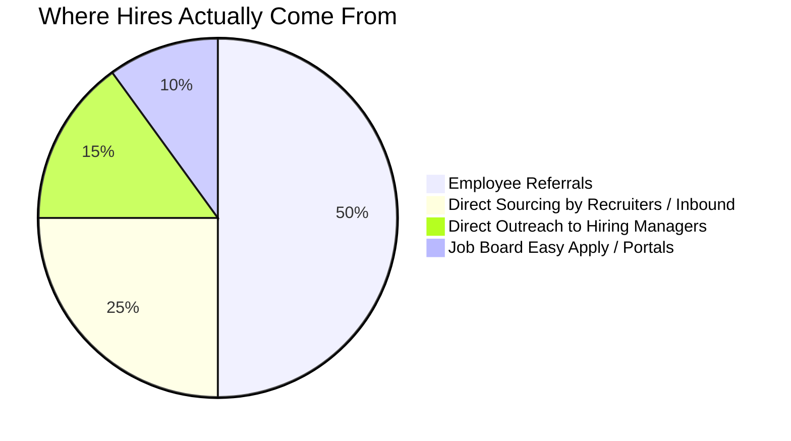
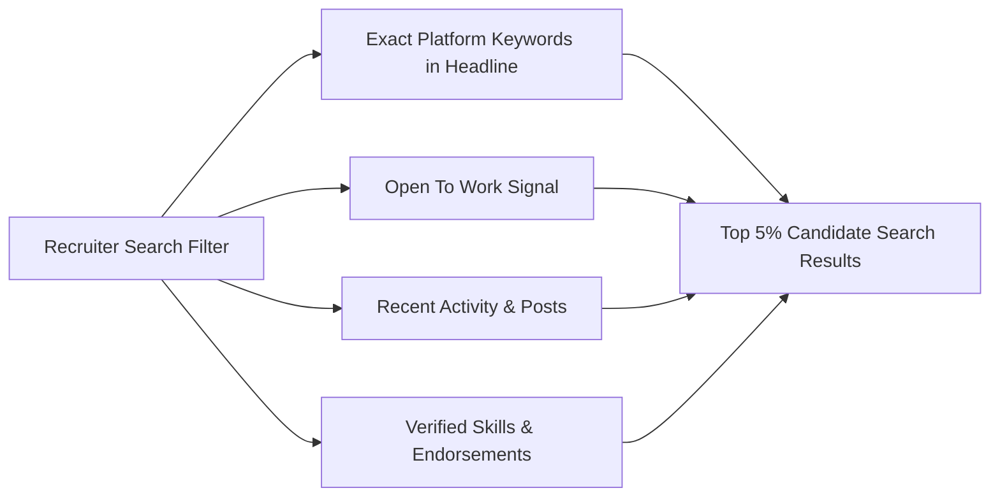
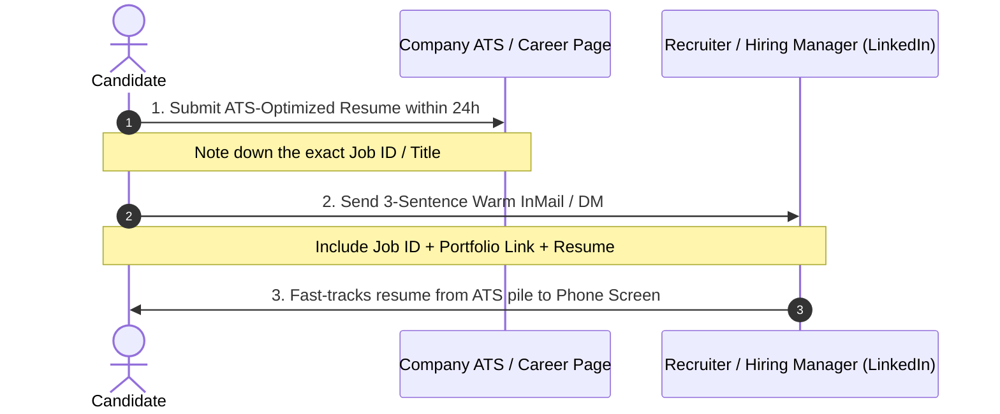

# 🕵️‍♂️ The Ultimate Multi-Platform Mobile Developer Job Search & Application Playbook
> **A Battle-Tested Guide to LinkedIn Hacking, Advanced Boolean Queries, Google X-Ray Search, ATS Optimization, Platform Strategies, and High-Conversion Cold Outreach across Android, iOS, Flutter, and React Native**


---

## 📖 Table of Contents
- [1. The 3-Tier Job Hunt Architecture](#1-the-3-tier-job-hunt-architecture)
- [2. Multi-Platform LinkedIn Profile Optimization (Android, iOS, Flutter, React Native)](#2-multi-platform-linkedin-profile-optimization)
- [3. Advanced Boolean Search Queries for All Mobile Platforms](#3-advanced-boolean-search-queries-for-all-mobile-platforms)
  - [Android Boolean Search Strings](#android-boolean-search-strings)
  - [iOS Boolean Search Strings](#ios-boolean-search-strings)
  - [Flutter Boolean Search Strings](#flutter-boolean-search-strings)
  - [React Native Boolean Search Strings](#react-native-boolean-search-strings)
  - [Mobile Lead & Cross-Platform Boolean Queries](#mobile-lead--cross-platform-boolean-queries)
- [4. Platform-Specific Cold Outreach & Direct Messaging Scripts](#4-platform-specific-cold-outreach--direct-messaging-scripts)
- [5. Platform-by-Platform Tactical Playbooks (Naukri, Wellfound, Otta, Instahyre)](#5-platform-by-platform-tactical-playbooks)
- [6. Google "X-Ray" Search Cheat Sheet for All Platforms](#6-google-x-ray-search-cheat-sheet-for-all-platforms)
- [7. How to Apply: The "Dual-Pincer" Application Method](#7-how-to-apply-the-dual-pincer-application-method)
- [8. ATS Resume Engineering for Mobile Engineers](#8-ats-resume-engineering-for-mobile-engineers)
- [9. The Job Search Operating System (Rule of 100 Tracker)](#9-the-job-search-operating-system-rule-of-100-tracker)

---

## 1. The 3-Tier Job Hunt Architecture

Most mobile job seekers spend 90% of their energy clicking "Easy Apply" on LinkedIn and wonder why they receive automated rejections. Understand how tech hiring actually works:



| Tier | Channel | Conversion Rate | Candidate Effort |
| :--- | :--- | :--- | :--- |
| **Tier 1: High Intent** | Direct Employee Referrals & Hiring Manager outreach | **25% – 40%** interview rate | High (Targeted messages, custom portfolios) |
| **Tier 2: Medium Intent** | Company career page within 24 hours of posting + Recruiter DM | **10% – 15%** interview rate | Medium (Resume alignment + tailored pitch) |
| **Tier 3: Low Intent** | LinkedIn "Easy Apply" with 500+ applicants | **< 2%** interview rate | Low (1-click spray & pray) |

> [!IMPORTANT]
> **The Golden Rule:** Shift 80% of your daily job search time to **Tier 1 & Tier 2**. Spend no more than 20% on public job board submissions.

---

## 2. Multi-Platform LinkedIn Profile Optimization

Recruiters use **LinkedIn Recruiter**, an enterprise tool with strict algorithmic filters. If your headline and profile lack exact platform keywords or recent activity signals, you will not appear on page 1 of recruiter searches.



### High-Impact Headline Formulas by Platform:

#### 🤖 Android Headlines
- **Fresher (0–1 yr):**  
  `Android Developer | Kotlin • Jetpack Compose • Coroutines • MVVM • Room | Shipped 2 Apps on Google Play`
- **Junior / Mid-Level (1–3 yrs):**  
  `Android Engineer @ [Company] | Kotlin • Jetpack Compose • Clean Architecture • Flow • Retrofit | 99.8% Crash-Free Rate`
- **Senior (3–6+ yrs):**  
  `Senior Android Engineer | Kotlin • Compose • Modularization • Hilt • Performance Vitals | Apps with 1M+ MAU`

#### 🍏 iOS Headlines
- **Fresher (0–1 yr):**  
  `iOS Developer | Swift • SwiftUI • Combine • MVVM • SwiftData | Shipped 2 Apps on Apple App Store`
- **Junior / Mid-Level (1–3 yrs):**  
  `iOS Engineer @ [Company] | Swift • SwiftUI • UIKit • Concurrency (async/await) • CoreData | Test-Driven XCTest`
- **Senior (3–6+ yrs):**  
  `Senior iOS Engineer | Swift • SwiftUI • Modular Architecture • SPM • Instruments Profiling | 500K+ Active Users`

#### 💙 Flutter Headlines
- **Fresher (0–1 yr):**  
  `Flutter Developer | Dart • Flutter • BLoC / Riverpod • Clean Architecture • REST APIs | Dual Stores (Play Store & App Store)`
- **Junior / Mid-Level (1–3 yrs):**  
  `Mobile Engineer (Flutter) @ [Company] | Dart • BLoC • Dio • MethodChannels • Firebase | Offline-First Architecture`
- **Senior (3–6+ yrs):**  
  `Senior Flutter Engineer | Dart • Multi-Engine Flutter • Custom Platform Channels • CI/CD Fastlane | High-Scale Production Apps`

#### ⚛️ React Native Headlines
- **Fresher (0–1 yr):**  
  `React Native Developer | TypeScript • React Native • Expo • Redux Toolkit • React Navigation | Shipped Dual-Platform Apps`
- **Junior / Mid-Level (1–3 yrs):**  
  `React Native Engineer @ [Company] | TypeScript • Expo EAS • Zustand • Reanimated 3 • Native Bridges | 60 FPS Fluid UI`
- **Senior (3–6+ yrs):**  
  `Senior Mobile Engineer (React Native) | TypeScript • New Architecture (TurboModules / Fabric) • Hermès • JSI | 2M+ Downloads`

---

## 3. Advanced Boolean Search Queries for All Mobile Platforms

Stop scrolling the default algorithm feed. Paste these precise Boolean strings into LinkedIn's top search bar (filter by **"Posts"** tab for live hiring updates):

### Android Boolean Search Strings
```text
"hiring" AND ("Android Developer" OR "Android Engineer" OR "Mobile Developer") AND ("Kotlin" OR "Compose") AND ("remote" OR "hybrid" OR "Bangalore" OR "Hyderabad" OR "Pune" OR "Noida") AND ("send resume" OR "DM me" OR "apply")
```

```text
("we are looking for" OR "my team is hiring") AND ("Android" OR "Kotlin") AND ("Junior" OR "Associate" OR "Fresher" OR "0-2 years")
```

---

### iOS Boolean Search Strings
```text
"hiring" AND ("iOS Developer" OR "iOS Engineer" OR "Apple Developer" OR "Swift Developer") AND ("Swift" OR "SwiftUI") AND ("remote" OR "hybrid" OR "London" OR "Bangalore" OR "USA") AND ("email" OR "DM me" OR "apply")
```

```text
("looking for" OR "team is expanding") AND ("iOS Engineer" OR "iOS Developer") AND ("SwiftUI" OR "UIKit") AND ("Junior" OR "Mid-level" OR "Associate")
```

---

### Flutter Boolean Search Strings
```text
"hiring" AND ("Flutter Developer" OR "Flutter Engineer" OR "Dart Developer") AND ("BLoC" OR "Riverpod" OR "Provider") AND ("remote" OR "hybrid") AND ("send CV" OR "DM" OR "apply")
```

```text
("we are hiring" OR "looking for") AND "Flutter" AND ("Junior" OR "Fresher" OR "0-1 year" OR "1-3 years") AND ("App Store" OR "Play Store")
```

---

### React Native Boolean Search Strings
```text
"hiring" AND ("React Native Developer" OR "React Native Engineer" OR "Mobile App Developer") AND ("TypeScript" OR "Expo") AND ("remote" OR "hybrid") AND ("send resume" OR "reach out")
```

```text
("team is hiring" OR "immediate joiner") AND "React Native" AND ("TypeScript" OR "Redux" OR "Zustand") AND ("Junior" OR "Fresher" OR "Associate")
```

---

### Mobile Lead & Cross-Platform Boolean Queries
```text
"hiring" AND ("Mobile Engineering Manager" OR "Mobile Tech Lead" OR "Staff Mobile Engineer" OR "Mobile Architect") AND ("Android" OR "iOS" OR "Flutter" OR "React Native") AND ("leadership" OR "architecture")
```

---

## 4. Platform-Specific Cold Outreach & Direct Messaging Scripts

Sending a blank connection request has a response rate under 15%. A tailored 250-character note jumps to **60%+**.

### Script 1: Fresher / Entry-Level Reaching Out to an Engineering Manager
*Use for: Android, iOS, Flutter, or React Native freshers.*

> "Hi [Name], loved your recent post on [Mobile Architecture / Tech topic].  
> I am an entry-level [Android / iOS / Flutter] engineer specializing in [Kotlin & Compose / Swift & SwiftUI / Dart & BLoC]. I recently built [App Name - live store link], an offline-first app utilizing [Room / SwiftData / Hive] and modern concurrency.  
> I noticed an opening on your mobile team. Would love to send my 1-page resume and a 2-min demo if you are open to reviewing it. Thank you!"

---

### Script 2: Junior/Mid-Level Reaching Out to a Technical Recruiter
*Subject: Application for [Platform] Engineer role [Job ID / Link]*

> "Hi [Name], I noticed you are leading talent acquisition for the [Android / iOS / React Native] Developer opening at [Company].  
> With [X] years of experience shipping production apps with [Kotlin / Swift / TypeScript] and driving 99.8% crash-free sessions with Clean Architecture, my background directly matches your requirements.  
> I have officially applied via the portal (Ref: [ID]). Attached is my resume for quick review. Open to a 5-minute screening call this week."

---

### Script 3: Asking a Peer Engineer for a Referral (The "Low-Friction" Referral)
Never ask: *"Can you refer me?"* (creates work for them).  
Instead, **provide a plug-and-play blurb:**

> "Hi [Name], huge fan of the mobile engineering work your team is doing at [Company].  
> I am applying for the [Platform] Engineer position (Job ID: #[ID]). I know internal referrals save the engineering team recruiting time.  
> To make it effortless for you, here is a 2-sentence summary of my fit, a link to the job, and my resume:  
> - **Stack:** [X] years [Kotlin & Compose / Swift & SwiftUI / React Native & TypeScript]  
> - **Impact:** Reduced network latency by 35% and increased app startup speed in previous app  
> - **Job Link:** [URL]  
> If you are comfortable referring me via your internal portal, I would be immensely grateful!"

---

### Script 4: The "Value-Add" Trojan Horse (Highest Response Rate Across All Platforms)
Install their app on your phone. Find a reproducible bug, layout glitch, or performance stutter:

> "Hi [Name], I installed [Company App] and noticed that rotating the screen on the checkout page resets the form state (on Android: missing `rememberSaveable` / on iOS: view re-instantiation without `@StateObject` / `@Observable`).  
> I drafted a quick 10-line code snippet showing how to resolve this state preservation issue cleanly.  
> I love what you are building and would love to bring this level of attention to detail to your mobile team. Are you currently hiring for mobile?"

---

## 5. Platform-by-Platform Tactical Playbooks

### 1. Naukri.com (India & Middle East)
Recruiters sort candidates by **"Last Active Date"**. If your profile was updated 2 weeks ago, you are buried on page 10.

- **The Daily 9:00 AM Freshness Hack:**  
  Log in to Naukri every morning at 9:00 AM. Edit your Profile Summary (add a dot or space) and click **Save**. Your profile immediately displays **"Updated Today"**, placing you at the top of recruiter searches.
- **Platform-Specific Headline Keywords:**  
  - *Android:* `Android Developer | Kotlin | Jetpack Compose | MVVM | Coroutines | Room | Retrofit | Hilt | 0-3 Yrs`  
  - *iOS:* `iOS Developer | Swift | SwiftUI | UIKit | Combine | async/await | CoreData | XCTest | 0-3 Yrs`  
  - *Flutter:* `Flutter Developer | Dart | BLoC | Riverpod | Clean Architecture | REST APIs | Android & iOS | 0-3 Yrs`  
  - *React Native:* `React Native Developer | TypeScript | Expo | Redux Toolkit | Zustand | Native Modules | 0-3 Yrs`

---

### 2. Wellfound (AngelList) & YC Work at a Startup
Startups prioritize raw builders who can ship features without hand-holding.
- **Custom Pitch Formula:** Always address why you love their specific product, what you built in the past that proves your capability, and a direct link to your APK or GitHub demo.
- **Founder Direct Outreach:** DM the CTO or founder directly on LinkedIn/Twitter:  
  *"Just applied via Wellfound for the mobile role. Built a similar feature in [Compose / SwiftUI / Flutter] here: [GitHub link]. Looking forward to speaking!"*

---

### 3. Instahyre, Cutshort & Otta
- **Instahyre:** Complete profile to 100%, upload a clean single-column PDF, and set realistic expected notice periods.
- **Cutshort:** Take and pass the mobile platform skill assessment tests (Android, iOS, or React Native). Verified badges trigger 3x more recruiter inbounds.
- **Otta / RemoteOK:** Best for international US/EU remote mobile engineering positions. Emphasize async communication, automated testing (XCTest / Compose Test), and CI/CD pipelines.

---

## 6. Google "X-Ray" Search Cheat Sheet for All Platforms

Google indexes millions of ATS portals that are hidden from regular job board searches. Use these exact queries:

### 1. Find Unlisted Startup Jobs on Greenhouse
```text
site:boards.greenhouse.io ("Android Engineer" OR "iOS Engineer" OR "Mobile Developer" OR "Flutter Developer")
```

### 2. Find Jobs on Lever
```text
site:jobs.lever.co ("Mobile Engineer" OR "Android Developer" OR "iOS Developer" OR "React Native Developer")
```

### 3. Find Jobs on Ashby (Fastest Growing Startup ATS)
```text
site:jobs.ashbyhq.com ("Mobile Engineer" OR "Android" OR "iOS" OR "Flutter")
```

### 4. Find Mobile Engineering Managers on LinkedIn
```text
site:linkedin.com/in ("Engineering Manager" OR "Mobile Lead" OR "Head of Mobile") AND ("Android" OR "iOS" OR "Flutter" OR "React Native") AND "Hiring" AND "Bangalore"
```

---

## 7. How to Apply: The "Dual-Pincer" Application Method

Never rely solely on a portal submission. Execute this synchronized 2-step process:



1. **Step 1: Direct Portal Submission:** Apply directly on the company's official career page (`company.com/careers` or Greenhouse/Lever link). This generates an official Candidate ID in their database.
2. **Step 2: Immediate Recruiter Outreach (Within 1 Hour):** Locate the company's Technical Recruiter or Engineering Manager on LinkedIn. Send Script #2 referencing your Candidate ID.  
3. **The Result:** The recruiter pulls your resume directly from the ATS queue of 500 applicants and places it on top of the interview review pile.

---

## 8. ATS Resume Engineering for Mobile Engineers

Applicant Tracking Systems (Workday, Greenhouse, Taleo) do not parse graphic designs, side columns, icons, or progress bars.

```mermaid
graph TD
    subgraph Bad Practices (Fails ATS)
        B1[Two-Column Layouts]
        B2[Skill Rating Bars 4/5 Stars]
        B3[Icons & Tables]
        B4[Exported as JPG / Image]
    end

    subgraph ATS-Compliant Best Practices
        G1[Clean Single-Column Layout]
        G2[Standard Headings: Experience, Projects, Skills]
        G3[Clear Bullet Points with Metrics]
        G4[Standard Text-Parsable PDF]
    end
```

### ATS Formatting Rules:
1. **Single-Column Only:** Multi-column layouts scramble text when parsed into ATS databases.
2. **Standard Headings:** Use `Technical Skills`, `Work Experience`, `Projects`, `Education`, and `Certifications`.
3. **Keyword Alignment:** If the job description asks for `Jetpack Compose, MVVM, Coroutines, Room`, ensure those exact phrases appear in your `Skills` and `Work Experience` sections.
4. **Hyperlinks:** Ensure your GitHub and Play Store / App Store links are clickable, clean URLs.
5. **Length:**  
   - 0–3 Years: Strictly **1 page**.  
   - 4–8+ Years: Maximum **2 pages**.

---

## 9. The Job Search Operating System (Rule of 100 Tracker)

Job hunting is a mathematical conversion funnel. When you track metrics daily, you eliminate anxiety and diagnose bottlenecks objectively.

### Weekly Target Funnel (The Rule of 100):

| Stage | Weekly Target | Conversion Diagnosis |
| :--- | :--- | :--- |
| **Targeted Applications** | 30 – 40 | If 0 replies after 50 applications $\to$ **Fix Resume ATS formatting & keywords.** |
| **Personalized Cold DMs** | 20 – 30 | If connection rate < 20% $\to$ **Revamp Headline and personalized intro note.** |
| **Referral Inquiries** | 5 – 10 | If referrals decline $\to$ **Showcase live APK/TestFlight demos or GitHub projects.** |
| **Recruiter Phone Screens** | 3 – 5 | If screens don't turn into tech rounds $\to$ **Practice 2-min intro pitch & communication.** |
| **Technical Interviews** | 2 – 3 | If failing technical rounds $\to$ **Review [Platform Guides](./01_Interview_Master_Framework.md) and live coding.** |

### Job Application CRM Template
Maintain this tracker in Notion or Google Sheets:

| Company | Platform | Role & Job ID | Applied Date | Channel | Point of Contact | Status | Follow-Up Date |
| :--- | :--- | :--- | :--- | :--- | :--- | :--- | :--- |
| **Zomato** | Android | Android Dev (#4021) | Oct 02 | LinkedIn DM to Mobile Lead | Rahul S. (EM) | Screening Done | Oct 06 |
| **Swiggy** | iOS | SDE-1 iOS | Oct 03 | Referral via Senior | Priya M. (Senior Dev) | Applied | Oct 07 |
| **CRED** | React Native | Mobile Engineer | Oct 04 | Career Portal + Recruiter DM | Ankit V. (Recruiter) | Awaiting Reply | Oct 08 |
| **PhonePe**| Flutter | Flutter Engineer | Oct 05 | Wellfound Direct Pitch | Amit K. (CTO) | Interview Scheduled | Oct 09 |

---

> [!TIP]
> **Daily Routine for Maximum Results:**
> - **09:00 AM:** Refresh Naukri profile & check LinkedIn jobs posted in the "Past 24 hours".
> - **10:00 AM:** Apply to top 5 matching roles using the Dual-Pincer method.
> - **11:30 AM:** Send 5 personalized connection requests to Engineering Managers.
> - **02:00 PM:** Dedicate 2 hours to Mobile Technical Interview practice using the guides:
>   - [Android L1 Interview Guide](./03_L1_Android_Developer_Guide.md)
>   - [iOS L1 Interview Guide](./04_L1_iOS_Developer_Guide.md)
>   - [Cross-Platform L1 Interview Guide](./05_L1_Cross_Platform_Guide.md)
> - **05:00 PM:** Follow up on pending DMs from 3 days ago.
