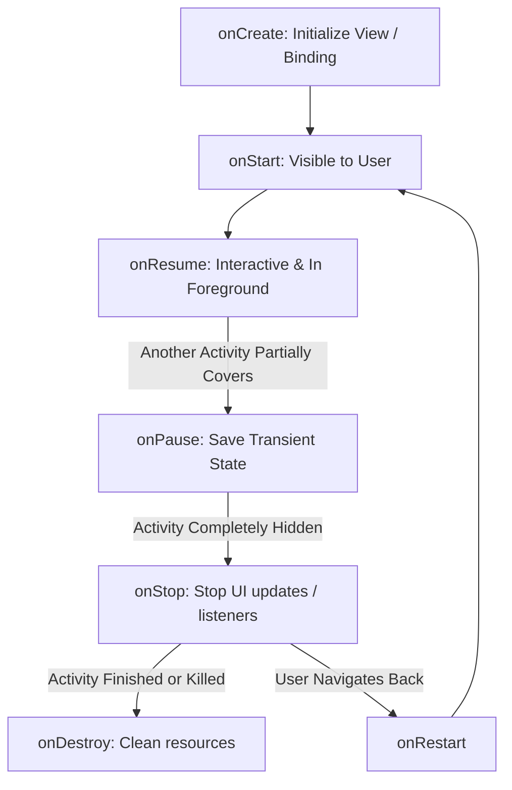
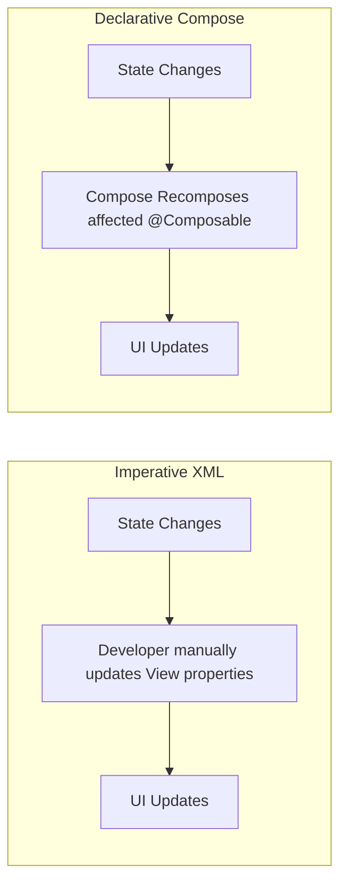
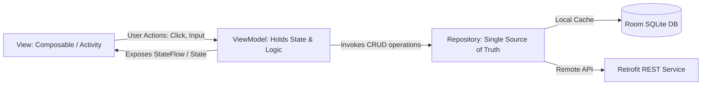

# 🎯 The Ultimate L1 Android Developer Interview Guide (Fresher / Junior / 0–3 Years)
> **The Definitive Handbook for Entry-Level Mobile Engineers, Campus Hires, Career Switchers, and Technical Screening Panels**


---

## 📖 Table of Contents
- [1. L1 Roles, Responsibilities & Evaluation Calibration](#1-l1-roles-responsibilities--evaluation-calibration)
- [2. Module 1: Kotlin Core & OOP Essentials](#2-module-1-kotlin-core--oop-essentials)
- [3. Module 2: Android Core Components & OS Architecture](#3-module-2-android-core-components--os-architecture)
- [4. Module 3: Modern UI: Jetpack Compose & XML View System](#4-module-3-modern-ui-jetpack-compose--xml-view-system)
- [5. Module 4: Asynchronous Programming & Kotlin Coroutines](#5-module-4-asynchronous-programming--kotlin-coroutines)
- [6. Module 5: Architecture (MVVM) & Data Persistence](#6-module-5-architecture-mvvm--data-persistence)
- [7. Module 6: Networking, REST APIs & JSON Serialization](#7-module-6-networking-rest-apis--json-serialization)
- [8. Module 7: Unit Testing & Android Studio Debugging](#8-module-7-unit-testing--android-studio-debugging)
- [9. Module 8: Android Build System & Gradle 101](#9-module-8-android-build-system--gradle-101)
- [10. Module 9: Top 10 Fresher / Entry-Level Interview Traps](#10-module-9-top-10-fresher--entry-level-interview-traps)
- [11. Module 10: 5 Hands-On Live Coding Challenges](#11-module-10-5-hands-on-live-coding-challenges)
- [12. Module 11: Interviewer Scorecard & Smart Questions to Ask](#12-module-11-interviewer-scorecard--smart-questions-to-ask)

---

## 1. L1 Roles, Responsibilities & Evaluation Calibration

In top IT product and service companies, an **Entry-Level / Junior Android Developer (0–3 Years)** is primarily focused on **feature implementation, code hygiene, and technical collaboration**. 

### Typical Roles & Daily Responsibilities
1. **Feature Implementation:** Develop robust Android application features using Kotlin or Java.
2. **Modern UI Development:** Implement responsive user interfaces using XML ViewBinding or Jetpack Compose.
3. **REST API Integration:** Connect to backend endpoints using Retrofit, OkHttp, and Coroutines.
4. **Architecture Adherence:** Follow MVVM (Model-View-ViewModel) and unidirectional data flow patterns.
5. **Lifecycle & State Handling:** Safely handle Activity/Fragment lifecycles and configuration changes (e.g., screen rotation, process death).
6. **Testing & Diagnostics:** Write unit tests (JUnit, MockK) and debug application issues using Logcat, breakpoints, and Android Studio Profiler.
7. **Code Hygiene & Reviews:** Resolve bugs, clean technical debt, and participate actively in peer code reviews.
8. **Cross-Functional Collaboration:** Partner with UI/UX designers, backend engineers, and QA testers to deliver sprint commitments.

### Interview Structure & Timing (45–60 Mins)

```mermaid
gantt
    title Standard 60-Minute L1 Interview Timeline
    dateFormat mm
    axisFormat %M min
    Warmup & Project Walkthrough  :00, 05m
    Kotlin Essentials & Null Safety :05, 12m
    Android Lifecycle & Core Components :17, 13m
    Jetpack Compose / Coroutines :30, 15m
    Live Coding Challenge (Strings/Collections) :45, 10m
    Candidate Q&A & Wrap-Up :55, 05m
```



---

## 2. Module 1: Kotlin Core & OOP Essentials

### Q1. What is the difference between `val`, `var`, and `const val`?
- **`var` (Variable):** Mutable reference. The pointer can be reassigned to another object anytime.
- **`val` (Value):** Read-only reference. Can only be assigned once. However, the internal state of the referenced object can still be mutated (e.g., `val list = mutableListOf(1, 2); list.add(3)` is completely valid).
- **`const val`:** Compile-time constant. Value is inlined at compile time.
  - Can only be declared at top-level or inside an `object` / `companion object`.
  - Can only hold primitive data types or `String`.
  - Cannot be assigned from a function call or runtime value.

---

### Q2. How does Kotlin guarantee Null Safety? Explain `?`, `?.`, `?:`, and `!!`.
Kotlin separates types into **non-nullable** (default) and **nullable** to eradicate `NullPointerException` (The "Billion Dollar Mistake").

```kotlin
var nonNullName: String = "Alice"
// nonNullName = null // Compile-time error!

var nullableName: String? = null // Valid
```

- **`?.` (Safe Call Operator):** Accesses property only if the target is non-null; otherwise returns `null`:
  ```kotlin
  val length: Int? = nullableName?.length
  ```
- **`?:` (Elvis Operator):** Provides a fallback default value when an expression evaluates to `null`:
  ```kotlin
  val length: Int = nullableName?.length ?: 0
  ```
- **`!!` (Not-Null Assertion Operator):** Forces the compiler to treat the value as non-null. Throws a runtime `NullPointerException` if the value is null. **Red flag in production code!**
- **Smart Casts:** If the compiler can verify a variable was checked for null, it automatically casts it to non-null:
  ```kotlin
  if (nullableName != null) {
      println(nullableName.length) // Auto-smartcast to String
  }
  ```

---

### Q3. What is the difference between `lateinit` and `by lazy`?

| Feature | `lateinit var` | `by lazy` |
| :--- | :--- | :--- |
| **Mutability** | Must be used with `var` | Must be used with `val` (read-only) |
| **Allowed Types** | Non-primitive objects only (No `Int`, `Boolean`) | Any type (primitives & objects) |
| **Initialization** | Initialized manually before usage (`isInitialized`) | Initialized automatically upon first access |
| **Thread Safety** | Not thread-safe by default | Thread-safe by default (`LazyThreadSafetyMode.SYNCHRONIZED`) |
| **Typical Use** | Dependency injection, ViewBinding, Android tests | Heavy objects, ViewModels, Database instances |

```kotlin
// lateinit example
lateinit var binding: ActivityMainBinding

// lazy example
val database: AppDatabase by lazy {
    Room.databaseBuilder(context, AppDatabase::class.java, "app.db").build()
}
```

---

### Q4. Explain Kotlin Scope Functions (`let`, `apply`, `run`, `also`, `with`).

| Function | Context Object | Return Value | Primary Use Case |
| :--- | :--- | :--- | :--- |
| **`let`** | `it` | Lambda result | Null-safety checks (`user?.let { ... }`) and value transformations |
| **`apply`** | `this` | Context object | Object configuration (building `Intent`, `NotificationCompat`, Views) |
| **`also`** | `it` | Context object | Additional side effects without altering value (logging, analytics) |
| **`run`** | `this` | Lambda result | Object configuration + computing an immediate result |
| **`with`** | `this` | Lambda result | Calling multiple methods on a non-null instance without repeating name |

```kotlin
// Practical Android examples:
val intent = Intent(this, DetailActivity::class.java).apply {
    putExtra("USER_ID", 101)
    putExtra("IS_ADMIN", true)
}

val formattedName = user?.let { "${it.firstName} ${it.lastName}" } ?: "Guest"

val users = fetchUsers().also { Log.d("Network", "Fetched ${it.size} users") }
```

---

### Q5. What is the difference between a `data class`, a regular `class`, and a `sealed class`?
- **Regular `class`:** Standard blueprint for objects. Requires manual overrides for `equals()`, `hashCode()`, and `toString()`.
- **`data class`:** Specifically designed to hold state. Automatically generates:
  1. `equals()` and `hashCode()` comparing constructor properties.
  2. `toString()` returning `User(id=1, name=Alice)`.
  3. `copy()` function for immutable state updates.
  4. `componentN()` functions for destructuring (`val (id, name) = user`).
- **`sealed class` / `sealed interface`:** Represents restricted class hierarchies (an "enum on steroids"). All subclasses must be known at compile time, enabling exhaustive `when` expressions without an `else` branch:

```kotlin
sealed interface UiState {
    data object Loading : UiState
    data class Success(val data: List<User>) : UiState
    data class Error(val message: String) : UiState
}

fun render(state: UiState) = when (state) {
    is UiState.Loading -> showSpinner()
    is UiState.Success -> showList(state.data)
    is UiState.Error -> showError(state.message)
    // No 'else' branch required!
}
```

---

## 3. Module 2: Android Core Components & OS Architecture

### Q6. What are the 4 fundamental Android Application Components?
1. **Activity:** Represents a single screen with a user interface.
2. **Service:** Runs in the background to perform long-running operations without a UI (e.g., music playback, location tracking).
3. **Broadcast Receiver:** Listens for system-wide or app-level broadcast intents (e.g., `ACTION_BATTERY_LOW`, `CONNECTIVITY_ACTION`).
4. **Content Provider:** Manages access to a central repository of structured data, enabling secure inter-app data sharing (e.g., Contacts, MediaStore).

---

### Q7. Walk me through the Activity Lifecycle methods and what happens during screen rotation.



**Scenario: What happens when the user rotates the device?**
1. The Android OS detects a **configuration change**.
2. The current Activity is completely destroyed: `onPause() -> onStop() -> onDestroy()`.
3. A brand new Activity instance is created: `onCreate() -> onStart() -> onResume()`.
4. **How to preserve data across rotation?**
   - **`ViewModel` (Recommended):** The ViewModel is retained in memory by the `ViewModelProvider` during configuration changes and re-attached to the new Activity instance.
   - **`onSaveInstanceState(Bundle)`:** Used for small, transient UI state (e.g., scroll position, uncommitted text).
   - **`rememberSaveable`** in Jetpack Compose.

---

### Q8. What is the difference between `ApplicationContext` and `ActivityContext`?
- **`ActivityContext`:** Bound to the lifecycle of an Activity. Used when inflating layouts, displaying dialogs, or launching UI components.  
  *Danger:* Passing `ActivityContext` to a long-lived Singleton or background thread causes a **Memory Leak** because the entire Activity and its view hierarchy cannot be garbage collected.
- **`ApplicationContext`:** Bound to the lifecycle of the entire application process. Safe to pass to Singletons, Database clients, and background repositories.

---

### Q9. What is an ANR (Application Not Responding)? What causes it, and how do you prevent it?
An ANR dialog is triggered by the Android OS when the **Main Thread (UI Thread)** is blocked and cannot process user input or draw frames:
- **5 seconds:** For user input events (key press, touch).
- **10–20 seconds:** For BroadcastReceivers and background Services.

**Common Causes:**
1. Performing network HTTP requests on the Main Thread (throws `NetworkOnMainThreadException`).
2. Heavy Room database queries or File read/write on the Main Thread.
3. Heavy CPU operations (JSON parsing, bitmap processing, complex sorting).

**Prevention:** Offload all heavy operations to background threads using **Kotlin Coroutines** with `Dispatchers.IO` (disk/network) or `Dispatchers.Default` (CPU computation).

---

## 4. Module 3: Modern UI: Jetpack Compose & XML View System

### Q10. What is Jetpack Compose, and how does it differ from the XML View System?
- **XML View System (Imperative):** You define a tree of static XML tags. In Kotlin, you find views via `findViewById` / ViewBinding and mutate them step-by-step (`button.isEnabled = false; textView.text = "Loading"`). High risk of state desynchronization.
- **Jetpack Compose (Declarative):** You describe the UI as a function of the current state (`@Composable`). When state changes, Compose re-executes the function (**Recomposition**) to render updated UI automatically.



---

### Q11. What is the difference between `remember` and `rememberSaveable`?
- **`remember`:** Retains a value across **recompositions** within the Composable tree. However, it **loses its value during configuration changes** (such as screen rotation) or process death.
- **`rememberSaveable`:** Retains value across recompositions **and** survives screen rotation and system-initiated process death by saving it in a `Bundle`.

```kotlin
@Composable
fun SearchBar() {
    // Survives screen rotation!
    var query by rememberSaveable { mutableStateOf("") }

    TextField(
        value = query,
        onValueChange = { query = it },
        label = { Text("Search users...") }
    )
}
```

---

### Q12. What is State Hoisting in Jetpack Compose?
State Hoisting is a pattern where state is moved up to a Composable's caller to make the child Composable **stateless, reusable, and easy to unit test**.

```kotlin
// Stateless Composable (Re-usable & Testable)
@Composable
fun CounterView(count: Int, onIncrement: () -> Unit) {
    Button(onClick = onIncrement) {
        Text("Count: $count")
    }
}

// Stateful Caller (Holds the state)
@Composable
fun CounterScreen() {
    var count by rememberSaveable { mutableStateOf(0) }
    CounterView(count = count, onIncrement = { count++ })
}
```

---

### Q13. Why use `LazyColumn` instead of a regular `Column`?
- **`Column`:** Emits all child items immediately upon composition. If you have 1,000 list items, it allocates memory and renders all 1,000 views at once, causing OutOfMemory (OOM) errors and UI stutter.
- **`LazyColumn` (equivalent to `RecyclerView` in XML):** Emits and renders only the items currently visible in the viewport. Recycles off-screen views to preserve memory and maintain 60/120 FPS scrolling.

```kotlin
@Composable
fun UserList(users: List<User>) {
    LazyColumn {
        items(
            items = users,
            key = { user -> user.id } // Always provide keys for optimal recomposition!
        ) { user ->
            UserCard(user)
        }
    }
}
```

---

## 5. Module 4: Asynchronous Programming & Kotlin Coroutines

### Q14. What are Kotlin Coroutines? Why are they called "lightweight threads"?
Coroutines are language-level concurrency abstractions. Unlike OS threads (which require 1MB+ of stack memory and expensive kernel context switching), thousands of coroutines can run concurrently on a small pool of shared threads without blocking the underlying thread.

```kotlin
// Suspending function pauses coroutine execution without blocking the OS thread
suspend fun fetchUserProfile(): UserDto {
    return apiService.getProfile() // Network call on IO thread
}
```

---

### Q15. What is the difference between `launch` and `async`?
- **`launch`:** "Fire and forget". Starts a coroutine that does not return a direct result. Returns a `Job` which can be used to track or cancel execution.
- **`async`:** Starts a coroutine that returns a result. Returns a `Deferred<T>` (a light-weight Future). Call `.await()` to retrieve the completed value.

```kotlin
// Parallel API requests using async:
viewModelScope.launch {
    try {
        val userDeferred = async { userRepository.getUser() }
        val ordersDeferred = async { orderRepository.getOrders() }

        // Both network requests run concurrently!
        val user = userDeferred.await()
        val orders = ordersDeferred.await()

        _uiState.value = UiState.Success(user, orders)
    } catch (e: Exception) {
        _uiState.value = UiState.Error(e.localizedMessage ?: "Unknown error")
    }
}
```

---

### Q16. Name the standard Coroutine Dispatchers and their roles.
1. **`Dispatchers.Main`:** Runs on the Android Main (UI) thread. Used for mutating UI state, showing toasts, and interacting with Views/Compose.
2. **`Dispatchers.IO`:** Backed by an elastic thread pool optimized for disk I/O, Room database queries, and Retrofit network requests.
3. **`Dispatchers.Default`:** Backed by a fixed thread pool sized to the device's CPU core count. Optimized for CPU-intensive tasks (sorting 10,000 items, parsing large JSON payloads, bitmap transformations).
4. **`Dispatchers.Unconfined`:** Starts execution in the caller thread until the first suspension point. Rarely used in production code.

---

### Q17. What is `viewModelScope` and why is it essential?
`viewModelScope` is a predefined `CoroutineScope` tied directly to the lifecycle of the `ViewModel`.
- When the user navigates away from the screen and the ViewModel is cleared (`onCleared()`), `viewModelScope` **automatically cancels all child coroutines running inside it**.
- This prevents **memory leaks** and wasted battery/network bandwidth from orphan coroutines trying to update dead UI components.

---

## 6. Module 5: Architecture (MVVM) & Data Persistence

### Q18. Explain the MVVM (Model-View-ViewModel) Pattern.



1. **View (UI Layer):** Observes state from the ViewModel and renders the UI. Contains no business logic.
2. **ViewModel:** Survives configuration changes. Handles business logic, calls repositories, and transforms domain models into UI state (`StateFlow`).
3. **Repository:** Mediates between local database storage (Room) and remote network endpoints (Retrofit). Acts as the single source of truth.
4. **Model:** Data classes representing the domain or database entities.

---

### Q19. What is Room Database and what are its 3 core components?
Room is an abstraction layer over SQLite that provides compile-time verification of SQL queries.
1. **`@Entity`:** Represents a table in the SQLite database.
   ```kotlin
   @Entity(tableName = "users")
   data class UserEntity(
       @PrimaryKey val id: Int,
       val name: String,
       val email: String
   )
   ```
2. **`@Dao` (Data Access Object):** Contains methods for accessing and mutating data. Supports Kotlin `suspend` functions and reactive `Flow`:
   ```kotlin
   @Dao
   interface UserDao {
       @Query("SELECT * FROM users")
       fun getAllUsers(): Flow<List<UserEntity>>

       @Insert(onConflict = OnConflictStrategy.REPLACE)
       suspend fun insertUser(user: UserEntity)
   }
   ```
3. **`@Database`:** The main database holder class that extends `RoomDatabase`.

---

### Q20. Why migrate from `SharedPreferences` to `Jetpack DataStore`?
- **SharedPreferences:**
  - Synchronous API (`apply()` and `commit()`) can block the UI thread and trigger ANRs.
  - Throws runtime exceptions on parsing errors.
  - No built-in reactive support (no Flow/Coroutines).
- **Jetpack DataStore:**
  - Fully asynchronous and non-blocking using Kotlin Coroutines and Flow.
  - Safe from UI thread deadlocks.
  - Provides type safety via **Proto DataStore** (Protocol Buffers) or simple key-value pairs via **Preferences DataStore**.

---

## 7. Module 6: Networking, REST APIs & JSON Serialization

### Q21. How do you set up Retrofit with OkHttp in Android?
```kotlin
// 1. Define Data Model
data class UserDto(val id: Int, val name: String, val email: String)

// 2. Define API Interface
interface ApiService {
    @GET("users/{id}")
    suspend fun getUserById(@Path("id") userId: Int): Response<UserDto>
}

// 3. Configure OkHttpClient & Retrofit
object NetworkModule {
    private val okHttpClient = OkHttpClient.Builder()
        .addInterceptor(HttpLoggingInterceptor().apply {
            level = HttpLoggingInterceptor.Level.BODY
        })
        .connectTimeout(15, TimeUnit.SECONDS)
        .readTimeout(15, TimeUnit.SECONDS)
        .build()

    val apiService: ApiService by lazy {
        Retrofit.Builder()
            .baseUrl("https://api.example.com/")
            .client(okHttpClient)
            .addConverterFactory(GsonConverterFactory.create())
            .build()
            .create(ApiService::class.java)
    }
}
```

---

### Q22. How do you handle network errors cleanly in MVVM?
Wrap network calls in a sealed `Result` or `UiState` wrapper:

```kotlin
sealed interface NetworkResult<out T> {
    data class Success<T>(val data: T) : NetworkResult<T>
    data class Error(val code: Int, val message: String) : NetworkResult<Nothing>
    data class Exception(val throwable: Throwable) : NetworkResult<Nothing>
}

// In Repository:
suspend fun getUser(id: Int): NetworkResult<UserDto> {
    return try {
        val response = apiService.getUserById(id)
        if (response.isSuccessful && response.body() != null) {
            NetworkResult.Success(response.body()!!)
        } else {
            NetworkResult.Error(response.code(), response.message())
        }
    } catch (e: IOException) {
        NetworkResult.Exception(e) // Network disconnect / timeout
    }
}
```

---

## 8. Module 7: Unit Testing & Android Studio Debugging

### Q23. How do you write a Unit Test for an Android ViewModel?
Using **JUnit4**, **MockK**, and **`kotlinx-coroutines-test`**:

```kotlin
class UserViewModelTest {

    @get:Rule
    val mainDispatcherRule = MainDispatcherRule() // Sets StandardTestDispatcher

    private val repository: UserRepository = mockk()
    private lateinit var viewModel: UserViewModel

    @Test
    fun `fetchUser success updates uiState to Success`() = runTest {
        // Given
        val fakeUser = User(id = 1, name = "Alice")
        coEvery { repository.getUser(1) } returns NetworkResult.Success(fakeUser)

        // When
        viewModel = UserViewModel(repository)
        viewModel.loadUser(1)

        // Then
        assertEquals(UiState.Success(fakeUser), viewModel.uiState.value)
    }
}
```

---

### Q24. How do you debug memory leaks and ANRs in Android Studio?
1. **Logcat:** Filter by package name, tag, and log level (`Log.e()`, `Log.w()`, `Log.d()`). Use structured JSON logging.
2. **Breakpoints:** Use **Conditional Breakpoints** (e.g., stop execution only when `userId == 105`) to debug without restarting.
3. **Android Studio Profiler:**
   - **CPU Profiler:** Record call charts to find methods blocking the Main Thread (causing frame drops or ANRs).
   - **Memory Profiler:** Inspect heap dumps to detect uncollected Activity instances retained by Singletons or listeners.
4. **LeakCanary:** Third-party library that automatically monitors Activity/Fragment destructions and raises a notification when a memory leak occurs.

---

## 9. Module 8: Android Build System & Gradle 101

### Q25. What is the difference between `minSdk`, `targetSdk`, and `compileSdk`?
- **`minSdk`:** The minimum Android OS version required to install and run the app. Devices with older versions cannot install the app from Google Play.
- **`targetSdk`:** The OS version against which the app was tested. Android uses this to enable runtime platform security and behavioral changes (e.g., notification permissions on Android 13 / API 33).
- **`compileSdk`:** The version of the Android SDK used to compile your Kotlin/Java code into DEX bytecode. It dictates which Android APIs are accessible during coding.

---

### Q26. What is the difference between `implementation` and `api` in Gradle?
- **`implementation`:** The dependency is private to the module. If Module A implements Library X, Module B (which depends on A) **cannot** access Library X.  
  *Advantage:* Speeds up compilation because changes to Library X only recompile Module A.
- **`api`:** The dependency is leaked transitively. If Module A adds Library X as `api`, Module B can directly call Library X.  
  *Disadvantage:* Slower build times because changing Library X triggers recompilation of all downstream modules.

---

## 10. Module 9: Top 10 Fresher / Entry-Level Interview Traps

Avoid these common traps that immediately signal inexperience to senior interviewers:

1. **Static Reference to Activity Context:** Storing an `Activity` reference in a companion object or singleton. Leads to fatal **Memory Leaks**.
2. **Calling Network on the Main Thread:** Directly executing HTTP calls or Room DB operations on `Dispatchers.Main` causes an immediate `NetworkOnMainThreadException` or ANR.
3. **Overusing the `!!` Operator:** Treating null safety as an inconvenience by littering `!!` across the codebase.
4. **Mutating State inside Composable Body:** Invoking `count++` directly inside a `@Composable` body triggers an infinite recomposition loop. Always trigger mutations inside an `onClick` or `LaunchedEffect`.
5. **Re-instantiating ViewModels Manually:** Calling `val vm = MyViewModel()` inside an Activity or Composable instead of using `viewModel()` or `viewModels()`. The ViewModel will not survive rotation!
6. **Forgetting Coroutine Cancellation:** Spawning global coroutines via `GlobalScope.launch` that outlive the screen and waste background memory.
7. **Modifying Collections while Iterating:** Removing items from a standard `ArrayList` during a `forEach` loop throws `ConcurrentModificationException`. Use `iterator.remove()` or `.filter()`.
8. **Missing `android:exported` in Manifest:** Starting in Android 12, components with `<intent-filter>` must explicitly declare `android:exported="true|false"`. Missing this causes an immediate installation crash.
9. **Confusing `lazy` with `lateinit`:** Trying to use `lateinit` on a primitive `Int` or `Boolean`.
10. **Hardcoding Strings & Dimensions:** Storing hardcoded `"Submit"` text in layouts instead of using `strings.xml` or string resources, preventing localization.

---

## 11. Module 10: 5 Hands-On Live Coding Challenges

Senior interviewers often test basic Kotlin fluency with a 5-to-10 minute live coding exercise. Practice these 5 common problems:

### Challenge 1: Functional Collection Transformation
**Problem:** Given a list of products, filter only products that are in stock, sort them by price ascending, and return a formatted string list: `"[Product Name] - $[Price]"`.

```kotlin
data class Product(val id: Int, val name: String, val price: Double, val inStock: Boolean)

fun getFormattedInStockProducts(products: List<Product>): List<String> {
    return products
        .filter { it.inStock }
        .sortedBy { it.price }
        .map { "${it.name} - $${it.price}" }
}

// Test Case:
val items = listOf(
    Product(1, "Keyboard", 45.0, true),
    Product(2, "Mouse", 25.0, false),
    Product(3, "Monitor", 180.0, true)
)
println(getFormattedInStockProducts(items))
// Output: [Keyboard - $45.0, Monitor - $180.0]
```

---

### Challenge 2: Two-Pointer Valid Palindrome
**Problem:** Determine if a string is a palindrome, considering only alphanumeric characters and ignoring cases. Must be **$O(N)$ time** and **$O(1)$ extra space**.

```kotlin
fun isPalindrome(s: String): Boolean {
    var left = 0
    var right = s.length - 1

    while (left < right) {
        while (left < right && !s[left].isLetterOrDigit()) left++
        while (left < right && !s[right].isLetterOrDigit()) right--

        if (s[left].lowercaseChar() != s[right].lowercaseChar()) {
            return false
        }
        left++
        right--
    }
    return true
}

// Test Cases:
println(isPalindrome("A man, a plan, a canal: Panama")) // true
println(isPalindrome("race a car")) // false
```

---

### Challenge 3: Word Frequency Counter
**Problem:** Given a sentence, count the frequency of each unique word, ignoring case and punctuation.

```kotlin
fun countWordFrequencies(sentence: String): Map<String, Int> {
    return sentence
        .lowercase()
        .replace(Regex("[^a-z0-9 ]"), "")
        .split("\\s+".toRegex())
        .filter { it.isNotBlank() }
        .groupingBy { it }
        .eachCount()
}

// Test Case:
val input = "Android is great. Kotlin for Android is awesome!"
println(countWordFrequencies(input))
// Output: {android=2, is=2, great=1, kotlin=1, for=1, awesome=1}
```

---

### Challenge 4: First Non-Repeating Character
**Problem:** Given a string, find the first non-repeating character in **$O(N)$ time**. Return `null` if none exists.

```kotlin
fun firstUniqueChar(s: String): Char? {
    val charCounts = LinkedHashMap<Char, Int>()
    for (char in s) {
        charCounts[char] = (charCounts[char] ?: 0) + 1
    }
    for ((char, count) in charCounts) {
        if (count == 1) return char
    }
    return null
}

// Test Cases:
println(firstUniqueChar("swiss")) // 'w'
println(firstUniqueChar("aabbcc")) // null
```

---

### Challenge 5: Reactive StateFlow ViewModel Counter
**Problem:** Write a minimal, idiomatic Android ViewModel exposing an immutable `StateFlow<Int>` with increment and decrement actions.

```kotlin
class CounterViewModel : ViewModel() {
    private val _count = MutableStateFlow(0)
    val count: StateFlow<Int> = _count.asStateFlow()

    fun increment() {
        _count.value += 1
    }

    fun decrement() {
        if (_count.value > 0) {
            _count.value -= 1
        }
    }
}
```

---

## 12. Module 11: Interviewer Scorecard & Smart Questions to Ask

### Candidate Scorecard (How Interviewers Grade You)

| Competency Area | Must-Have for L1 Hire | Red Flag (Definite Reject) |
| :--- | :--- | :--- |
| **Kotlin Basics** | Knows `val` vs `var`, null safety (`?`, `?.`, `?:`), data classes. | Uses `!!` without justification; cannot explain what null safety solves. |
| **Android Lifecycle** | Explains Activity lifecycle, why screen rotation destroys views, ViewModel role. | Unaware of screen rotation destruction; puts long network calls in `onCreate()`. |
| **UI Fluency** | Understands declarative Compose, `remember`, `rememberSaveable`, `LazyColumn`. | Has never built a UI; cannot explain how data updates on screen. |
| **Concurrency** | Knows difference between Main and IO threads, what an ANR is, basic `launch`. | Assumes network calls run automatically in the background. |
| **Live Coding** | Writes readable, syntactically correct Kotlin with standard collections. | Gets stuck on basic loops or primitive syntax; shows zero problem-solving ability. |

---

### Smart Questions to Ask the Interviewer (Impress the Panel)
When the interviewer asks: *"Do you have any questions for us?"*, ask 2 of these high-value questions:

1. *"What is the mobile team's current approach to modernizing older XML codebases to Jetpack Compose?"*
2. *"How does the team handle CI/CD automated testing for mobile releases before shipping to the Play Store?"*
3. *"What is the mentorship and code review process like for junior engineers joining the mobile team?"*
4. *"What are the primary performance vitals (crash rate, cold start latency) the Android team is focused on improving this quarter?"*
