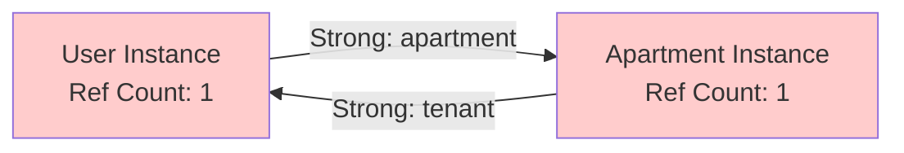
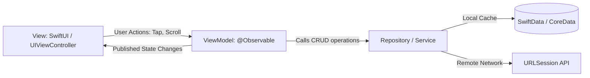

# 🍏 The Ultimate L1 iOS Developer Interview Guide (Fresher / Junior / 0–3 Years)
> **The Definitive Handbook for Entry-Level iOS Engineers, Campus Hires, Career Switchers, and Technical Screening Panels**


---

## 📖 Table of Contents
- [1. L1 Roles, Responsibilities & Evaluation Calibration](#1-l1-roles-responsibilities--evaluation-calibration)
- [2. Module 1: Swift Core & Type System Essentials](#2-module-1-swift-core--type-system-essentials)
- [3. Module 2: iOS Application Lifecycle & UIKit vs SwiftUI](#3-module-2-ios-application-lifecycle--uikit-vs-swiftui)
- [4. Module 3: Memory Management & ARC (Automatic Reference Counting)](#4-module-3-memory-management--arc-automatic-reference-counting)
- [5. Module 4: Asynchronous Swift (async/await, Tasks & Combine)](#5-module-4-asynchronous-swift-asyncawait-tasks--combine)
- [6. Module 5: Architecture (MVVM) & Data Persistence (SwiftData / CoreData)](#6-module-5-architecture-mvvm--data-persistence-swiftdata--coredata)
- [7. Module 6: Networking with URLSession & JSON Parsing](#7-module-6-networking-with-urlsession--json-parsing)
- [8. Module 7: Unit Testing with XCTest & Xcode Debugging](#8-module-7-unit-testing-with-xctest--xcode-debugging)
- [9. Module 8: App Distribution & Apple Developer Ecosystem](#9-module-8-app-distribution--apple-developer-ecosystem)
- [10. Module 9: Top 10 Fresher / Entry-Level iOS Interview Traps](#10-module-9-top-10-fresher--entry-level-ios-interview-traps)
- [11. Module 10: 5 Hands-On Live Coding Challenges](#11-module-10-5-hands-on-live-coding-challenges)
- [12. Module 11: Interviewer Scorecard & Smart Questions to Ask](#12-module-11-interviewer-scorecard--smart-questions-to-ask)

---

## 1. L1 Roles, Responsibilities & Evaluation Calibration

In modern IT product and service companies, an **Entry-Level / Junior iOS Developer (0–3 Years)** is responsible for:
1. **Feature Implementation:** Develop iOS app features using Swift and modern APIs.
2. **Modern UI Development:** Build fluid interfaces using SwiftUI or UIKit (AutoLayout / Programmatic constraints).
3. **API Integration:** Connect backend REST/JSON services using `URLSession` and Codable.
4. **Architecture Adherence:** Follow MVVM (Model-View-ViewModel) and reactive state bindings.
5. **Memory Safety:** Manage memory lifecycles using ARC, preventing retain cycles with `weak` and `unowned`.
6. **Testing & Diagnostics:** Write unit tests with `XCTest` and debug issues using Xcode Breakpoints, Instruments, and LLDB.
7. **Code Hygiene & Reviews:** Resolve defects, maintain clean Git commits, and actively review peer pull requests.
8. **App Store Readiness:** Handle basic provisioning profiles, test distribution via TestFlight, and resolve store compliance guidelines.

### Interview Structure & Timing (45–60 Mins)

```mermaid
gantt
    title Standard 60-Minute L1 iOS Interview Timeline
    dateFormat mm
    axisFormat %M min
    Warmup & Project Portfolio :00, 05m
    Swift Core (Optionals, Struct vs Class) :05, 12m
    Memory Management (ARC & Retain Cycles) :17, 10m
    SwiftUI / UIKit & Modern Concurrency :27, 15m
    Live Coding Challenge (Swift Algorithms) :42, 13m
    Candidate Q&A & Wrap-Up :55, 05m
```



---

## 2. Module 1: Swift Core & Type System Essentials

### Q1. What is the difference between `let` and `var`?
- **`var` (Variable):** Mutable reference. The stored value can be updated or reassigned.
- **`let` (Constant):** Immutable reference. The value must be assigned once and cannot be changed.
  - *Best Practice:* In Swift, favor `let` by default. Only change to `var` if the compiler requires mutation.

---

### Q2. Struct vs Class: What are the differences and when do you use each?

| Feature | `struct` (Value Type) | `class` (Reference Type) |
| :--- | :--- | :--- |
| **Storage** | Stack memory (Fast allocation) | Heap memory (Requires ARC tracking) |
| **Passing Semantics** | Copied upon assignment or function pass | Reference pointer is passed |
| **Inheritance** | Does not support inheritance (use Protocols) | Supports class inheritance |
| **Deinitializer** | No `deinit` method | Has `deinit` for cleanup |
| **Typical iOS Use** | SwiftUI Views, Data Models, DTOs | ViewModels, Database Managers, Network Clients |

```swift
// Struct (Copied)
struct Point { var x: Int; var y: Int }
var p1 = Point(x: 0, y: 0)
var p2 = p1
p2.x = 10 // p1.x is still 0!

// Class (Shared Reference)
class Counter { var count = 0 }
let c1 = Counter()
let c2 = c1
c2.count = 5 // c1.count is now 5!
```

---

### Q3. How does Swift achieve Optionals and unwrapping?
In Swift, variables cannot hold `nil` unless declared as an **Optional** (`Type?`).

```swift
var username: String? = "John"
```

**Unwrapping Mechanisms:**
1. **Optional Binding (`if let` / `guard let`):**
   ```swift
   guard let name = username else {
       return // Exits scope early if nil
   }
   print("Hello, \(name)")
   ```
2. **Nil-Coalescing Operator (`??`):**
   ```swift
   let displayName = username ?? "Guest"
   ```
3. **Optional Chaining (`?.`):**
   ```swift
   let count = username?.count
   ```
4. **Forced Unwrapping (`!`):** Crashes the app with `Fatal error: Unexpectedly found nil` if the value is nil. **Avoid in production!**

---

### Q4. What is the difference between a Protocol and an Abstract Class?
Swift does not have abstract classes. Instead, Swift uses **Protocols** with **Protocol Extensions** to provide default implementations (Protocol-Oriented Programming):

```swift
protocol Describable {
    var title: String { get }
    func describe()
}

extension Describable {
    func describe() {
        print("Item: \(title)") // Default implementation
    }
}
```

---

## 3. Module 2: iOS Application Lifecycle & UIKit vs SwiftUI

### Q5. Explain the iOS App Lifecycle states.
An iOS application transitions through 5 distinct execution states:
1. **Not Running:** The app has not been launched or was terminated by the system.
2. **Inactive:** Running in the foreground but not receiving events (e.g., incoming phone call, Control Center open).
3. **Active:** Running in the foreground and actively receiving user touch/key events.
4. **Background:** Executing background tasks (audio playback, location updates, background fetch).
5. **Suspended:** In memory in the background, but code execution is paused by iOS to conserve battery. The system may purge it without notice under memory pressure.

---

### Q6. SwiftUI vs UIKit: What are the fundamental differences?
- **UIKit (Imperative):** You instantiate `UIView` / `UIViewController` hierarchies, configure layout via AutoLayout constraints or frames, and manually update view properties when data arrives (`label.text = "Success"`).
- **SwiftUI (Declarative):** You declare the UI as a function of state (`struct ContentView: View`). When state changes via `@State`, `@Binding`, or `@Observable`, SwiftUI re-evaluates the `body` property and updates only the modified views.

```swift
// SwiftUI Declarative State
struct GreetingView: View {
    @State private var name = ""

    var body: some View {
        VStack {
            TextField("Enter name", text: $name)
            Text("Welcome, \(name)!")
        }
        .padding()
    }
}
```

---

### Q7. Explain `@State`, `@Binding`, and `@StateObject` / `@Observable`.
- **`@State`:** Manages transient, private view-local state owned by the view.
- **`@Binding`:** Creates a two-way read/write link to state owned by a parent view without duplicating storage.
- **`@StateObject` (iOS 14–16) / `@Observable` (iOS 17+):**
  - Manages reference-type ViewModels.
  - `@StateObject` ensures the ViewModel instance survives view invalidations.
  - In iOS 17+, the `@Observable` macro eliminates property wrappers (`@Published`) and re-renders only views that actively read specific fields.

---

## 4. Module 3: Memory Management & ARC (Automatic Reference Counting)

### Q8. How does ARC (Automatic Reference Counting) work in Swift?
ARC tracks and manages memory allocation on the Heap:
- Every time a class instance is assigned to a reference, its **reference count increases by 1**.
- When a reference goes out of scope or is set to `nil`, its count decreases by 1.
- When the reference count reaches **zero**, the instance's `deinit` is invoked, and memory is instantly reclaimed.

---

### Q9. What is a Retain Cycle, and how do you resolve it?
A Retain Cycle occurs when two class instances hold strong references to each other, preventing their reference count from ever reaching zero. This causes a **Memory Leak**.



**Solution: `weak` vs `unowned`**
- **`weak`:** Does not keep a strong hold on the instance. Always declared as an `optional var` (`weak var delegate: CustomDelegate?`). Automatically becomes `nil` when the referenced instance deallocates.
- **`unowned`:** Does not increase reference count, but assumes the referenced object will never be `nil` during its lifetime. Accessing an unowned reference after deallocation crashes the app.

```swift
// Breaking retain cycle in closures:
class ProfileViewModel {
    var onUpdate: (() -> Void)?

    func bind() {
        // Capture [weak self] to prevent retain cycle
        onUpdate = { [weak self] in
            guard let self = self else { return }
            self.refreshUI()
        }
    }
}
```

---

## 5. Module 4: Asynchronous Swift (async/await, Tasks & Combine)

### Q10. What is Swift Modern Concurrency (`async/await`)?
Introduced in Swift 5.5, `async/await` eliminates "Callback Hell" and completion handlers:
- **`async`:** Marks a function as asynchronous, indicating it may suspend execution.
- **`await`:** A suspension point where the current thread yields execution to the cooperative thread pool.

```swift
func fetchUser(id: Int) async throws -> User {
    let url = URL(string: "https://api.example.com/users/\(id)")!
    let (data, response) = try await URLSession.shared.data(from: url)
    return try JSONDecoder().decode(User.self, from: data)
}
```

---

### Q11. What is an `Actor` in Swift, and how does it prevent Data Races?
An `actor` is a reference type (like a class) that provides **automatic synchronization for its mutable state**:
- Only one task can access an actor's mutable properties or methods at any given time.
- Callers outside the actor must use `await` to access its members.
- **`@MainActor`:** A specialized actor that guarantees execution on the Main (UI) thread:

```swift
@MainActor
class OrderViewModel: ObservableObject {
    @Published var items: [Item] = []
    // All UI state mutations are guaranteed to happen on the Main Thread!
}
```

---

## 6. Module 5: Architecture (MVVM) & Data Persistence (SwiftData / CoreData)

### Q12. Explain MVVM (Model-View-ViewModel) in iOS.



1. **Model:** Plain structs representing domain data and business entities.
2. **View:** Declarative SwiftUI views or UIKit view controllers. Listens to ViewModel state and triggers user intents.
3. **ViewModel:** Transforms business data into display-ready state. Owns business logic and network/database calls.
4. **Repository:** Abstracts data sources (local cache vs remote network).

---

### Q13. SwiftData vs CoreData: What are the differences?
- **CoreData:** Apple's legacy object-graph persistence framework. Relies on `.xcdatamodeld` XML visual schema files, Objective-C runtime classes (`NSManagedObject`), and explicit `NSManagedObjectContext` management.
- **SwiftData (iOS 17+):** Built purely in Swift using modern Swift Macros. Uses `@Model` on standard Swift classes, integrates seamlessly with SwiftUI via `@Query`, and handles migrations declaratively.

```swift
import SwiftData

@Model
class Note {
    var title: String
    var createdAt: Date

    init(title: String, createdAt: Date = Date()) {
        self.title = title
        self.createdAt = createdAt
    }
}
```

---

## 7. Module 6: Networking with URLSession & JSON Parsing

### Q14. How do you implement a clean generic API Client in Swift?

```swift
enum NetworkError: Error {
    case invalidURL
    case invalidResponse(statusCode: Int)
    case decodingError(Error)
}

class APIClient {
    func request<T: Decodable>(urlString: String) async throws -> T {
        guard let url = URL(string: urlString) else {
            throw NetworkError.invalidURL
        }

        let (data, response) = try await URLSession.shared.data(from: url)

        guard let httpResponse = response as? HTTPURLResponse,
              (200...299).contains(httpResponse.statusCode) else {
            let code = (response as? HTTPURLResponse)?.statusCode ?? 500
            throw NetworkError.invalidResponse(statusCode: code)
        }

        do {
            let decoder = JSONDecoder()
            decoder.keyDecodingStrategy = .convertFromSnakeCase
            return try decoder.decode(T.self, from: data)
        } catch {
            throw NetworkError.decodingError(error)
        }
    }
}
```

---

## 8. Module 7: Unit Testing with XCTest & Xcode Debugging

### Q15. How do you write an asynchronous Unit Test using `XCTest`?
```swift
import XCTest
@testable import MyApp

final class UserViewModelTests: XCTestCase {
    var sut: UserViewModel!
    var mockService: MockUserService!

    override func setUp() {
        super.setUp()
        mockService = MockUserService()
        sut = UserViewModel(service: mockService)
    }

    override func tearDown() {
        sut = nil
        mockService = nil
        super.tearDown()
    }

    func testFetchUserSuccess() async throws {
        // Given
        let expectedUser = User(id: 1, name: "Alice")
        mockService.result = .success(expectedUser)

        // When
        await sut.loadUser(id: 1)

        // Then
        XCTAssertEqual(sut.user?.name, "Alice")
        XCTAssertFalse(sut.isLoading)
    }
}
```

---

### Q16. How do you debug iOS apps in Xcode?
1. **LLDB (Low-Level Debugger):**
   - `po object`: Print description of object.
   - `p expression`: Evaluate Swift expression at breakpoint.
2. **Xcode Instruments:**
   - **Time Profiler:** Identifies CPU bottlenecks and main thread hangs.
   - **Leaks Instrument:** Automatically detects memory leaks and active retain cycles.
3. **Debug View Hierarchy:** Visual 3D inspector to diagnose layout clipping, hidden views, or miscalculated AutoLayout constraints.

---

## 9. Module 8: App Distribution & Apple Developer Ecosystem

### Q17. What is the difference between an App ID, Certificate, and Provisioning Profile?
- **App ID:** A unique reverse-domain identifier (e.g., `com.company.myapp`) registered in Apple Developer portal.
- **Certificate (.cer / .p12):** Cryptographic public/private key pair issued by Apple verifying your developer identity (Development Certificate vs Distribution Certificate).
- **Provisioning Profile:** Links your Certificate, App ID, and authorized test Device UDIDs together. Required by iOS to verify that the binary is allowed to run on physical hardware.

---

## 10. Module 9: Top 10 Fresher / Entry-Level iOS Interview Traps

1. **Forgetting `[weak self]` in Closures:** Escaping closures that capture `self` strongly cause instant retain cycles and memory leaks.
2. **Forced Unwrapping (`!`):** Using `!` on optional values causes immediate application crashes in production.
3. **Updating UI on Background Threads:** Calling UI mutations inside background URLSession tasks without `DispatchQueue.main.async` or `@MainActor`.
4. **Instantiating ViewModel inside SwiftUI Body:** Re-instantiating `let vm = MyViewModel()` inside a SwiftUI struct re-creates the ViewModel on every single view redraw. Use `@StateObject` or `@Observable`.
5. **Ignoring Autoreleasepool in Heavy Loops:** Processing thousands of images or strings in a loop without `autoreleasepool { ... }` causes high memory spikes and watchdog crashes.
6. **Mutating Collections during Enumeration:** Modifying an `Array` while iterating through it throws a runtime crash.
7. **Using `unowned` Carelessly:** Assuming an unowned reference will always exist; crashes if the parent is deallocated first.
8. **Missing Info.plist Permissions:** Accessing Camera, Location, or Photo Library without declaring usage descriptions in `Info.plist` triggers an immediate SIGABRT crash.
9. **Confusing Frame vs Bounds:**
   - `frame`: Location and size of the view relative to its **superview's** coordinate system.
   - `bounds`: Location and size of the view relative to its **own** coordinate system `(0, 0, width, height)`.
10. **Hardcoding Strings:** Not using `String(localized: "key")` or String Catalogs, making multi-language localization impossible.

---

## 11. Module 10: 5 Hands-On Live Coding Challenges

### Challenge 1: Filter and Transform User Models
**Problem:** Given a list of users, filter those who are active, sort them by registration date descending, and return their names capitalized.

```swift
struct User {
    let name: String
    let isActive: Bool
    let registeredDate: Date
}

func getActiveUserNames(users: [User]) -> [String] {
    return users
        .filter { $0.isActive }
        .sorted { $0.registeredDate > $1.registeredDate }
        .map { $0.name.capitalized }
}
```

---

### Challenge 2: Two-Pointer Valid Palindrome
**Problem:** Check if a string is a palindrome, considering only alphanumeric characters and ignoring case ($O(N)$ time, $O(1)$ space).

```swift
func isPalindrome(_ s: String) -> Bool {
    let characters = Array(s.lowercased())
    var left = 0
    var right = characters.count - 1

    while left < right {
        while left < right && !characters[left].isLetter && !characters[left].isNumber {
            left += 1
        }
        while left < right && !characters[right].isLetter && !characters[right].isNumber {
            right -= 1
        }

        if characters[left] != characters[right] {
            return false
        }
        left += 1
        right -= 1
    }
    return true
}

// Test:
print(isPalindrome("A man, a plan, a canal: Panama")) // true
```

---

### Challenge 3: Word Frequency Counter
**Problem:** Count the frequency of each word in a string, returning a `[String: Int]` dictionary.

```swift
func countWordFrequencies(_ sentence: String) -> [String: Int] {
    let words = sentence
        .lowercased()
        .components(separatedBy: CharacterSet.alphanumerics.inverted)
        .filter { !$0.isEmpty }

    var frequencies: [String: Int] = [:]
    for word in words {
        frequencies[word, default: 0] += 1
    }
    return frequencies
}
```

---

### Challenge 4: First Unique Character
**Problem:** Return the first non-repeating character in a string in $O(N)$ time.

```swift
func firstUniqueChar(_ s: String) -> Character? {
    var counts: [Character: Int] = [:]
    for char in s {
        counts[char, default: 0] += 1
    }
    for char in s {
        if counts[char] == 1 {
            return char
        }
    }
    return nil
}

// Test:
print(firstUniqueChar("swiss") ?? "-") // "w"
```

---

### Challenge 5: Minimal SwiftUI Counter ViewModel
**Problem:** Write a clean MVVM counter ViewModel with increment/decrement logic.

```swift
import Foundation

@MainActor
class CounterViewModel: ObservableObject {
    @Published private(set) var count: Int = 0

    func increment() {
        count += 1
    }

    func decrement() {
        guard count > 0 else { return }
        count -= 1
    }
}
```

---

## 12. Module 11: Interviewer Scorecard & Smart Questions to Ask

### Candidate Scorecard (How Interviewers Grade You)

| Competency Area | Must-Have for L1 Hire | Red Flag (Definite Reject) |
| :--- | :--- | :--- |
| **Swift Basics** | Understands Optionals, unwrapping (`guard let`), Struct vs Class. | Uses `!` everywhere; does not know value vs reference types. |
| **Memory (ARC)** | Explains retain cycles, knows when to use `weak self`. | Cannot explain why memory leaks happen in closures. |
| **UI Fluency** | Knows SwiftUI view lifecycle, state bindings, or UIKit constraints. | Has never written UI code; unable to build a basic form or list. |
| **Concurrency** | Understands main thread UI rules, basic `async/await` and `@MainActor`. | Updates UI on background queues without understanding thread safety. |
| **Live Coding** | Writes clean, readable Swift code with proper control flow and standard types. | Gets stuck on basic Swift syntax; cannot write a loop or conditional. |

---

### Smart Questions to Ask the Interviewer
1. *"What is the iOS team's timeline and architecture strategy for adopting Swift 6 complete concurrency checking?"*
2. *"How does the team manage modularization between feature teams—via Swift Package Manager (SPM) or CocoaPods?"*
3. *"What is the test coverage expectation for pull requests on the iOS team?"*
4. *"How do you monitor production performance and crash-free session metrics using Apple MetricKit or Crashlytics?"*
