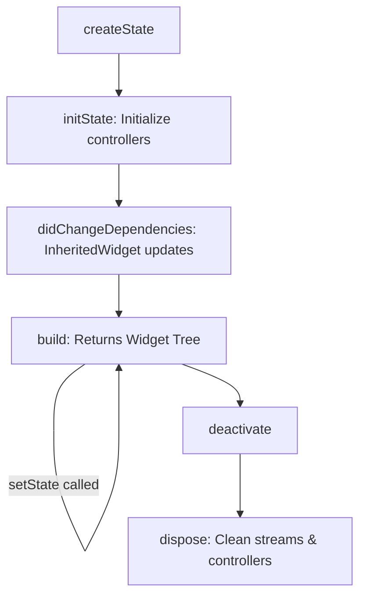

# 🌐 The Ultimate L1 Cross-Platform Mobile Interview Guide (Flutter & React Native: 0–3 Years)
> **The Definitive Handbook for Entry-Level Cross-Platform Mobile Engineers, Campus Hires, Career Switchers, and Technical Screening Panels**


---

## 📖 Table of Contents
- [1. L1 Cross-Platform Roles & Calibration](#1-l1-cross-platform-roles--calibration)
- [2. Part A: Flutter & Dart Core Track](#2-part-a-flutter--dart-core-track)
  - [Dart Language Essentials](#dart-language-essentials)
  - [Flutter Widget Lifecycle & State Management (BLoC / Riverpod)](#flutter-widget-lifecycle--state-management)
  - [Rendering Engine: Skia vs Impeller](#rendering-engine-skia-vs-impeller)
  - [Native Interop: MethodChannels](#native-interop-methodchannels)
- [3. Part B: React Native & TypeScript Track](#3-part-b-react-native--typescript-track)
  - [TypeScript Core Essentials](#typescript-core-essentials)
  - [New Architecture: JSI, Fabric & TurboModules](#new-architecture-jsi-fabric--turbomodules)
  - [The Hermès JS Engine](#the-hermès-js-engine)
  - [State Management: Redux Toolkit & Zustand](#state-management-redux-toolkit--zustand)
- [4. Shared Topics: Networking, Storage & Performance](#4-shared-topics-networking-storage--performance)
- [5. Top 10 Fresher Cross-Platform Interview Traps](#5-top-10-fresher-cross-platform-interview-traps)
- [6. 5 Hands-On Live Coding Challenges (Dart & TypeScript)](#6-5-hands-on-live-coding-challenges-dart--typescript)
- [7. Interviewer Scorecard & Smart Questions to Ask](#7-interviewer-scorecard--smart-questions-to-ask)

---

## 1. L1 Cross-Platform Roles & Calibration

In modern IT product and service companies, an **Entry-Level / Junior Cross-Platform Developer (0–3 Years)** is responsible for:
1. **Multi-Platform Feature Development:** Building features that deploy uniformly to both Android and iOS from a shared codebase (Flutter or React Native).
2. **Declarative UI Creation:** Implementing pixel-perfect, responsive UI using Flutter Widgets or React Native JSX components.
3. **API Integration:** Connecting to REST/GraphQL services using Dio or Axios.
4. **State Management:** Applying structured state management (BLoC/Riverpod in Flutter, Redux Toolkit/Zustand in React Native).
5. **Platform Bridging:** Integrating native device capabilities (Camera, Push Notifications, Biometrics) via native plugins or MethodChannels/TurboModules.
6. **Testing & Diagnostics:** Writing unit and component tests (`flutter_test`, `jest`) and profiling UI frame rates using DevTools or Flipper.
7. **Store Deployment:** Building production release binaries (APK/AAB for Google Play, IPA for Apple App Store).

### Interview Timing Calibration (45–60 Mins)

```mermaid
gantt
    title Standard 60-Minute L1 Cross-Platform Interview
    dateFormat mm
    axisFormat %M min
    Warmup & Portfolio Walkthrough :00, 05m
    Core Language (Dart or TypeScript) :05, 12m
    Platform Architecture (Impeller / JSI / Bridge) :17, 13m
    State Management & Lifecycle :30, 15m
    Live Coding Challenge :45, 10m
    Candidate Q&A & Wrap-Up :55, 05m
```



---

## 2. Part A: Flutter & Dart Core Track

### Dart Language Essentials

#### Q1. What is Sound Null Safety in Dart? Explain `?`, `!`, and `late`.
In Dart, variables are non-nullable by default.
- **`?` (Nullable):** Indicates a variable can store `null` (`String? name;`).
- **`!` (Null Assertion):** Tells the compiler the value is guaranteed not to be null. Throws a runtime exception if null.
- **`late`:** Postpones initialization until first access while ensuring non-nullability at runtime.

#### Q2. What is the difference between `final` and `const` in Dart?
- **`final`:** Run-time constant. Value is evaluated once at runtime and cannot be reassigned (`final now = DateTime.now();`).
- **`const`:** Compile-time constant. Value must be known at compile time and is stored in canonical memory (`const pi = 3.14159;`).
  - *Flutter Performance Tip:* Using `const` on Widget constructors (`const SizedBox(height: 16)`) prevents unnecessary re-instantiations during rebuilds.

---

### Flutter Widget Lifecycle & State Management

#### Q3. Explain the difference between `StatelessWidget` and `StatefulWidget`.
- **`StatelessWidget`:** Immutable. Does not store internal mutable state. Rebuilds only when its parent widget passes new constructor parameters.
- **`StatefulWidget`:** Consists of two classes: the immutable Widget configuration class and the mutable `State<T>` class that persists across rebuilds.



#### Q4. Explain State Management in Flutter: BLoC vs Riverpod vs setState.
- **`setState`:** Built-in, local state management. Rebuilds the entire subtree of the widget. Does not scale for multi-screen shared state.
- **BLoC (Business Logic Component):** Separates business logic from UI using Dart Streams. Events go in, States come out. Highly predictable and testable.
- **Riverpod:** A compile-safe, robust evolution of Provider. Does not depend on `BuildContext`, making it testable in pure Dart environments.

```dart
// Simple BLoC / Cubit Example:
class CounterCubit extends Cubit<int> {
  CounterCubit() : super(0);

  void increment() => emit(state + 1);
  void decrement() => emit(state > 0 ? state - 1 : 0);
}
```

---

### Rendering Engine: Skia vs Impeller

#### Q5. What is Flutter's Impeller engine, and why was it introduced to replace Skia?
- **Skia:** Legacy 2D rendering engine. Skia compiled graphics shaders just-in-time (JIT) at runtime. On first animation or draw, compiling shaders caused dropped frames known as **"Shader Compilation Jank"**.
- **Impeller:** Flutter's modern graphics engine. Impeller pre-compiles all shaders ahead-of-time (AOT) during app build, eliminating shader jank and delivering guaranteed 60/120 FPS animations on iOS (Metal) and Android (Vulkan).

---

### Native Interop: MethodChannels

#### Q6. How does Flutter communicate with native Android (Kotlin) and iOS (Swift)?
Flutter uses **Platform Channels** over an asynchronous binary messaging bus:
- **`MethodChannel`:** Used for method invocations and requesting data from native platforms.
- **`EventChannel`:** Used for continuous data streams (sensor feeds, battery changes).

```dart
// Flutter Dart Side:
const platform = MethodChannel('com.example.app/battery');

Future<int> getBatteryLevel() async {
  try {
    final int result = await platform.invokeMethod('getBatteryLevel');
    return result;
  } on PlatformException catch (e) {
    return -1;
  }
}
```

---

## 3. Part B: React Native & TypeScript Track

### TypeScript Core Essentials

#### Q7. What are the differences between `type` and `interface` in TypeScript?
- **`interface`:** Best for defining object structures. Supports declaration merging (adding fields to existing interfaces) and `extends`.
- **`type` (Type Alias):** More flexible. Can define unions (`type Status = 'loading' | 'success' | 'error'`), primitives, tuples, and mapped types.

---

### New Architecture: JSI, Fabric & TurboModules

#### Q8. Explain the difference between React Native's Old Architecture and New Architecture.

```mermaid
graph TD
    subgraph Old Architecture (Async Bridge Bottleneck)
        JS1[JS Thread] -->|JSON Stringify via Bridge| Bridge[Async C++ Bridge]
        Bridge -->|JSON Parse| Native1[Native Thread: Android / iOS]
    end

    subgraph New Architecture (Direct Native Calls)
        JS2[JS Thread] <-->|JSI: Direct C++ Pointer Access| Native2[Native C++ / Obj-C / Java]
    end
```

- **Old Architecture (The Bridge):** JavaScript and Native threads communicated asynchronously by serializing data into JSON strings across a C++ bridge. Passing large payloads (images, gesture events) created severe bottlenecks.
- **New Architecture:**
  1. **JSI (JavaScript Interface):** Eliminates the Bridge. Allows JavaScript to directly hold C++ reference pointers and call native methods synchronously.
  2. **Fabric:** The modern declarative rendering system that directly constructs native host views via C++.
  3. **TurboModules:** On-demand lazy loading of native modules via JSI (rather than initializing all modules on app startup).

---

### The Hermès JS Engine

#### Q9. What is Hermès and why is it enabled by default in React Native?
Hermès is an open-source JavaScript engine optimized by Meta for running React Native apps on mobile devices:
1. **AOT Bytecode Compilation:** Compiles JavaScript into optimized bytecode during build time, rather than parsing JS at startup.
2. **Faster Time to Interactive (TTI):** Dramatically reduces cold start latency.
3. **Lower Memory Footprint:** Efficient garbage collection tailored to mobile constraints.

---

### State Management: Redux Toolkit & Zustand

#### Q10. Why is Zustand preferred over classic Redux for modern React Native apps?
- **Classic Redux:** Heavy boilerplate (actions, reducers, action creators, dispatch, selectors).
- **Zustand:** Ultra-lightweight, hook-based state management with zero boilerplate. Does not require wrapping the app in Context Providers:

```typescript
import { create } from 'zustand';

interface CounterState {
  count: number;
  increment: () => void;
  decrement: () => void;
}

export const useCounterStore = create<CounterState>((set) => ({
  count: 0,
  increment: () => set((state) => ({ count: state.count + 1 })),
  decrement: () => set((state) => ({ count: Math.max(0, state.count - 1) })),
}));
```

---

## 4. Shared Topics: Networking, Storage & Performance

### Q11. How do you store offline data in Flutter vs React Native?
- **Flutter:**
  - **Hive / Isar:** Ultra-fast, lightweight NoSQL key-value stores written in pure Dart.
  - **Drift (Moor) / Sqflite:** Type-safe relational SQLite databases.
- **React Native:**
  - **MMKV:** Fast, direct key-value storage written in C++ via JSI (30x faster than `AsyncStorage`).
  - **WatermelonDB:** Scalable SQLite database optimized for high-performance offline-first apps.

---

## 5. Top 10 Fresher Cross-Platform Interview Traps

1. **Calling `setState` After Widget Disposal:** In Flutter, updating state after a widget is unmounted throws `Unhandled Exception: setState() called after dispose()`. Always check `if (mounted)`.
2. **Missing `key` in Lists:** In Flutter (`ListView`) and React Native (`FlatList`), omitting unique item keys degrades recycling performance and scrambles scroll state.
3. **Heavy Calculations on the Main JS / Dart Thread:** Running heavy JSON parsing on the main thread freezes animations. (Use `compute()` in Flutter or Web Workers/Reanimated Worklets in React Native).
4. **Memory Leaks from Uncancelled Streams/Listeners:** Forgetting to close `StreamController`, `TextEditingController`, or remove event listeners in `dispose()` / `useEffect` cleanup.
5. **Overusing the Bridge (React Native Old Arch):** Passing 60 FPS animation updates across the bridge causes frame drops. Always use **React Native Reanimated** (runs on UI thread via JSI).
6. **Hardcoded Screen Dimensions:** Using fixed pixel values instead of responsive layout widgets (`LayoutBuilder`, `MediaQuery`, or Flexbox).
7. **Unused Imports and Bloated Dependencies:** Adding 50 third-party packages without auditing their impact on APK/IPA binary size.
8. **Ignoring Platform Design Guidelines:** Shipping iOS apps with Android Material buttons and Android Back button expectations, violating Apple HIG.
9. **Confusing Build Variants:** Not understanding the difference between Debug (JIT, slow performance) and Release (AOT compiled, optimized) builds when benchmarking performance.
10. **Committing Secrets to Git:** Storing plain-text Firebase keys or API tokens directly in repository code.

---

## 6. 5 Hands-On Live Coding Challenges (Dart & TypeScript)

### Challenge 1: Filter and Transform Cart Items
**Problem:** Filter in-stock items, sort by price ascending, and return formatted names.

#### Dart Solution (Flutter):
```dart
class CartItem {
  final String name;
  final double price;
  final bool inStock;
  CartItem(this.name, this.price, this.inStock);
}

List<String> getInStockProductSummary(List<CartItem> items) {
  return items
      .where((item) => item.inStock)
      .toList()
    ..sort((a, b) => a.price.compareTo(b.price))
    ..map((item) => '${item.name} - \$${item.price}').toList();
}
```

#### TypeScript Solution (React Native):
```typescript
interface CartItem {
  name: String;
  price: number;
  inStock: boolean;
}

function getInStockProductSummary(items: CartItem[]): string[] {
  return items
    .filter((item) => item.inStock)
    .sort((a, b) => a.price - b.price)
    .map((item) => `${item.name} - $${item.price}`);
}
```

---

### Challenge 2: Two-Pointer Valid Palindrome ($O(N)$ Time, $O(1)$ Space)

#### Dart:
```dart
bool isPalindrome(String s) {
  final clean = s.toLowerCase().replaceAll(RegExp(r'[^a-z0-9]'), '');
  int left = 0;
  int right = clean.length - 1;

  while (left < right) {
    if (clean[left] != clean[right]) return false;
    left++;
    right--;
  }
  return true;
}
```

#### TypeScript:
```typescript
function isPalindrome(s: string): boolean {
  const clean = s.toLowerCase().replace(/[^a-z0-9]/g, '');
  let left = 0;
  let right = clean.length - 1;

  while (left < right) {
    if (clean[left] !== clean[right]) return false;
    left++;
    right--;
  }
  return true;
}
```

---

### Challenge 3: Word Frequency Counter

#### Dart:
```dart
Map<String, int> countWordFrequencies(String sentence) {
  final words = sentence
      .toLowerCase()
      .replaceAll(RegExp(r'[^a-z0-9 ]'), '')
      .split(RegExp(r'\s+'))
      .where((w) => w.isNotEmpty);

  final counts = <String, int>{};
  for (final word in words) {
    counts[word] = (counts[word] ?? 0) + 1;
  }
  return counts;
}
```

#### TypeScript:
```typescript
function countWordFrequencies(sentence: string): Record<string, number> {
  const words = sentence
    .toLowerCase()
    .replace(/[^a-z0-9 ]/g, '')
    .split(/\s+/)
    .filter(Boolean);

  return words.reduce((acc, word) => {
    acc[word] = (acc[word] || 0) + 1;
    return acc;
  }, {} as Record<string, number>);
}
```

---

### Challenge 4: First Unique Character

#### Dart:
```dart
String? firstUniqueChar(String s) {
  final counts = <String, int>{};
  for (int i = 0; i < s.length; i++) {
    final char = s[i];
    counts[char] = (counts[char] ?? 0) + 1;
  }
  for (int i = 0; i < s.length; i++) {
    if (counts[s[i]] == 1) return s[i];
  }
  return null;
}
```

#### TypeScript:
```typescript
function firstUniqueChar(s: string): string | null {
  const counts: Record<string, number> = {};
  for (const char of s) {
    counts[char] = (counts[char] || 0) + 1;
  }
  for (const char of s) {
    if (counts[char] === 1) return char;
  }
  return null;
}
```

---

### Challenge 5: Minimal Reactive Counter

#### Flutter (Cubit):
```dart
class CounterCubit extends Cubit<int> {
  CounterCubit() : super(0);
  void increment() => emit(state + 1);
  void decrement() => emit(state > 0 ? state - 1 : 0);
}
```

#### React Native (Zustand):
```typescript
import { create } from 'zustand';

export const useCounterStore = create<{
  count: number;
  increment: () => void;
  decrement: () => void;
}>((set) => ({
  count: 0,
  increment: () => set((state) => ({ count: state.count + 1 })),
  decrement: () => set((state) => ({ count: Math.max(0, state.count - 1) })),
}));
```

---

## 7. Interviewer Scorecard & Smart Questions to Ask

### Candidate Scorecard (How Interviewers Grade You)

| Competency Area | Must-Have for L1 Hire | Red Flag (Definite Reject) |
| :--- | :--- | :--- |
| **Language Fundamentals** | Knows Dart sound null safety or TypeScript interfaces/types. | Confused by nullable vs non-nullable; cannot write basic loops. |
| **Platform Architecture** | Explains Flutter Widget tree / Impeller, or RN New Architecture / JSI. | Believes React Native compiles JS directly to native Objective-C/Java byte code. |
| **State Management** | Uses BLoC/Riverpod or Redux/Zustand cleanly; explains unidirectional data flow. | Mutates state directly; does not understand why UI re-renders. |
| **Lifecycle & Cleanups** | Closes streams, timers, and controllers in `dispose()` / `useEffect`. | Leaks memory constantly; calls setState on unmounted widgets. |
| **Live Coding** | Writes clean, working Dart/TypeScript code with correct logic and collections. | Cannot solve basic array/string problem within 10 minutes. |

---

### Smart Questions to Ask the Interviewer
1. *"What is the mobile team's current status on migrating to React Native's New Architecture (Fabric & TurboModules) or Flutter's Impeller rendering engine?"*
2. *"How does the team handle platform-specific native dependencies when bridging custom hardware features?"*
3. *"What does the automated CI/CD pipeline look like for generating dual-store release builds (Fastlane / EAS / Codemagic)?"*
4. *"How do you monitor cross-platform crash rates and JavaScript/Dart thread frame drops in production?"*
