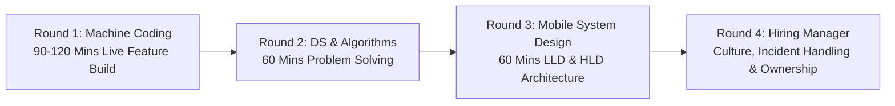
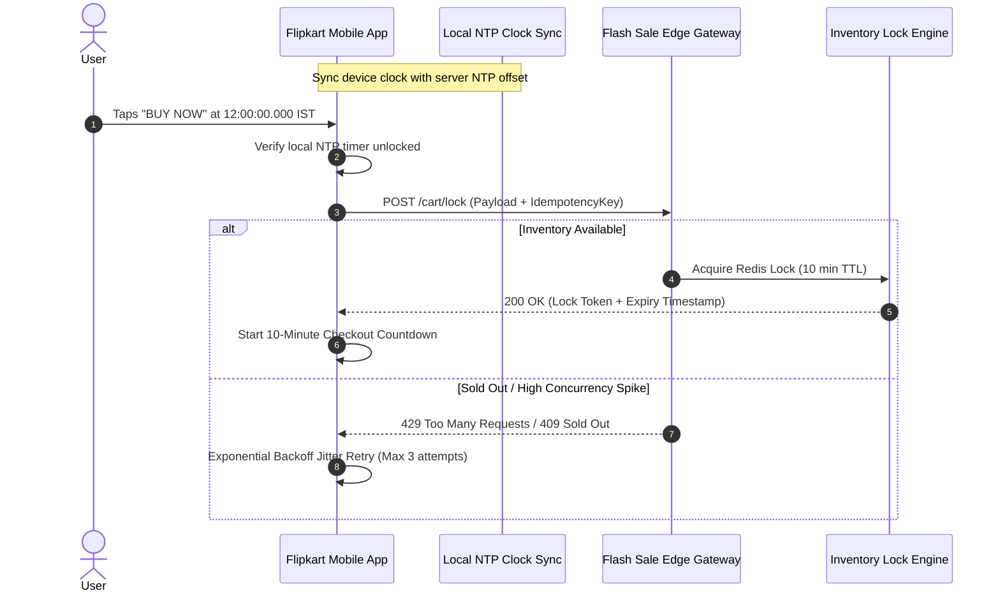
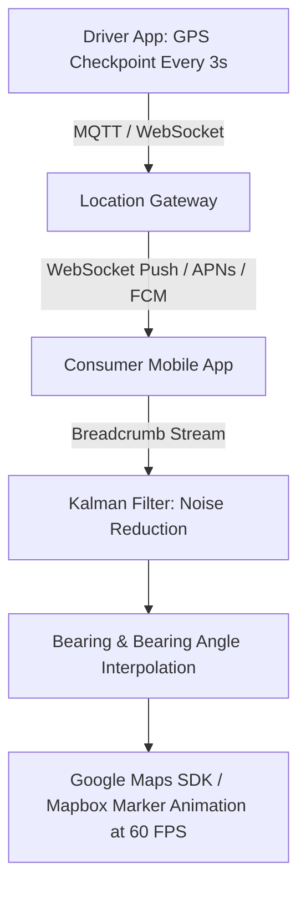
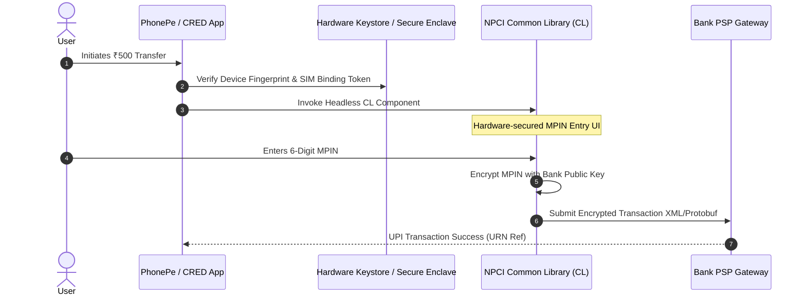

# 🇮🇳 Indian Product-Based Companies Mobile Interview Playbook
> **The Definitive Guide to Interviewing, Machine Coding, System Design, and Salary Benchmarks across 60+ Top Indian Tech Unicorns and Product Giants**


---

## 📖 Table of Contents
- [1. The Indian Mobile Tech Landscape](#1-the-indian-mobile-tech-landscape)
- [2. Comprehensive Sector Breakdown (60+ Companies)](#2-comprehensive-sector-breakdown)
  - [FinTech, Payments & WealthTech](#fintech-payments--wealthtech)
  - [Quick Commerce & Food Delivery](#quick-commerce--food-delivery)
  - [E-Commerce & Fashion Tech](#e-commerce--fashion-tech)
  - [Mobility, EV & Logistics](#mobility-ev--logistics)
  - [Entertainment, Ticketing & Travel](#entertainment-ticketing--travel)
  - [Gaming & Real-Money Gaming (RMG)](#gaming--real-money-gaming-rmg)
  - [HealthTech & EdTech](#healthtech--edtech)
  - [Global SaaS & Dev Tools Founded in India](#global-saas--dev-tools-founded-in-india)
- [3. The Standard Indian Product Interview Loop](#3-the-standard-indian-product-interview-loop)
- [4. The Machine Coding Round Playbook (The #1 Elimination Round)](#4-the-machine-coding-round-playbook)
- [5. Deep-Dive Mobile System Design Blueprints for Indian Unicorns](#5-deep-dive-mobile-system-design-blueprints)
  - [Blueprint 1: Flipkart Big Billion Day Flash Sale & Checkout Lock](#blueprint-1-flipkart-flash-sale--checkout-lock)
  - [Blueprint 2: Swiggy / Zepto 10-Minute Dark Store & Live Courier Tracking](#blueprint-2-swiggy--zepto-live-courier-tracking)
  - [Blueprint 3: PhonePe / CRED Headless UPI Payment & SIM Binding](#blueprint-3-phonepe--cred-headless-upi-payment)
  - [Blueprint 4: Zerodha Kite 60 FPS Canvas Financial Charting Engine](#blueprint-4-zerodha-kite-60-fps-financial-charts)
- [6. Top 5 DSA & Problem-Solving Algorithms for Indian Tech Interviews](#6-top-5-dsa--problem-solving-algorithms)
- [7. Unique Mobile Engineering Challenges in India](#7-unique-mobile-engineering-challenges-in-india)
- [8. SDE Compensation & Salary Benchmarks (INR LPA)](#8-sde-compensation--salary-benchmarks-inr-lpa)
- [9. Notice Period & Offer Negotiation Strategy in India](#9-notice-period--offer-negotiation-strategy-in-india)

---

## 1. The Indian Mobile Tech Landscape

India has one of the largest and fastest-growing mobile-first internet populations in the world with over **750+ million smartphone users**:
- **Platform Dynamics:** Android commands **~95% market share** across hundreds of heterogeneous budget OEM devices (Xiaomi, Realme, Samsung, Vivo, Oppo), while iOS represents an influential, high-spending segment driving the fastest-growing premium consumer apps (CRED, Apple Pay, Swiggy One).
- **Engineering Complexity:** Indian product companies build for extreme scale (tens of millions of daily active users) under demanding local constraints: low-spec budget hardware (2GB/3GB RAM), Android Go editions, intermittent cellular transitions, and strict financial compliance (NPCI UPI, SEBI, RBI data localization).

---

## 2. Comprehensive Sector Breakdown

### FinTech, Payments & WealthTech
High-trust, ultra-secure transaction pipelines, biometric authentication, and high-frequency data feeds.

| Company | Key Mobile Features & Focus Areas | Guide Link |
| :--- | :--- | :--- |
| **CRED** | Neo-brutalist UI animations, custom canvas roulette physics, credit score gauge, strict biometric security. | [CRED.md](./Cred/Cred.md) |
| **PhonePe** | NPCI UPI SDK, SIM binding, biometric PIN auth, offline merchant QR scanning, high-reliability payments. | [PhonePe.md](./Phonepay/Phonepay.md) |
| **Razorpay** | Checkout SDK, headless UPI integration, custom payment sheets, developer documentation. | [Razorpay.md](./Razorpay/Razorpay.md) |
| **Paytm** | Multi-service wallet, soundbox Bluetooth telemetry, fast transit cards, mini-apps container. | [Paytm.md](./Paytm/Paytm.md) |
| **Zerodha** | Kite mobile app, ultra-lightweight zero-bloat architecture, 60 FPS Canvas charts, tick-by-tick WebSockets. | [Zerodha.md](./Zerodha/Zerodha.md) |
| **Groww** | Stock & mutual fund investment flows, automated SIP recurring mandate state machines, paperless KYC. | [Groww.md](./Groww/Groww.md) |
| **Angel One** | SmartAPI, high-frequency market depth 5 ladder, moving averages, derivatives trading. | [AngelOne.md](./AngelOne/AngelOne.md) |
| **Juspay** | HyperSDK, pre-render engine, PureScript / functional mobile architecture, headless UPI payments. | [Juspay.md](./Juspay/Juspay.md) |
| **BharatPe** | Merchant QR ledger, credit underwriting, daily loan collection, voice alert speakers. | [BharatPe.md](./BharatPe/BharatPe.md) |
| **Pine Labs** | Android POS Smart Terminals, biometric smart cards, merchant loyalty integrations. | [PineLabs.md](./PineLabs/PineLabs.md) |
| **Navi** | Instant paperless personal loans, home loans, health insurance checkout with e-NACH auto-debit. | [Navi.md](./Navi/Navi.md) |

---

### Quick Commerce & Food Delivery
Sub-10 minute deliveries, real-time vehicle telemetry, and dynamic inventory locks.

| Company | Key Mobile Features & Focus Areas | Guide Link |
| :--- | :--- | :--- |
| **Swiggy** | Live driver tracking, sticky floating cart, multi-store Instamart orders, iOS Live Activities. | [Swiggy.md](./Swiggy/Swiggy.md) |
| **Zomato** | Hyper-local search debouncing, restaurant menu caching, live delivery ETA countdowns. | [Zomato.md](./Zomato/Zomato.md) |
| **Blinkit** | 10-minute delivery timer, dark store inventory reservation state machine, low-memory catalog rendering. | [Blinkit.md](./Blinkit/Blinkit.md) |
| **Zepto** | Real-time cart countdown timers, dark store geofencing, sub-1-second checkout flow. | [Zepto.md](./Zepto/Zepto.md) |

---

### E-Commerce & Fashion Tech
Massive festival sales, dynamic carousels, and low-bandwidth image optimization.

| Company | Key Mobile Features & Focus Areas | Guide Link |
| :--- | :--- | :--- |
| **Flipkart** | Big Billion Days flash sales, Server-Driven UI (SDUI), custom two-tier image caching. | [Flipkart.md](./Flipkart/Flipkart.md) |
| **Myntra** | Video feed shopping, high-fashion image galleries, dynamic personalized recommendations. | [Myntra.md](./Myntra/Myntra.md) |
| **Meesho** | Social reselling, ultra-lightweight APK size (<15MB), offline catalog sharing via WhatsApp. | [Meesho.md](./Meesho/Meesho.md) |
| **Ajio** | Reliance retail fashion catalog, coupon recommendation engine, secure return tracking. | [Ajio.md](./Ajio/Ajio.md) |
| **Tata Neu** | Super-app loyalty currency (NeuCoins), cross-brand identity SSO, flight/hotel/grocery booking. | [TataNeu.md](./TataNeu/TataNeu.md) |
| **Nykaa** | Beauty commerce, AR live camera lipstick shade try-on, beauty influencer video feeds. | [Nykaa.md](./Nykaa/Nykaa.md) |
| **Lenskart** | 3D Face Mapping camera module, virtual eyewear try-on, prescription camera upload. | [Lenskart.md](./Lenskart/Lenskart.md) |

---

### Mobility, EV & Logistics
Battery-conscious GPS breadcrumbs, Bluetooth LE pairing, and map routing.

| Company | Key Mobile Features & Focus Areas | Guide Link |
| :--- | :--- | :--- |
| **Ola** | Ride booking, auto-rickshaw pooling, Ola Electric scooter companion controls, offline maps. | [Ola.md](./Ola/Ola.md) |
| **Rapido** | Bike-taxi dispatching, live captain tracking, low-latency push notification dispatch. | [Rapido.md](./Rapido/Rapido.md) |
| **Ather Energy** | Connected EV companion app, Bluetooth auto-unlock, charging telemetry, live Ather Grid navigation. | [Ather_Energy.md](./Ather_Energy/Ather_Energy.md) |
| **Delhivery** | Field delivery agent app, offline barcode scanning with ML Kit, proof-of-delivery photos. | [Delhivery.md](./Delhivery/Delhivery.md) |
| **RedBus** | Inter-city bus tracking, GPS live bus location, seat layout selector, rest-stop alerts. | [RedBus.md](./RedBus/RedBus.md) |
| **Cars24** | Real-time vehicle inspection checklist, 360-degree high-res car photo capture, instant loan pre-approval. | [Cars24.md](./Cars24/Cars24.md) |

---

### Entertainment, Ticketing & Travel

| Company | Key Mobile Features & Focus Areas | Guide Link |
| :--- | :--- | :--- |
| **BookMyShow** | High-concurrency seat matrix selection on Canvas, 8-minute reservation lock, digital passes. | [BookMyShow.md](./BookMyShow/BookMyShow.md) |
| **MakeMyTrip** | Multi-city flight booking, hotel room video tours, train PNR status live tracking. | [MakeMyTrip.md](./MakeMyTrip/MakeMyTrip.md) |
| **Ixigo** | Live running train status using cell tower triangulation without GPS, instant PNR prediction. | [Ixigo.md](./Ixigo/Ixigo.md) |
| **Dailyhunt / Glance** | Infinite news scroll, lock-screen interactive content, low-latency video streaming. | [Dailyhunt.md](./Dailyhunt/Dailyhunt.md) |
| **ShareChat / Moj** | Short-video feed, audio chat rooms, regional language input keyboards, camera filters. | [ShareChat.md](./ShareChat/ShareChat.md) |

---

### Gaming & Real-Money Gaming (RMG)

| Company | Key Mobile Features & Focus Areas | Guide Link |
| :--- | :--- | :--- |
| **Dream11** | High-concurrency fantasy team creation, live match leaderboard points calculation at 500K RPS. | [Dream11.md](./Dream11/Dream11.md) |
| **MPL** | Mobile Premier League gaming container, low-latency multiplayer WebSockets, fraud detection. | [MPL.md](./MPL/MPL.md) |
| **Games24x7** | RummyCircle, card animation physics, RNG certification, anti-collusion algorithms. | [Games24x7.md](./Games24x7/Games24x7.md) |

---

### HealthTech & EdTech

| Company | Key Mobile Features & Focus Areas | Guide Link |
| :--- | :--- | :--- |
| **PharmEasy / 1mg** | Prescription OCR camera upload, medicine cart discount engine, lab test appointment booking. | [PharmEasy.md](./PharmEasy/PharmEasy.md) |
| **CureFit (Cult.fit)** | Live workout camera rep counting via ML Kit pose detection, gym slot reservation timer. | [CureFit.md](./CureFit/CureFit.md) |
| **Unacademy** | Live interactive classroom video, real-time student polls, offline video lecture encryption. | [Unacademy.md](./Unacademy/Unacademy.md) |

---

### Global SaaS & Dev Tools Founded in India

| Company | Key Mobile Features & Focus Areas | Guide Link |
| :--- | :--- | :--- |
| **Postman** | API request execution on mobile, workspace sync, environment variable switcher. | [Postman.md](./Postman/Postman.md) |
| **BrowserStack** | Cloud device control, automated mobile SDK test runners, tunnel proxying. | [BrowserStack.md](./BrowserStack/BrowserStack.md) |
| **Freshworks** | Mobile CRM, customer ticket notification push, offline ticket updates. | [Freshworks.md](./Freshworks/Freshworks.md) |
| **Zoho** | Complete enterprise office suite, offline-first document syncing, email client. | [Zoho.md](./Zoho/Zoho.md) |

---

## 3. The Standard Indian Product Interview Loop

Almost all tier-1 Indian product companies follow a structured 4-round evaluation:



---

## 4. The Machine Coding Round Playbook

The **Machine Coding Round** is the hallmark of Indian tech interviews (CRED, Flipkart, Swiggy, PhonePe, Uber India). In 90–120 minutes, you must design, code, run, and unit-test a working mobile feature from scratch.

### Why 70% of Candidates Fail Machine Coding
1. **Focusing too much on UI:** Spending 75 minutes styling margins, colors, and fonts while having zero architecture, no repository, and no tests.
2. **Over-Engineering:** Spending 60 minutes setting up 12 Hilt modules and Clean Architecture layers without writing a single working screen.
3. **Hardcoding Everything:** Putting all network calls, state mutations, and UI in a single 800-line Activity/ViewController.

### The 90-Minute Execution Blueprint:

```mermaid
gantt
    title 90-Minute Machine Coding Strategy
    dateFormat mm
    axisFormat %M min
    1. Requirement Clarification & Contract Design :00, 10m
    2. Data Layer (Models, Repo & Mock Data Source) :10, 20m
    3. ViewModel & State Management (StateFlow / @Observable) :30, 20m
    4. UI Implementation (Compose / SwiftUI / ViewBinding) :50, 20m
    5. Edge Cases (Loading, Error, Empty, Screen Rotation) :70, 10m
    6. Unit Testing Critical Business Logic & Wrap-up :80, 10m
```



### Standard Evaluation Scoring Rubric:
- **Clean Architecture & Separation of Concerns (30%):** View $\to$ ViewModel $\to$ Repository $\to$ DataSource.
- **Thread Safety & Concurrency (20%):** Proper Coroutine Dispatchers / Swift Actors, no main thread blocking.
- **Code Extensibility & SOLID (20%):** Easy to swap mock data source with a real Retrofit/URLSession API.
- **Error & Edge Case Handling (15%):** Empty states, offline banners, configuration changes (screen rotation).
- **Unit Test Coverage (15%):** At least 2–3 JUnit/MockK or XCTest cases verifying business logic.

---

## 5. Deep-Dive Mobile System Design Blueprints

### Blueprint 1: Flipkart Flash Sale & Checkout Lock
**Problem:** Millions of users attempt to purchase an iPhone at ₹49,999 simultaneously during Big Billion Days. The server has 10,000 units in stock.



**Key Architectural Solutions:**
- **NTP Time Synchronization:** Local device clocks can be altered by users. The app fetches server timestamps during launch and calculates a clock drift offset:
  $$\text{Current Server Time} = \text{SystemClock.elapsedRealtime()} + \text{ServerOffset}$$
- **Idempotency Keys:** Every checkout click generates a unique UUID `checkout_request_id` stored in local Room/CoreData. Even if the network drops and the user taps "Buy Now" twice, the server processes the order exactly once.

---

### Blueprint 2: Swiggy / Zepto Live Courier Tracking
**Problem:** Track delivery partner coordinates in real time, showing a smooth car/bike marker moving along a polyline with 10-minute dynamic countdowns.



**Key Architectural Solutions:**
- **Kalman Filtering:** Raw GPS data from budget phones contains significant noise ($\pm 15$ meters). A Kalman filter smooths coordinate jumps before drawing.
- **Bearing Interpolation:** Don't instantly jump marker positions. Animate coordinate latitude/longitude smoothly over 3 seconds using `ValueAnimator` / `withAnimation` while rotating the vehicle icon to face the heading angle.
- **iOS Live Activities:** Use ActivityKit to display real-time order status on the Lock Screen and Dynamic Island without requiring the user to open the app.

---

### Blueprint 3: PhonePe / CRED Headless UPI Payment
**Problem:** Seamlessly execute UPI transactions on Android/iOS adhering to NPCI (National Payments Corporation of India) security guidelines.



**Key Architectural Solutions:**
- **Hardware SIM Binding:** Android telephony manager verifies that the SIM card slot matches the phone number registered during onboarding. If the user swaps SIMs, the app invalidates tokens and forces re-verification.
- **SafetyNet / Play Integrity API:** Validating that the APK has not been tampered with, is installed from Google Play, and is not running on a rooted device or emulator.
- **`FLAG_SECURE` / Screen Protection:** Preventing screen recording or screenshot capture of sensitive banking balances and UPI PIN inputs.

---

### Blueprint 4: Zerodha Kite 60 FPS Financial Charts
**Problem:** Ingest 500+ tick updates per second across 50 stock symbols on a watchlist without dropping frames or causing phone thermal throttling.

**Key Architectural Solutions:**
- **Sampling & Throttling Buffer:** The human eye and mobile screens refresh at 60Hz or 120Hz. Processing 500 ticks/sec on the UI thread causes massive UI freezing. Use a Coroutine/Flow sampling buffer:
  ```kotlin
  stockPriceFlow
      .sample(16.milliseconds) // Cap updates to 60 FPS
      .flowOn(Dispatchers.Default)
      .collect { latestTick -> updateWatchlistUI(latestTick) }
  ```
- **Custom Hardware-Accelerated Canvas:** Avoid using nested Composables or Views for stock candlestick charts. Use a single custom Canvas with path reuse (`Path.rewind()` instead of allocating new `Path` objects each frame) to eliminate garbage collection pauses.

---

## 6. Top 5 DSA & Problem-Solving Algorithms for Indian Tech Interviews

Practice these 5 algorithmic patterns that appear repeatedly in Indian product company coding rounds:

### 1. Autocomplete Search Trie with Debounce
**Problem:** Implement a Trie data structure that indexes 50,000 product keywords and returns the top 5 suggestions with matching prefixes ranked by search frequency.

```kotlin
class AutocompleteTrie {
    private class Node {
        val children = mutableMapOf<Char, Node>()
        val topSuggestions = mutableListOf<String>()
    }

    private val root = Node()

    fun insert(word: String) {
        var current = root
        for (char in word) {
            current = current.children.getOrPut(char) { Node() }
            if (current.topSuggestions.size < 5 && !current.topSuggestions.contains(word)) {
                current.topSuggestions.add(word)
            }
        }
    }

    fun searchPrefix(prefix: String): List<String> {
        var current = root
        for (char in prefix) {
            current = current.children[char] ?: return emptyList()
        }
        return current.topSuggestions
    }
}
```

---

### 2. Sliding Window Rate Limiter
**Problem:** Implement a client-side rate limiter that prevents users from tapping "Order Now" more than 5 times in a rolling 10-second window.

```kotlin
class SlidingWindowRateLimiter(
    private val maxRequests: Int = 5,
    private val windowMs: Long = 10_000L
) {
    private val requestTimestamps = ArrayDeque<Long>()

    @Synchronized
    fun allowRequest(): Boolean {
        val now = System.currentTimeMillis()
        while (requestTimestamps.isNotEmpty() && now - requestTimestamps.first() > windowMs) {
            requestTimestamps.removeFirst()
        }
        return if (requestTimestamps.size < maxRequests) {
            requestTimestamps.addLast(now)
            true
        } else {
            false
        }
    }
}
```

---

### 3. Two-Tier Memory + Disk LRU Cache
**Problem:** Design a memory-first cache that evicts items to disk when in-memory count exceeds capacity.

---

### 4. GPS Polyline Simplification (Ramer-Douglas-Peucker)
**Problem:** Given a delivery rider's path of 10,000 coordinates, simplify it into a lightweight polyline with minimal geometric distortion for rendering on Google Maps.

---

### 5. Dynamic Programming: Coupon & Discount Optimizer
**Problem:** Given a shopping cart and conflicting coupons (flat discount, percentage off, buy-2-get-1), determine the combination that maximizes savings.

---

## 7. Unique Mobile Engineering Challenges in India

When interviewing with Indian product companies, impress interviewers by discussing these real-world mobile engineering constraints:

1. **The "Next Billion Users" Hardware Constraint:**
   - Many Indian consumers use devices with 2GB–3GB RAM running Android Go editions.
   - You must know how to eliminate memory leaks, restrict image cache sizes, and avoid heavy third-party SDK dependencies.
2. **Bandwidth Optimization & APK Size:**
   - Every additional 5MB in APK download size results in a **~1-2% drop in installation conversion**.
   - Companies rely heavily on ProGuard/R8 rules, WebP image formats, and Dynamic Feature Delivery.
3. **Regulatory & Compliance Architecture:**
   - **NPCI & UPI Guidelines:** SIM binding verification, device fingerprinting, and strict token storage in hardware Keystore.
   - **SEBI & RBI Rules:** Mandatory Two-Factor Authentication (TOTP / MPIN), session auto-expiry after 5 minutes of inactivity.

---

## 8. SDE Compensation & Salary Benchmarks (INR LPA)

*Benchmarks across top Indian Product Companies (CRED, Swiggy, Flipkart, PhonePe, Uber India, Google India):*

| Role Level | Experience | Fixed Base Salary (INR) | Variable / Bonus | Stock Options / RSUs |
| :--- | :--- | :--- | :--- | :--- |
| **SDE-1 (Junior / Fresher)** | 0 – 2 Years | **₹18L – ₹30L** | 10% – 15% | ₹5L – ₹15L / year |
| **SDE-2 (Mid-Level)** | 2 – 5 Years | **₹32L – ₹50L** | 10% – 20% | ₹15L – ₹30L / year |
| **SDE-3 / Senior Mobile Dev** | 5 – 8 Years | **₹55L – ₹80L** | 15% – 25% | ₹30L – ₹60L / year |
| **Staff / Lead Mobile Dev** | 8 – 12+ Years| **₹85L – ₹1.3Cr+** | 20% – 30% | ₹60L – ₹1.2Cr+ / year |

---

## 9. Notice Period & Offer Negotiation Strategy in India

Handling the standard Indian 60-to-90 day notice period while negotiating multiple offers requires deliberate strategy:

### 1. Handling the 60–90 Day Notice Period
- **Get Initial Offers First:** Most Indian startups prefer immediate joiners (< 30 days). Target companies like Flipkart, Amazon, or Google first who can comfortably wait 90 days.
- **Notice Period Buyout:** Once an initial offer is in hand, ask competing companies if they offer a **Notice Period Buyout Bonus** to buy out your remaining days.

### 2. The Multi-Offer Leverage Sequence
```text
Offer 1 (Service / Mid-tier Product) -> Offer 2 (High-Growth Unicorn) -> Offer 3 (Tier-1 Product Giant)
```
- Never reveal exact numbers verbally. State:  
  *"I am currently in final rounds with two Tier-1 consumer tech companies. Based on the responsibilities and scope of this role, I am expecting compensation aligned with top-quartile market benchmarks (₹XL base)."*
- When an offer arrives, ask for a written breakdown: **Fixed Base, Annual Performance Bonus, Joining Bonus, and 4-Year ESOP vesting schedule**.
