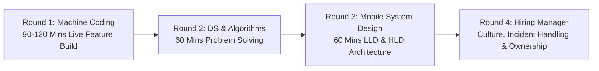

# 🇮🇳 Indian Product-Based Companies Mobile Interview Playbook
> **The Definitive Guide to Interviewing, System Design, and Salary Benchmarks across 60+ Top Indian Tech Unicorns and Product Giants**

---

## 📖 Table of Contents
- [1. The Indian Mobile Tech Landscape](#1-the-indian-mobile-tech-landscape)
- [2. Comprehensive Sector Breakdown (60+ Companies)](#2-comprehensive-sector-breakdown)
  - [FinTech, Payments & WealthTech](#fintech-payments--wealthtech)
  - [Quick Commerce & Food Delivery](#quick-commerce--food-delivery)
  - [E-Commerce & Fashion Tech](#e-commerce--fashion-tech)
  - [Mobility, EV & Logistics](#mobility-ev--logistics)
  - [Entertainment, Ticketing & Travel](#entertainment-ticketing--travel)
  - [Gaming & Real-Money Gaming (RMG)](#gaming--real-money-gaming-rmg)
  - [HealthTech & EdTech](#healthtech--edtech)
  - [Global SaaS & Dev Tools Founded in India](#global-saas--dev-tools-founded-in-india)
- [3. The Standard Indian Product Interview Loop](#3-the-standard-indian-product-interview-loop)
- [4. Unique Mobile Engineering Challenges in India](#4-unique-mobile-engineering-challenges-in-india)
- [5. SDE Compensation & Salary Benchmarks (INR LPA)](#5-sde-compensation--salary-benchmarks-inr-lpa)

---

## 1. The Indian Mobile Tech Landscape

India has one of the largest and fastest-growing mobile-first internet populations in the world with over **750+ million smartphone users**:
- **Platform Dynamics:** Android holds **~95% market share** across diverse budget hardware, while iOS represents an influential, high-spending segment driving the fastest-growing premium consumer apps.
- **Engineering Complexity:** Indian product companies build for extreme scale (hundreds of millions of transactions) under challenging conditions: low-spec budget hardware (2GB/3GB RAM), Android Go editions, and fluctuating network speeds across Tier-2/3/4 cities.

---

## 2. Comprehensive Sector Breakdown

### FinTech, Payments & WealthTech
High-trust, ultra-secure transaction pipelines, biometric authentication, and high-frequency data feeds.

| Company | Key Mobile Features & Focus Areas | Guide Link |
| :--- | :--- | :--- |
| **CRED** | Neo-brutalist UI animations, custom canvas roulette physics, credit score gauge, strict biometric security. | [CRED.md](./Cred/Cred.md) |
| **PhonePe** | NPCI UPI SDK, SIM binding, biometric PIN auth, offline merchant QR scanning, high-reliability payments. | [PhonePe.md](./Phonepay/Phonepay.md) |
| **Razorpay** | Checkout SDK, headless UPI integration, custom payment sheets, developer documentation. | [Razorpay.md](./Razorpay/Razorpay.md) |
| **Paytm** | Multi-service wallet, soundbox Bluetooth telemetry, fast transit cards, mini-apps container. | [Paytm.md](./Paytm/Paytm.md) |
| **Zerodha** | Kite mobile app, ultra-lightweight zero-bloat architecture, 60 FPS Canvas charts, tick-by-tick WebSockets. | [Zerodha.md](./Zerodha/Zerodha.md) |
| **Groww** | Stock & mutual fund investment flows, automated SIP recurring mandate state machines, paperless KYC. | [Groww.md](./Groww/Groww.md) |
| **Angel One** | SmartAPI, high-frequency market depth 5 ladder, moving averages, derivatives trading. | [AngelOne.md](./AngelOne/AngelOne.md) |
| **Juspay** | HyperSDK, pre-render engine, PureScript / functional mobile architecture, headless UPI payments. | [Juspay.md](./Juspay/Juspay.md) |
| **BharatPe** | Merchant QR ledger, credit underwriting, daily loan collection, voice alert speakers. | [BharatPe.md](./BharatPe/BharatPe.md) |
| **Pine Labs** | Android POS Smart Terminals, biometric smart cards, merchant loyalty integrations. | [PineLabs.md](./PineLabs/PineLabs.md) |
| **Navi** | Instant paperless personal loans, home loans, health insurance checkout with e-NACH auto-debit. | [Navi.md](./Navi/Navi.md) |

---

### Quick Commerce & Food Delivery
Sub-10 minute deliveries, real-time vehicle telemetry, and dynamic inventory locks.

| Company | Key Mobile Features & Focus Areas | Guide Link |
| :--- | :--- | :--- |
| **Swiggy** | Live driver tracking, sticky floating cart, multi-store Instamart orders, iOS Live Activities. | [Swiggy.md](./Swiggy/Swiggy.md) |
| **Zomato** | Hyper-local search debouncing, restaurant menu caching, live delivery ETA countdowns. | [Zomato.md](./Zomato/Zomato.md) |
| **Blinkit** | 10-minute delivery timer, dark store inventory reservation state machine, low-memory catalog rendering. | [Blinkit.md](./Blinkit/Blinkit.md) |
| **Zepto** | Real-time cart countdown timers, dark store geofencing, sub-1-second checkout flow. | [Zepto.md](./Zepto/Zepto.md) |

---

### E-Commerce & Fashion Tech
Massive festival sales, dynamic carousels, and low-bandwidth image optimization.

| Company | Key Mobile Features & Focus Areas | Guide Link |
| :--- | :--- | :--- |
| **Flipkart** | Big Billion Days flash sales, Server-Driven UI (SDUI), custom two-tier image caching. | [Flipkart.md](./Flipkart/Flipkart.md) |
| **Myntra** | Video feed shopping, high-fashion image galleries, dynamic personalized recommendations. | [Myntra.md](./Myntra/Myntra.md) |
| **Meesho** | Social reselling, ultra-lightweight APK size (<15MB), offline catalog sharing via WhatsApp. | [Meesho.md](./Meesho/Meesho.md) |
| **Ajio** | Reliance retail fashion catalog, coupon recommendation engine, secure return tracking. | [Ajio.md](./Ajio/Ajio.md) |
| **Tata Neu** | Super-app loyalty currency (NeuCoins), cross-brand identity SSO, flight/hotel/grocery booking. | [TataNeu.md](./TataNeu/TataNeu.md) |
| **Nykaa** | Beauty commerce, AR live camera lipstick shade try-on, beauty influencer video feeds. | [Nykaa.md](./Nykaa/Nykaa.md) |
| **Lenskart** | 3D Face Mapping camera module, virtual eyewear try-on, prescription camera upload. | [Lenskart.md](./Lenskart/Lenskart.md) |

---

### Mobility, EV & Logistics
Battery-conscious GPS breadcrumbs, Bluetooth LE pairing, and map routing.

| Company | Key Mobile Features & Focus Areas | Guide Link |
| :--- | :--- | :--- |
| **Ola** | Ride booking, auto-rickshaw pooling, Ola Electric scooter companion controls, offline maps. | [Ola.md](./Ola/Ola.md) |
| **Rapido** | Bike-taxi dispatching, live captain tracking, low-latency push notification dispatch. | [Rapido.md](./Rapido/Rapido.md) |
| **Ather Energy** | Connected EV companion app, Bluetooth auto-unlock, charging telemetry, live Ather Grid navigation. | [Ather_Energy.md](./Ather_Energy/Ather_Energy.md) |
| **Delhivery** | Field delivery agent app, offline barcode scanning with ML Kit, proof-of-delivery photos. | [Delhivery.md](./Delhivery/Delhivery.md) |
| **RedBus** | Inter-city bus tracking, GPS live bus location, seat layout selector, rest-stop alerts. | [RedBus.md](./RedBus/RedBus.md) |
| **Cars24** | Real-time vehicle inspection checklist, 360-degree high-res car photo capture, instant loan pre-approval. | [Cars24.md](./Cars24/Cars24.md) |

---

### Entertainment, Ticketing & Travel

| Company | Key Mobile Features & Focus Areas | Guide Link |
| :--- | :--- | :--- |
| **BookMyShow** | High-concurrency seat matrix selection on Canvas, 8-minute reservation lock, digital passes. | [BookMyShow.md](./BookMyShow/BookMyShow.md) |
| **MakeMyTrip** | Multi-city flight booking, hotel room video tours, train PNR status live tracking. | [MakeMyTrip.md](./MakeMyTrip/MakeMyTrip.md) |
| **Ixigo** | Live running train status using cell tower triangulation without GPS, instant PNR prediction. | [Ixigo.md](./Ixigo/Ixigo.md) |
| **Dailyhunt / Glance** | Infinite news scroll, lock-screen interactive content, low-latency video streaming. | [Dailyhunt.md](./Dailyhunt/Dailyhunt.md) |
| **ShareChat / Moj** | Short-video feed, audio chat rooms, regional language input keyboards, camera filters. | [ShareChat.md](./ShareChat/ShareChat.md) |

---

### Gaming & Real-Money Gaming (RMG)

| Company | Key Mobile Features & Focus Areas | Guide Link |
| :--- | :--- | :--- |
| **Dream11** | High-concurrency fantasy team creation, live match leaderboard points calculation at 500K RPS. | [Dream11.md](./Dream11/Dream11.md) |
| **MPL** | Mobile Premier League gaming container, low-latency multiplayer WebSockets, fraud detection. | [MPL.md](./MPL/MPL.md) |
| **Games24x7** | RummyCircle, card animation physics, RNG certification, anti-collusion algorithms. | [Games24x7.md](./Games24x7/Games24x7.md) |

---

### HealthTech & EdTech

| Company | Key Mobile Features & Focus Areas | Guide Link |
| :--- | :--- | :--- |
| **PharmEasy / 1mg** | Prescription OCR camera upload, medicine cart discount engine, lab test appointment booking. | [PharmEasy.md](./PharmEasy/PharmEasy.md) |
| **CureFit (Cult.fit)** | Live workout camera rep counting via ML Kit pose detection, gym slot reservation timer. | [CureFit.md](./CureFit/CureFit.md) |
| **Unacademy** | Live interactive classroom video, real-time student polls, offline video lecture encryption. | [Unacademy.md](./Unacademy/Unacademy.md) |

---

### Global SaaS & Dev Tools Founded in India

| Company | Key Mobile Features & Focus Areas | Guide Link |
| :--- | :--- | :--- |
| **Postman** | API request execution on mobile, workspace sync, environment variable switcher. | [Postman.md](./Postman/Postman.md) |
| **BrowserStack** | Cloud device control, automated mobile SDK test runners, tunnel proxying. | [BrowserStack.md](./BrowserStack/BrowserStack.md) |
| **Freshworks** | Mobile CRM, customer ticket notification push, offline ticket updates. | [Freshworks.md](./Freshworks/Freshworks.md) |
| **Zoho** | Complete enterprise office suite, offline-first document syncing, email client. | [Zoho.md](./Zoho/Zoho.md) |

---

## 3. The Standard Indian Product Interview Loop

Almost all tier-1 Indian product companies follow a structured 4-round evaluation:

1. **Round 1: Machine Coding / Practical Assignment (90–120 Mins):**
   - You are given a real-world mini-app problem statement (e.g., *Build an offline-first Movie Discovery app with search, favorites, Room/CoreData caching, and Compose/SwiftUI UI*).
   - Evaluated on: Clean Architecture (MVVM), code separation, thread safety, unit test coverage, and error handling.
2. **Round 2: Data Structures & Algorithms (60 Mins):**
   - 2 medium-to-hard LeetCode problems (Trie for autocomplete, Two-Pointers, Sliding Window, Interval overlaps, Graph/BFS).
3. **Round 3: Mobile System Design (LLD / HLD - 60 Mins):**
   - Designing an end-to-end mobile architecture (e.g., *Design Swiggy Live Tracking*, *Design Flipkart Flash Sale*, *Design CRED Animation Engine*).
   - Evaluated on: Network protocol selection (HTTP vs SSE vs WebSockets), offline caching strategies, memory constraints, battery vitals, and modularization.
4. **Round 4: Hiring Manager / Techno-Managerial:**
   - Deep-dive into past production outages, handling aggressive sprint delivery timelines, and alignment with company core values.

---

## 4. Unique Mobile Engineering Challenges in India

When interviewing with Indian product companies, impress interviewers by discussing these real-world mobile engineering constraints:

1. **The "Next Billion Users" Hardware Constraint:**
   - Many Indian consumers use devices with 2GB–3GB RAM running Android Go editions.
   - You must know how to eliminate memory leaks, restrict image cache sizes, and avoid heavy third-party SDK dependencies.
2. **Bandwidth Optimization & APK Size:**
   - Every additional 5MB in APK download size results in a **~1-2% drop in installation conversion**.
   - Companies rely heavily on ProGuard/R8 rules, WebP image formats, and Dynamic Feature Delivery.
3. **Regulatory & Compliance Architecture:**
   - **NPCI & UPI Guidelines:** SIM binding verification, device fingerprinting, and strict token storage in hardware Keystore.
   - **SEBI & RBI Rules:** Mandatory Two-Factor Authentication (TOTP / MPIN), session auto-expiry after 5 minutes of inactivity.

---

## 5. SDE Compensation & Salary Benchmarks (INR LPA)

*Benchmarks across top Indian Product Companies (CRED, Swiggy, Flipkart, PhonePe, Uber India, Google India):*

| Role Level | Experience | Fixed Base Salary (INR) | Variable / Bonus | Stock Options / RSUs |
| :--- | :--- | :--- | :--- | :--- |
| **SDE-1 (Junior / Fresher)** | 0 – 2 Years | **₹18L – ₹30L** | 10% – 15% | ₹5L – ₹15L / year |
| **SDE-2 (Mid-Level)** | 2 – 5 Years | **₹32L – ₹50L** | 10% – 20% | ₹15L – ₹30L / year |
| **SDE-3 / Senior Mobile Dev** | 5 – 8 Years | **₹55L – ₹80L** | 15% – 25% | ₹30L – ₹60L / year |
| **Staff / Lead Mobile Dev** | 8 – 12+ Years| **₹85L – ₹1.3Cr+** | 20% – 30% | ₹60L – ₹1.2Cr+ / year |
