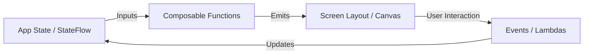

# 🎨 Jetpack Compose Architecture & Engineering Mastery

> **The modern declarative UI toolkit for Android — from state modeling and recomposition optimization to side-effects, custom layouts, and design systems.**

---

## 🏗️ The Declarative Paradigm Shift

Jetpack Compose completely replaces the legacy Android View system with a reactive, Kotlin-native declarative model:

```
Imperative Views (Legacy)           Declarative Compose (Modern)
+-----------------------+           +-----------------------+
| Mutate View Directly  |           | Data Flow: Down (Args)|
| findViewById()        |    ───>   | Events Flow: Up (Cb)  |
| setText(), setGone()  |           | UI = f(State)         |
+-----------------------+           +-----------------------+
```



---

## 📑 Core Chapters in this Module

| Chapter | Topic | Highlights |
|:---|:---|:---|
| **[04. State Management](./04_State_Management.md)** | Reactive State | `remember`, `mutableStateOf`, `rememberSaveable`, and Unidirectional Data Flow (UDF). |
| **[05. Side-Effects Mastery](./05_Side_Effects.md)** | Lifecycle Effect APIs | `LaunchedEffect`, `rememberCoroutineScope`, `DisposableEffect`, `produceState`, `derivedStateOf`. |
| **[06. Layout & Modifiers](./06_Layout__UI.md)** | Composition Hierarchy | `Box`, `Column`, `Row`, `LazyColumn`, Custom Modifiers, and SubcomposeLayout. |
| **[07. Navigation](./07_Navigation.md)** | App Navigation | Type-Safe Compose Navigation with Kotlinx Serialization. |
| **[09. Design Systems & M3](./09_Theming__Material_Design.md)** | Theming & Styling | Material 3 Dynamic Color, Typography scales, Shape tokens, and Dark Mode. |
| **[10. Animations](./10_Animations.md)** | Motion & Physics | `animateContentSize`, `AnimatedVisibility`, `animateFloatAsState`, and transition specs. |
| **[11 & 19. Performance](./19_Performance_Deep_Dive.md)** | Recomposition Tuning | `@Stable`, `@Immutable`, Compose Compiler Metrics (skippable vs restartable), and phase deferral. |
| **[12. UI Testing](./12_Testing.md)** | Compose Testing | `createComposeRule()`, semantics tree inspection, and headless UI automation. |
| **[13. Interoperability](./13_Interoperability.md)** | Hybrid Migration | `AndroidView` inside Compose and `ComposeView` inside XML layouts. |
