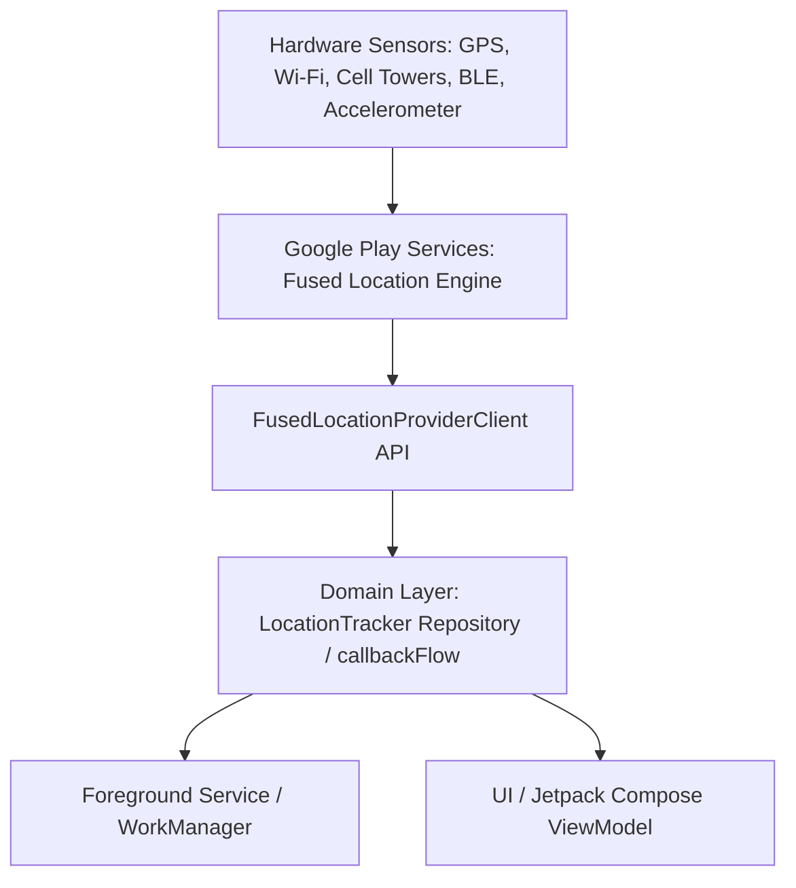
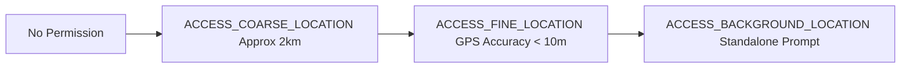
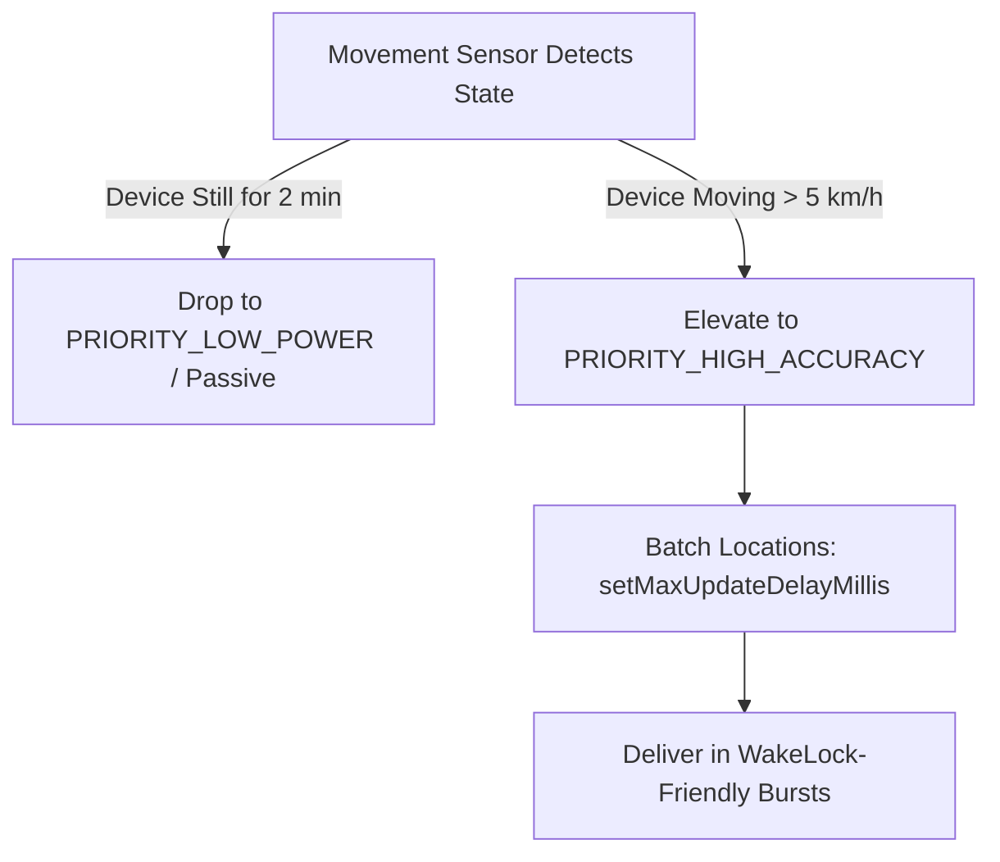

# 📍 Location Provider & Foreground Service Architecture
> **Targeted for Senior, Staff, and Lead Android Engineers**  
> **Core Focus:** FusedLocationProviderClient, Android 10-15+ Permissions, Battery Optimization, Foreground Service Types, and Reactive Kotlin Flow Streams.


---

## 📖 Table of Contents
- [1. Location Architecture Overview](#1-location-architecture-overview)
- [2. FusedLocationProviderClient Internals](#2-fusedlocationproviderclient-internals)
- [3. Modern Android Location Permissions (Android 10 - 15+)](#3-modern-android-location-permissions-android-10---15)
- [4. Reactive Location Flow with `callbackFlow`](#4-reactive-location-flow-with-callbackflow)
- [5. Foreground Service for Ongoing Tracking](#5-foreground-service-for-ongoing-tracking)
- [6. Battery & Doze Mode Optimization](#6-battery--doze-mode-optimization)
- [7. Staff-Level Architecture: Production Location Engine](#7-staff-level-architecture-production-location-engine)
- [8. Top Interview Questions & Edge Cases](#8-top-interview-questions--edge-cases)

---

## 1. Location Architecture Overview

Modern mobile applications (e.g., Uber, DoorDash, Google Maps) require robust, battery-efficient, and accurate location streaming. In Android, the architecture involves three cooperating layers:



---

## 2. FusedLocationProviderClient Internals

Instead of using raw `LocationManager` (which ties you directly to individual GPS or Network hardware chips), Google Play Services provides `FusedLocationProviderClient`.

### How Fusion Works Behind the Scenes
1. **Multi-Source Arbitration:** FusedLocation merges GPS (satellites), Wi-Fi SSID scans, Cellular tower trilateration, and device inertial sensors (magnetometer, accelerometer, step detector).
2. **Wi-Fi & Cell Assisted Positioning:** GPS has a high Time-To-First-Fix (TTFF) when cold (up to 30-60 seconds) and drains 100-300 mA of current. FusedLocation uses Wi-Fi and Cell caches to yield an instant initial fix (~10-20m accuracy) within milliseconds while GPS locks on satellites.
3. **Sensor-Assisted Dead Reckoning:** When driving through tunnels or dense urban canyons where satellite signals reflect off skyscrapers (multipath interference), device accelerometers estimate distance and direction until signal reception stabilizes.

### Priority Levels & Battery Tradeoffs

| Priority Constant | Sensors Used | Accuracy | Target Current Draw | Ideal Use Case |
| :--- | :--- | :--- | :--- | :--- |
| `PRIORITY_HIGH_ACCURACY` | GPS + Wi-Fi + Cell + Sensors | ~1 - 10 meters | ~150 - 250 mA | Turn-by-turn navigation, Active ride-hailing tracking |
| `PRIORITY_BALANCED_POWER_ACCURACY` | Wi-Fi + Cell Towers | ~40 - 100 meters | ~20 - 40 mA | City-level location, Weather, Store finders |
| `PRIORITY_LOW_POWER` | Cell Towers only | ~500 - 2000 meters | < 10 mA | Coarse city/neighborhood check-ins |
| `PRIORITY_PASSIVE` | No active requests (piggybacks on other apps) | Variable | ~0 mA | Background passive geo-tagging, Analytics |

---

## 3. Modern Android Location Permissions (Android 10 - 15+)

Android requires tiered permissions for location:



### Key Permission Nuances
1. **Approximate vs. Precise (Android 12+ / API 31):**
   - The system presents a dialog with "Precise" and "Approximate".
   - You **must** request both `ACCESS_FINE_LOCATION` and `ACCESS_COARSE_LOCATION` simultaneously. If you request only `FINE`, the system ignores it or throws an error.
   - If the user selects "Approximate", the app receives scrambled coordinates (shifted by a random offset of ~2–5 km).
2. **Background Location (Android 10+ / API 29):**
   - Cannot be requested alongside foreground permissions in a single prompt. Doing so causes an automatic permission denial.
   - Flow: Request Foreground -> User Grants -> Explain rationale -> Request `ACCESS_BACKGROUND_LOCATION` (redirects to OS Settings screen in Android 11+).
3. **Foreground Service Location Types (Android 14+ / API 34):**
   - In your `AndroidManifest.xml`, you must declare `android:foregroundServiceType="location"`.
   - You must declare `<uses-permission android:name="android.permission.FOREGROUND_SERVICE_LOCATION" />`.

```xml
<!-- AndroidManifest.xml -->
<manifest xmlns:android="http://schemas.android.com/apk/res/android">

    <uses-permission android:name="android.permission.INTERNET" />
    <uses-permission android:name="android.permission.ACCESS_COARSE_LOCATION" />
    <uses-permission android:name="android.permission.ACCESS_FINE_LOCATION" />
    
    <!-- Required for Android 10+ Background tracking -->
    <uses-permission android:name="android.permission.ACCESS_BACKGROUND_LOCATION" />

    <!-- Required for Android 14+ Foreground Service -->
    <uses-permission android:name="android.permission.FOREGROUND_SERVICE" />
    <uses-permission android:name="android.permission.FOREGROUND_SERVICE_LOCATION" />
    <uses-permission android:name="android.permission.POST_NOTIFICATIONS" />

    <application ...>
        <service
            android:name=".location.LocationForegroundService"
            android:foregroundServiceType="location"
            android:exported="false" />
    </application>
</manifest>
```

---

## 4. Reactive Location Flow with `callbackFlow`

In modern Clean Architecture, avoid leaking `LocationCallback` into UI or ViewModels. Encapsulate location updates inside an idiomatic Kotlin `Flow` using `callbackFlow` and `awaitClose`.

### Implementation

```kotlin
package com.example.location.data

import android.annotation.SuppressLint
import android.content.Context
import android.location.Location
import android.os.Looper
import com.google.android.gms.location.FusedLocationProviderClient
import com.google.android.gms.location.LocationCallback
import com.google.android.gms.location.LocationRequest
import com.google.android.gms.location.LocationResult
import com.google.android.gms.location.Priority
import kotlinx.coroutines.channels.awaitClose
import kotlinx.coroutines.flow.Flow
import kotlinx.coroutines.flow.callbackFlow
import javax.inject.Inject
import javax.inject.Singleton

interface LocationTracker {
    fun getLocationUpdates(intervalMs: Long): Flow<Location>
    suspend fun getCurrentLocation(): Location?
}

@Singleton
class DefaultLocationTracker @Inject constructor(
    private val client: FusedLocationProviderClient,
    private val context: Context
) : LocationTracker {

    @SuppressLint("MissingPermission")
    override fun getLocationUpdates(intervalMs: Long): Flow<Location> = callbackFlow {
        // 1. Build modern LocationRequest (Google Play Services 21.0.0+)
        val locationRequest = LocationRequest.Builder(Priority.PRIORITY_HIGH_ACCURACY, intervalMs)
            .setMinUpdateIntervalMillis(intervalMs / 2) // Fastest rate app can process
            .setMinUpdateDistanceMeters(2.0f)           // Filter micro-jitter when stationary
            .setWaitForAccurateLocation(false)
            .build()

        // 2. Define callback
        val locationCallback = object : LocationCallback() {
            override fun onLocationResult(result: LocationResult) {
                result.lastLocation?.let { location ->
                    trySend(location) // Non-blocking send to Flow downstream
                }
            }
        }

        // 3. Register with FusedLocation
        client.requestLocationUpdates(
            locationRequest,
            locationCallback,
            Looper.getMainLooper()
        ).addOnFailureListener { exception ->
            close(exception)
        }

        // 4. Clean up registration when Flow collector cancels or is destroyed
        awaitClose {
            client.removeLocationUpdates(locationCallback)
        }
    }

    @SuppressLint("MissingPermission")
    override suspend fun getCurrentLocation(): Location? {
        return kotlin.coroutines.suspendCoroutine { continuation ->
            client.getCurrentLocation(Priority.PRIORITY_HIGH_ACCURACY, null)
                .addOnSuccessListener { location -> continuation.resumeWith(Result.success(location)) }
                .addOnFailureListener { continuation.resumeWith(Result.success(null)) }
        }
    }
}
```

---

## 5. Foreground Service for Ongoing Tracking

When tracking a driver or runner who puts their phone in their pocket, the OS will kill background activities within minutes. A Foreground Service with an ongoing notification is required.

```kotlin
package com.example.location.service

import android.app.Notification
import android.app.NotificationChannel
import android.app.NotificationManager
import android.app.PendingIntent
import android.app.Service
import android.content.Context
import android.content.Intent
import android.content.pm.ServiceInfo
import android.os.Build
import android.os.IBinder
import androidx.core.app.NotificationCompat
import androidx.core.app.ServiceCompat
import com.example.location.data.LocationTracker
import dagger.hilt.android.AndroidEntryPoint
import kotlinx.coroutines.CoroutineScope
import kotlinx.coroutines.Dispatchers
import kotlinx.coroutines.SupervisorJob
import kotlinx.coroutines.cancel
import kotlinx.coroutines.flow.catch
import kotlinx.coroutines.flow.launchIn
import kotlinx.coroutines.flow.onEach
import javax.inject.Inject

@AndroidEntryPoint
class LocationForegroundService : Service() {

    @Inject lateinit var locationTracker: LocationTracker
    private val serviceScope = CoroutineScope(SupervisorJob() + Dispatchers.IO)

    companion object {
        const val ACTION_START = "ACTION_START"
        const val ACTION_STOP = "ACTION_STOP"
        const val NOTIFICATION_CHANNEL_ID = "location_tracking_channel"
        const val NOTIFICATION_ID = 1001
    }

    override fun onBind(intent: Intent?): IBinder? = null

    override fun onCreate() {
        super.onCreate()
        createNotificationChannel()
    }

    override fun onStartCommand(intent: Intent?, flags: Int, startId: Int): Int {
        when (intent?.action) {
            ACTION_START -> startTracking()
            ACTION_STOP -> stopTracking()
        }
        return START_STICKY
    }

    private fun startTracking() {
        val notification = buildNotification("Tracking your active route...")
        
        // Android 14 (API 34) requires explicit foregroundServiceType flag
        if (Build.VERSION.SDK_INT >= Build.VERSION_CODES.Q) {
            ServiceCompat.startForeground(
                this,
                NOTIFICATION_ID,
                notification,
                ServiceInfo.FOREGROUND_SERVICE_TYPE_LOCATION
            )
        } else {
            startForeground(NOTIFICATION_ID, notification)
        }

        // Collect location updates at 3-second intervals
        locationTracker.getLocationUpdates(3000L)
            .catch { e -> e.printStackTrace() }
            .onEach { location ->
                updateNotification("Lat: ${location.latitude.format(4)}, Lng: ${location.longitude.format(4)}")
                // Broadcast or push to backend / Firebase here
            }
            .launchIn(serviceScope)
    }

    private fun stopTracking() {
        ServiceCompat.stopForeground(this, ServiceCompat.STOP_FOREGROUND_REMOVE)
        stopSelf()
    }

    private fun buildNotification(content: String): Notification {
        return NotificationCompat.Builder(this, NOTIFICATION_CHANNEL_ID)
            .setContentTitle("Active Trip Tracking")
            .setContentText(content)
            .setSmallIcon(android.R.drawable.ic_menu_mylocation)
            .setOngoing(true)
            .setPriority(NotificationCompat.PRIORITY_LOW)
            .build()
    }

    private fun updateNotification(content: String) {
        val manager = getSystemService(Context.NOTIFICATION_SERVICE) as NotificationManager
        manager.notify(NOTIFICATION_ID, buildNotification(content))
    }

    private fun createNotificationChannel() {
        if (Build.VERSION.SDK_INT >= Build.VERSION_CODES.O) {
            val channel = NotificationChannel(
                NOTIFICATION_CHANNEL_ID,
                "Location Tracking Service",
                NotificationManager.IMPORTANCE_LOW
            )
            val manager = getSystemService(Context.NOTIFICATION_SERVICE) as NotificationManager
            manager.createNotificationChannel(channel)
        }
    }

    override fun onDestroy() {
        super.onDestroy()
        serviceScope.cancel()
    }

    private fun Double.format(digits: Int) = "%.${digits}f".format(this)
}
```

---

## 6. Battery & Doze Mode Optimization

Mobile engineers must prevent excessive battery drain while meeting real-time accuracy demands:



### Essential Optimization Strategies:
1. **Displacement Filter (`setMinUpdateDistanceMeters`):** Avoid waking the CPU when the user is waiting at a traffic light or stationary indoors.
2. **Batched Delivery (`setMaxUpdateDelayMillis`):** Instead of processing every point every 2 seconds, allow the hardware chip to store 5 points and deliver them all at once every 10 seconds. The radio sleeps in between, saving up to **60% RF transmission power**.
3. **Activity Recognition API Integration:** Use `ActivityRecognitionClient` to detect if the user is `STILL`, `WALKING`, or `IN_VEHICLE`. Throttle polling frequency dynamically based on user speed.

---

## 7. Staff-Level Architecture: Production Location Engine

In enterprise-scale apps (e.g., delivery platforms), a production location engine implements:
1. **Kalman Filtering:** Smooths out raw GPS sensor noise, multipath distortion, and altitude fluctuation.
2. **Map Matching:** Snaps coordinates onto open road segments (using OpenStreetMap or Google Roads API) so the vehicle does not appear to drive through buildings.
3. **Dead Reckoning Interpolation:** Predicts intermediate vehicle coordinates between GPS ticks at 60 FPS using vehicle velocity and heading vectors.

---

## 8. Top Interview Questions & Edge Cases

### Q1. Why does my location update stop when the screen turns off, even with a Background Permission?
**Answer:**  
In Android 8.0 (API 26) and higher, **Background Execution Limits** restrict background apps from receiving location updates more than a few times per hour, regardless of whether `ACCESS_BACKGROUND_LOCATION` was granted. To receive continuous location updates (e.g. navigation or fitness tracking), the app must run as an active **Foreground Service** with an ongoing persistent notification and `android:foregroundServiceType="location"`.

### Q2. How does Android 12's Approximate Location impact apps that require precise routing?
**Answer:**  
If a user selects "Approximate", the system truncates coordinate accuracy to within ~1.6 km (1 mile) and recalculates the point at intervals. If your app is a turn-by-turn navigation service, you should:
1. Check `ContextCompat.checkSelfPermission(context, Manifest.permission.ACCESS_FINE_LOCATION)`.
2. If only `COARSE` is granted, display an in-app explanatory UI dialog explaining *why* navigation requires exact GPS.
3. Call `requestPermissions` again for `FINE_LOCATION` to allow the user to upgrade their choice.

### Q3. How do you prevent memory leaks when wrapping FusedLocationProviderClient with Coroutines?
**Answer:**  
Always use `callbackFlow` paired with `awaitClose { client.removeLocationUpdates(callback) }`. If the downstream coroutine scope is cancelled (e.g., user navigates away from the Compose screen), `awaitClose` is guaranteed to be invoked, unregistering the listener from Google Play Services and releasing internal Binder IPC references.
