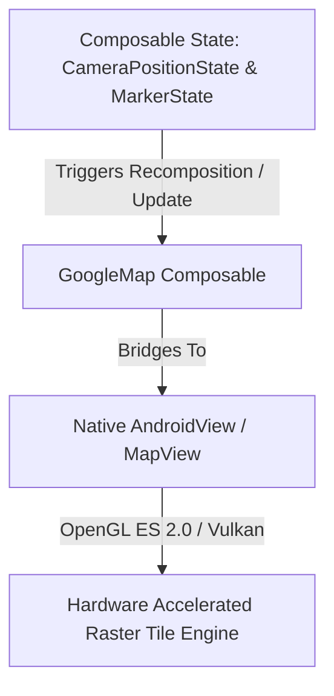
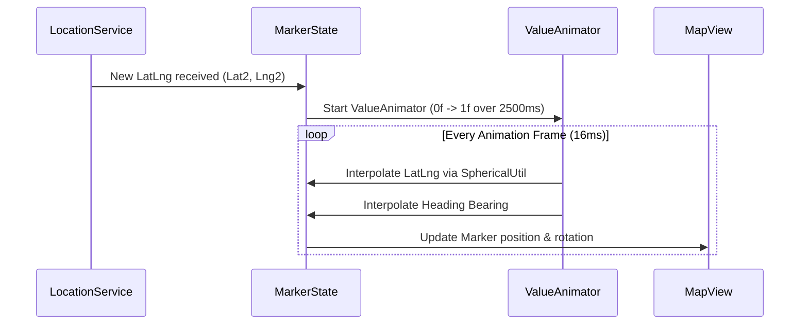

# 🗺️ Google Maps in Jetpack Compose & Smooth Marker Animation
> **Targeted for Senior, Staff, and Lead Android Engineers**  
> **Core Focus:** Maps Compose SDK, Real-time Driver Tracking, Smooth Marker Interpolation, Bearing Calculation, Polyline Rendering, and Marker Clustering.


---

## 📖 Table of Contents
- [1. Google Maps SDK Architecture in Compose](#1-google-maps-sdk-architecture-in-compose)
- [2. Setup & Map Properties](#2-setup--map-properties)
- [3. Real-Time Vehicle / Driver Animation Engine](#3-real-time-vehicle--driver-animation-engine)
- [4. Route Polylines & Directions](#4-route-polylines--directions)
- [5. Marker Clustering for High-Density Datasets](#5-marker-clustering-for-high-density-datasets)
- [6. Custom Map Styling (Dark & Uber-Themed JSON)](#6-custom-map-styling-dark--uber-themed-json)
- [7. Interview Questions & Performance Pitfalls](#7-interview-questions--performance-pitfalls)

---

## 1. Google Maps SDK Architecture in Compose

Traditionally, Android embedded Google Maps using `SupportMapFragment` or `MapView` inside XML layouts. In modern Android, Google maintains the official **Maps Compose** library (`com.google.maps.android:maps-compose`), which wraps the native C++/OpenGL MapView inside a declarative Compose lifecycle.



### Gradle Dependencies
```kotlin
dependencies {
    // Official Maps Compose SDK
    implementation("com.google.maps.android:maps-compose:4.3.3")
    implementation("com.google.android.gms:play-services-maps:19.0.0")

    // Maps Compose Utility Library (Clustering & Spherical Geometry)
    implementation("com.google.maps.android:maps-compose-utils:4.3.3")
    implementation("com.google.maps.android:android-maps-utils:3.8.2")
}
```

---

## 2. Setup & Map Properties

### Jetpack Compose GoogleMap Container

```kotlin
package com.example.maps.ui

import androidx.compose.foundation.layout.Box
import androidx.compose.foundation.layout.fillMaxSize
import androidx.compose.runtime.Composable
import androidx.compose.runtime.getValue
import androidx.compose.runtime.mutableStateOf
import androidx.compose.runtime.remember
import androidx.compose.ui.Modifier
import com.google.android.gms.maps.model.CameraPosition
import com.google.android.gms.maps.model.LatLng
import com.google.android.gms.maps.model.MapStyleOptions
import com.google.maps.android.compose.GoogleMap
import com.google.maps.android.compose.MapProperties
import com.google.maps.android.compose.MapUiSettings
import com.google.maps.android.compose.rememberCameraPositionState

@Composable
fun RideTrackingMapScreen(
    driverLocation: LatLng,
    pickupLocation: LatLng,
    routePoints: List<LatLng>,
    mapThemeJson: String? = null
) {
    // 1. Maintain Camera state across recompositions
    val cameraPositionState = rememberCameraPositionState {
        position = CameraPosition.fromLatLngZoom(driverLocation, 16f)
    }

    // 2. Configure UI controls and gestures
    val uiSettings by remember {
        mutableStateOf(
            MapUiSettings(
                myLocationButtonEnabled = false,
                zoomControlsEnabled = false,
                compassEnabled = true,
                mapToolbarEnabled = false
            )
        )
    }

    // 3. Configure Map properties
    val mapProperties by remember(mapThemeJson) {
        mutableStateOf(
            MapProperties(
                isMyLocationEnabled = false,
                mapStyleOptions = mapThemeJson?.let { MapStyleOptions(it) }
            )
        )
    }

    Box(modifier = Modifier.fillMaxSize()) {
        GoogleMap(
            modifier = Modifier.fillMaxSize(),
            cameraPositionState = cameraPositionState,
            properties = mapProperties,
            uiSettings = uiSettings
        ) {
            // Children composables: Markers, Polylines, Clusters
        }
    }
}
```

---

## 3. Real-Time Vehicle / Driver Animation Engine

When building apps like Uber or Lyft, location updates arrive every 2 to 4 seconds. Jumping markers directly creates an unpolished, jarring user experience. 

A production tracking engine must:
1. **Spherical Linear Interpolation (Slerp):** Smoothly animate coordinates from point $A$ to point $B$ across the globe's curve.
2. **Bearing / Heading Rotation:** Rotate the car icon smoothly to point towards the direction of travel.



### Complete Smooth Marker Animator Implementation

```kotlin
package com.example.maps.animation

import android.animation.ValueAnimator
import android.view.animation.LinearInterpolator
import com.google.android.gms.maps.model.LatLng
import com.google.android.gms.maps.model.Marker
import com.google.maps.android.SphericalUtil
import kotlin.math.abs

class SmoothMarkerAnimator {

    private var currentAnimator: ValueAnimator? = null

    /**
     * Smoothly animates a vehicle marker between two location updates.
     * @param marker The Google Maps Marker instance
     * @param startPosition Initial coordinate
     * @param targetPosition New destination coordinate
     * @param durationMs Duration of the animation (typically matching polling interval)
     */
    fun animateMarkerTo(
        marker: Marker,
        startPosition: LatLng,
        targetPosition: LatLng,
        durationMs: Long = 2500L
    ) {
        // Cancel existing animator if a fresh packet arrives early
        currentAnimator?.cancel()

        // Calculate heading bearing between the two coordinates
        val targetRotation = SphericalUtil.computeHeading(startPosition, targetPosition).toFloat()
        val startRotation = marker.rotation

        currentAnimator = ValueAnimator.ofFloat(0f, 1f).apply {
            duration = durationMs
            interpolator = LinearInterpolator()

            addUpdateListener { animator ->
                val fraction = animator.animatedFraction
                
                // 1. Interpolate coordinates along the great-circle path
                val nextLatLng = SphericalUtil.interpolate(startPosition, targetPosition, fraction.toDouble())
                marker.position = nextLatLng

                // 2. Smoothly interpolate rotation without spinning 360 degrees
                marker.rotation = computeShortestRotation(startRotation, targetRotation, fraction)
            }

            start()
        }
    }

    /**
     * Calculates the shortest angular distance so a marker rotating from 355° to 5° 
     * turns by +10° rather than backwards by -350°.
     */
    private fun computeShortestRotation(from: Float, to: Float, fraction: Float): Float {
        val diff = (to - from + 360f) % 360f
        val shortestDelta = if (diff > 180f) diff - 360f else diff
        return (from + shortestDelta * fraction + 360f) % 360f
    }
}
```

---

## 4. Route Polylines & Directions

When drawing navigation paths, Google Directions API returns an encoded polyline string (e.g. `_p~iF~ps|U_ulLnnqC_mqN...`). 

```kotlin
import androidx.compose.ui.graphics.Color
import com.google.android.gms.maps.model.JointType
import com.google.android.gms.maps.model.RoundCap
import com.google.maps.android.PolyUtil
import com.google.maps.android.compose.Polyline

@Composable
fun RouteOverlay(encodedRoutePoints: String) {
    // 1. Decode compressed polyline string into List<LatLng>
    val points = remember(encodedRoutePoints) {
        PolyUtil.decode(encodedRoutePoints)
    }

    // 2. Render smooth anti-aliased polyline in Compose
    Polyline(
        points = points,
        color = Color(0xFF1E88E5), // Material Blue 600
        width = 12f,
        jointType = JointType.ROUND,
        startCap = RoundCap(),
        endCap = RoundCap(),
        geodesic = true // Follows the Earth's curvature
    )
}
```

---

## 5. Marker Clustering for High-Density Datasets

Rendering 5,000 individual markers on a mobile screen causes severe frame drops ($< 15\text{ FPS}$) and out-of-memory errors due to excessive Bitmap textures stored in GPU memory. 

Use the **Maps Compose Utils** clustering component, which indexes points using a **QuadTree**:

```kotlin
package com.example.maps.clustering

import androidx.compose.runtime.Composable
import com.google.android.gms.maps.model.LatLng
import com.google.maps.android.clustering.ClusterItem
import com.google.maps.android.compose.MapsComposeExperimentalApi
import com.google.maps.android.compose.clustering.Clustering

data class DriverClusterItem(
    val driverId: String,
    val driverName: String,
    val positionLatLng: LatLng
) : ClusterItem {
    override fun getPosition(): LatLng = positionLatLng
    override fun getTitle(): String = driverName
    override fun getSnippet(): String = "Driver ID: $driverId"
    override fun getZIndex(): Float? = 0f
}

@OptIn(MapsComposeExperimentalApi::class)
@Composable
fun HighDensityDriverCluster(drivers: List<DriverClusterItem>) {
    Clustering(
        items = drivers,
        onClusterClick = { cluster ->
            // Camera zoom into cluster bounds
            false
        },
        onClusterItemClick = { item ->
            // Show vehicle detail bottom sheet
            false
        }
    )
}
```

---

## 6. Custom Map Styling (Dark & Uber-Themed JSON)

Google Maps supports runtime JSON styling to match app themes (e.g. night mode):

```json
[
  {
    "elementType": "geometry",
    "stylers": [{ "color": "#212121" }]
  },
  {
    "elementType": "labels.icon",
    "stylers": [{ "visibility": "off" }]
  },
  {
    "elementType": "labels.text.fill",
    "stylers": [{ "color": "#757575" }]
  },
  {
    "featureType": "road",
    "elementType": "geometry.fill",
    "stylers": [{ "color": "#2c2c2c" }]
  },
  {
    "featureType": "water",
    "elementType": "geometry",
    "stylers": [{ "color": "#000000" }]
  }
]
```

Applied in Compose via:
```kotlin
MapProperties(
    mapStyleOptions = MapStyleOptions(uberNightModeJsonString)
)
```

---

## 7. Interview Questions & Performance Pitfalls

### Q1. Why does frequent recomposition in Jetpack Compose cause GoogleMap flickering or lag?
**Answer:**  
`GoogleMap` is an interop layer wrapping a native view. If state objects like `MapProperties`, `MapUiSettings`, or marker lists are instantiated inside the `@Composable` body without `remember` or `derivedStateOf`, every recomposition causes the underlying map engine to recreate listeners and re-evaluate properties. Always use `remember` for `CameraPositionState`, `MapUiSettings`, and memoize route polyline decoding.

### Q2. How does SphericalUtil.interpolate differ from standard linear interpolation (lerp)?
**Answer:**  
Standard `lerp` treats latitude and longitude as flat 2D Cartesian coordinates:
$$\text{Lat}_t = \text{Lat}_1 + (\text{Lat}_2 - \text{Lat}_1) \times t$$
Because the Earth is a sphere, Cartesian lerp introduces severe distortion near the poles and fails across the International Date Line (longitude wrapping from $+180^\circ$ to $-180^\circ$). `SphericalUtil.interpolate` uses **Slerp** (Spherical Linear Interpolation) across great-circle arcs, maintaining real-world geographic velocity and trajectory.

### Q3. How do you prevent out-of-memory crashes when rendering hundreds of custom Bitmap markers?
**Answer:**  
1. **Reuse BitmapDescriptor instances:** Avoid regenerating `BitmapDescriptorFactory.fromBitmap()` on every render loop. Cache generated descriptors in an `LruCache<String, BitmapDescriptor>`.
2. **Downsample Icons:** Never pass raw camera or high-res gallery images directly as markers. Downsample to target density dimensions ($96\times96$ or $128\times128$ px).
3. **Use Marker Clustering:** Offload off-screen and closely grouped markers into QuadTree clusters.
