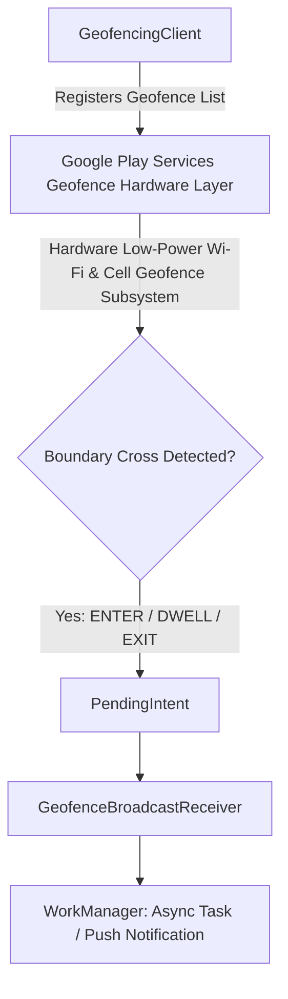
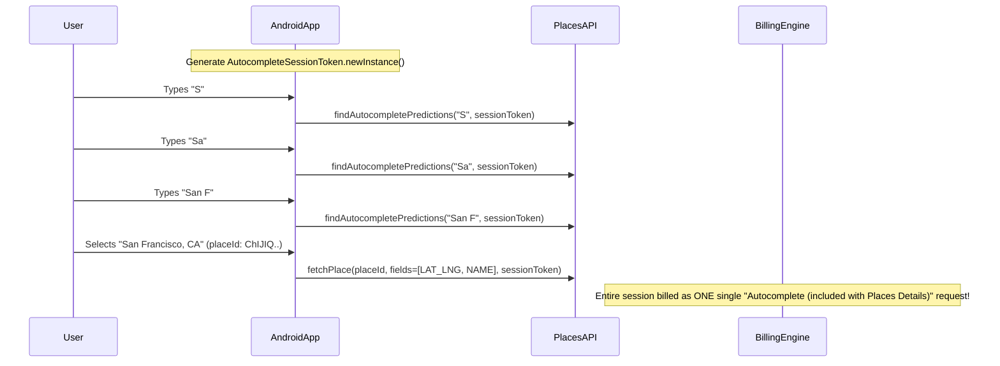

# 📍 Geofencing API & Google Places SDK Architecture
> **Targeted for Senior, Staff, and Lead Android Engineers**  
> **Core Focus:** GeofencingClient, Dwell & Transition Triggers, WorkManager Bridge, Google Places SDK Autocomplete, and Session-Token Cost Optimization.


---

## 📖 Table of Contents
- [1. Geofencing API Fundamentals](#1-geofencing-api-fundamentals)
- [2. Building and Registering Geofences](#2-building-and-registering-geofences)
- [3. Handling Geofence Transitions with BroadcastReceiver & WorkManager](#3-handling-geofence-transitions-with-broadcastreceiver--workmanager)
- [4. Battery Optimization & Dwell Delay Strategy](#4-battery-optimization--dwell-delay-strategy)
- [5. Google Places SDK: Architecture & Session Tokens](#5-google-places-sdk-architecture--session-tokens)
- [6. Real-Time Autocomplete Flow with Cost Optimization](#6-real-time-autocomplete-flow-with-cost-optimization)
- [7. Interview Questions & Production Pitfalls](#7-interview-questions--production-pitfalls)

---

## 1. Geofencing API Fundamentals

Geofencing combines location awareness with proximity detection, triggering events when a user enters, exits, or lingers within a predefined geographic perimeter (represented as a latitude, longitude, and radius).



### Transition Types
1. **`GEOFENCE_TRANSITION_ENTER`:** User crosses into the geofence perimeter.
2. **`GEOFENCE_TRANSITION_EXIT`:** User moves outside the geofence perimeter.
3. **`GEOFENCE_TRANSITION_DWELL`:** User enters the geofence and remains inside for a designated duration (`setLoiteringDelay`). This prevents spurious notifications when someone merely drives past a physical store.

---

## 2. Building and Registering Geofences

```kotlin
package com.example.maps.geofence

import android.annotation.SuppressLint
import android.app.PendingIntent
import android.content.Context
import android.content.Intent
import com.google.android.gms.location.Geofence
import com.google.android.gms.location.GeofencingClient
import com.google.android.gms.location.GeofencingRequest
import com.google.android.gms.location.LocationServices
import javax.inject.Inject
import javax.inject.Singleton

@Singleton
class GeofenceManager @Inject constructor(
    private val context: Context
) {
    private val geofencingClient: GeofencingClient = 
        LocationServices.getGeofencingClient(context)

    private val geofencePendingIntent: PendingIntent by lazy {
        val intent = Intent(context, GeofenceBroadcastReceiver::class.java)
        PendingIntent.getBroadcast(
            context,
            0,
            intent,
            PendingIntent.FLAG_UPDATE_CURRENT or PendingIntent.FLAG_MUTABLE
        )
    }

    @SuppressLint("MissingPermission")
    fun addStoreGeofence(
        storeId: String,
        latitude: Double,
        longitude: Double,
        radiusMeters: Float = 150f
    ) {
        // 1. Build individual geofence
        val geofence = Geofence.Builder()
            .setRequestId(storeId) // Unique identifier
            .setCircularRegion(latitude, longitude, radiusMeters)
            .setExpirationDuration(Geofence.NEVER_EXPIRE)
            .setTransitionTypes(
                Geofence.GEOFENCE_TRANSITION_ENTER or 
                Geofence.GEOFENCE_TRANSITION_DWELL or 
                Geofence.GEOFENCE_TRANSITION_EXIT
            )
            .setLoiteringDelay(120_000) // Dwell for at least 2 minutes (120,000 ms)
            .setNotificationResponsiveness(30_000) // 30-sec trade-off for battery savings
            .build()

        // 2. Build request wrapper
        val request = GeofencingRequest.Builder()
            .setInitialTrigger(GeofencingRequest.INITIAL_TRIGGER_ENTER or GeofencingRequest.INITIAL_TRIGGER_DWELL)
            .addGeofence(geofence)
            .build()

        // 3. Register with Google Play Services
        geofencingClient.addGeofences(request, geofencePendingIntent)
            .addOnSuccessListener {
                // Successfully monitored
            }
            .addOnFailureListener { exception ->
                // Handle permission or Play Services error (e.g. GeofenceStatusCodes.GEOFENCE_TOO_MANY_GEOFENCES)
            }
    }

    fun removeGeofences(storeIds: List<String>) {
        geofencingClient.removeGeofences(storeIds)
    }
}
```

---

## 3. Handling Geofence Transitions with BroadcastReceiver & WorkManager

When a geofence fires, Android wakes the app via `PendingIntent`. You have roughly **10 seconds** before the OS considers the broadcast receiver stalled (ANR). Never execute network operations or heavy disk reads directly inside `onReceive()`. Offload to **WorkManager**.

```kotlin
package com.example.maps.geofence

import android.content.BroadcastReceiver
import android.content.Context
import android.content.Intent
import androidx.work.Data
import androidx.work.OneTimeWorkRequestBuilder
import androidx.work.WorkManager
import com.google.android.gms.location.Geofence
import com.google.android.gms.location.GeofencingEvent

class GeofenceBroadcastReceiver : BroadcastReceiver() {

    override fun onReceive(context: Context, intent: Intent) {
        val geofencingEvent = GeofencingEvent.fromIntent(intent) ?: return

        if (geofencingEvent.hasError()) {
            val errorCode = geofencingEvent.errorCode
            // Log geofence error
            return
        }

        val transition = geofencingEvent.geofenceTransition
        val triggeringGeofences = geofencingEvent.triggeringGeofences ?: emptyList()

        for (geofence in triggeringGeofences) {
            val geofenceId = geofence.requestId

            // Dispatch to WorkManager for reliable, deferred background execution
            val workData = Data.Builder()
                .putString("GEOFENCE_ID", geofenceId)
                .putInt("TRANSITION_TYPE", transition)
                .build()

            val workRequest = OneTimeWorkRequestBuilder<GeofenceSyncWorker>()
                .setInputData(workData)
                .build()

            WorkManager.getInstance(context).enqueue(workRequest)
        }
    }
}
```

---

## 4. Battery Optimization & Dwell Delay Strategy

### Key Production Rules:
1. **Minimum Radius:** Never set a radius smaller than **100 meters**. Narrower perimeters force continuous high-drain GPS polling because Wi-Fi/Cell trilateration has an accuracy tolerance of 40–80m.
2. **Notification Responsiveness (`setNotificationResponsiveness`):** Setting responsiveness to `0` forces the phone to immediately wake the AP (Application Processor). Setting it to `60000` (60 seconds) allows the hardware sensor hub to batch wakeups, saving up to **80% power**.
3. **Use Dwell instead of Enter:** Entering a store perimeter while driving on a highway causes spam notifications. `setLoiteringDelay(120_000)` ensures notifications only fire if the user actually stops and spends time inside.

---

## 5. Google Places SDK: Architecture & Session Tokens

Google Places API can become **extremely expensive** if integrated naively. Every keystroke could trigger an individual API billing event ($0.017 to $0.032 per request).

### Session Tokens: The Multi-Thousand Dollar Cost Saver
A **Session Token** (`AutocompleteSessionToken`) groups the query keystrokes of an autocomplete search into a single logical session for billing purposes. 



---

## 6. Real-Time Autocomplete Flow with Cost Optimization

```kotlin
package com.example.maps.places

import com.google.android.libraries.places.api.Places
import com.google.android.libraries.places.api.model.AutocompletePrediction
import com.google.android.libraries.places.api.model.AutocompleteSessionToken
import com.google.android.libraries.places.api.model.Place
import com.google.android.libraries.places.api.net.FetchPlaceRequest
import com.google.android.libraries.places.api.net.FindAutocompletePredictionsRequest
import com.google.android.libraries.places.api.net.PlacesClient
import kotlinx.coroutines.flow.Flow
import kotlinx.coroutines.flow.debounce
import kotlinx.coroutines.flow.distinctUntilChanged
import kotlinx.coroutines.flow.flow
import kotlinx.coroutines.tasks.await
import javax.inject.Inject
import javax.inject.Singleton

@Singleton
class PlacesRepository @Inject constructor(
    private val placesClient: PlacesClient
) {
    // 1. Maintain active session token for the current user typing session
    private var sessionToken: AutocompleteSessionToken? = null

    fun startNewSession() {
        sessionToken = AutocompleteSessionToken.newInstance()
    }

    /**
     * Debounced search to prevent redundant requests while the user is rapidly typing.
     */
    suspend fun searchPlaces(query: String): List<AutocompletePrediction> {
        if (query.isBlank() || query.length < 2) return emptyList()

        if (sessionToken == null) {
            startNewSession()
        }

        val request = FindAutocompletePredictionsRequest.builder()
            .setSessionToken(sessionToken)
            .setQuery(query)
            .build()

        return try {
            val response = placesClient.findAutocompletePredictions(request).await()
            response.autocompletePredictions
        } catch (e: Exception) {
            emptyList()
        }
    }

    /**
     * Completes the billing session by fetching place details.
     * Note: Request ONLY the fields you need! Requesting unnecessary fields (e.g., Photos, Reviews)
     * moves your request into higher-priced SKU tiers (Places Details Enterprise).
     */
    suspend fun getPlaceCoordinates(placeId: String): Place? {
        val placeFields = listOf(Place.Field.ID, Place.Field.NAME, Place.Field.LAT_LNG)

        val request = FetchPlaceRequest.builder(placeId, placeFields)
            .setSessionToken(sessionToken) // Closes and finalizes the billing session!
            .build()

        return try {
            val response = placesClient.fetchPlace(request).await()
            // Reset token after successful session conclusion
            sessionToken = null
            response.place
        } catch (e: Exception) {
            null
        }
    }
}
```

---

## 7. Interview Questions & Production Pitfalls

### Q1. What happens if an app creates more than 100 geofences per device user?
**Answer:**  
The Google Play Services Geofencing API enforces a strict hard limit of **100 geofences per app user**. Attempting to add the 101st geofence triggers `GeofenceStatusCodes.GEOFENCE_TOO_MANY_GEOFENCES`.  
**Architecture Solution:**  
In apps with thousands of stores/locations (e.g. Starbucks or Target), do **dynamic geofence clustering**:
1. Monitor the user's coarse location (e.g., via `FusedLocationProviderClient` with `PRIORITY_BALANCED_POWER_ACCURACY`).
2. Query your backend or local Room spatial database for the **closest 20–50 locations** within a 15–25 km radius.
3. Unregister previous distant geofences and register only the nearby active set.

### Q2. Why should Place.Field lists be strictly minimized when calling fetchPlace()?
**Answer:**  
Google Maps Platform charges tiered pricing for Place Details requests based on requested fields:
- **Basic Data** (`Place.Field.ID`, `NAME`, `LAT_LNG`, `ADDRESS`): Covered under basic SKU.
- **Contact Data** (`PHONE_NUMBER`, `WEBSITE_URI`, `OPENING_HOURS`): Triggers Contact SKU tier.
- **Atmosphere Data** (`RATING`, `USER_RATINGS_TOTAL`, `REVIEWS`, `PRICE_LEVEL`): Triggers the highest-priced Atmosphere SKU tier.  
Requesting `Place.Field.values().toList()` indiscriminately can increase monthly API expenses by **300% to 500%**. Always explicitly specify only the required fields.
