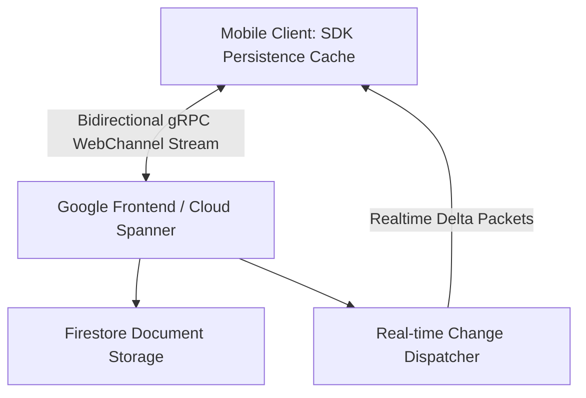
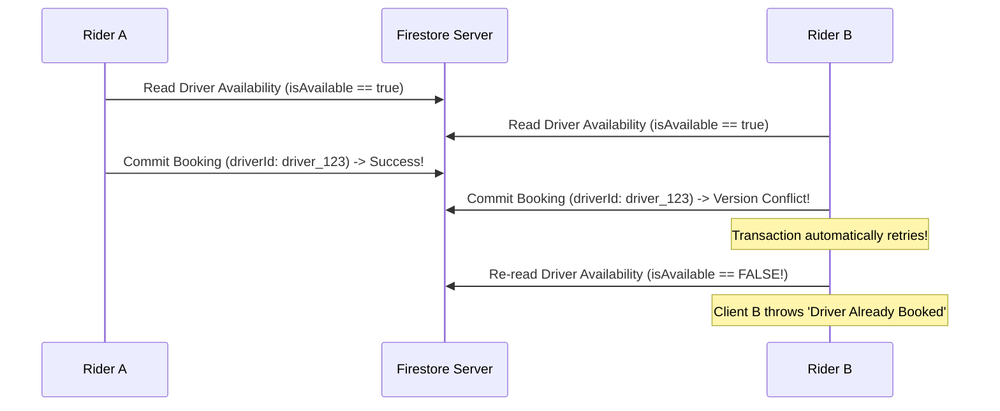

# 🔥 Cloud Firestore Real-Time Architecture & Offline Patterns
> **Targeted for Senior, Staff, and Lead Android Engineers**  
> **Core Focus:** Real-time Snapshot Streams with Kotlin Flow, Offline Persistence Engine, Atomic Transactions, Race Condition Mitigation, and Enterprise Security Rules.


---

## 📖 Table of Contents
- [1. Cloud Firestore Architecture & Storage Internals](#1-cloud-firestore-architecture--storage-internals)
- [2. Converting Snapshot Listeners to Reactive Kotlin Flow](#2-converting-snapshot-listeners-to-reactive-kotlin-flow)
- [3. Offline Cache Engine & Persistence Settings](#3-offline-cache-engine--persistence-settings)
- [4. Atomic Operations: Transactions vs. Batch Writes](#4-atomic-operations-transactions-vs-batch-writes)
- [5. Scalable Pagination with Query Cursors](#5-scalable-pagination-with-query-cursors)
- [6. Enterprise Security Rules & Validation](#6-enterprise-security-rules--validation)
- [7. Interview Questions & Production War Stories](#7-interview-questions--production-war-stories)

---

## 1. Cloud Firestore Architecture & Storage Internals

Cloud Firestore is a globally distributed, document-oriented NoSQL database optimized for real-time mobile sync. 



### Documents vs. Collections
- **Documents:** Lightweight JSON-like key-value records (max size **1 MB**).
- **Collections:** Non-nested containers of documents. Queries are **shallow** (querying a collection does not fetch documents in subcollections).
- **Collection Group Queries:** Allows indexing and querying across all subcollections sharing the same name throughout the entire database hierarchy.

---

## 2. Converting Snapshot Listeners to Reactive Kotlin Flow

Wrapping Firestore's native `EventListener<QuerySnapshot>` inside a Kotlin `callbackFlow` provides cancellation safety, lifecycle awareness, and clean integration with ViewModels and Compose.

```kotlin
package com.example.firebase.firestore

import com.google.firebase.firestore.DocumentSnapshot
import com.google.firebase.firestore.FirebaseFirestore
import com.google.firebase.firestore.MetadataChanges
import com.google.firebase.firestore.Query
import kotlinx.coroutines.channels.awaitClose
import kotlinx.coroutines.flow.Flow
import kotlinx.coroutines.flow.callbackFlow
import javax.inject.Inject
import javax.inject.Singleton

data class RideOrder(
    val orderId: String = "",
    val riderId: String = "",
    val driverId: String? = null,
    val status: String = "SEARCHING", // SEARCHING, ACCEPTED, IN_TRANSIT, COMPLETED
    val pickupLat: Double = 0.0,
    val pickupLng: Double = 0.0
)

@Singleton
class OrderRepository @Inject constructor(
    private val firestore: FirebaseFirestore
) {

    /**
     * Streams real-time updates for an active ride order.
     * Uses MetadataChanges.INCLUDE to distinguish local uncommitted writes from server-confirmed states.
     */
    fun observeOrder(orderId: String): Flow<Resource<RideOrder>> = callbackFlow {
        val docRef = firestore.collection("orders").document(orderId)

        val registration = docRef.addSnapshotListener(MetadataChanges.INCLUDE) { snapshot, error ->
            if (error != null) {
                trySend(Resource.Error(error.localizedMessage ?: "Unknown Firestore Error"))
                close(error)
                return@addSnapshotListener
            }

            if (snapshot != null && snapshot.exists()) {
                val order = snapshot.toObject(RideOrder::class.java)
                val isFromCache = snapshot.metadata.isFromCache
                val hasPendingWrites = snapshot.metadata.hasPendingWrites()

                if (order != null) {
                    trySend(Resource.Success(order, isFromCache = isFromCache, hasPendingWrites = hasPendingWrites))
                }
            } else {
                trySend(Resource.Error("Order not found"))
            }
        }

        // Guarantees that unregistering the listener releases Firestore Binder connections when scope closes
        awaitClose {
            registration.remove()
        }
    }
}

sealed class Resource<out T> {
    data class Success<out T>(val data: T, val isFromCache: Boolean = false, val hasPendingWrites: Boolean = false) : Resource<T>()
    data class Error(val message: String) : Resource<Nothing>()
    object Loading : Resource<Nothing>()
}
```

---

## 3. Offline Cache Engine & Persistence Settings

Firestore maintains an internal SQLite database on the Android device. In modern Firestore SDK releases, you can configure **Persistent Cache** vs **Memory Cache** explicitly.

```kotlin
package com.example.firebase.config

import com.google.firebase.firestore.FirebaseFirestore
import com.google.firebase.firestore.FirebaseFirestoreSettings
import com.google.firebase.firestore.PersistentCacheSettings

object FirestoreConfig {

    fun initFirestore(): FirebaseFirestore {
        val firestore = FirebaseFirestore.getInstance()

        val settings = FirebaseFirestoreSettings.Builder()
            // 1. Configure disk cache with automatic size management
            .setLocalCacheSettings(
                PersistentCacheSettings.newBuilder()
                    .setSizeBytes(100L * 1024 * 1024) // 100 MB Cache quota
                    .build()
            )
            .build()

        firestore.firestoreSettings = settings
        return firestore
    }
}
```

### Local Mutations & `hasPendingWrites()`
When a device writes data while offline:
1. The local SQLite database updates immediately.
2. Local snapshot listeners emit the updated state instantly (**Optimistic UI**). `snapshot.metadata.hasPendingWrites()` returns `true`.
3. When the network reconnects, mutations are flushed to the cloud. Once acknowledged by the server, the listener fires again with `hasPendingWrites() == false`.

---

## 4. Atomic Operations: Transactions vs. Batch Writes

### Batch Writes
Used when you need to perform multiple write/update/delete operations atomically where **none of the operations depend on prior reads**.

```kotlin
suspend fun cancelOrderAndFreeDriver(orderId: String, driverId: String) {
    val batch = firestore.batch()

    val orderRef = firestore.collection("orders").document(orderId)
    val driverRef = firestore.collection("drivers").document(driverId)

    batch.update(orderRef, "status", "CANCELLED")
    batch.update(driverRef, "isAvailable", true)

    batch.commit().await()
}
```

### Transactions (Handling Race Conditions)
Used when a write **depends on reading the current state** of a document (e.g. seat booking, inventory deduction, account balance).



```kotlin
suspend fun bookCabSeat(driverId: String, riderId: String): Boolean {
    val driverRef = firestore.collection("drivers").document(driverId)

    return try {
        firestore.runTransaction { transaction ->
            val snapshot = transaction.get(driverRef)
            val availableSeats = snapshot.getLong("availableSeats") ?: 0L

            if (availableSeats <= 0L) {
                throw IllegalStateException("No seats remaining!")
            }

            // Deduct seat and assign rider atomically
            transaction.update(driverRef, "availableSeats", availableSeats - 1)
            transaction.update(driverRef, "passengers", com.google.firebase.firestore.FieldValue.arrayUnion(riderId))
            true
        }.await()
    } catch (e: Exception) {
        false
    }
}
```

---

## 5. Scalable Pagination with Query Cursors

Never fetch entire collections into memory. Implement query cursors using `startAfter()` and `limit()`.

```kotlin
package com.example.firebase.firestore

import com.google.firebase.firestore.DocumentSnapshot
import com.google.firebase.firestore.FirebaseFirestore
import com.google.firebase.firestore.Query
import kotlinx.coroutines.tasks.await

class PaginatedOrdersSource(
    private val firestore: FirebaseFirestore
) {
    private var lastVisibleDocument: DocumentSnapshot? = null

    suspend fun fetchNextPage(pageSize: Long = 20): List<RideOrder> {
        var query = firestore.collection("orders")
            .orderBy("timestamp", Query.Direction.DESCENDING)
            .limit(pageSize)

        lastVisibleDocument?.let { lastDoc ->
            query = query.startAfter(lastDoc)
        }

        val snapshot = query.get().await()
        if (!snapshot.isEmpty) {
            lastVisibleDocument = snapshot.documents.last()
        }

        return snapshot.toObjects(RideOrder::class.java)
    }
}
```

---

## 6. Enterprise Security Rules & Validation

Firestore security rules execute on Google's edge nodes before any read or write touches the database. 

```javascript
rules_version = '2';
service cloud.firestore {
  match /databases/{database}/documents {
    
    // Helper function: verifies authenticated user
    function isAuthenticated() {
      return request.auth != null;
    }

    // Helper function: verifies ownership
    function isOwner(userId) {
      return isAuthenticated() && request.auth.uid == userId;
    }

    // Helper function: validates role claim from custom auth token
    function isAdmin() {
      return isAuthenticated() && request.auth.token.role == 'admin';
    }

    // Rules for Orders collection
    match /orders/{orderId} {
      // Any authenticated user can read orders they created or were assigned to
      allow read: if isAuthenticated() && (
        resource.data.riderId == request.auth.uid || 
        resource.data.driverId == request.auth.uid ||
        isAdmin()
      );

      // Only the rider can create an order, and schema must be valid
      allow create: if isAuthenticated() 
        && request.resource.data.riderId == request.auth.uid
        && request.resource.data.status == "SEARCHING"
        && request.resource.data.keys().hasAll(['riderId', 'status', 'pickupLat', 'pickupLng']);

      // State transitions must be valid (e.g. cannot jump from CANCELLED to COMPLETED)
      allow update: if isAuthenticated() && (
        isAdmin() ||
        (resource.data.status == "SEARCHING" && request.resource.data.status == "ACCEPTED") ||
        (resource.data.driverId == request.auth.uid && request.resource.data.status in ["IN_TRANSIT", "COMPLETED"])
      );
    }
  }
}
```

---

## 7. Interview Questions & Production War Stories

### Q1. What is the fundamental difference between Firestore and Realtime Database (RTDB) billing, and how does it alter mobile app design?
**Answer:**  
- **RTDB** bills primarily by **bandwidth transferred (GB downloaded)** and storage.
- **Firestore** bills primarily by **individual document operations (Reads, Writes, Deletes)**.  
**Mobile Design Implication:**  
In Firestore, fetching a list of 500 small documents costs 500 Reads. If those documents update 10 times, you accumulate 5,000 Reads. Therefore, in high-frequency update scenarios (such as emitting driver GPS coordinates every second), direct Firestore document writes can lead to astronomical bills. Real-time GPS coordinates are better suited for **RTDB** (where bandwidth for tiny coordinate payloads is cheap) or WebSocket backends, whereas historical rides, receipts, and user profiles belong in **Firestore**.

### Q2. How do Firestore Transactions handle offline situations?
**Answer:**  
**Transactions will unconditionally fail if the client is offline.**  
A transaction requires reading the server document to obtain its current atomic version stamp and executing the write directly against the server to verify no concurrent mutations occurred. If offline, the transaction cannot guarantee isolation and immediately rejects the operation. Batch writes, on the other hand, *can* be queued locally while offline and synchronized when the device reconnects.
