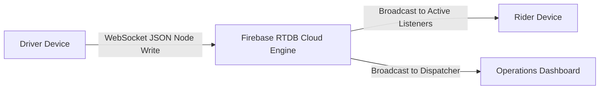
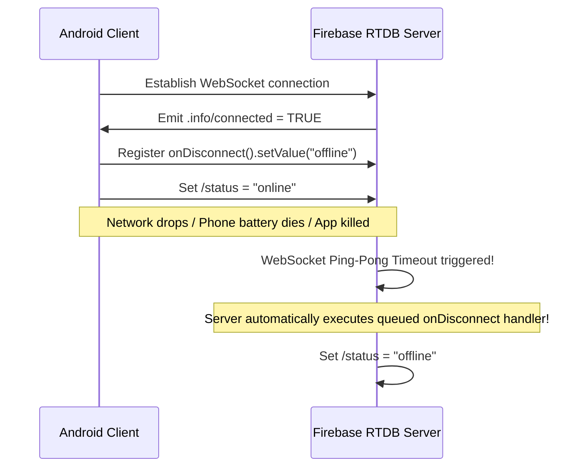
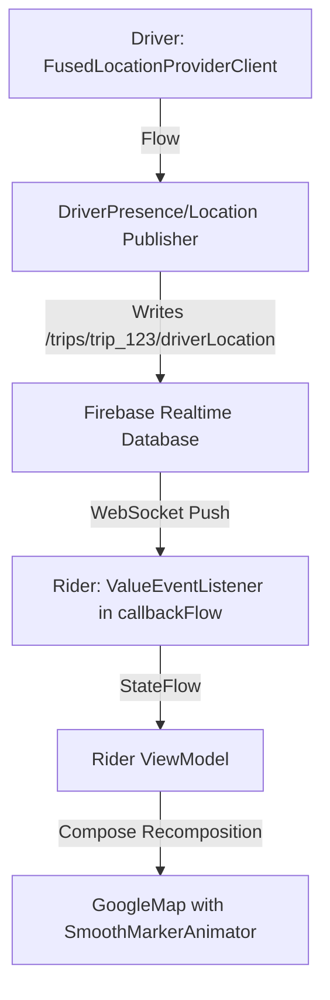

# ⚡ Firebase Realtime Database: Presence & Live Ride Tracking
> **Targeted for Senior, Staff, and Lead Android Engineers**  
> **Core Focus:** Realtime Database (RTDB) Internals, Connection State (`.info/connected`), Atomic `onDisconnect()` Handlers, and End-to-End Real-Time Vehicle Tracking Architecture.


---

## 📖 Table of Contents
- [1. Realtime Database (RTDB) Architecture](#1-realtime-database-rtdb-architecture)
- [2. Real-Time Presence System (`.info/connected` & `onDisconnect`)](#2-real-time-presence-system-infoconnected--ondisconnect)
- [3. End-to-End Live Vehicle Tracking Architecture](#3-end-to-end-live-vehicle-tracking-architecture)
- [4. Driver Engine: High-Frequency Location Publisher](#4-driver-engine-high-frequency-location-publisher)
- [5. Rider Engine: Reactive Coordinate Consumer](#5-rider-engine-reactive-coordinate-consumer)
- [6. Jetpack Compose UI: Animated Car on Map](#6-jetpack-compose-ui-animated-car-on-map)
- [7. Interview Questions & System Trade-Offs](#7-interview-questions--system-trade-offs)

---

## 1. Realtime Database (RTDB) Architecture

Firebase Realtime Database is a cloud-hosted NoSQL JSON tree. Unlike Firestore (which uses gRPC document streams), RTDB maintains a persistent, low-overhead **WebSocket connection** to clients.



### When to Choose RTDB over Firestore
1. **High-Frequency Writes:** Transmitting driver GPS coordinates every 1–2 seconds. (RTDB charges by **data transfer in GB**, while Firestore charges by **individual write counts**).
2. **True Presence Detection:** RTDB natively supports server-side socket disconnection hooks (`onDisconnect`), allowing immediate detection when a user loses cell reception or closes the app abruptly.

---

## 2. Real-Time Presence System (`.info/connected` & `onDisconnect`)

A critical requirement in ride-hailing and chat apps is knowing if a driver or user is currently online or offline.



### Production Presence Manager Implementation

```kotlin
package com.example.firebase.presence

import com.google.firebase.database.DataSnapshot
import com.google.firebase.database.DatabaseError
import com.google.firebase.database.FirebaseDatabase
import com.google.firebase.database.ServerValue
import com.google.firebase.database.ValueEventListener
import javax.inject.Inject
import javax.inject.Singleton

@Singleton
class DriverPresenceManager @Inject constructor(
    private val database: FirebaseDatabase
) {

    fun monitorAndSyncPresence(driverId: String) {
        val userStatusDatabaseRef = database.getReference("/drivers/$driverId/status")
        val connectedRef = database.getReference(".info/connected")

        connectedRef.addValueEventListener(object : ValueEventListener {
            override fun onDataChange(snapshot: DataSnapshot) {
                val connected = snapshot.getValue(Boolean::class.java) ?: false
                if (connected) {
                    // 1. Tell server to mark us offline if our socket dies
                    userStatusDatabaseRef.onDisconnect().setValue(
                        mapOf(
                            "state" to "OFFLINE",
                            "lastSeen" to ServerValue.TIMESTAMP
                        )
                    )

                    // 2. Set ourselves as currently online
                    userStatusDatabaseRef.setValue(
                        mapOf(
                            "state" to "ONLINE",
                            "lastSeen" to ServerValue.TIMESTAMP
                        )
                    )
                }
            }

            override fun onCancelled(error: DatabaseError) {
                // Handle read failure
            }
        })
    }
}
```

---

## 3. End-to-End Live Vehicle Tracking Architecture

Let's design the live tracking pipeline where a **Driver** emits coordinates and a **Rider** observes the moving vehicle on an animated map.



---

## 4. Driver Engine: High-Frequency Location Publisher

```kotlin
package com.example.tracking.driver

import android.location.Location
import com.google.firebase.database.FirebaseDatabase
import com.google.firebase.database.ServerValue
import kotlinx.coroutines.CoroutineScope
import kotlinx.coroutines.Dispatchers
import kotlinx.coroutines.flow.Flow
import kotlinx.coroutines.flow.launchIn
import kotlinx.coroutines.flow.onEach
import javax.inject.Inject

class DriverLocationPublisher @Inject constructor(
    private val database: FirebaseDatabase
) {

    fun startPublishing(tripId: String, locationFlow: Flow<Location>, scope: CoroutineScope) {
        val tripLocationRef = database.getReference("/trips/$tripId/driverLocation")

        locationFlow
            .onEach { location ->
                val payload = mapOf(
                    "latitude" to location.latitude,
                    "longitude" to location.longitude,
                    "bearing" to location.bearing,
                    "speed" to location.speed,
                    "timestamp" to ServerValue.TIMESTAMP
                )
                // Low-overhead write directly onto the specific trip node
                tripLocationRef.setValue(payload)
            }
            .launchIn(scope)
    }
}
```

---

## 5. Rider Engine: Reactive Coordinate Consumer

```kotlin
package com.example.tracking.rider

import com.google.android.gms.maps.model.LatLng
import com.google.firebase.database.DataSnapshot
import com.google.firebase.database.DatabaseError
import com.google.firebase.database.FirebaseDatabase
import com.google.firebase.database.ValueEventListener
import kotlinx.coroutines.channels.awaitClose
import kotlinx.coroutines.flow.Flow
import kotlinx.coroutines.flow.callbackFlow
import javax.inject.Inject
import javax.inject.Singleton

data class DriverPosition(
    val latLng: LatLng = LatLng(0.0, 0.0),
    val bearing: Float = 0f,
    val speed: Float = 0f,
    val timestamp: Long = 0L
)

@Singleton
class RiderLiveTrackingRepository @Inject constructor(
    private val database: FirebaseDatabase
) {

    fun observeDriverLocation(tripId: String): Flow<DriverPosition> = callbackFlow {
        val ref = database.getReference("/trips/$tripId/driverLocation")

        val listener = object : ValueEventListener {
            override fun onDataChange(snapshot: DataSnapshot) {
                val lat = snapshot.child("latitude").getValue(Double::class.java) ?: return
                val lng = snapshot.child("longitude").getValue(Double::class.java) ?: return
                val bearing = snapshot.child("bearing").getValue(Float::class.java) ?: 0f
                val speed = snapshot.child("speed").getValue(Float::class.java) ?: 0f
                val timestamp = snapshot.child("timestamp").getValue(Long::class.java) ?: 0L

                val position = DriverPosition(
                    latLng = LatLng(lat, lng),
                    bearing = bearing,
                    speed = speed,
                    timestamp = timestamp
                )
                trySend(position)
            }

            override fun onCancelled(error: DatabaseError) {
                close(error.toException())
            }
        }

        ref.addValueEventListener(listener)

        awaitClose {
            ref.removeEventListener(listener)
        }
    }
}
```

---

## 6. Jetpack Compose UI: Animated Car on Map

```kotlin
package com.example.tracking.ui

import androidx.compose.foundation.layout.fillMaxSize
import androidx.compose.runtime.Composable
import androidx.compose.runtime.LaunchedEffect
import androidx.compose.runtime.collectAsState
import androidx.compose.runtime.getValue
import androidx.compose.runtime.remember
import androidx.compose.ui.Modifier
import com.example.maps.animation.SmoothMarkerAnimator
import com.example.tracking.rider.DriverPosition
import com.google.android.gms.maps.model.BitmapDescriptorFactory
import com.google.android.gms.maps.model.CameraPosition
import com.google.maps.android.compose.GoogleMap
import com.google.maps.android.compose.Marker
import com.google.maps.android.compose.rememberCameraPositionState
import com.google.maps.android.compose.rememberMarkerState
import kotlinx.coroutines.flow.StateFlow

@Composable
fun LiveRideTrackingScreen(
    driverPositionFlow: StateFlow<DriverPosition>
) {
    val driverPosition by driverPositionFlow.collectAsState()
    val markerState = rememberMarkerState(position = driverPosition.latLng)
    val cameraPositionState = rememberCameraPositionState {
        position = CameraPosition.fromLatLngZoom(driverPosition.latLng, 16f)
    }

    // Keep animator reference across recompositions
    val markerAnimator = remember { SmoothMarkerAnimator() }

    // Smoothly animate the marker whenever a fresh driver coordinate arrives
    LaunchedEffect(driverPosition.latLng) {
        markerState.position = driverPosition.latLng
        cameraPositionState.animate(
            com.google.android.gms.maps.CameraUpdateFactory.newLatLng(driverPosition.latLng),
            1000
        )
    }

    GoogleMap(
        modifier = Modifier.fillMaxSize(),
        cameraPositionState = cameraPositionState
    ) {
        Marker(
            state = markerState,
            title = "Your Driver",
            rotation = driverPosition.bearing,
            flat = true, // Lays flat on the map plane so rotation matches street heading
            icon = BitmapDescriptorFactory.defaultMarker(BitmapDescriptorFactory.HUE_AZURE)
        )
    }
}
```

---

## 7. Interview Questions & System Trade-Offs

### Q1. Why is `flat = true` necessary for vehicle markers on Google Maps?
**Answer:**  
By default (`flat = false`), Google Maps markers are **billboards**: they always face the camera viewport regardless of how the user tilts or rotates the map. When rendering vehicles, setting `flat = true` forces the marker image to align parallel to the earth's surface. When the vehicle changes bearing, rotating the marker aligns precisely with the street orientation on tilted 3D maps.

### Q2. How do you prevent excessive payload size in RTDB when streaming high-frequency data?
**Answer:**  
1. **Denormalization:** Never nest the active `driverLocation` inside the heavy `tripDetails` (which contains passenger profiles, payment tokens, receipts, etc.). Separate it into an isolated leaf node (`/trips/$tripId/driverLocation`).
2. **Targeted Listeners:** The Rider listens strictly to `/trips/$tripId/driverLocation`. This avoids downloading parent tree changes and cuts bandwidth consumption down to mere bytes per ping.
3. **Truncate Precision:** Round coordinates to 5–6 decimal places (~1.1 meter resolution). Extra decimal digits consume unnecessary JSON string bandwidth.
