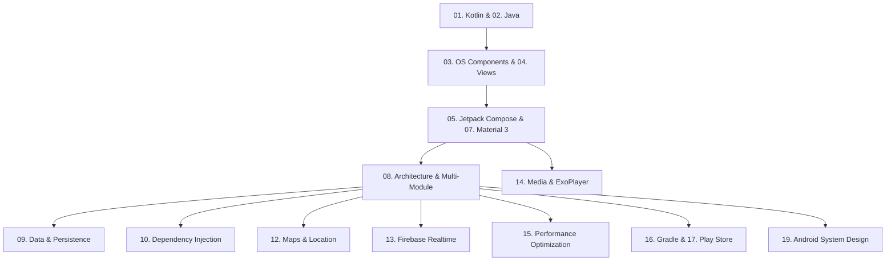

# 🤖 Android Mastery: The Senior & Staff Android Engineer Handbook

> **A Comprehensive, Production-Grade Engineering and Interview Guide for Modern Android, Jetpack Compose, Coroutines, System Architecture, and OS Internals.**

---

## 📖 Curriculum Roadmap

---

## 📚 19-Chapter Android Curriculum

| # | Chapter Hub | Scope & Key Topics |
| :---: | :--- | :--- |
| **01** | **[01. Kotlin Mastery](./01_kotlin/README.md)** | [Language Fundamentals](./01_kotlin/01_language_fundamentals/README.md), [Coroutines Guide](./01_kotlin/02_coroutines/README.md), [Flows & Channels Guide](./01_kotlin/03_flows_and_channels/README.md), [Cheat Sheet](./01_kotlin/04_cheatsheet.md), and [Coding Challenges](./01_kotlin/05_coding_challenges.md). |
| **02** | **[02. Java Core & Internals](./02_java/README.md)** | [Core Java](./02_java/Core/01_core_java.md), [Java Cheatsheet](./02_java/Core/02_cheatsheet.md), and [Advanced Java & JVM Internals](./02_java/Advanced/01_advanced_java.md). |
| **03** | **[03. Core Components & Lifecycle](./03_components_and_lifecycle/README.md)** | [Android Components Guide](./03_components_and_lifecycle/01_components_lifecycle.md): Activity/Fragment lifecycle, Foreground Services, Broadcast Receivers, Content Providers, and Binder IPC. |
| **04** | **[04. Views & Classic Layouts](./04_views_and_layouts/README.md)** | [Android UI Guide](./04_views_and_layouts/01_views_and_layouts.md): View vs ViewGroup, ConstraintLayout, Measure/Layout/Draw passes, and Touch Event Dispatch. |
| **05** | **[05. Jetpack Compose UI](./05_jetpack_compose/README.md)** | 25-part complete declarative UI guide: State management, side effects, layout, animation, performance deep dives, and compiler stability. |
| **06** | **[06. Jetpack Libraries](./06_jetpack_libraries/README.md)** | [Architecture Components Guide](./06_jetpack_libraries/01_jetpack_architecture_components.md): ViewModel internals, SavedStateHandle, Paging 3, and WorkManager. |
| **07** | **[07. UX & Material Design 3](./07_ux_and_material_design/README.md)** | [UX & Design Guide](./07_ux_and_material_design/01_ux_and_material_design.md): Material You dynamic theming, Accessibility (a11y), Foldables & Large Screens, and Predictive Back. |
| **08** | **[08. Architecture Patterns](./08_architecture/README.md)** | Clean Architecture, MVI, MVVM, MVP, MVC, and feature modularization. |
| **09** | **[09. Data & Persistence](./09_data_and_persistence/README.md)** | Room Database (migrations, DAO, multithreading), SQLite, Realm, and DataStore. |
| **10** | **[10. Dependency Injection](./10_dependency_injection/README.md)** | Hilt (Android-first), Dagger 2 (compile-time graph), and Koin (Kotlin-native Service Locator). |
| **11** | **[11. Third-Party Libraries](./11_third_party_libraries/README.md)** | Retrofit, OkHttp interceptors, Coil image loading, KotlinX Serialization, LeakCanary, and Chucker. |
| **12** | **[12. Maps & Location Services](./12_maps_and_location/README.md)** | FusedLocationProviderClient, foreground location service, Google Maps Compose, marker animations, and Geofencing. |
| **13** | **[13. Firebase & Real-Time Sync](./13_firebase_realtime/README.md)** | Cloud Firestore real-time architecture, Realtime Database live tracking, FCM push notifications, and Remote Config. |
| **14** | **[14. Media & Video Streaming](./14_media_and_streaming/README.md)** | [ExoPlayer Mastery Guide](./14_media_and_streaming/01_exoplayer_mastery.md): Media3, adaptive streaming (HLS/DASH), DRM (Widevine), caching, and custom renderers. |
| **15** | **[15. Performance Engineering](./15_performance_optimization/README.md)** | [Performance Fundamentals](./15_performance_optimization/01_performance_fundamentals.md), [50+ Mastery Questions](./15_performance_optimization/02_performance_mastery.md), and [Perfetto System Tracing Mastery](./15_performance_optimization/03_perfetto_system_tracing_mastery.md): Memory leaks, Systrace/Perfetto, Baseline Profiles, and Jank elimination. |
| **16** | **[16. Gradle Build System](./16_gradle_build_system/README.md)** | [Gradle Basics](./16_gradle_build_system/01_gradle_basics.md) and [Gradle Mastery](./16_gradle_build_system/02_gradle_mastery.md): Kotlin DSL (`.kts`), Version Catalogs, Configuration Cache, and R8 shrinking. |
| **17** | **[17. Google Play Distribution](./17_playstore_distribution/README.md)** | [Play Store Guide](./17_playstore_distribution/01_playstore_and_console.md): Android App Bundles (AAB), Play App Signing, Android Vitals, and In-App Updates. |
| **18** | **[18. RxJava & Reactive Extensions](./18_rxjava/README.md)** | [RxJava Guide](./18_rxjava/01_rxjava_guide.md): Observables, Schedulers, Backpressure, and migration to Kotlin Flow. |
| **19** | **[19. Android Mobile System Design](./19_system_design/README.md)** | [System Design Guide](./19_system_design/System_Design_Guide/README.md): Offline-first sync, real-time WebSockets, custom image loading libraries, and feed pagination. |

---

[⬅️ Back to Platforms Overview](../README.md)
