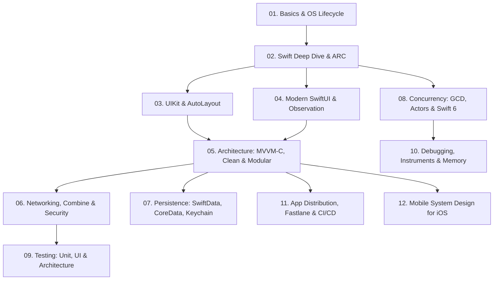

# 🍎 iOS Mastery: The Senior & Lead iOS Engineer Handbook
> **A Comprehensive, Production-Grade Engineering and Interview Guide for Swift, UIKit, SwiftUI, and iOS Architecture.**

---

## 📖 Curriculum Roadmap

> 💡 **Coming from Android?**  
> Read our dedicated **[iOS Architecture & Mental Models for Android Engineers (The Rosetta Stone)](./iOS_for_Android_Developers_Rosetta_Stone.md)** for a direct side-by-side mapping of Compose, Coroutines, Room, Hilt, and JVM GC to their iOS counterparts.

---

## 📚 Table of Contents

### 🟢 Phase 1: Core Foundation & Swift Language Internals
1. **[01. Basics](./01_basics)**
   - [01. iOS Ecosystem Overview](./01_basics/01_ios_overview.md): Runtime, compilation pipeline (LLVM/Clang/SwiftC), app bundle structure.
   - [02. iOS Architecture Layers](./01_basics/02_ios_architecture.md): Cocoa Touch, Media, Core Services, Core OS.
   - [03. App & Scene Lifecycle](./01_basics/03_app_and_scene_lifecycle.md): AppDelegate vs SceneDelegate, SwiftUI App protocol, background execution & task limits.

2. **[02. Swift Mastery](./02_swift)**
   - [01. Swift Basics & Syntax](./02_swift/01_swift_basics.md): Optionals, control flow, functions, closures.
   - [02. Value vs. Reference Types & CoW](./02_swift/02_value_vs_reference_types.md): Structs vs Classes, Copy-on-Write (CoW) implementation, Memory layout (Stack vs Heap).
   - [03. Protocols & Protocol-Oriented Programming (POP)](./02_swift/03_protocols_and_extensions.md): Protocols, extensions, existential types (`any` vs `some`), witness tables.
   - [04. Generics & Type Constraints](./02_swift/04_generics.md): Type parameters, associated types (`associatedtype`), generic specialization.
   - [05. Error Handling](./02_swift/05_error_handling.md): `throws`, `rethrows`, `Result`, typed throws in Swift 6, `defer` execution order.
   - [06. ARC & Memory Management](./02_swift/06_arc_memory_management.md): Strong, `weak`, `unowned`, retain cycles in closures, capture lists, memory leak resolution.

---

### 🎨 Phase 2: User Interface Frameworks
3. **[03. UI Frameworks (UIKit & Interop)](./03_ui_frameworks)**
   - [01. UIKit Core Concepts & Lifecycle](./03_ui_frameworks/01_uikit_core_concepts.md): UIViewController lifecycle (`viewIsAppearing`), Auto Layout Cassowary engine, Content Hugging & Compression Resistance, DiffableDataSource.
   - [02. SwiftUI Core Concepts](./03_ui_frameworks/02_swiftui_core_concepts.md): Declarative UI paradigm, View graph, structural vs explicit identity, layout phases.
   - [03. UIKit & SwiftUI Interoperability](./03_ui_frameworks/03_uikit_vs_swiftui_interop.md): `UIViewRepresentable`, `UIViewControllerRepresentable`, `UIHostingController`, bridging coordinators.

4. **[04. SwiftUI Advanced](./04_swiftui)**
   - [01. View Lifecycle](./04_swiftui/01_view_lifecycle.md): `onAppear`, `onDisappear`, `.task` lifecycle coroutines, `.onChange` transitions.
   - [02. State Management & Observation](./04_swiftui/02_state_management.md): `@State`, `@Binding`, `@Bindable`, `@Environment`, and the modern iOS 17+ `@Observable` macro.
   - [03. Lists & Lazy Grids](./04_swiftui/03_lists_and_lazy_grids.md): LazyVStack/LazyHStack, LazyVGrid/LazyHGrid, list cell recycling and diffing.
   - [04. Navigation Architecture](./04_swiftui/04_navigation.md): `NavigationStack`, `NavigationPath`, programmatic push/pop, deep linking, sheets vs full-screen covers.
   - [05. Animations & Transitions](./04_swiftui/05_animations.md): Implicit vs explicit animations, `matchedGeometryEffect`, PhaseAnimator, KeyframeAnimator.
   - [06. Performance Optimization](./04_swiftui/06_performance_optimizations.md): Eliminating unnecessary body evaluations, `EquatableView`, avoiding `AnyView`, rendering instruments.

---

### 🏛️ Phase 3: Architecture & Data Engineering
5. **[05. MVVM & Architecture](./05_mvvm_and_architecture)**
   - [01. MVVM in iOS](./05_mvvm_and_architecture/01_mvvm_architecture.md): Two-way binding, Combine/AsyncStream integration, clean separation of concerns.
   - [02. Coordinator Pattern (MVVM-C)](./05_mvvm_and_architecture/02_coordinators_mvvm_c.md): Flow coordinators, resolving back-swipe memory leaks, SwiftUI NavigationPath Routers.
   - [03. Clean Architecture & VIPER](./05_mvvm_and_architecture/03_clean_architecture_viper.md): Domain Entities, Use Cases, Repositories, Presenters, dependency inversion.
   - [04. Dependency Injection](./05_mvvm_and_architecture/04_dependency_injection.md): Constructor injection, Property Wrappers, Composition Root, container frameworks.
   - [05. Modularization & SPM](./05_mvvm_and_architecture/05_modularization_spm.md): Swift Package Manager (SPM) multi-module setup, micro-features, build time acceleration.

6. **[06. Networking & Security](./06_networking)**
   - [01. URLSession & Modern Network Client](./06_networking/01_urlsession.md): DataTask, upload/download, background URLSession, custom URLProtocol for mocking.
   - [02. Async/Await Networking](./06_networking/02_async_await_networking.md): `async/await` with `URLSession.shared.data(from:)`, `Codable` strategies, custom Date/Key decoders.
   - [03. API Error Handling & Retries](./06_networking/03_api_error_handling.md): Custom HTTP error mapping, exponential backoff, retry mechanisms.
   - [04. Combine in Networking](./06_networking/04_combine_networking.md): Publishers, Subscribers, Operators (`map`, `flatMap`, `debounce`, `catch`, `eraseToAnyPublisher`).
   - [05. Security & SSL Pinning](./06_networking/05_security_and_ssl_pinning.md): SSL/TLS Pinning (Public Key vs Certificate), ATS, OAuth2 token refresh race conditions with Actors.

7. **[07. Data Persistence](./07_data_persistence)**
   - [01. UserDefaults & AppStorage](./07_data_persistence/01_userdefaults.md): Appropriate limits, performance pitfalls, `@AppStorage`.
   - [02. Keychain Services](./07_data_persistence/02_keychain.md): Secure item storage, biometric authentication (`kSecAccessControlBiometryAny`), Secure Enclave.
   - [03. SQLite & Raw Storage](./07_data_persistence/03_sqlite.md): SQLite C-API, GRDB, query execution and indexes.
   - [04. Core Data Deep Dive](./07_data_persistence/04_coredata.md): Core Data Stack, background MOCs, `performBackgroundTask`, faulting, migrations, NSFetchedResultsController.
   - [05. SwiftData (iOS 17+)](./07_data_persistence/05_swiftdata.md): `@Model`, `ModelContainer`, `ModelContext`, `@Query`, `ModelActor`, schema migration.
   - [06. Caching Strategies](./07_data_persistence/06_caching_strategies.md): NSCache, URLCache, two-tiered disk/memory caching with eviction policies.

---

### ⚡ Phase 4: Concurrency, Performance & Testing
8. **[08. Concurrency](./08_concurrency)**
   - [01. Grand Central Dispatch (GCD)](./08_concurrency/01_gcd.md): Serial vs Concurrent queues, `sync` vs `async`, DispatchGroup, DispatchWorkItem, DispatchSemaphore, QoS.
   - [02. Operation & OperationQueue](./08_concurrency/02_operations.md): Advanced dependencies, priority, cancellation, custom concurrent Operation subclasses.
   - [03. Modern Swift Concurrency](./08_concurrency/03_async_await_structured_concurrency.md): `async/await`, `Task`, `TaskGroup`, cooperative cancellation, `AsyncSequence`.
   - [04. Thread Safety, Actors & Swift 6](./08_concurrency/04_thread_safety_actors_swift6.md): Data races, `os_unfair_lock`, Actors, Actor Reentrancy Hazard, `Sendable`, Swift 6 strict checking.

9. **[09. Testing Strategy](./09_testing)**
   - [01. Unit Testing with XCTest](./09_testing/01_unit_testing.md): Async testing with Swift Concurrency, test expectations, performance tests (`measure`).
   - [02. Mocking & Stubbing](./09_testing/02_mocking_and_stubbing.md): Protocol-based test doubles, spies, stubs, URLProtocol mocking.
   - [03. UI Testing (XCUITest)](./09_testing/03_ui_testing_xcui.md): XCUIApplication, XCUIElement query hierarchy, Page Object Model (POM).
   - [04. Testable Architecture](./09_testing/04_testable_architecture.md): Designing for testability, state verification, mocking system dependencies.

10. **[10. Debugging & Performance](./10_debugging_and_performance)**
    - [01. Instruments Mastery](./10_debugging_and_performance/01_instruments.md): Time Profiler, Allocations, Leaks, Core Animation 120 FPS / ProMotion drops.
    - [02. Memory Leak Elimination](./10_debugging_and_performance/02_memory_leaks.md): Finding retain cycles with Xcode Memory Graph Debugger, MallocStackLogging.
    - [03. App Performance Tuning](./10_debugging_and_performance/03_performance_tuning.md): Optimizing app launch time (dyld3/4, pre-main vs post-main), image decoding, view flattening.
    - [04. Crash Logs & Symbolication](./10_debugging_and_performance/04_crash_logs_and_symbolication.md): Symbolicating `.crash` files with dSYM, analyzing `EXC_BAD_ACCESS`, SIGSEGV, Watchdog `0x8badf00d`.

---

### 🚀 Phase 5: Distribution & System Design
11. **[11. App Distribution & DevOps](./11_app_distribution)**
    - [01. Certificates & Provisioning Profiles](./11_app_distribution/01_certificates_and_profiles.md): Development vs Distribution certs, App IDs, Entitlements, Push notifications.
    - [02. TestFlight Distribution](./11_app_distribution/02_testflight.md): Internal vs External testing, build groups, public links, release notes.
    - [03. CI/CD & Fastlane](./11_app_distribution/03_ci_cd_fastlane.md): Fastlane lanes (`match`, `gym`, `pilot`), GitHub Actions, Xcode Cloud.
    - [04. App Store Review & Monetization](./11_app_distribution/04_app_store_review.md): Common rejection reasons (Guideline 2.1, 4.8, 5.1.1), StoreKit 2 in-app purchases and subscriptions.

12. **[12. Mobile System Design for iOS](./12_system_design)**
    - [01. System Design Framework](./12_system_design/01_system_design_framework.md): End-to-end template for mobile architecture rounds (Requirements, HLD, Data Layer, Sync, Caching).
    - [02. Scalable Architecture](./12_system_design/02_scalable_ios_apps.md): Multi-repo vs Monorepo, feature flag engines, design systems.
    - [03. Offline-First Sync Engine](./12_system_design/03_offline_first_apps.md): Local queueing, conflict resolution strategies, idempotency keys.
    - [04. Security Architecture](./12_system_design/04_security_architecture.md): Data protection classes (`NSFileProtectionComplete`), Jailbreak detection, Secure Enclave.
